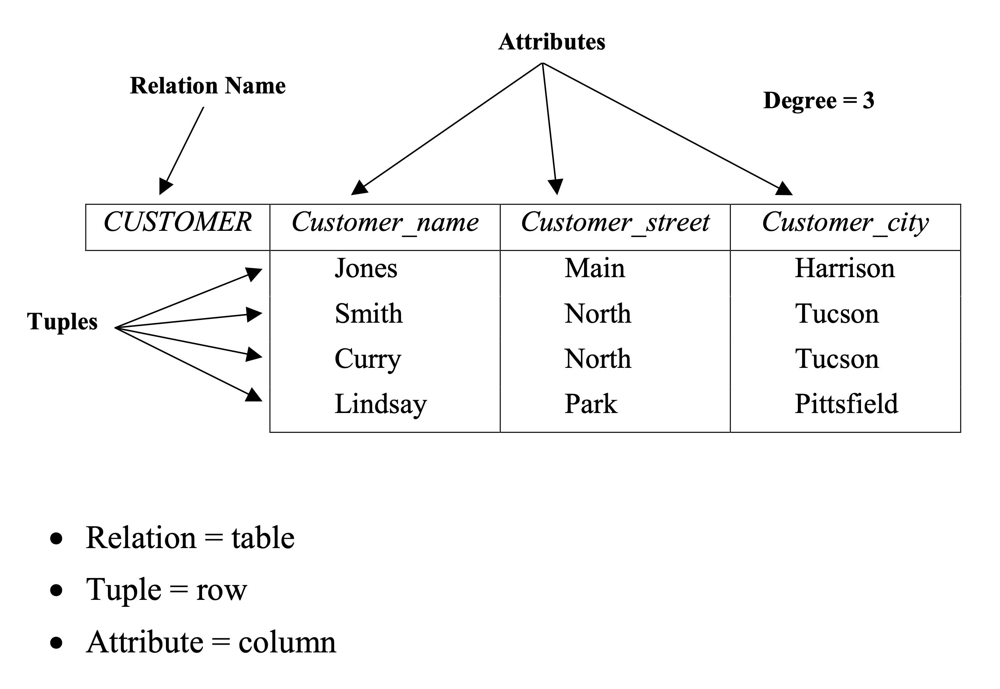

- - -

# 데이터베이스와 SQL: SQLite

### Database and SQL: SQLite 

* * *

**박 진 수** 교수  
Intelligent Data Semantics Lab  
Seoul National University

- - -

<div align='right'><font size='-1'>[partial credit: 이일주 연구원]</font></div>

<h3>Table of Contents<span class="tocSkip"></span></h3>
<div class="toc"><ul class="toc-item"><li><span><a href="#데이터베이스-기본-개념" data-toc-modified-id="데이터베이스-기본-개념-1">데이터베이스 기본 개념</a></span><ul class="toc-item"><li><span><a href="#데이터베이스-관리-시스템" data-toc-modified-id="데이터베이스-관리-시스템-1.1">데이터베이스 관리 시스템</a></span></li><li><span><a href="#데이터베이스" data-toc-modified-id="데이터베이스-1.2">데이터베이스</a></span></li><li><span><a href="#관계형-데이터베이스" data-toc-modified-id="관계형-데이터베이스-1.3">관계형 데이터베이스</a></span><ul class="toc-item"><li><span><a href="#관계형-데이터베이스-구조" data-toc-modified-id="관계형-데이터베이스-구조-1.3.1">관계형 데이터베이스 구조</a></span></li><li><span><a href="#테이블" data-toc-modified-id="테이블-1.3.2">테이블</a></span></li><li><span><a href="#정규화" data-toc-modified-id="정규화-1.3.3">정규화</a></span></li><li><span><a href="#제약-조건" data-toc-modified-id="제약-조건-1.3.4">제약 조건</a></span></li></ul></li><li><span><a href="#데이터베이스-언어" data-toc-modified-id="데이터베이스-언어-1.4">데이터베이스 언어</a></span></li></ul></li><li><span><a href="#SQLite" data-toc-modified-id="SQLite-2">SQLite</a></span><ul class="toc-item"><li><span><a href="#SQLite의-특징" data-toc-modified-id="SQLite의-특징-2.1">SQLite의 특징</a></span></li><li><span><a href="#내려받기" data-toc-modified-id="내려받기-2.2">내려받기</a></span><ul class="toc-item"><li><span><a href="#윈도우-운영체제" data-toc-modified-id="윈도우-운영체제-2.2.1">윈도우 운영체제</a></span></li><li><span><a href="#맥-운영체제(macOS)" data-toc-modified-id="맥-운영체제(macOS)-2.2.2">맥 운영체제(macOS)</a></span></li></ul></li><li><span><a href="#설치하기" data-toc-modified-id="설치하기-2.3">설치하기</a></span></li></ul></li><li><span><a href="#Structured-Query-Language" data-toc-modified-id="Structured-Query-Language-3">Structured Query Language</a></span><ul class="toc-item"><li><span><a href="#데이터베이스-생성" data-toc-modified-id="데이터베이스-생성-3.1">데이터베이스 생성</a></span></li><li><span><a href="#CREATE-TABLE" data-toc-modified-id="CREATE-TABLE-3.2">CREATE TABLE</a></span><ul class="toc-item"><li><span><a href="#Keys" data-toc-modified-id="Keys-3.2.1">Keys</a></span><ul class="toc-item"><li><span><a href="#PRIMARY-KEY" data-toc-modified-id="PRIMARY-KEY-3.2.1.1">PRIMARY KEY</a></span></li><li><span><a href="#AUTOINCREMENT" data-toc-modified-id="AUTOINCREMENT-3.2.1.2">AUTOINCREMENT</a></span></li><li><span><a href="#FOREIGN-KEY" data-toc-modified-id="FOREIGN-KEY-3.2.1.3">FOREIGN KEY</a></span></li></ul></li></ul></li><li><span><a href="#DROP-TABLE" data-toc-modified-id="DROP-TABLE-3.3">DROP TABLE</a></span></li><li><span><a href="#INSERT" data-toc-modified-id="INSERT-3.4">INSERT</a></span></li><li><span><a href="#UPDATE" data-toc-modified-id="UPDATE-3.5">UPDATE</a></span></li><li><span><a href="#DELETE" data-toc-modified-id="DELETE-3.6">DELETE</a></span></li><li><span><a href="#SELECT" data-toc-modified-id="SELECT-3.7">SELECT</a></span><ul class="toc-item"><li><span><a href="#WHERE-절-조건식" data-toc-modified-id="WHERE-절-조건식-3.7.1">WHERE 절 조건식</a></span></li></ul></li><li><span><a href="#Lab:-초급-SQL" data-toc-modified-id="Lab:-초급-SQL-3.8">Lab: 초급 SQL</a></span><ul class="toc-item"><li><span><a href="#문제-1" data-toc-modified-id="문제-1-3.8.1">문제 1</a></span></li><li><span><a href="#문제-2" data-toc-modified-id="문제-2-3.8.2">문제 2</a></span></li><li><span><a href="#문제-3" data-toc-modified-id="문제-3-3.8.3">문제 3</a></span></li></ul></li><li><span><a href="#GROUP-BY" data-toc-modified-id="GROUP-BY-3.9">GROUP BY</a></span><ul class="toc-item"><li><span><a href="#문제" data-toc-modified-id="문제-3.9.1">문제</a></span></li><li><span><a href="#HAVING" data-toc-modified-id="HAVING-3.9.2">HAVING</a></span><ul class="toc-item"><li><span><a href="#문제" data-toc-modified-id="문제-3.9.2.1">문제</a></span></li></ul></li></ul></li><li><span><a href="#ORDER-BY" data-toc-modified-id="ORDER-BY-3.10">ORDER BY</a></span><ul class="toc-item"><li><span><a href="#문제" data-toc-modified-id="문제-3.10.1">문제</a></span></li></ul></li><li><span><a href="#JOIN" data-toc-modified-id="JOIN-3.11">JOIN</a></span><ul class="toc-item"><li><span><a href="#문제" data-toc-modified-id="문제-3.11.1">문제</a></span></li></ul></li><li><span><a href="#중첩-질의" data-toc-modified-id="중첩-질의-3.12">중첩 질의</a></span></li><li><span><a href="#Lab:-중급-SQL" data-toc-modified-id="Lab:-중급-SQL-3.13">Lab: 중급 SQL</a></span><ul class="toc-item"><li><span><a href="#문제-1" data-toc-modified-id="문제-1-3.13.1">문제 1</a></span></li><li><span><a href="#문제-2" data-toc-modified-id="문제-2-3.13.2">문제 2</a></span></li><li><span><a href="#문제-3" data-toc-modified-id="문제-3-3.13.3">문제 3</a></span></li></ul></li></ul></li><li><span><a href="#학습에-도움이-될만한-참고-사이트" data-toc-modified-id="학습에-도움이-될만한-참고-사이트-4">학습에 도움이 될만한 참고 사이트</a></span></li></ul></div>

# 데이터베이스 기본 개념

데이터베이스와 SQL(Structured Query Language)은 범위를 벗어나는 주제이기 때문에 각자 공부를 해야한다. 여기서는 최소한의 개념만 설명하기로 한다. 특히 SQL과 Relational Algebra에 관한 상세한 내용은 아래 링크를 참조한다.
- SQL: https://jinsooya.github.io/lab/db/sql-integrity-constraints.pdf
- Relational Algebra: https://jinsooya.github.io/lab/db/relational-algebra.pdf

## 데이터베이스 관리 시스템

**데이터베이스 관리 시스템**(database management system, DBMS)란?
- 상호 관련된 데이터를 저장하는 저장소와 해당 데이터에 접근하기 위해 필요한 일련의 프로그램들로 구성한 소프트웨어다.

**데이터베이스 관리 시스템**(DBMS)의 특징
1. 데이터 관리
  - 데이터 중복의 최소화
  - 데이터의 무결성(정확성, 일관성, 유효성) 유지
  - 데이터 백업/복구
2. 작업 관리
  - 다수 사용자들의 데이터 공유, 보안, 접근 제어
  - 데이터 갱신(update)작업의 Rollback 기능 지원
3. 데이터 처리
  - 대규모 데이터에서 필요한 데이터들만을 추출
  - 실시간으로 변동하는 데이터 처리 및 분석

## 데이터베이스

**데이터베이스**(database, DB)란?
- 논리적으로 상호 연결되어 있는 데이터 모음으로서 이 데이터는
    - 공유되고(shared)
        - 같은 데이터를 다양한 의사 결정에 사용한다.
    - 무결성이 유지되며(integrated)
        - 데이터 무결성은 데이터가 얼마나 정확한가를 뜻한다. 여러 데이터 파일 간에 중복된 데이터가 존재하면, 한 곳에 변화가 일어났을 때, 나머지 중복 데이터에 그 변화가 즉각적으로 반영되어야 한다. 따라서 데이터 파일 간의 중복을 부분 혹은 전부 제거하여 무결성을 유지한다. 
    - 자기 기술적(self-describing)이다.
        - 데이터 + 데이터 구조(시스템 카탈로그나 메타데이터를 통해 저장된 데이터베이스에 대한 완전한 정의 또는 설명을 제공한다.

**스키마**(schema)란?
- 데이터베이스의 논리적 구조(logical structure of the database)다. 즉, 데이터를 저장하는 구조와 표현 방식을 스키마라고 하며, 데이터를 입력, 조회, 수정, 삭제 할 때는 정의한 스키마에 맞게 구문을 작성해야 한다.
  

**인스턴스**(instance)란?
- 특정 시점에 저장되어 있는 데이터베이스의 내용
- 데이터베이스 상태(status)라고도 한다.

**트랜잭션**(transaction)이란?
- 데이터베이스에서 일련의 작업을 수행하는 단위다.
  * 성공(commit) 혹은 실패(Abort)로 종료한다.
  * ACID 특성을 가진다.

**ACID**란?
- 원자성(atomicity)
  * 하나의 트랜잭션의 작업들은 모두 실행되거나 전혀 실행되지 않아야 한다.
  * 중간에 취소가 된다면 이전의 작업들은 롤백(rollback)해야 한다.
  * 예) A계좌에서 10만원을 B계좌로 이체한다. 즉, 
      1. A계좌에서 10만원 인출
      2. B계좌로 10만원 입금   
     => 두 작업 모두 수행되거나 둘 다 수행되지 않아야 한다.
- 일관성(consistency)
  * 트랜잭션의 실행이 완료된 후에는 데이터베이스가 모든 일관성 조건을 만족해야 한다.
  * 예) 계좌이체 후 A계좌와 B계좌의 잔액의 합이 트랜잭션 수행 이전과 같아야 한다.
- 고립성(isolation)
  * 트랜잭션들이 수행되는 동안 다른 트랜잭션으로부터 영향을 받아서는 안된다.
  * 예) 트랜잭션1의 중간 결과는 트랜잭션2가 참조할 수 없다.
- 지속성(durability)
  * 완료(commit)된 트랜잭션의 결과는 영구적으로 반영되어야 한다.

## 관계형 데이터베이스

**관계형 데이터베이스**(relational database, RDB)란?
- 가장 일반적으로 많이 사용하는 데이터베이스 종류이며 테이블(table) 형태로 데이터를 저장한다.
    * 행(row) : 테이블에서 가로 방향으로 나열한 값의 집합으로 레코드(record) 혹은 튜플(tuple)이라고 한다.
    * 열(column) : 테이블에서 세로 방향으로 나열한 값의 집합으로 필드(field) 혹은 속성(attribute)이라고 한다.
        + 하나의 필드에서는 동일한 타입의 데이터만 입력이 가능하다.

테이블에서 저장 가능한 데이터 자료형은 다음과 같다.
- INT, BIGINT, SMALLINT, ...
- DECIMAL, FLOAT, DOUBLE, ...
- CHAR, VARCHAR, ...
- DATE, TIME, TIMESTAMP, ...
- BLOB, ...
- ...

### 관계형 데이터베이스 구조

데이터베이스에 다음과 같이 열과 행으로 구조화된 테이블 형태로 데이터를 저장하게 된다.



### 테이블

|ID|FNAME|LNAME|DNAME|FLOOR|GENDER|SALARY|
|-----|-----|-----|-----|:-----:|:-----:|-----|
|1 | Brad | Nash | Research | 9F | M | 30000|
|2 | Franklin | Smith | Sales | 9F | M | 40000|
|3 | Nicole | Kim | Finance | 10F | F | 25000|
|4 | Anna | Mills | Research | 9F |F | 43000 |
|5 | Tim | Allen | Research | 9F | M | 38000 |
|6 | Jennifer |Grey | HR | 10F | F | 35000 |
|7 | Tony | Parker | Sales | 9F | M | 25000 |
|8 | James | Wong | Finance | 10F | M | 45000 |

### 정규화

**정규화**(normalization)란?
- 관계형 데이터베이스의 설계에서 데이터의 중복을 최소화하기 위하여 구조화하는 것을 말한다.

앞의 예시 테이블에서 각 직원들의 부서 관련 데이터(DNAME, FLOOR)가 중복되는 것을 알 수 있다.
-  Research 부서가 10F으로 장소를 이동한다면?
-  DEPARTMENT 테이블을 만들고 DID 관계를 설정하면 된다.

이처럼 외래키(FOREIGN KEY)를 설정하므로서 데이터베이스 무결성을 유지하는데 도움이 된다.
- 예) 직원의 DID는 DEPARTMENT 테이블에 있는 값으로만 설정할 수 있다.


DEPARTMENT 테이블

| DID | DNAME | FLOOR |
|-----|-----|:-----:|
| 1 | Finance | 10F |
| 2 | Sales | 9F |
| 3 | Research | 9F |
| 4 | HR | 10F |

EMPLOYEE 테이블

|EID|FNAME|LNAME|DID|GENDER|SALARY|
|-|-----|-----|:-----:|:-----:|-----|
|1 | Brad | Nash | 3 | M | 30000|
|2 | Franklin | Smith | 2 | M | 40000|
|3 | Nicole | Kim | 1 | F | 25000|
|4 | Anna | Mills | 3 | F | 43000 |
|5 | Tim | Allen | 3 | M | 38000 |
|6 | Jennifer |Grey | 4 | F | 35000 |
|7 | Tony | Parker | 2 | M | 25000 |
|8 | James | Wong | 1 | M | 45000 |

### 제약 조건

**제약 조건**(constraint)이란?
- 데이터베이스의 무결성(정확성, 일관성, 유효성)의 유지하기 위해 테이블에 정용하는 규칙이다.

**제약 조건**
- UNIQUE KEY: 저장한 레코드를 고유하게 식별하기 위한 키를 정의한다. 
    - 예) 주민등록번호, 학번, 사번)
    - NULL 값은 중복 입력이 가능하다.
- NOT NULL: 해당 컬럼에 NULL 값의 입력을 금지한다.
- PRIMARY KEY: UNIQUE KEY & NOT NULL로 테이블 당 하나의 PRIMARY KEY만 정의할 수 있다.
- CHECK: 입력할 수 있는 값의 범위 등을 제한한다.
- FOREIGN KEY: 관계형 데이터베이스에서 테이블 간의 관계를 정의한다.

## 데이터베이스 언어

데이터베이스 언어는 크게 네 종류가 있다.

**데이터 정의 언어**(data definition language, DDL)
- 데이터베이스 스키마((테이블, 뷰, 인덱스 등)를 정의하는 언어다.
- DDL 컴파일러는 메타 데이터를 포함하는 데이터 사전에 저장될 테이블들을 생성한다.
- CREATE(테이블 생성), DROP(테이블 삭제), ALTER(테이블 수정/재정의)

**데이터 조작 언어**(data manipulation language, DML)
- 데이터베이스를 조작하는 언어로 데이터 검색, 삽입, 삭제 및 수정을 할 수 있다.
- INSERT(레코드 입력), DELETE(레코드 삭제), UPDATE(레코드 갱신)

**권한 제어 언어**(data control language, DCL)
- 데이터베이스 사용자의 권한을 제어하는 언어다
- GRANT(권한 부여), REVOKE(권한 취소)
    

   
**호스트 언어**(host language)
- 범용(general-purpose) 프로그래밍 언어다.
- 예) Python, Java, C 등

# SQLite

**SQLite**란?
- 오픈 소스 데이터베이스 관리 시스템(DBMS) 중 하나로, 독립적인 서버 프로세스를 가지고 있지 않으며(서버-클라이언트 모델이 아닌 serverless) 응용 프로그램에 내장해서 사용할 수 있는 비교적 가벼운 데이터베이스(lightweight disk-based database)다. 따라서 로컬에서만 사용 가능하다.
- 안드로이드나 아이폰 등 모바일 폰을 포함하여 많은 응용프로그램에 내장되어 사용되는 데이터베이스다.
- SQLite에 상세한 내용은 아래 링트를 참조한다.
    - SQLite Homepage: https://sqlite.org/index.html
    - SQLite Tutorial: https://www.sqlitetutorial.net

## SQLite의 특징

SQLite의 특징은 다음과 같다.

- 단일 데이터베이스 파일 : 데이터베이스 간련 모든 정보가 단 하나의 파일로 저장한다. 즉, 테이블 스키마, 레코드 데이터, 인덱스과 같은 정보가 한 파일에 저장되며, SQLite API로 데이터베이스를 열 때도 해당 파일의 이름을 전달인자로 받는다.
- 간결성 : 페이지 크기에 제한이 있다. 데이터베이스 파일이 파일시스템에 파일로 저장되기 때문에 파일 크기 제한이 있다면 데이터베이스가 작동하는데 문제가 생길 수 있다. 따라서 큰 데이터를 저장하지 않는 편이 좋고 어쩔 수 없는 경우에는 데이터를 여러 데이터베이스 파일로 나눠서 저장하는 것이 좋다.
    * 대략 140TB로 알려져 있으나 상세한 내용은 아래 링크를 참조하면 된다.
        + https://www.sqlite.org/limits.html
- 동시성 : 읽기는 여러 프로세스에서 가능하지만, 쓰기는 한 순간에 오직 하나의 프로세스만 가능합니다.
- DROP COLUMN, ALTER COLUMN, ADD CONSTRAINT 같은 구문은 지원하지 않는다. 동적 자료형과 RENAME TABLE을 활용하여 기능을 동일하게 구현할 수 있다.
    - **동적 자료형**이란 자료형이 그것을 저장하는 저장소가 아닌 값 자체에 의해 결정되는 자료형을 뜻한다. 즉, 테이블을 생성할 때 선언한 컬럼의 자료형과 일치하지 않는 데이터도 저장할 수 있다.
- 더 상세한 정보는 아래 링크를 참조하면 된다.
    - https://www.sqlite.org/lang.html
    

**SQLite 자료형**

SQLite3이 지원하는 자료형은 다음과 같다.

  | 타입     | 설명                                 | 예제                           |
  | ------- | ----------------------------------- | ------------------------------ |
  | NULL    | 값을 정의하지 않거나 존재하지 않음          | NULL                           |
  | INTEGER | 부호를 갖는 정수형 데이터                 | -1, 0, 1234                    |
  | REAL    | 부호를 갖는 소수점 데이터                 | 3.14, 0.001                    |
  | TEXT    | 문자열 데이터                          | '데이터베이스', "Steve's book"     |
  | BLOB    | 바이너리 데이터                         | x'0101                         |
  

**SQLite 주석**
- 두 개 연속 대쉬 '**--**'이며 이 후의 모든 내용은 주석 처리된다.
- C 스타일 주석인 **/*     */** 로 이 안의 모든 내용은 주석 처리된다.

## 내려받기

아래 링크에서 최신 SQLite를 내려받는다.
- http://www.sqlite.org/download.html

### 윈도우 운영체제

**Precompiled Binaries for Windows**로 가서 아래 두 파일을 내려받는다.
- sqlite-**dll-win32**-x86-xxxxxxx.zip (32-bit DLL (x86) for SQLite version x.xx.x.)
- sqlite-**tools-win32**-x86-xxxxxxx.zip (A bundle of command-line tools for managing SQLite database files, including the command-line shell program, the sqldiff.exe program, and the sqlite3_analyzer.exe program.)

### 맥 운영체제(macOS)
- sqlite-**tools-osx**-x86-xxxxxxx.zip (Precompiled Binaries for Mac OS X (x86))

## 설치하기

1. 내려받은 ZIP 파일의 압축을 푼 후 해당 파일들을 SQLite를 설치하려는 폴더로 옮긴다.
2. **sqlite3.exe**(윈도우) 또는 **sqlite3**(macOS)을 더블 클릭하여 실행한다.
3. 명령 프롬프트(윈도우) 또는 터미널(masOS)에서 다음과 비슷한 시작 메시지가 나오면 SQLite는 정상적으로 설치가 되었다.
<pre>SQLite version ... 날짜
Enter ".help" for usage hints
Connected to a transient in-memory database.
Use ".open FILENAME" to reopen on a persistent database
sqlite> _</pre>
4. 종료하기 위해 **> .quit**을 입력하고 실행한다.

여기서는 SQLite를 사용하여 SQL을 학습한다. 명령어 셀에서 SQLite를 사용할 예정이다.

**[참고]**  
데이터베이스 연결과 SQL 실행을 위한 다양한 IDE가 존재한다. 원하면 내려받아 설치해서 사용하면 된다.
- [DB Browser for SQLite](https://sqlitebrowser.org), [DataGrip](https://www.jetbrains.com/ko-kr/datagrip/), [DBeaver](https://dbeaver.io), [Toad](https://www.toadworld.com) 등

# Structured Query Language

**SQL**(structured query language)이란?
- 데이터베이스의 정의와 질의 및 갱신을 위하여 설계된 프로그래밍 언어다.
- 표준화 되어 모든 데이터베이스 시스템이 동일한 문법의 SQL 사용할 수 있다.

주요 구문
- 테이블 생성, 삭제, 변경 (CREATE, DROP, ALTER)
- 데이터 갱신 (INSERT, UPDATE, DELETE)
- 질의 (SELECT)
- SQL 명령문들은 마지막에 '**;**' 부호를 사용하여 구분한다.

**[참고]** SQL 실습도구
- https://www.w3schools.com/sql/
- https://sqliteonline.com/

## 데이터베이스 생성

1. SQLite가 있는 폴더로 이동한다.
1. 하위 폴더로 데이터베이스 파일을 저장할 'databases'라는 폴더를 생성한다.
1. 명령어 셸 창을 연다(윈도우에서는 '명령 프롬프트', 맥에서는 '터미널')
1. 방금 만든 'databases' 폴더로 이동한다. 예를 들어,
    - 윈도우: **cd C:\sqlite-tools\databases**
    - 맥OS: **cd ~/sqlite-tools\databases**       
1. 명령어 셸에서 **sqlite3** 입력하여 SQLite를 실행한다.
1. **sqlite>** 에서 다음 명령어를 실행하여 현재 작업 폴더가 'databases'인지 확인한다.
    - 윈도우: **sqlite> .shell cd**
    - 맥OS: **sqlite> .shell pwd**       
1. **sqlite>** 에서 다음과 같이 **.open**명령어를 실행하여 'company.db'를 생성한다.
    - <pre>sqlite> .open company.db</pre>
    - **.open** 명령어는 폴더에 데이터베이스가 있다면 해당 DB를 열어주고, 없다면 새로 생성한다.
1. **sqlite>** 에서 **.databases**명령어를 실행하여 'company.db'가 만들어졌는지 확인한다. DB가 생성되어 연결되어 있다면 다음 예처럼 파일 경로와 함께 DB 이름을 보여준다.
    - <pre>sqlite> .databases</pre>
      <pre>main: /Users/jinsoopark/db/sqlite-tools/databases/company.db</pre>
- 참고로 **sqlite>** 에서 **.help** 명령어르르 실행하면 SQLite가 제공하는 명령어들에 대한 정보를 볼 수 있다.


**[참고]** : 명령어 셸에서 **sqlite3 [데이터베이스 이름].db**를 실행해도 데이터베이스를 만들 수 있다.
- 예) **> sqlite3 company.db**

## CREATE TABLE

새로운 테이블을 생성한다.

<pre>CREATE TABLE [테이블이름](
    [필드이름1] [필드타입1], 
    [필드이름2] [필드타입2], 
    ... 
);</pre>

같은 이름의 테이블이 있으면 오류를 발생시킨다.
<pre>CREATE TABLE IF NOT EXISTS [테이블 이름](
    [필드이름1] [필드타입1], 
    [필드이름2] [필드타입2], 
    ... 
);</pre>

### Keys

#### PRIMARY KEY

테이블에서 개별 레코드를 식별할 수 있어야 하기 때문에 유일한 값을 저장하는 필드(컬럼)가 필요한데 이를 주키(PRIMARY KEY)라고 한다. 주키로 설정한 필드에 중복값을 입력하면 오류가 난다. 그리고 NULL 값을 허용하지 않는 것이 좋다. 

<pre>CREATE TABLE [테이블이름](
    [필드이름1] [필드타입1] NOT NULL PRIMARY KEY, 
    [필드이름2] [필드타입2], 
    ... 
);</pre>

또는 다음과 같이 표현할 수도 있다.

<pre>CREATE TABLE [테이블이름](
    [필드이름1] [필드타입1] NOT NULL, 
    [필드이름2] [필드타입2], 
    ..., 
    PRIMARY KEY([필드이름1])
);</pre>

**PRIMARY KEY**는 꼭 하나의 필드(컬럼)로만 구성할 필요는 없다. 여러 필드의 조합으로도 구성할 수 있다. 이는 합성키, 복합키 (COMPOSITE KEY)라고 한다.

<pre>CREATE TABLE [테이블이름](
    [필드이름1] [필드타입1] NOT NULL, 
    [필드이름2] [필드타입2] NOT NULL, 
    [필드이름3] [필드타입3], 
    [필드이름4] [필드타입4], 
    ..., 
    PRIMARY KEY([필드이름1], [필드이름2])
);</pre>

#### AUTOINCREMENT

데이터를 추가할 때 자동으로 식별자 키의 값이 하나씩 증가하도록 할 때 사용한다. 물론 이 때 키의 자료형은 INTEGER여야 한다. 즉, INTEGER PRIMARY KEY에서만 AUTOINCREMENT를 사용할 수 있다. 뿐만 아니라 복합키를 사용하면 AUTOINCREMENT는 사용할 수 없다.

<pre>CREATE TABLE [테이블이름](
    [필드이름1] INTEGER PRIMARY KEY AUTOINCREMENT, 
    [필드이름2] [필드타입2], 
    ...
);</pre>

**예**)    
<pre>CREATE TABLE Department (did INTEGER, dname TEXT, floor TEXT, PRIMARY KEY (did));

CREATE TABLE IF NOT EXISTS Department (did INTEGER PRIMARY KEY AUTOINCREMENT, dname TEXT, floor TEXT);

CREATE TABLE Department(
    did INTEGER PRIMARY KEY AUTOINCREMENT, 
    dname TEXT, 
    floor TEXT
);</pre>

SQLite의 'company.db'에 'Department' 테이블을 만들어 보자.

```sqlite
sqlite> CREATE TABLE Department(
   ...>     did INTEGER PRIMARY KEY AUTOINCREMENT, 
   ...>     dname TEXT, 
   ...>     floor TEXT
   ...> );
```

현재 연결한 데이터베이스의 테이블을 열람하려면 **.tables** 명령어를 실행하면 된다. SQLite 셸 명령어 마지막에는 **;** 을 붙이지 않는다.

```sqlite
sqlite> .tables
Department
```

테이블의 스키마를 확인하려면 **.schema [테이블이름]** 명령어를 실행하면 된다.

```sqlite
sqlite> .schema Department
sqlite> .schema Department
CREATE TABLE Department(
    did INTEGER PRIMARY KEY AUTOINCREMENT, 
    dname TEXT, 
    floor TEXT
);
```

참고로 데이터베이스에 속한 모든 테이블의 스키마를 확인하려면 **[테이블이름]** 을 지정하지 않고 그냥 **.schema** 명령어를 실행하면 된다.

#### FOREIGN KEY

테이블의 한 필드가 다른 테이블의 키 필드를 참조하면 이를 외래키(FOREIGN KEY)라고 한다. **외래키를 통해 두 테이블을 연결하고 관계성을 가지게 할 수 있다**. 또한 여러 테이블에 정보를 저장하고 관리할 수 있도록 함으로써 중복 데이터를 없애고 확장성을 가지게 해준다.

<pre>CREATE TABLE [테이블이름A](
    [필드이름1] INTEGER PRIMARY KEY AUTOINCREMENT, 
    [필드이름2] [필드타입2], 
    [필드이름3] [필드타입2], 
    ...
    FOREIGN KEY([필드이름3]) REFERENCES [테이블이름B]([키필드이름]) 
);</pre>

복합키를 사용할 수도 있다.
<pre>CREATE TABLE [테이블이름A](
    ...    
    [필드이름2] [필드타입2], 
    [필드이름3] [필드타입2], 
    ...
    FOREIGN KEY([필드이름2], [필드이름3]) REFERENCES [테이블이름B]([키필드이름1], [(키필드이름2)]) 
);</pre>

## DROP TABLE

기존 테이블을 제거한다.
<pre>DROP TABLE [테이블이름];</pre>

해당 테이블이 없으면 오류를 발생시킨다.
<pre>DROP TABLE IF EXISTS [테이블이름];</pre>

**예**)
<pre>DROP TABLE Department;
DROP TABLE IF EXSITS Department;</pre>

## INSERT

새로운 레코드를 입력한다.
<pre>INSERT INTO [테이블이름] ([필드이름1], [필드이름2], ...  ) 
     VALUES ([필드값1], [필드값2], ...);</pre>

- 문자열 값은 작은 따옴표 **''** 나 큰 따옴포 **""** 로 묶어줘야 한다.

**예**)
<pre>INSERT INTO Department(dname, floor) 
       VALUES ('Finance', '10F');

INSERT INTO Department(dname, floor) VALUES('Sales', '9F');
INSERT INTO Department(dname, floor) VALUES('Research', '9F');
INSERT INTO Department(dname, floor) VALUES('HR', '9F');
 
INSERT INTO Department VALUES (11, 'Marketing', '10F');</pre>

| did | dname | floor |
|-----|-----|-----|
| 1  | Finance | 10F |
| 2  | Sales | 9F |
| 3  | Research | 9F |
| 4  | HR | 9F |
| 11 | Marketing | 10F |

SQLite의 'Department' 테이블에 데이터(레코드)를 추가 해보자.

```sqlite
sqlite> -- AUTOINCREMENT는 1부터 시작한다.
sqlite> INSERT INTO Department(dname, floor) 
   ...>      VALUES ('Finance', '10F');
```

여러 데이터를 한꺼번에 추가할 수도 있다.

<pre>INSERT INTO [테이블이름] ([필드이름1], [필드이름2], ...  ) 
     VALUES ([필드값1], [필드값2], ...),
            ([필드값1], [필드값2], ...),
            ...
            ...;</pre>

이번에는 데이터는 한꺼번에 입력해보자.

```sqlite
sqlite> INSERT INTO Department(dname, floor) 
   ...>      VALUES ('Sales', '9F'),
   ...>             ('Research', '9F'),
   ...>             ('HR', '9F');
```

AUTOINCREMENT의 값을 변경할 수도 있다.

```sqlite
sqlite> -- 지금 입력하는 데이터부터 did가 11부터 시작하도록 하기 위해
sqlite> -- AUTOINCREMENT 필드(컬럼)인 did 값을 11로 설정한다. 
sqlite> -- 이후 입력하는 데이터는 12, 13으로 자동 입력이 된다.
sqlite> INSERT INTO Department VALUES(11, 'Marketing', '10F');
```

데이터가 제대로 입력되었는지 다음 명령어를 실행하여 확인해보자.

```sqlite
sqlite> SELECT * FROM Department;
did|dname|floor
1|Finance|10F
2|Sales|9F
3|Research|9F
4|HR|9F
11|Marketing|10F
```


## UPDATE

기존 레코드의 값을 갱신한다.

<pre>UPDATE [테이블이름] 
   SET [필드이름] = [필드값] 
 WHERE [조건]</pre>

**예**) dname이 'HR'인 레코드의 floor 값을 '10F'로 변경한다.
<pre>UPDATE Department SET floor = '10F' WHERE dname = 'HR';</pre>


| did | dname | floor |
|-----|-----|-----|
| 1  | Finance | 10F |
| 2  | Sales | 9F |
| 3  | Research | 9F |
| 4  | HR | 10F |
| 11 | Marketing | 10F |

SQLite의 'Department' 테이블의 데이터(레코드) 값을 변경해보자.

```sqlite
sqlite> UPDATE Department SET floor = '10F' WHERE dname = 'HR';
```

데이터가 제대로 갱신되었는지 다음 명령어를 실행하여 확인해보자.

```sqlite
sqlite> SELECT * FROM Department;
1|Finance|10F
2|Sales|9F
3|Research|9F
4|HR|10F
11|Marketing|10F
```

## DELETE

레코드를 삭제한다.

<pre>DELETE FROM [테이블이름] 
      WHERE [조건]</pre>


**예**) dname이 'Marketing'인 레코드를 삭제한다,
<pre>DELETE FROM Department WHERE dname = 'Marketing';</pre>

| did | dname | floor |
|-----|-----|-----|
| 1 | Finance | 10F |
| 2 | Sales | 9F |
| 3 | Research | 9F |
| 4 | HR | 10F |

SQLite의 'Department' 테이블의 데이터(레코드)를 삭제해보자.

```sqlite
sqlite> DELETE FROM Department WHERE dname = 'Marketing';
```

데이터가 제대로 갱신되었는지 다음 명령어를 실행하여 확인해보자.

```sqlite
sqlite> SELECT * FROM Department;
1|Finance|10F
2|Sales|9F
3|Research|9F
4|HR|10F
```

## SELECT

데이터베이스 질의어로 레코드를 열람할 때 사용한다.
- SELECT-FROM-WHERE 구조를 가진다.

<pre>SELECT [필드이름1], [필드이름2], ... 
  FROM [테이블이름1], [테이블이름2], ... 
 WHERE [조건];</pre>
 
- **[필드이름]** 에 **\*** 를 넣으면 전체 컬럼을 선택한다.
- **[필드이름] AS [지정]** 형식으로 하면 결과 테이블의 필드 이름을 지정할 수 있다.

**예**) Department 테이블의 모든 레코드를 추출한다.
<pre>SELECT * FROM Department;</pre>

**예**) Department 테이블의 레코드 개수을 알아본다.
<pre>SELECT COUNT(*) FROM Department;</pre>

**예**) Department 테이블에서 floor가 '9F'인 레코드들의 did와 dname을 열람한다. 이 때 did는 ID로 명칭하고 dname은 NAME으로 명칭한다.
<pre>SELECT did as ID , dname as NAME 
  FROM Department
 WHERE floor = '9F';</pre>

| ID | NAME |
|-----|-----|
| 2 | Sales |
| 3 | Research |

앞서 학습한 내용으로 SQLite의 'Department' 테이블의 데이터를 열람(조회)해보자. 데이터를 열람할 때 **.header on** 과 **.mode column**을 실행하여 출력 형식을 미리 설정하면 출력 결과를 좀 더 보기 좋게 열람할 수 있다.
- **.header on** : 데이터를 열람할 때 테이블의 필드(컬럼) 이름을 보여준다.
- **.mode column** : 출력 형식을 컬럼 모드로 전환한다. 
    - 예를 들어 **.mode html**로 설정하면 HTML 형식으로 출력한다.
    - **.mode**의 기본값은 **list**다.
- SQLite의 셸 명령어에 대한 상세한 내용은 아래 링크를 참조하면 된다.
    - https://sqlite.org/cli.html

```sqlite
sqlite> .header on
sqlite> .mode column
sqlite> SELECT * FROM Department;
did         dname       floor     
----------  ----------  ----------
1           Finance     10F       
2           Sales       9F        
3           Research    9F        
4           HR          10F    

sqlite> SELECT COUNT(*) FROM Department;
COUNT(*)  
----------
4         

sqlite> SELECT did as ID, dname as NAME 
   ...>   FROM Department
   ...>  WHERE floor = '9F';
ID          NAME      
----------  ----------
2           Sales     
3           Research  
```


### WHERE 절 조건식

|술어|연산자|예|
|:-----|:-----------------------------------------------|:-----------------------|
|비교   | **=**, **<>**, **<**, **<=**, **>**, **>=**    | value < 20000|
|범위   | **BETWEEN**                                    | value BETWEEN 10000 AND 20000|
|집합   | **IN**, **NOT IN**                             | value IN (10000, 20000, 30000)|
|패턴   | **LIKE**                                       | name LIKE 'New%'|
|NULL  | **IS NULL**, **IS NOT NULL**                   | name IS NULL|
|복합   | **AND**, **OR**, **NOT**                       | (value < 20000) AND (name LIKE 'New%')|

**LIKE**
- **=** 와 달리 특정 패턴과 일치하는 문자열을 열람(조회)할 수 있다.

```sqlite
sqlite> SELECT *
   ...>   FROM Employee
   ...>  WHERE fname
   ...>   LIKE '%i%';
eid         fname       lname       did         gender      salary    
----------  ----------  ----------  ----------  ----------  ----------
2           Franklin    Smith       2           M           40000     
3           Nicole      Kim         1           F           25000     
5           Tim         Allen       3           M           38000     
6           Jennifer    Grey        4           F           35000  
```

## Lab: 초급 SQL

### 문제 1

**CREATE**문을 사용하여 아래 테이블 'Employee'를 생성한다.
- eid: INTEGER
- fname: TEXT
- lname: TEXT
- did: INTEGER
- gender: TEXT
- salary: INTEGER

이 때 'eid'를 주키로 하고 필드값을 AUTOINCREMENT로 설정한다. 'did'는 외래키이며 'Department'의 주키를 참조하도록 한다.

**답**


```sqlite
sqlite> -- Your answer here
   ...>
```   

### 문제 2

**INSERT**문을 사용하여 아래 표에 나타난 8개의 레코드를 입력한다.

|eid|fname|lname|did|gender|salary|
|-|-----|-----|-----|-----|-----|
|1 | Brad | Nash | 3 | M | 30000|
|2 | Franklin | Smith | 2 | M | 40000|
|3 | Nicole | Kim | 1 | F | 25000|
|4 | Anna | Mills | 3 | F | 43000 |
|5 | Tim | Allen | 3 | M | 38000 |
|6 | Jennifer |Grey | 4 | F | 35000 |
|7 | Tony | Parker | 2 | M | 25000 |
|8 | James | Wong | 1 | M | 45000 |

**답**


```sqlite
sqlite> -- Your answer here
   ...>
```   

### 문제 3

다음을 질의하는 SQL을 작성하여 실행한다.
- 연봉이 30,000불 이상인 직원들의 fname, lname, salary를 열람한다.

| fname | lname | salary |
|-----|-----|-----|
| Brad | Nash | 30000 |
| Franklin | Smith | 40000 |
| Anna | Mills |43000 |
| Tim | Allen | 38000 |
| Jennifer | Grey | 35000 |
| James | Wong | 45000 |

**답**


```sqlite
sqlite> -- Your answer here
   ...>
```   

## GROUP BY

여러 레코드에 대한 집단값을 연산한다.

집계값(aggregation): **COUNT**, **SUM**, **AVG**, **MIN**, **MAX**
- 집계값은 **SUM(필드이름)**, **COUNT(\*)** 와 같은 방식으로 선언한다.

<pre>  SELECT [그룹필드1], [집계값1], ... 
    FROM [테이블이름] 
GROUP BY [그룹필드1];</pre>

**예**) Employee 테이블에서 성별 그룹들의 평균 salary는?

<pre>  SELECT gender, AVG(salary) AS avg_sal 
    FROM Employee 
GROUP BY gender;</pre>

| gender | avg_sal |
|-----|-----|
| F | 34333.33 |
| M | 35600 |

방금 학습한 내용을 SQLite에서 실행해보자.

```sqlite
sqlite>  SELECT gender, AVG(salary) AS avg_sal 
   ...>    FROM Employee 
   ...>GROUP BY gender;
gender      avg_sal         
----------  ----------------
F           34333.3333333333
M           35600.0  
```

### 문제

Employee 테이블에서 각 did 그룹의 최고 salary는?

**답**


```sqlite
sqlite> -- Your answer here
   ...>
```   

### HAVING

WHERE 절처럼 조건문이 들어가지만 그룹 전체의 결과 집합의 행에만 적용할 수 있다.

**예**) Employee 테이블에서 2명의 직원이 근무하는 did는?

<pre>  SELECT did, COUNT(*)
    FROM Employee
GROUP BY did
  HAVING count(*) = 2;
</pre>

|did|COUNT(\*)|
|-----|-----|
| 1 | 2 |
| 2 | 2 |

방금 학습한 내용을 SQLite에서 실행해보자.

```sqlite
sqlite>   SELECT did, COUNT(*)
   ...>     FROM Employee
   ...> GROUP BY did
   ...>   HAVING count(*) = 2;
did         COUNT(*)  
----------  ----------
1           2         
2           2         
```

#### 문제

직원들의 평균 salary가 **35,000**을 초과하는 부서명은?

**답**


```sqlite
sqlite> -- Your answer here
   ...>
```   

## ORDER BY

질의의 결과를 특정 컬럼을 기준으로 정렬한다.
- 오름차순(**ASC**), 내림차순(**DESC**)

<pre>  SELECT [필드이름1], [필드이름2] 
    FROM [테이블이름] 
ORDER BY [필드이름] ASC|DESC;</pre>

**예**) Employee 테이블의 fname, lname, salary를 salary 기준으로 내림차순 정렬한다.

<pre>  SELECT fname, lname, salary 
    FROM Employee 
ORDER BY salary DESC;</pre>

|fname|lname|salary|
|-----|-----|-----|
| James | Wong | 45000 |
| Anna | Mills | 43000 |
| Franklin | Smith | 40000 |
| Tim | Allen | 38000 |
| Jennifer | Grey | 35000 |
| Brad | Nash | 30000 |
| Nicole | Kim | 25000 |
| Tony | Parker | 25000 |

방금 학습한 내용을 SQLite에서 실행해보자.

```sqlite
sqlite>   SELECT fname, lname, salary 
   ...>     FROM Employee 
   ...> ORDER BY salary DESC;
fname       lname       salary    
----------  ----------  ----------
James       Wong        45000     
Anna        Mills       43000     
Franklin    Smith       40000     
Tim         Allen       38000     
Jennifer    Grey        35000     
Brad        Nash        30000     
Nicole      Kim         25000     
Tony        Parker      25000   
```

### 문제

Employee 테이블에서 gender가 'M'인 레코드들의 fname, lname, salary를 fname 기준으로 오름차순 정렬한다.

**답**


```sqlite
sqlite> -- Your answer here
   ...>
```   

## JOIN

두 개 이상의 테이블을 결합하여 레코드를 열람한다.
- 주로 정규화한 테이블들을 대상으로 함께 질의하는데 사용한다.

<pre>SELECT [필드이름1], [필드이름2], ... 
  FROM [테이블이름1], [테이블이름2], 
 WHERE [조인조건];</pre>
 
<pre>SELECT [필드이름1], [필드이름2], ... 
  FROM [테이블이름1] 
  JOIN [테이블이름2] ON [조인조건];</pre>

**예**) 

<pre>SELECT fname, lname, dname, gender 
  FROM Employee, Department 
 WHERE Department.did = Employee.did;

SELECT fname, lname, dname, gender 
  FROM Department 
  JOIN Employee ON Department.did = Employee.did;</pre>

|fname|lname|dname|gender|
|-----|-----|-----|-----|
| Brad | Nash | Research | M |
| Franklin | Smith | Sales | M |
| Nicole | Kim | Finace | F |
| Anna | Mills | Research | F |
| Tim | Allen | Research | M |
| Jennifer |Grey | HR | F |
| Tony | Parker | Sales | M |
| James | Wong | Finance | M |

방금 학습한 내용을 SQLite에서 실행해보자.

```sqlite
sqlite> SELECT fname, lname, dname, gender 
   ...>   FROM Department 
   ...>   JOIN Employee ON Department.did = Employee.did;
fname       lname       dname       gender    
----------  ----------  ----------  ----------
Brad        Nash        Research    M         
Franklin    Smith       Sales       M         
Nicole      Kim         Finance     F         
Anna        Mills       Research    F         
Tim         Allen       Research    M         
Jennifer    Grey        HR          F         
Tony        Parker      Sales       M         
James       Wong        Finance     M    
```

### 문제

**9**층에서 근무하는 남자 직원들의 이름(fname, lname)을 열람한다.

**답**


```sqlite
sqlite> -- Your answer here
   ...>
```   

## 중첩 질의

**중첩 질의**(nested query)란?
- SQL 문 안에 또 다른 SQL 문이 있는 구조를 말한다.

**예**) 중첩 질의를 통해 Research 부서에 일하는 직원들의 fname, lname, gender 정보를 열람한다.

<pre>SELECT fname, lname, gender
  FROM Employee
 WHERE did IN (SELECT did 
                 FROM Department 
                WHERE dname LIKE '%Re%');</pre>
                
|fname|lname|gener|
|-----|-----|-----|
|Brad|Nash  |M
|Anna|Mills |F
|Tim|Allen  |M

SQLite에서 실행한 결과는 다음과 같다.

```sqlite
sqlite> SELECT fname, lname, gender
   ...>   FROM Employee
   ...>  WHERE did IN (SELECT did 
   ...>                  FROM Department 
   ...>                 WHERE dname LIKE '%Re%');
fname       lname       gender    
----------  ----------  ----------
Brad        Nash        M         
Anna        Mills       F         
Tim         Allen       M 
```

## Lab: 중급 SQL

### 문제 1

- 각 부서별  평균 연봉을 계산한다.
- 결과 테이블의 필드는 부서명(dname)과 평균연봉(avg_sal)으로 한다.
- 평균 연봉을 기준으로 내림차순 정렬한다.

|dname|avg_sal|
|-----|-----|
| Research | 37000 |
| Finance | 35000 |
| HR | 35000 |
| Sales | 32500 |

**답**


```sqlite
sqlite> -- Your answer here
   ...>
```   

### 문제 2

- 각 층의 직원들 중 가장 높은 연봉을 받는 사람을 열람한다.
- 결과 테이블의 필드는 층(floor), 이름(fname), 성(lname), 최고연봉(max_sal)로 한다.

|floor|fname|lname|max_sal|
|-----|-----|-----|-----|
|10F|James|Wong|45000|
|9F|Anna|Mills|43000|

**답**


```sqlite
sqlite> -- Your answer here
   ...>
```   

### 문제 3

- 부서별 연봉이 30,000불 이상인 직원의 수를 확인한다.
- 결과 테이블의 필드는 부서명(dname), 직원 수로 한다.
  
|dname|count(\*)|
|-----|:-----:|
|Finance|1|
|HR|1|
|Research|3|
|Sales|1|

**답**


```sqlite
sqlite> -- Your answer here
   ...>
```   

# 학습에 도움이 될만한 참고 사이트

- [SQLite로 가볍게 배우는 데이터베이스](https://wikidocs.net/book/1530)
  

- - -

# THE END
