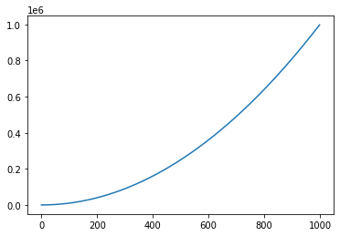
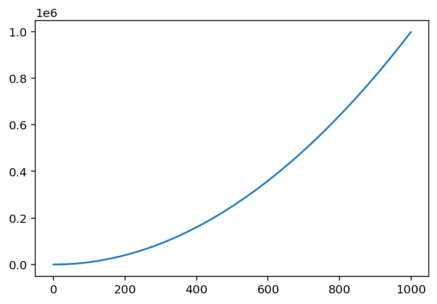

- - -

# 쥬피터 노트북/쥬피터랩
###Jupytyer Notebook/JupyterLab

* * *

**박 진 수** 교수  
Intelligent Data Semantics Lab  
Seoul National University

- - -

<h3>Table of Contents<span class="tocSkip"></span></h3>
<div class="toc"><ul class="toc-item"><li><span><a href="#Managing-Jupyter-Notebook-Cell" data-toc-modified-id="Managing-Jupyter-Notebook-Cell-1"><span class="toc-item-num">1&nbsp;&nbsp;</span>Managing Jupyter Notebook Cell</a></span></li><li><span><a href="#Some-Useful-IPython-Magic-Commands" data-toc-modified-id="Some-Useful-IPython-Magic-Commands-2"><span class="toc-item-num">2&nbsp;&nbsp;</span>Some Useful IPython Magic Commands</a></span><ul class="toc-item"><li><span><a href="#Assistants" data-toc-modified-id="Assistants-2.1"><span class="toc-item-num">2.1&nbsp;&nbsp;</span>Assistants</a></span><ul class="toc-item"><li><span><a href="#%ismagic" data-toc-modified-id="%ismagic-2.1.1"><span class="toc-item-num">2.1.1&nbsp;&nbsp;</span>%ismagic</a></span></li><li><span><a href="#?" data-toc-modified-id="?-2.1.2"><span class="toc-item-num">2.1.2&nbsp;&nbsp;</span>?</a></span></li><li><span><a href="#??" data-toc-modified-id="??-2.1.3"><span class="toc-item-num">2.1.3&nbsp;&nbsp;</span>??</a></span></li><li><span><a href="#%env-:-환경-변수-설정" data-toc-modified-id="%env-:-환경-변수-설정-2.1.4"><span class="toc-item-num">2.1.4&nbsp;&nbsp;</span>%env : 환경 변수 설정</a></span></li><li><span><a href="#%who-:-전역-변수-보기" data-toc-modified-id="%who-:-전역-변수-보기-2.1.5"><span class="toc-item-num">2.1.5&nbsp;&nbsp;</span>%who : 전역 변수 보기</a></span></li><li><span><a href="#%who_ls-:-전역-변수-리스트로-보기" data-toc-modified-id="%who_ls-:-전역-변수-리스트로-보기-2.1.6"><span class="toc-item-num">2.1.6&nbsp;&nbsp;</span>%who_ls : 전역 변수 리스트로 보기</a></span></li><li><span><a href="#%whos-:-전역-변수-상세-정보-보기" data-toc-modified-id="%whos-:-전역-변수-상세-정보-보기-2.1.7"><span class="toc-item-num">2.1.7&nbsp;&nbsp;</span>%whos : 전역 변수 상세 정보 보기</a></span></li><li><span><a href="#고화질-Retina" data-toc-modified-id="고화질-Retina-2.1.8"><span class="toc-item-num">2.1.8&nbsp;&nbsp;</span>고화질 Retina</a></span></li></ul></li><li><span><a href="#Writing,-Excuting,-Loading-Files" data-toc-modified-id="Writing,-Excuting,-Loading-Files-2.2"><span class="toc-item-num">2.2&nbsp;&nbsp;</span>Writing, Excuting, Loading Files</a></span><ul class="toc-item"><li><span><a href="#%%writefile-:-셀의-내용을-파일로-저장" data-toc-modified-id="%%writefile-:-셀의-내용을-파일로-저장-2.2.1"><span class="toc-item-num">2.2.1&nbsp;&nbsp;</span>%%writefile : 셀의 내용을 파일로 저장</a></span></li><li><span><a href="#%run-:-파이썬-코드-실행" data-toc-modified-id="%run-:-파이썬-코드-실행-2.2.2"><span class="toc-item-num">2.2.2&nbsp;&nbsp;</span>%run : 파이썬 코드 실행</a></span></li><li><span><a href="#!-:-셸-명령어-실행" data-toc-modified-id="!-:-셸-명령어-실행-2.2.3"><span class="toc-item-num">2.2.3&nbsp;&nbsp;</span>! : 셸 명령어 실행</a></span></li><li><span><a href="#%load-:-외부-코드-삽입" data-toc-modified-id="%load-:-외부-코드-삽입-2.2.4"><span class="toc-item-num">2.2.4&nbsp;&nbsp;</span>%load : 외부 코드 삽입</a></span></li><li><span><a href="#%pycat-:-외부-코드-보기" data-toc-modified-id="%pycat-:-외부-코드-보기-2.2.5"><span class="toc-item-num">2.2.5&nbsp;&nbsp;</span>%pycat : 외부 코드 보기</a></span></li><li><span><a href="#%store-:-Jupyter-Notebook-간에-변수-주고-받기" data-toc-modified-id="%store-:-Jupyter-Notebook-간에-변수-주고-받기-2.2.6"><span class="toc-item-num">2.2.6&nbsp;&nbsp;</span>%store : Jupyter Notebook 간에 변수 주고 받기</a></span></li></ul></li><li><span><a href="#Performance" data-toc-modified-id="Performance-2.3"><span class="toc-item-num">2.3&nbsp;&nbsp;</span>Performance</a></span><ul class="toc-item"><li><span><a href="#%time,-%%time,-%timeit,-%%timeit-:-코드-실행-시간" data-toc-modified-id="%time,-%%time,-%timeit,-%%timeit-:-코드-실행-시간-2.3.1"><span class="toc-item-num">2.3.1&nbsp;&nbsp;</span>%time, %%time, %timeit, %%timeit : 코드 실행 시간</a></span></li></ul></li></ul></li><li><span><a href="#pickle-:-변수에-담긴-내용을-파일로-저장하기" data-toc-modified-id="pickle-:-변수에-담긴-내용을-파일로-저장하기-3"><span class="toc-item-num">3&nbsp;&nbsp;</span><strong>pickle</strong> : 변수에 담긴 내용을 파일로 저장하기</a></span></li></ul></div>

# Managing Jupyter Notebook Cell

Jupyter Notebook을 이용하면 파이썬 프로그래밍을 조금 더 편하게 할 수 있다.

프로그램을 매번 새로 실행하지 않고 코드를 관리할 수 있다.


```python
print('Hello, Python!')
```

    Hello, Python!


**셀(cell)** 은 
1. 코드를 입력할 수 있는 부분과  
2. 코드의 실행 결과를 나타내는 출력 창으로 구성된다.


```python
# 화면에 표시할 출력 결과가 없는 코드도 있다.
k = 1  
```

코드의 실행은 
- **셀(cell)** 단위로 일어나지만,  

실행 환경은 
- **문서** 단위에서 공유된다.


```python
k += 2
```


```python
k?
```


    Type:        int
    String form: 3
    Docstring:  
    int([x]) -> integer
    int(x, base=10) -> integer
    
    Convert a number or string to an integer, or return 0 if no arguments
    are given.  If x is a number, return x.__int__().  For floating point
    numbers, this truncates towards zero.
    
    If x is not a number or if base is given, then x must be a string,
    bytes, or bytearray instance representing an integer literal in the
    given base.  The literal can be preceded by '+' or '-' and be surrounded
    by whitespace.  The base defaults to 10.  Valid bases are 0 and 2-36.
    Base 0 means to interpret the base from the string as an integer literal.
    >>> int('0b100', base=0)
    4


따라서 Jupyter Notebook을 이용해 파이썬 코드를 작성할 때는 **셀(cell)** 을 잘 관리하여야 한다.

---
# Some Useful IPython Magic Commands

## Assistants

### %ismagic

**%ismagic**은 사용 가능한 모든 매직 명령어를 보여준다.


```python
%lsmagic
```


    Available line magics:
    %alias  %alias_magic  %autoawait  %autocall  %automagic  %autosave  %bookmark  %cat  %cd  %clear  %colors  %conda  %config  %connect_info  %cp  %debug  %dhist  %dirs  %doctest_mode  %ed  %edit  %env  %gui  %hist  %history  %killbgscripts  %ldir  %less  %lf  %lk  %ll  %load  %load_ext  %loadpy  %logoff  %logon  %logstart  %logstate  %logstop  %ls  %lsmagic  %lx  %macro  %magic  %man  %matplotlib  %mkdir  %more  %mv  %notebook  %page  %pastebin  %pdb  %pdef  %pdoc  %pfile  %pinfo  %pinfo2  %pip  %popd  %pprint  %precision  %prun  %psearch  %psource  %pushd  %pwd  %pycat  %pylab  %qtconsole  %quickref  %recall  %rehashx  %reload_ext  %rep  %rerun  %reset  %reset_selective  %rm  %rmdir  %run  %save  %sc  %set_env  %store  %sx  %system  %tb  %time  %timeit  %unalias  %unload_ext  %who  %who_ls  %whos  %xdel  %xmode
    
    Available cell magics:
    %%!  %%HTML  %%SVG  %%bash  %%capture  %%debug  %%file  %%html  %%javascript  %%js  %%latex  %%markdown  %%perl  %%prun  %%pypy  %%python  %%python2  %%python3  %%ruby  %%script  %%sh  %%svg  %%sx  %%system  %%time  %%timeit  %%writefile
    
    Automagic is ON, % prefix IS NOT needed for line magics.


### ?

각 명령어 뒤에 물음표 **?** 를 붙여 실행하면 추가 정보를 확인할 수 있다.


```python
%lsmagic?
```


    Docstring: List currently available magic functions.
    File:      .../site-packages/IPython/core/magics/basic.py


```python
print?
```


    Docstring:
    print(value, ..., sep=' ', end='\n', file=sys.stdout, flush=False)
    
    Prints the values to a stream, or to sys.stdout by default.
    Optional keyword arguments:
    file:  a file-like object (stream); defaults to the current sys.stdout.
    sep:   string inserted between values, default a space.
    end:   string appended after the last value, default a newline.
    flush: whether to forcibly flush the stream.
    Type:      builtin_function_or_method


```python
s = 'a'
s?
```


    Type:        str
    String form: a
    Length:      1
    Docstring:  
    str(object='') -> str
    str(bytes_or_buffer[, encoding[, errors]]) -> str
    
    Create a new string object from the given object. If encoding or
    errors is specified, then the object must expose a data buffer
    that will be decoded using the given encoding and error handler.
    Otherwise, returns the result of object.__str__() (if defined)
    or repr(object).
    encoding defaults to sys.getdefaultencoding().
    errors defaults to 'strict'.


```python
# 명칭공간(namespace)을 검색할 수도 있다.
import random
random.*rand*?
```


    random.getrandbits
    random.randint
    random.random
    random.randrange


### ??

**??** 를 사용하면 가능한 경우에 함수나 클래스 등의 소스 코드도 보여준다.


```python
def myfunction(x, y):
    """Add two numbers and returns the sume of the two numbers.
  
    Args:
        x (int): the first number
        y (int): the second number
        
    Returns:
        int: sum of x and y
    """
    return x + y
```


```python
myfunction?
```


    Signature:myfunction(x, y)
    Docstring:
    Add two numbers and returns the sume of the two numbers.
    
    Args:
        x (int): the first number
        y (int): the second number
        
    Returns:
        int: sum of x and y
    File:      .../ipynb/<ipython-input-10-b95db71fbb5f>
    Type:      function


```python
myfunction??
```


    Signature: myfunction(x, y)
    Docstring:
    Add two numbers and returns the sume of the two numbers.
    
    Args:
        x (int): the first number
        y (int): the second number
        
    Returns:
        int: sum of x and y
    Source:   
    def myfunction(x, y)
        """Add two numbers and returns the sume of the two numbers.
        
        Args:
            x (int): the first number
            y (int): the second number
        
        Returns:
            int: sum of x and y
        """
        return x + y
    File:     .../ipynb/<ipython-input-10-b95db71fbb5f>
    Type:      function


### %env : 환경 변수 설정

**%env**
- 환경 변수들을 보여준다.


```python
%env
```


    {'TERM_SESSION_ID': 'w0t0p0:ED4BA11B-CF5A-4FB8-8393-A228AFA95AE1',
     'SSH_AUTH_SOCK': '/private/tmp/com.apple.launchd.PGNvq9efJz/Listeners',
     'LC_TERMINAL_VERSION': '3.3.12',
     'COLORFGBG': '15;0',
     'ITERM_PROFILE': 'Default',
     'XPC_FLAGS': '0x0',
     'LANG': 'ko_KR.UTF-8',
     'PWD': '/Users/jinsoopark/Dropbox/_data/document/lecture/big-data-analytics',
     'SHELL': '/bin/zsh',
     'TERM_PROGRAM_VERSION': '3.3.12',
     'TERM_PROGRAM': 'iTerm.app',
     'PATH': '/Users/jinsoopark/Dropbox/_data/venv/3.8ds/bin:/Library/Frameworks/Python.framework/Versions/3.8/bin:/Library/Frameworks/Python.framework/Versions/3.8/bin:/usr/local/bin:/usr/bin:/bin:/usr/sbin:/sbin:/opt/X11/bin:/Library/Apple/usr/bin',
     'DISPLAY': '/private/tmp/com.apple.launchd.qTYDYz7iFD/org.macosforge.xquartz:0',
     'LC_TERMINAL': 'iTerm2',
     'COLORTERM': 'truecolor',
     'TERM': 'xterm-color',
     'HOME': '/Users/jinsoopark',
     'TMPDIR': '/var/folders/2n/pxbrfdvx1lsgyf_c2128lbgc0000gn/T/',
     'USER': 'jinsoopark',
     'XPC_SERVICE_NAME': '0',
     'LOGNAME': 'jinsoopark',
     'ITERM_SESSION_ID': 'w0t0p0:ED4BA11B-CF5A-4FB8-8393-A228AFA95AE1',
     '__CF_USER_TEXT_ENCODING': '0x1F5:0x3:0x33',
     'SHLVL': '1',
     'OLDPWD': '/Users/jinsoopark/Dropbox/_data/document/lecture/big-data-analytics',
     'KEYTIMEOUT': '<hidden>',
     'VIRTUAL_ENV': '/Users/jinsoopark/Dropbox/_data/venv/3.8ds',
     'PS1': '(3.8ds) %F{red}%%%f ',
     '_': '/Users/jinsoopark/Dropbox/_data/venv/3.8ds/bin/jupyter',
     'KERNEL_LAUNCH_TIMEOUT': '40',
     'JPY_PARENT_PID': '665',
     'CLICOLOR': '1',
     'PAGER': 'cat',
     'GIT_PAGER': 'cat',
     'MPLBACKEND': 'module://ipykernel.pylab.backend_inline'}


**%env *환경변수=값***
- ***환경변수*** 에 값을 설정한다.


```python
%env PYTHONPATH=/Users/ontology/mypythonlib
```

    env: PYTHONPATH=/Users/ontology/mypythonlib


```python
import os
os.environ['PYTHONPATH']
```


    '/Users/ontology/mypythonlib'


```python
%env
```


    {'TERM_SESSION_ID': 'w0t0p0:ED4BA11B-CF5A-4FB8-8393-A228AFA95AE1',
     'SSH_AUTH_SOCK': '/private/tmp/com.apple.launchd.PGNvq9efJz/Listeners',
     'LC_TERMINAL_VERSION': '3.3.12',
     'COLORFGBG': '15;0',
     'ITERM_PROFILE': 'Default',
     'XPC_FLAGS': '0x0',
     'LANG': 'ko_KR.UTF-8',
     'PWD': '/Users/jinsoopark/Dropbox/_data/document/lecture/big-data-analytics',
     'SHELL': '/bin/zsh',
     'TERM_PROGRAM_VERSION': '3.3.12',
     'TERM_PROGRAM': 'iTerm.app',
     'PATH': '/Users/jinsoopark/Dropbox/_data/venv/3.8ds/bin:/Library/Frameworks/Python.framework/Versions/3.8/bin:/Library/Frameworks/Python.framework/Versions/3.8/bin:/usr/local/bin:/usr/bin:/bin:/usr/sbin:/sbin:/opt/X11/bin:/Library/Apple/usr/bin',
     'DISPLAY': '/private/tmp/com.apple.launchd.qTYDYz7iFD/org.macosforge.xquartz:0',
     'LC_TERMINAL': 'iTerm2',
     'COLORTERM': 'truecolor',
     'TERM': 'xterm-color',
     'HOME': '/Users/jinsoopark',
     'TMPDIR': '/var/folders/2n/pxbrfdvx1lsgyf_c2128lbgc0000gn/T/',
     'USER': 'jinsoopark',
     'XPC_SERVICE_NAME': '0',
     'LOGNAME': 'jinsoopark',
     'ITERM_SESSION_ID': 'w0t0p0:ED4BA11B-CF5A-4FB8-8393-A228AFA95AE1',
     '__CF_USER_TEXT_ENCODING': '0x1F5:0x3:0x33',
     'SHLVL': '1',
     'OLDPWD': '/Users/jinsoopark/Dropbox/_data/document/lecture/big-data-analytics',
     'KEYTIMEOUT': '<hidden>',
     'VIRTUAL_ENV': '/Users/jinsoopark/Dropbox/_data/venv/3.8ds',
     'PS1': '(3.8ds) %F{red}%%%f ',
     '_': '/Users/jinsoopark/Dropbox/_data/venv/3.8ds/bin/jupyter',
     'KERNEL_LAUNCH_TIMEOUT': '40',
     'JPY_PARENT_PID': '665',
     'CLICOLOR': '1',
     'PAGER': 'cat',
     'GIT_PAGER': 'cat',
     'MPLBACKEND': 'module://ipykernel.pylab.backend_inline',
     'PYTHONPATH': '/Users/ontology/mypythonlib'}


### %who : 전역 변수 보기

**%who**
- 현재 메모리에 할당된 모든 전역 변수를 보여준다.


```python
x = 'a'
y = 1
z = 0.0
%who
```

    k	 myfunction	 os	 random	 s	 x	 y	 z	 


**%who *자료형***

- 현재 메모리에 할당된 전역 변수 중 지정한 ***자료형*** 의 변수만 보여준다.


```python
%who float
```

    z	 


### %who_ls : 전역 변수 리스트로 보기

**%who_ls**
- 현재 메모리에 할당된 모든 전역 변수를 리스트 형태로 반환한다.


```python
%who_ls
```


    ['k', 'myfunction', 'os', 'random', 's', 'x', 'y', 'z']


### %whos : 전역 변수 상세 정보 보기

**%whos**은 현재 메모리에 할당된 전역 변수들의 정보를 보여준다.


```python
%whos
```

    Variable     Type        Data/Info
    ----------------------------------
    k            int         3
    myfunction   function    <function myfunction at 0x7fb71c01eb80>
    os           module      <module 'os' from '/Libra<...>3.8/lib/python3.8/os.py'>
    random       module      <module 'random' from '/L<...>lib/python3.8/random.py'>
    s            str         a
    x            str         a
    y            int         1
    z            float       0.0


### 고화질 Retina

<b><pre>%config InlineBackend.figure_format = 'retina'</pre></b>
- Retina 스크린을 장착한 컴퓨터인 경우 위의 매직 코드를 사용해 고화질 도표를 생성할 수 있다.


```python
from matplotlib import pyplot

x = range(1000)
y = [i ** 2 for i in x]

pyplot.plot(x, y)
pyplot.show();
```


    

    


```python
%config InlineBackend.figure_format = 'retina'
from matplotlib import pyplot

x = range(1000)
y = [i ** 2 for i in x]

pyplot.plot(x, y)
pyplot.show();
```


    

    


## Writing, Excuting, Loading Files

### %%writefile : 셀의 내용을 파일로 저장

**%%writefile *경로***

- ***경로*** 의 파일로 저장한다.


```python
%%writefile src/hellojupyter.py
# This file is written from Jupyter Notebook using %%writefile
msg = 'Hello Jupyter Notebook'
for word in msg.split():
    print(word)
```

    Writing src/hellojupyter.py


### %run : 파이썬 코드 실행

**%run *경로***

- ***경로*** 의 파이썬 파일이나 Jupyter Notebook 파일을 실행한다.
- Jupyter Notebook의 경우에는 모든 코드 셀을 실행하고 결과를 보여준다.


```python
%run src/hellojupyter.py
```

    Hello
    Jupyter
    Notebook


    <Figure size 432x288 with 0 Axes>


```python
%run src/hellojupyter.ipynb 
```

    Hello
    Jupyter
    Notebook


### ! : 셸 명령어 실행

**!**

- 셸 명령어를 Jupyter Notebook 내에서 실행할 수 있다. 
- 느낌표(**!**)를 셸 명령어 앞에 붙이고 실행하면 된다.


```python
!ls src
```

    __pycache__        hellojupyter.ipynb hellojupyter.py    mytime.py


또는 다음과 같이 할 수도 있다.


```python
files = !ls src
for file in files:
    if file.endswith(('.py', '.ipynb')):  # or는 튜플로 처리한다.
        print(file)
```

    hellojupyter.ipynb
    hellojupyter.py
    mytime.py


### %load : 외부 코드 삽입

**%load *경로***

- 현재 셀을 ***경로*** 의 파일 코드로 대체한다.
    - ***경로*** 는 url이 될 수도 있다.

**실행 전**


```python
%load src/hellojupyter.py
```

**[참고] 실행 후**


```python
# %load src/hellojupyter.py
# This file is written from Jupyter Notebook using %%writefile
msg = 'Hello Jupyter Notebook'
for word in msg.split():
    print(word)
```

    Hello
    Jupyter
    Notebook


### %pycat : 외부 코드 보기

**%pycat *경로***

- ***경로*** 의 파일 코드를 Jupyter Notebook에서는 창으로, Jupyter Lab에서는 output 셀에서 보여준다.


```python
%pycat src/hellojupyter.py
```


    
    # This file is written from Jupyter Notebook using %%writefile
    msg = 'Hello Jupyter Notebook'
    for word in msg.split():
        print(word)


### %store : Jupyter Notebook 간에 변수 주고 받기

**%store *변수***

- ***변수*** 를 메모리에 저장한다.


```python
x = '파이썬'
x
```


    '파이썬'


```python
%store x
```

    Stored 'x' (str)


```python
del x
```


```python
x
```


    ---------------------------------------------------------------------------

    NameError                                 Traceback (most recent call last)

    <ipython-input-30-6fcf9dfbd479> in <module>
    ----> 1 x
    

    NameError: name 'x' is not defined


**%store -r *변수***

- ***변수*** 를 다른(또는 같은) Jupyter Notebook에서 복원한다.


```python
%store -r x
x
```


    '파이썬'


## Performance

### %time, %%time, %timeit, %%timeit : 코드 실행 시간

**%time** (in line mode) / **%%time** (in cell mode)
- 코드가 한번 실행되는 시간을 보여준다.

**%timeit** (in line mode) **%%timeit** (in cell mode)
- 파이썬의 **timeit** 모듈을 사용하여 기본적으로 명령문을 **1,000,000**번 실행하고 이 중 가장 빨리 실행된 **3**개의 평균값을 보여준다.
- timeit.**timeit**(*stmt='pass', setup='pass', timer=<default timer>, number=1000000, globals=None*)


```python
%time x = [i % 3 for i in range(1000)]
```

    CPU times: user 62 µs, sys: 1 µs, total: 63 µs
    Wall time: 65.1 µs


```python
%timeit x = [i % 3 for i in range(1000)]
```

    39.3 µs ± 213 ns per loop (mean ± std. dev. of 7 runs, 10000 loops each)


```python
import numpy
%time numpy.random.normal(size=10)
```

    CPU times: user 53 µs, sys: 32 µs, total: 85 µs
    Wall time: 88 µs


    array([ 0.00346798, -1.08213467,  0.17015653, -0.382166  ,  0.39235997,
            0.6293234 ,  0.20743897,  0.33324199, -0.48049566,  0.61572384])


```python
import numpy
%timeit numpy.random.normal(size=10)
```

    3.32 µs ± 27.8 ns per loop (mean ± std. dev. of 7 runs, 100000 loops each)


```python
%%time
import time
for _ in range(50):
    time.sleep(0.01) # sleep for 0.01 seconds
```

    CPU times: user 887 µs, sys: 1.07 ms, total: 1.96 ms
    Wall time: 557 ms


```python
%%timeit
import time
for _ in range(50):
    time.sleep(0.01) # sleep for 0.01 seconds
```

    560 ms ± 12.6 ms per loop (mean ± std. dev. of 7 runs, 1 loop each)


```python
%time pass
```

    CPU times: user 1 µs, sys: 0 ns, total: 1 µs
    Wall time: 4.05 µs


```python
%timeit pass
```

    5.89 ns ± 0.0348 ns per loop (mean ± std. dev. of 7 runs, 100000000 loops each)


# **pickle** : 변수에 담긴 내용을 파일로 저장하기


```python
import pickle

colors = ['yellow', 'white', 'red', 'plum', 'pink', 'green', 'blue', 'black']

with open('data/colors.pickle', 'wb') as file:
    pickle.dump(colors, file)
```


```python
# 파일에 담긴 내용을 확인한다.
!cat data/colors.pickle
```

    ��A]�(�yellow��white��red��plum��pink��green��blue��black�e.


```python
loaded_colors = pickle.load(open('data/colors.pickle', 'rb'))
print(loaded_colors)
```

    ['yellow', 'white', 'red', 'plum', 'pink', 'green', 'blue', 'black']


- - -
# THE END
