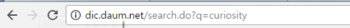
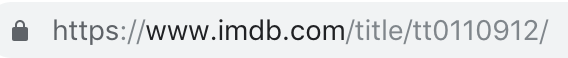
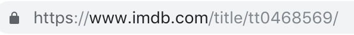

- - -

# 웹 스크래핑 기초

### Web Scraping: The Basic

* * *

**박 진 수** 교수  
Intelligent Data Semantics Lab  
Seoul National University

- - -

<h3>Table of Contents<span class="tocSkip"></span></h3>
<div class="toc"><ul class="toc-item"><li><span><a href="#관련-모듈-설치-및-사용" data-toc-modified-id="관련-모듈-설치-및-사용-1">관련 모듈 설치 및 사용</a></span></li><li><span><a href="#네이버-금융-사이트" data-toc-modified-id="네이버-금융-사이트-2">네이버 금융 사이트</a></span><ul class="toc-item"><li><span><a href="#USD-환율-확인하기" data-toc-modified-id="USD-환율-확인하기-2.1">USD 환율 확인하기</a></span></li></ul></li><li><span><a href="#다음-어학사전" data-toc-modified-id="다음-어학사전-3">다음 어학사전</a></span><ul class="toc-item"><li><span><a href="#단어의-검색-결과-출력하기" data-toc-modified-id="단어의-검색-결과-출력하기-3.1">단어의 검색 결과 출력하기</a></span></li><li><span><a href="#여러-단어의-검색-결과-출력하기" data-toc-modified-id="여러-단어의-검색-결과-출력하기-3.2">여러 단어의 검색 결과 출력하기</a></span></li><li><span><a href="#여러-단어의-검색-결과-저장하기" data-toc-modified-id="여러-단어의-검색-결과-저장하기-3.3">여러 단어의 검색 결과 저장하기</a></span></li><li><span><a href="#원하는-단어들이-있는-파일에서-불러와-결과를-다른-파일로-저장하기" data-toc-modified-id="원하는-단어들이-있는-파일에서-불러와-결과를-다른-파일로-저장하기-3.4">원하는 단어들이 있는 파일에서 불러와 결과를 다른 파일로 저장하기</a></span></li></ul></li><li><span><a href="#coinmarketcap.com" data-toc-modified-id="coinmarketcap.com-4">coinmarketcap.com</a></span><ul class="toc-item"><li><span><a href="#비트코인-관련-데이터-출력하기" data-toc-modified-id="비트코인-관련-데이터-출력하기-4.1">비트코인 관련 데이터 출력하기</a></span></li><li><span><a href="#상위-100개-코인-관련-데이터-저장하기" data-toc-modified-id="상위-100개-코인-관련-데이터-저장하기-4.2">상위 100개 코인 관련 데이터 저장하기</a></span></li><li><span><a href="#특정-조건을-만족하는-코인-관련-데이터-저장하기" data-toc-modified-id="특정-조건을-만족하는-코인-관련-데이터-저장하기-4.3">특정 조건을 만족하는 코인 관련 데이터 저장하기</a></span></li></ul></li><li><span><a href="#IMDb" data-toc-modified-id="IMDb-5">IMDb</a></span><ul class="toc-item"><li><span><a href="#'보헤미안-랩소디'-영화-정보-출력하기" data-toc-modified-id="'보헤미안-랩소디'-영화-정보-출력하기-5.1">'보헤미안 랩소디' 영화 정보 출력하기</a></span></li><li><span><a href="#여러-영화-정보-저장하기" data-toc-modified-id="여러-영화-정보-저장하기-5.2">여러 영화 정보 저장하기</a></span></li><li><span><a href="#영화-리뷰-출력하기" data-toc-modified-id="영화-리뷰-출력하기-5.3">영화 리뷰 출력하기</a></span></li><li><span><a href="#영화-리뷰-일부-저장하기" data-toc-modified-id="영화-리뷰-일부-저장하기-5.4">영화 리뷰 일부 저장하기</a></span></li><li><span><a href="#영화-리뷰-전체-저장하기" data-toc-modified-id="영화-리뷰-전체-저장하기-5.5">영화 리뷰 전체 저장하기</a></span></li><li><span><a href="#본인이-좋아하는-영화-리뷰-저장하기" data-toc-modified-id="본인이-좋아하는-영화-리뷰-저장하기-5.6">본인이 좋아하는 영화 리뷰 저장하기</a></span></li></ul></li><li><span><a href="#인트라넷-공지사항-크롤링" data-toc-modified-id="인트라넷-공지사항-크롤링-6">인트라넷 공지사항 크롤링</a></span></li></ul></div>

# 관련 모듈 설치 및 사용


```python
!python -m pip install --upgrade bs4

# 또는
#!pip install bs4
```


```python
from urllib.request import urlopen
from bs4 import BeautifulSoup 

import bs4
print('bs4 version...:', bs4.__version__)
```

# 네이버 금융 사이트

## USD 환율 확인하기

- https://finance.naver.com/marketindex/


```python
# from bs4 import BeautifulSoup
# from urllib.request import urlopen

url = 'https://finance.naver.com/marketindex/'
bs = BeautifulSoup(urlopen(url), 'html.parser')
# print(bs.prettify())
```


```python
# 현재 각 나라의 환율을 포함하고 있는 태그 내용을 추출한다.
__TODO__
```


```python
# 현재 미국 달러 환율을 포함하고 있는 태그 내용을 추출한다.
__TODO__
```


```python
# 현재 미국 달러 환율을 포함하고 있는 태그 안의 텍스트 내용만 추출한다.
__TODO__
```

# 다음 어학사전 

## 단어의 검색 결과 출력하기

- - -

- 다음 어학사전에서 'curiosity' 단어를 검색한 결과 화면의 가장 상단에 나타나는 단어의 뜻을 출력한다.
    + http://dic.daum.net/

- 영어 단어의 의미(본 예제에서는 '1. 호기심 2. 큐리오시티')를 출력한다.

- - -

**TIPS**
- 가져오고자 하는 텍스트의 다른 HTML 구성요소와 구분되는 특성(CSS style)을 잘 생각해 본다.
- 가장 상단에 있는 데이터임을 고려하면서 HTML 파싱 결과를 어떻게 슬라이싱(slicing)할 것인지 고민해 본다.

**실행 결과**
<pre>> python dict_daum_word.py
1.호기심
2.큐리오시티
</pre>


```python
# Your answer here
```

## 여러 단어의 검색 결과 출력하기

- - -

- [다음 어학사전](http://dic.daum.net/)에 'curiosity', 'killed', 'the', 'cat' 4개 단어를 검색한 결과 화면의 가장 상단에 나타나는 단어의 뜻을 출력한다.

- 각 영어 단어의 의미를 출력한다.

- - -

**TIPS**
- **for** 문을 활용해 여러 단어를 돌아가면서 데이터를 출력한다!
- 초기 화면에서 몇 개 단어를 검색해 보면서 [URL 구조](https://drive.google.com/file/d/1ResSaWNAne2V7xjQxM1up6qMYNvXljUk/view?usp=sharing)를 잘 생각해 본다.



**실행 결과**
<pre>> python dict_daum_words.py
curiosity
1.호기심
2.큐리오시티

killed
1.죽음
2.사망
3.살해되다
4.목숨을 잃다

the
1.그
2.그럴수록
3.더욱더

cat
1.고양이
2.고양이과 동물

=== Job completed! =======
</pre>


```python
# Your answer here
```

## 여러 단어의 검색 결과 저장하기

- - -

- [다음 어학사전](http://dic.daum.net/)에 'curiosity', 'killed', 'the', 'cat' 4개 단어를 검색한 결과 화면의 가장 상단에 나타나는 단어의 뜻을 텍스트 파일로 저장한다.

- 각 영어 단어의 의미를 저장한다.

- - -
**TIPS**
- 파이썬의 **open()** 함수를 사용해 텍스트 파일로 저장한다.
- 한글 저장을 위해 인코딩을 'utf-8'로 설정하는 것이 바람직하다.

**실행 결과**
<pre>> python dict_daum_words_file.py
curiosity
1.호기심
2.큐리오시티

killed
1.죽음
2.사망
3.살해되다
4.목숨을 잃다

the
1.그
2.그럴수록
3.더욱더

cat
1.고양이
2.고양이과 동물

위 내용을 'daum-dict-1.txt'로 저장하였습니다.
</pre>


```python
#  Your answer here
```


```
%pycat daum-dict-1.txt
curiosity
1.호기심
2.큐리오시티

killed
1.죽음
2.사망
3.살해되다
4.목숨을 잃다

the
1.그
2.그럴수록
3.더욱더

cat
1.고양이
2.고양이과 동물
```


## 원하는 단어들이 있는 파일에서 불러와 결과를 다른 파일로 저장하기

- - -

- [다음 어학사전](http://dic.daum.net/)에 텍스트 파일(daum-words.txt)에 있는 각 단어를 검색한 결과 화면의 가장 상단에 나타나는 단어의 뜻을 텍스트 파일로 저장한다.
    + daum-words.txt
    ```code
    but
    satisfaction
    brought
    it
    back
    ```

- 각 영어 단어의 의미를 저장한다.

- - -

**TIPS**
- 텍스트 파일(daum-words.txt)의 내용을 불러올 때 readlines() 함수를 사용한다.
- 한글 저장을 위해 인코딩을 'utf-8'로 설정하는 것이 바람직하다

**실행 결과**
<pre>> python dict_daum_words_files.py
but
1.~만
2.하지만
3.그러나
4.아니면
5.뿐만 아니라

satisfaction
1.만족
2.충족

brought
1.가져왔다
2.보내졌다
3.데려왔다
4.키웠다
5.모였다

it
1.그것
2.이것
3.그런

back
1.돌아가다
2.뒤
3.등
4.후퇴하다

위 내용을 'daum-dict-2.txt'로 저장하였습니다.
</pre>

수집할 단어 목록을 직접 작성하던지 아니면 실습을 위해 다음 데이터 파일을 내려받는다.


```python
# --- 만약 wget이 설치되어 있다면 아래 명령어로 모든 파일을 'data'라는 하위 폴더에 내려받는다.
!wget -P data -q --show-progress --no-check-certificate https://raw.githubusercontent.com/snu-ds/data/master/daum-words.txt
```

    daum-words.txt      100%[===================>]      36  --.-KB/s    in 0s      


**wget**을 설치하지 않았다면 아래 링크를 선택하여 내려받는다. 파일을 내려받은 후 파일 이름이 아래 이름과 일치하는지 꼭 확인하기 바란다.

- [daum-words.txt](https://docs.google.com/uc?export=download&id=1QGzowwJ4ds3WKrwcqxK2WToLBcjiR58F) 

내려받은 모든 파일은 현재 작업 폴더의 하위 폴더인 'data'에 있다고 가정한다.

파일 내용을 확인한다.


```
%pycat data/daum-words.txt
but
satisfaction
brought
it
back
```


```python
# Your answer here
```


```
%pycat daum-dict-2.txt
but
1.~만
2.하지만
3.그러나
4.아니면
5.뿐만 아니라

satisfaction
1.만족
2.충족

brought
1.가져왔다
2.보내졌다
3.데려왔다
4.키웠다
5.모였다

it
1.그것
2.이것
3.그런

back
1.돌아가다
2.뒤
3.등
4.후퇴하다
```


# coinmarketcap.com

## 비트코인 관련 데이터 출력하기

- - -
- [코인마켓캡](https://coinmarketcap.com/) 메인 페이지의 가장 상단에 있는 비트코인의 화폐 이름(Name)과 시가총액(Market Cap), 개당 가격(Price), 그리고 24시간 볼륨(Volume)을 출력한다.
    - <https://coinmarketcap.com/>


- 한 줄에 하나씩 출력하도록 한다.

- - -

**힌트** : 분할정복(Divide and Conquer)  
- 우선 전체 코인 데이터가 포함되어 있는 테이블('**table**')을 찾는다.
- 테이블 내에 비트코인 데이터가 있는 행('**tr**')을 찾는다.

**실행 결과** (실시간 정보라 현재 결과는 다를 수 있다.)

<pre>> python coin_bitcoin.py
Coin Name..: Bitcoin
Market Cap.: $183,011,780,428
Price......: $9,963.13
Volume.....: $62,526,079,800
</pre>


```python
# Your answer here
```

## 상위 100개 코인 관련 데이터 저장하기

- - -

- [코인마켓캡](https://coinmarketcap.com/) 메인 페이지에 있는 상위 **100**개 코인의 화폐 이름(Name)과 시가총액(Market Cap), 개당 가격(Price), 그리고 **24**시간 볼륨(Volume)을 텍스트 파일로 저장한다.
    - <https://coinmarketcap.com/>


- 한 줄에 코인 하나의 데이터를 저장하고, 각 행(줄)에서 화폐 이름(Name), 시가총액(Market Cap), 개당 가격(Price), **24**시간 볼륨(Volume)은 탭으로 구분한다.

- - -

**힌트**
- 직전 실습에서 사용한 코드를 조금만 바꾸면 쉽게 풀 수 있다.
- **for** 문을 활용해 텍스트 파일에 코인 하나씩 데이터를 **write** 한다.

**실행 결과** (실시간 정보라 현재 결과는 다를 수 있다.)

<pre>> python coin_top100.py
Bitcoin	$183,006,254,350	$9,962.59	$53,576,818,654
Ethereum	$23,887,067,049	$215.50	$20,791,214,149
XRP	$9,764,030,397	$0.221342	$2,467,134,493
Tether	$6,378,971,336	$1.00	$64,564,048,880
Bitcoin Cash	$4,866,329,043	$264.45	$3,931,784,287
Bitcoin SV	$3,918,473,369	$212.96	$2,458,343,039
Litecoin	$3,126,520,959	$48.33	$4,760,798,074
Binance Coin	$2,695,994,322	$17.33	$386,079,999
EOS	$2,575,283,775	$2.79	$3,805,598,110
Tezos	$1,978,238,051	$2.79	$160,275,851
Stellar	$1,487,954,214	$0.073543	$619,287,041
Cardano	$1,369,186,527	$0.052809	$174,085,700
Chainlink	$1,338,664,374	$3.82	$390,086,266
Crypto.com Coin	$1,144,993,100	$0.068962	$7,524,020
Monero	$1,126,966,071	$64.20	$128,601,509
TRON	$1,095,323,650	$0.016426	$1,715,398,490
UNUS SED LEO	$1,061,110,001	$1.06	$20,578,612
Huobi Token	$937,285,103	$4.21	$133,398,111
Ethereum Classic	$850,357,599	$7.31	$2,143,986,489
Neo	$825,335,378	$11.70	$963,411,901
Dash	$785,039,734	$82.78	$770,914,298
USD Coin	$710,900,977	$1.01	$574,356,881
HedgeTrade	$706,818,754	$2.45	$517,030
IOTA	$567,356,603	$0.204120	$17,071,084
Cosmos	$544,126,767	$2.85	$191,523,115
Zcash	$432,275,611	$47.44	$397,598,034
NEM	$378,306,785	$0.042034	$23,317,383
Ontology	$345,401,113	$0.525928	$123,164,807
Maker	$344,167,202	$342.26	$3,319,244
Basic Attention Token	$329,673,461	$0.226187	$209,071,358
Dogecoin	$326,865,088	$0.002626	$290,316,980
OKB	$325,071,940	$5.42	$152,906,555
FTX Token	$300,335,922	$3.15	$2,593,143
DigiByte	$293,656,870	$0.022388	$34,527,524
0x	$269,374,699	$0.412528	$408,364,058
VeChain	$269,013,140	$0.004851	$216,306,762
Paxos Standard	$244,823,109	$0.999474	$662,642,088
Binance USD	$177,922,110	$0.999331	$117,689,961
Bitcoin Gold	$175,913,265	$10.04	$45,364,895
Decred	$171,265,284	$14.94	$122,329,232
ICON	$168,283,207	$0.310488	$74,632,190
Hyperion	$165,716,571	$0.523152	$21,976,702
Hedera Hashgraph	$164,207,101	$0.040270	$10,811,769
Synthetix Network Token	$164,052,426	$0.904095	$5,180,257
Qtum	$161,666,706	$1.67	$411,425,882
Augur	$158,257,869	$14.39	$59,189,204
Algorand	$154,990,427	$0.219854	$68,061,158
Lisk	$152,413,717	$1.23	$5,090,092
THETA	$145,876,052	$0.167577	$11,716,382
TrueUSD	$137,260,685	$0.999124	$1,068,640,181
Ravencoin	$136,370,419	$0.022294	$18,270,193
Enjin Coin	$119,363,254	$0.145605	$13,292,392
Kyber Network	$118,596,559	$0.658766	$60,990,935
Multi-collateral DAI	$113,222,657	$1.01	$20,908,043
ZB Token	$111,576,694	$0.240836	$42,450,325
OmiseGO	$109,934,733	$0.783874	$151,804,161
Bitcoin Diamond	$109,787,473	$0.588695	$10,238,432
Waves	$108,412,800	$1.06	$39,409,900
Status	$107,729,049	$0.031042	$55,118,151
Hive	$103,880,938	$0.364097	$10,815,716
Energi	$95,631,544	$3.39	$1,176,997
Nano	$95,328,283	$0.715418	$7,058,744
ABBC Coin	$95,073,222	$0.171175	$44,367,943
Siacoin	$94,712,423	$0.002265	$1,986,411
MCO	$93,207,527	$5.90	$61,610,044
MonaCoin	$92,640,779	$1.41	$4,015,992
DxChain Token	$91,656,428	$0.001833	$394,492
Holo	$89,001,060	$0.000542	$11,225,333
Aave	$87,214,176	$0.067088	$5,403,450
DigixDAO	$82,485,551	$41.24	$7,398,091
Numeraire	$80,522,074	$33.15	$2,366,443
Nervos Network	$76,567,597	$0.004455	$9,524,188
KuCoin Shares	$76,237,935	$0.938310	$6,191,685
Zilliqa	$74,402,916	$0.007358	$20,961,994
Komodo	$73,665,238	$0.615241	$22,232,169
Bytom	$69,555,438	$0.069382	$11,768,447
Steem	$67,417,528	$0.182240	$3,449,183
BitTorrent	$62,336,693	$0.000294	$84,109,215
Verge	$61,993,149	$0.003812	$3,285,005
Matic Network	$61,863,573	$0.018018	$26,376,227
Nexo	$60,749,976	$0.108482	$13,561,198
Quant	$60,662,893	$5.02	$3,725,866
Ren	$60,269,153	$0.070701	$2,932,495
BitShares	$56,116,977	$0.020429	$11,930,455
Bytecoin	$56,082,731	$0.000305	$62,967
Terra	$55,957,535	$0.194455	$2,249,985
Decentraland	$55,237,737	$0.040315	$34,614,967
MaidSafeCoin	$52,876,150	$0.116840	$211,033
Seele-N	$52,823,022	$0.075505	$10,040,820
Ripio Credit Network	$52,405,109	$0.103191	$4,339,990
Streamr	$52,066,143	$0.076890	$5,126,321
HyperCash	$50,869,839	$1.14	$14,546,161
v.systems	$50,194,904	$0.025246	$3,179,679
Horizen	$50,148,787	$5.56	$4,309,437
IOST	$46,822,210	$0.003897	$33,320,164
Crypterium	$45,786,402	$0.459843	$1,254,790
Chiliz	$45,652,461	$0.009996	$11,615,510
Golem	$45,649,049	$0.046578	$5,520,457
ReddCoin	$45,567,101	$0.001582	$781,377
Blockstack	$44,403,459	$0.111682	$954,008

=== 수집한 데이터 100개를 'cryptocurrency-top100.txt'로 저장하였습니다. =======
</pre>


```python
# Your answer here
```


```
%pycat cryptocurrency-top100.txt
Bitcoin $183,006,254,350        $9,962.59       $53,576,818,654
Ethereum        $23,887,067,049 $215.50 $20,791,214,149
XRP     $9,764,030,397  $0.221342       $2,467,134,493
Tether  $6,378,971,336  $1.00   $64,564,048,880
Bitcoin Cash    $4,866,329,043  $264.45 $3,931,784,287
Bitcoin SV      $3,918,473,369  $212.96 $2,458,343,039
Litecoin        $3,126,520,959  $48.33  $4,760,798,074
Binance Coin    $2,695,994,322  $17.33  $386,079,999
EOS     $2,575,283,775  $2.79   $3,805,598,110
Tezos   $1,978,238,051  $2.79   $160,275,851
Stellar $1,487,954,214  $0.073543       $619,287,041
Cardano $1,369,186,527  $0.052809       $174,085,700
Chainlink       $1,338,664,374  $3.82   $390,086,266
Crypto.com Coin $1,144,993,100  $0.068962       $7,524,020
Monero  $1,126,966,071  $64.20  $128,601,509
TRON    $1,095,323,650  $0.016426       $1,715,398,490
UNUS SED LEO    $1,061,110,001  $1.06   $20,578,612
Huobi Token     $937,285,103    $4.21   $133,398,111
Ethereum Classic        $850,357,599    $7.31   $2,143,986,489
Neo     $825,335,378    $11.70  $963,411,901
Dash    $785,039,734    $82.78  $770,914,298
USD Coin        $710,900,977    $1.01   $574,356,881
HedgeTrade      $706,818,754    $2.45   $517,030
IOTA    $567,356,603    $0.204120       $17,071,084
Cosmos  $544,126,767    $2.85   $191,523,115
Zcash   $432,275,611    $47.44  $397,598,034
NEM     $378,306,785    $0.042034       $23,317,383
Ontology        $345,401,113    $0.525928       $123,164,807
Maker   $344,167,202    $342.26 $3,319,244
Basic Attention Token   $329,673,461    $0.226187       $209,071,358
Dogecoin        $326,865,088    $0.002626       $290,316,980
OKB     $325,071,940    $5.42   $152,906,555
FTX Token       $300,335,922    $3.15   $2,593,143
DigiByte        $293,656,870    $0.022388       $34,527,524
0x      $269,374,699    $0.412528       $408,364,058
VeChain $269,013,140    $0.004851       $216,306,762
Paxos Standard  $244,823,109    $0.999474       $662,642,088
Binance USD     $177,922,110    $0.999331       $117,689,961
Bitcoin Gold    $175,913,265    $10.04  $45,364,895
Decred  $171,265,284    $14.94  $122,329,232
ICON    $168,283,207    $0.310488       $74,632,190
Hyperion        $165,716,571    $0.523152       $21,976,702
Hedera Hashgraph        $164,207,101    $0.040270       $10,811,769
Synthetix Network Token $164,052,426    $0.904095       $5,180,257
Qtum    $161,666,706    $1.67   $411,425,882
Augur   $158,257,869    $14.39  $59,189,204
Algorand        $154,990,427    $0.219854       $68,061,158
Lisk    $152,413,717    $1.23   $5,090,092
THETA   $145,876,052    $0.167577       $11,716,382
TrueUSD $137,260,685    $0.999124       $1,068,640,181
Ravencoin       $136,370,419    $0.022294       $18,270,193
Enjin Coin      $119,363,254    $0.145605       $13,292,392
Kyber Network   $118,596,559    $0.658766       $60,990,935
Multi-collateral DAI    $113,222,657    $1.01   $20,908,043
ZB Token        $111,576,694    $0.240836       $42,450,325
OmiseGO $109,934,733    $0.783874       $151,804,161
Bitcoin Diamond $109,787,473    $0.588695       $10,238,432
Waves   $108,412,800    $1.06   $39,409,900
Status  $107,729,049    $0.031042       $55,118,151
Hive    $103,880,938    $0.364097       $10,815,716
Energi  $95,631,544     $3.39   $1,176,997
Nano    $95,328,283     $0.715418       $7,058,744
ABBC Coin       $95,073,222     $0.171175       $44,367,943
Siacoin $94,712,423     $0.002265       $1,986,411
MCO     $93,207,527     $5.90   $61,610,044
MonaCoin        $92,640,779     $1.41   $4,015,992
DxChain Token   $91,656,428     $0.001833       $394,492
Holo    $89,001,060     $0.000542       $11,225,333
Aave    $87,214,176     $0.067088       $5,403,450
DigixDAO        $82,485,551     $41.24  $7,398,091
Numeraire       $80,522,074     $33.15  $2,366,443
Nervos Network  $76,567,597     $0.004455       $9,524,188
KuCoin Shares   $76,237,935     $0.938310       $6,191,685
Zilliqa $74,402,916     $0.007358       $20,961,994
Komodo  $73,665,238     $0.615241       $22,232,169
Bytom   $69,555,438     $0.069382       $11,768,447
Steem   $67,417,528     $0.182240       $3,449,183
BitTorrent      $62,336,693     $0.000294       $84,109,215
Verge   $61,993,149     $0.003812       $3,285,005
Matic Network   $61,863,573     $0.018018       $26,376,227
Nexo    $60,749,976     $0.108482       $13,561,198
Quant   $60,662,893     $5.02   $3,725,866
Ren     $60,269,153     $0.070701       $2,932,495
BitShares       $56,116,977     $0.020429       $11,930,455
Bytecoin        $56,082,731     $0.000305       $62,967
Terra   $55,957,535     $0.194455       $2,249,985
Decentraland    $55,237,737     $0.040315       $34,614,967
MaidSafeCoin    $52,876,150     $0.116840       $211,033
Seele-N $52,823,022     $0.075505       $10,040,820
Ripio Credit Network    $52,405,109     $0.103191       $4,339,990
Streamr $52,066,143     $0.076890       $5,126,321
HyperCash       $50,869,839     $1.14   $14,546,161
v.systems       $50,194,904     $0.025246       $3,179,679
Horizen $50,148,787     $5.56   $4,309,437
IOST    $46,822,210     $0.003897       $33,320,164
Crypterium      $45,786,402     $0.459843       $1,254,790
Chiliz  $45,652,461     $0.009996       $11,615,510
Golem   $45,649,049     $0.046578       $5,520,457
ReddCoin        $45,567,101     $0.001582       $781,377
Blockstack      $44,403,459     $0.111682       $954,008
```


## 특정 조건을 만족하는 코인 관련 데이터 저장하기

- - -

- 상위 **100**개의 코인 중 **24**시간 볼륨(Volume)이 USD **1,000,000** 달러 이상이고 개당 가격이 **50** 달러 이상인 코인들의 데이터만 저장한다.

- 한 줄에 코인 하나의 데이터를 저장하고, 각 행(줄)에서 화폐 이름(Name), 시가총액(Market Cap), 개당 가격(Price), **24**시간 볼륨(Volume)은 탭으로 구분한다.

- - -

**힌트**
- 각 코인의 개당 가격과 볼륨에서 **replace()** 메소드를 사용해 '$', ',' 등 기호들을 제거한다.
- 가격과 볼륨을 **float** 자료형으로 형변환한다.
- **if** 문을 사용하여 조건을 만족하는 코인의 데이터만 저장한다.

**실행 결과** (실시간 정보라 현재 결과는 다를 수 있다.)
<pre>> python coin_top100_filtered.py
Bitcoin	$183,003,203,920	$9,962.37	$53,578,229,173
Ethereum	$23,820,564,303	$214.89	$20,808,729,498
Bitcoin Cash	$4,848,003,138	$263.46	$3,943,258,222
Bitcoin SV	$3,902,418,293	$212.09	$2,461,824,919
Monero	$1,125,135,198	$64.10	$127,579,153
Dash	$780,949,244	$82.35	$769,912,066
Maker	$344,355,936	$342.45	$3,312,511

=== 수집한 데이터 7개를 'cryptocurrency-top100-filtered.txt'로 저장하였습니다. =======
</pre>


```python
# Your answer here
```


```
%pycat cryptocurrency-top100-filtered.txt
Bitcoin $183,003,203,920        $9,962.37       $53,578,229,173
Ethereum        $23,820,564,303 $214.89 $20,808,729,498
Bitcoin Cash    $4,848,003,138  $263.46 $3,943,258,222
Bitcoin SV      $3,902,418,293  $212.09 $2,461,824,919
Monero  $1,125,135,198  $64.10  $127,579,153
Dash    $780,949,244    $82.35  $769,912,066
Maker   $344,355,936    $342.45 $3,312,511
```


# IMDb

## '보헤미안 랩소디' 영화 정보 출력하기

- - -

IMDb 사이트에서 영화 보헤미안 랩소디 페이지(<https://www.imdb.com/title/tt1727824/>)에서 보헤미안 랩소디 영화의 제목(title)과 감독(director), 그리고 출연 배우(cast)를 출력한다.

- - -


**실행 결과**
<pre>> python imdb_movie.py
Movie: Bohemian Rhapsody (2018) 
Director: Bryan Singer
Cast:    Rami Malek
         Lucy Boynton
         Gwilym Lee
</pre>


```python
# Your answer here
```

## 여러 영화 정보 저장하기

- - -

- IMDb 사이트(<http://www.imdb.com>)에서 아래 영화의 제목(title)과 감독 이름(director)를 텍스트 파일에 저장한다.
    - 펄프 픽션(Pulp Fiction): <http://www.imdb.com/title/tt0110912>
    - 포레스트 검프(Forrest Gump): <http://www.imdb.com/title/tt0109830>
    - 다크 나이트(The Dark Knight): <http://www.imdb.com/title/tt0468569>

- 영화 하나당 한 줄씩 출력되도록 한다.

- - -

**힌트**  
- 영화가 달라짐에 따라 각 영화 정보의 URL이 어떻게 변하는지 잘 살펴본다.

  
  
  

**실행 결과**

<pre>> python imdb_movies.py
Pulp Fiction(1994), Quentin Tarantino
Forrest Gump(1994), Robert Zemeckis
The Dark Knight(2008), Christopher Nolan

위 내용을 'IMDb-directors.txt'로 저장하였습니다.
</pre>


```python
# Your answer here
```


```
%pycat IMDb-directors.txt
Pulp Fiction(1994), Quentin Tarantino
Forrest Gump(1994), Robert Zemeckis
The Dark Knight(2008), Christopher Nolan
```


## 영화 리뷰 출력하기

- - -

영화 [보헤미안 랩소디(Bohemian Rhapsody)](https://www.imdb.com/title/tt1727824/)의 리뷰 페이지에 들어가 첫 번째 리뷰 내용을 출력해 보자.

- https://www.imdb.com/title/tt1727824/reviews?ref_=tt_ql_3 

- - -

**실행 결과** (실시간으로 리뷰가 추가되기 때문에 결과는 다를 수 있다.)
<pre>> python imdb_movie_review.py
This movie is a must see for any music and movie lover Queen fan or no Queen fan,anyone who sees this movie will be going through a rollercoaster of Emotions Beeing it Queens music or the story behind the music Rami Malek puts down an excellent version of Freddie Mercury, but all the actors play great in this movie In my opinion best thing to do is ignore the criticism and go see it for yourself.
</pre>


```python
# Your answer here
```

## 영화 리뷰 일부 저장하기

- - -

영화 [보헤미안 랩소디(Bohemian Rhapsody)](https://www.imdb.com/title/tt1727824/)의 리뷰 페이지에 들어가 첫 25개의 리뷰를 텍스트 파일로 저장해보자. 단, 'Warning: Spoilers'란 내용이 들어 있는 리뷰의 경우에는 리뷰 내용은 생략하고 'Warning: Spoilers'만 저장한다.
- https://www.imdb.com/title/tt1727824/reviews?ref_=tt_ql_3

- - - 

**실행 결과** (실시간으로 리뷰가 추가되기 때문에 결과는 다를 수 있다.)
<pre>> python imdb_movie_25reviews_file.py
Job completed!!!
수집한 데이터 25개를 'IMDb-bohemian-rhapsody-first25-reviews.txt'로 저장하였습니다.
</pre>


```python
# Your answer here
```

## 영화 리뷰 전체 저장하기

- - -

영화 [보헤미안 랩소디(Bohemian Rhapsody)](https://www.imdb.com/title/tt1727824/)의 리뷰 페이지에 들어가 전체 리뷰를 텍스트 파일로 저장해보자. 단, 'Warning: Spoilers'란 내용이 들어 있는 리뷰의 경우에는 리뷰 내용은 생략하고 'Warning: Spoilers'만 저장한다.
- https://www.imdb.com/title/tt1727824/reviews?ref_=tt_ql_3

- - - 

**실행 결과** (실시간으로 리뷰가 추가되기 때문에 결과는 다를 수 있다.)
<pre>> python imdb_movie_all_reviews_file.py
.......... 현재 가져온 리뷰 개수: 100
.......... 현재 가져온 리뷰 개수: 200
.......... 현재 가져온 리뷰 개수: 300
.......... 현재 가져온 리뷰 개수: 400
.......... 현재 가져온 리뷰 개수: 500
.......... 현재 가져온 리뷰 개수: 600
.......... 현재 가져온 리뷰 개수: 700
.......... 현재 가져온 리뷰 개수: 800
.......... 현재 가져온 리뷰 개수: 900
.......... 현재 가져온 리뷰 개수: 1,000
.......... 현재 가져온 리뷰 개수: 1,100
.......... 현재 가져온 리뷰 개수: 1,200
.......... 현재 가져온 리뷰 개수: 1,300
.......... 현재 가져온 리뷰 개수: 1,400
.......... 현재 가져온 리뷰 개수: 1,500
.......... 현재 가져온 리뷰 개수: 1,600
.......... 현재 가져온 리뷰 개수: 1,700
.......... 현재 가져온 리뷰 개수: 1,800
.......... 현재 가져온 리뷰 개수: 1,900
.......... 현재 가져온 리뷰 개수: 2,000
.......... 현재 가져온 리뷰 개수: 2,100
.......... 현재 가져온 리뷰 개수: 2,200
.......... 현재 가져온 리뷰 개수: 2,300
.......... 현재 가져온 리뷰 개수: 2,400
.......... 현재 가져온 리뷰 개수: 2,500
.......... 현재 가져온 리뷰 개수: 2,600
.......... 현재 가져온 리뷰 개수: 2,700
.......... 현재 가져온 리뷰 개수: 2,800
.......... 현재 가져온 리뷰 개수: 2,900
.......... 현재 가져온 리뷰 개수: 3,000
.......... 현재 가져온 리뷰 개수: 3,100
.......... 현재 가져온 리뷰 개수: 3,200
.......... 현재 가져온 리뷰 개수: 3,300
...
Job completed!!!
수집한 데이터 3,337개를 'IMDb-bohemian-rhapsody-all-reviews.txt'로 저장하였습니다.
</pre>


```python
# Your answer here
```

## 본인이 좋아하는 영화 리뷰 저장하기

- - -

자신이 좋아하는 영화를 **3개 이상** 골라 직전에 실습한 코드를 조금씩 바꾸어 영화 리뷰를 각각 다른 텍스트 파일에 저장해 보자.

- - - 


```python
# Your answer here
```

# 인트라넷 공지사항 크롤링

- - -

서울대학교 경영대학 공지사항 제목을 5페이지까지 스크래핑하여 화면으로 출력한다.

- 서울대학교 경영대학 공지사항(<http://cba.snu.ac.kr/ko/notice>)

- - -

**실행 결과** (실시간으로 공지가 추가되기 때문에 결과는 다를 수 있다.)
```
> python snu_biz.py
2020학년도 하계 계절수업 <경영학원론> 증원 안내
교수협의회 코로나19 위기극복장학금 신청 안내(초과학기/...
2020학년도 푸드스마일즈 우양 자매애 장학생 선발 안내
2020학년도 2학기 부전공 최종 합격자 발표
(기한연장) 2020학년도 1학기 학록장학문화재단 장학생 선...
[경영학도서관] 2020년 4월 신착도서 목록
2020학년도 가헌신도재단 '종이로꿈꾸는세상' 사...
연합전공 벤처경영학 이수규정 안내
2020년 콘라드아데나워재단 한국사무소 독일유학 석/박사 장...
2020학년도 서울장학재단 독립유공자후손장학금 장학생 선...
2020학년도 서울장학재단 서울희망대학장학금 장학생 선발 ...
2020학년도 5월 언어교육원 지원
2020학년도 하계 계절수업 수강신청 안내
2020학년도 1학기 석,박사학위논문심사 계획 공고
[일정변경완료]▷▶ 2020학년도 경영대학 대학원 신입생 후기...
[2020년 1학기] 경영대학 개설 교과목 강의자료 이용안내
★★★2020학년도 학사일정 변경사항 안내★★★
[재수강 강좌 공지] 컴퓨터의 개념 및 실습 재수강 가능 강좌...
글로벌인재특별전형 경영대 지원 자격 변경 안내(graduate ad...
부전공 전필 인정 교과목 안내
2020년도 국비유학(연수)생 모집 안내
[학부졸업] 지도교수추천 및 학습윤리준수확인서 제출기한 관련
2020 퀴즈 온 코리아 (Quiz on Korea) 안내
2020학년도 1학기 학자금 대출 업무처리기준 변경 사항 및 ...
2020 대림산업 신입채용 및 Untact Career 'JOB담...
[이랜드ESI] ESI 인턴 22기 채용공고
2020년도 8월 학부졸업 보고서 공지
2020학년도 현대차정몽구재단 미래산업인재 장학생 선발 안내
Notice of purchasing public mask for foreign students
국가근로장학금 마을돌봄기관 근로장학생 선발 안내
2020학년도 하계 계절수업 국내 타 대학 학점 교류 신청 안내
(일당 6만원 지급) 2020학년도 자유전공학부 전공박람회 전공...
[학부 졸업] 지도교수추천서 및 학습윤리준수확인서 관련
서울대학교 경영대학 정/부학생회장 보궐 선거 투표 안내
2020학년도 1학기 「강의 중간 수강소감 조사」 실시 안내
2020학년도 2학기 복수전공 및 연합전공(벤처경영학) 합격자 ...
서울대학교 경영대학 “학생홍보대사” 선발
각 군 현역병 모집일정(4월)
경영대학 정/부학생회장 보궐선거 공동선본발족식 공고
한국은행 발권국 외부연구용역 공모 안내
2020학년도 푸른등대 긴급지원(코로나19) 기부장학금 장학...
2020학년도 제1학기 등록금 분납 2차 수납계획 알림
경영대학 정/부학생회장 보궐선거 후보자 등록 공고
서울주택도시공사 청년 매입임대주택 입주자 모집 안내
2020학년도 1학기 수강신청 취소 재안내
비대면 수업에 따른 유의사항 및 저작권 관련 온라인 교육 ...
2020학년도 1학기 비대면 수업기간 연장 안내
[경력개발센터]2020 서울대학교 온라인 채용상담 - 삼성생명
선거관리위원회 구성 & 선거일정 공고 & 후보자 추천서 온...
2020학년도 인천인재육성재단 코로나19 특별장학생 선발 안내
한국상담학회 코로나19 무료전화 및 온라인 게시판 상담
[Tashi Capital 채용공고] Korea RA - 채용공고
2020년 대웅재단 글로벌 장학프로그램 웅토링 스쿨 안내
2020학년도 2학기 경영학 다전공 선발 안내
[경영학도서관] 2020년 3월 신착도서 목록
2020학년도 1학기 대학원 교과학점 통산인정 신청 안내
2020학년도 서울장학재단 서울희망공익인재 장학생 선발 안내
2020학년도 1학기 본교 입학전 타교 수학학점 인정 신청 안내
2020학년도 1학기 비대면수업 기간 연장 안내
2020년 우수학생 국가장학사업(인문100년) 학생 사전신청 안내
2020학년도 제1차 대학교원 신규채용 공고
2020학년도 1학기 은평구민장학재단 장학생 선발 안내
전선 교과목 초안지 처리 완료
영상정보처리기기(CCTV) 운영 및 관리 방침
출판물 불법복제 단속 관련 안내
회계원리(251.205) 004 강좌 증원 안내
2020학년도 1학기 개설 교양 교과목 성적평가방법 변경 안내
2020-1학기 고졸 후학습자 장학금(희망사다리Ⅱ) 신규 장학...
2020-1학기 중소기업취업연계장학금(희망사다리Ⅰ) 신규 장...
(기한연장)2020학년도 서울장학재단 서울우수인재장학금 장...
2020학년도 1학기 대학원 신입생 연구윤리 교육 실시 안내
2020학년도 1/4분기 긴급구호장학생 선발 알림
McDonnell International Sympoisum 2020 - 3MT Competition
2020년도 회계학 학습장학금 신청 (기한: 4/17까지)
경영학원론(251.101_002_안중호 교수님) 수업 안내
(학부신입 대상) 2020학년도 달서인재육성장학재단 장학생 ...
2020년도 2학기 경영대학 교환학생 추가모집 선발 전형 안내
[금일 14:00 예정] 인사관리(251.303_002) 증원 안내
(비대면 진행 가능) 2020년 8월 학부 졸업사정 공지
2020학년도 1학기 타학과(부) 전공 교과목 성적평가방법 선...
중급회계1(002) 정운오 교수님 강의 대체 강사 투입 예정
졸업예정자 전필 교과목 초안지 처리 완료
(중요)개강 이후 과목별 비대면수업 운영방식 안내
2020학년도 1학기 한국선원복지고용센터 장학생 선발 안내
OIA's COVID-19 Notice Board for international studen...
해군 제129기 사관후보생(학사장교) 모집
2020학년도 대학원(석,박사) 신입생 학사안내 책자 배부 안내
2020년 3월 언어교육원 수강료 지원
(무기한연장)경영대학 강의실 및 세미나실 예약 제한 안내
2020년 아이코어사업 여성특화형 실험실창업탐색팀 모집 안내
대학원생 2020년 8월 졸업 및 수료 예정자 수료사정 점검 안내
[중국/동남아 유학생] 2020학년도 1학기 아모레퍼시픽 글로...
2020학년도 1학기 학사운영 안내(비대면 수업 관련)
2020학년도 1학기 신입생 학생증(S-CARD) 배부 일정 연기 안내
2020학년도 하계 계절수업 수요조사 실시 안내
2020학년도 통영시 장학생 선발 안내
2019년도 2학기 Dean's List 및 이의신청 접수
2020학년도1학기 농어촌희망재단 청년창업농육성장학생 모...
[기타] 서울대/포스코스포츠센터 휴관 안내
2020학년도 1학기 신라문화장학재단 특별장학금 신청 안내
```


```python
# Your answer here
```

- - -

# THE END
