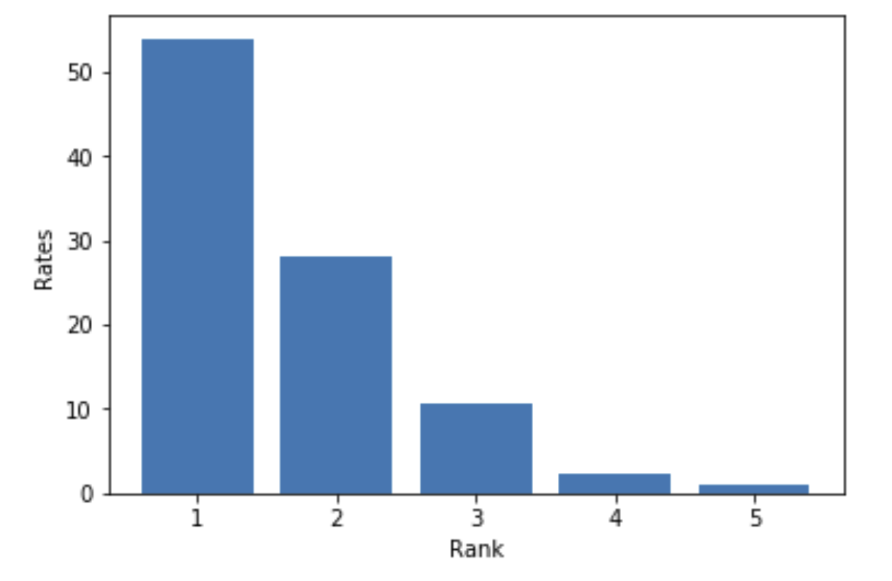
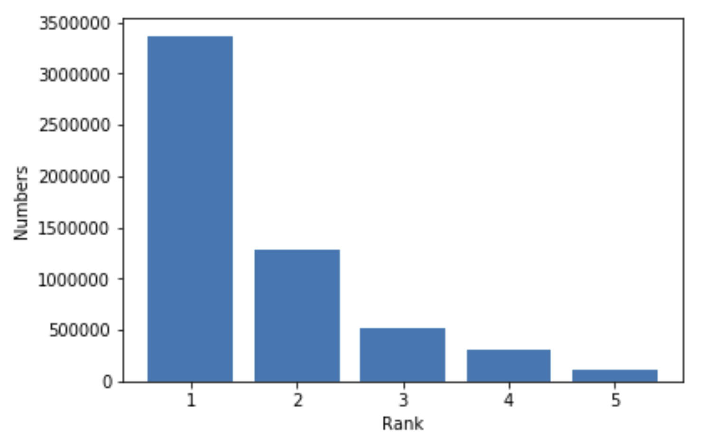
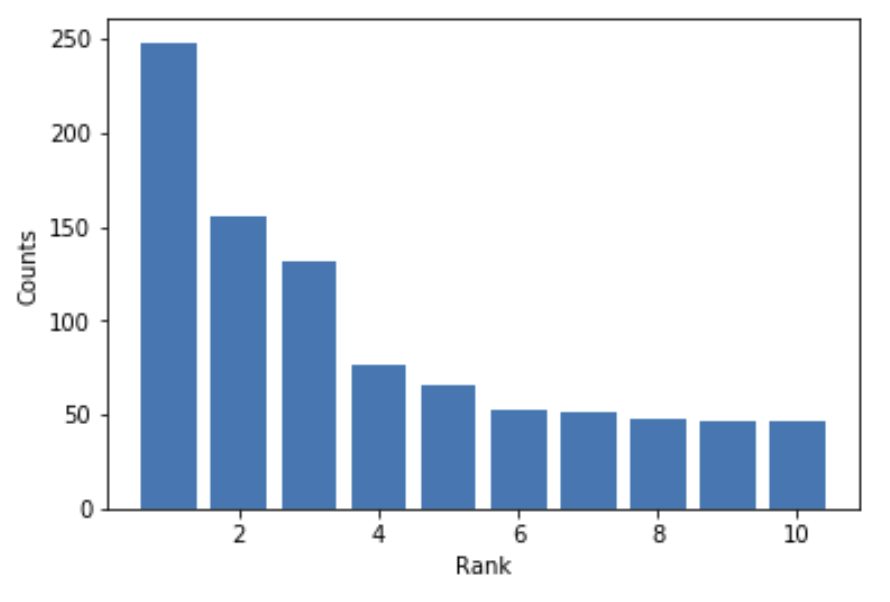

- - -

# 웹 스크래핑과 시각화

### Web Scraping and Visualization

* * *

**박 진 수** 교수  
Intelligent Data Semantics Lab  
Seoul National University

- - -

<h3>Table of Contents<span class="tocSkip"></span></h3>
<div class="toc"><ul class="toc-item"><li><span><a href="#관련-모듈-설치-및-사용" data-toc-modified-id="관련-모듈-설치-및-사용-1">관련 모듈 설치 및 사용</a></span></li><li><span><a href="#영화-예매율-상위-5위-시각화" data-toc-modified-id="영화-예매율-상위-5위-시각화-2">영화 예매율 상위 5위 시각화</a></span></li><li><span><a href="#영화-주간-관객-수-상위-5위-시각화" data-toc-modified-id="영화-주간-관객-수-상위-5위-시각화-3">영화 주간 관객 수 상위 5위 시각화</a></span></li><li><span><a href="#영화-리뷰-텍스트-분석-및-시각화" data-toc-modified-id="영화-리뷰-텍스트-분석-및-시각화-4">영화 리뷰 텍스트 분석 및 시각화</a></span><ul class="toc-item"><li><span><a href="#영화-리뷰-크롤링" data-toc-modified-id="영화-리뷰-크롤링-4.1">영화 리뷰 크롤링</a></span></li><li><span><a href="#영화-리뷰-내용-탐색-분석" data-toc-modified-id="영화-리뷰-내용-탐색-분석-4.2">영화 리뷰 내용 탐색 분석</a></span></li><li><span><a href="#영화-리뷰-내용을-워드클라우드-그리기" data-toc-modified-id="영화-리뷰-내용을-워드클라우드-그리기-4.3">영화 리뷰 내용을 워드클라우드 그리기</a></span><ul class="toc-item"><li><span><a href="#wordcloud-패키지-사용" data-toc-modified-id="wordcloud-패키지-사용-4.3.1">wordcloud 패키지 사용</a></span></li><li><span><a href="#pytagcloud-패키지-사용" data-toc-modified-id="pytagcloud-패키지-사용-4.3.2">pytagcloud 패키지 사용</a></span></li></ul></li></ul></li></ul></div>

# 관련 모듈 설치 및 사용


```python
# HTML과 XML의 형식을 가진 데이터를 파싱하기 위한 오픈소스 패키지
!python -m pip install --upgrade bs4

# 차트 등의 도형을 손쉽게 2-D로 시각화 해주는 오픈소스 패키지
!python -m pip install --upgrade matplotlib

# 한국어 자연어 처리와 분석을 위한 자바(Java) 기반의 오픈소스 패키지
!python -m pip install --upgrade konlpy

# --- wordcloud 모듈을 설치하다.
!python -m pip install --upgrade wordcloud

# 워드 클라우드 관련 패키지
!python -m pip install --upgrade pygame 
!python -m pip install --upgrade simplejson 

# 아래 모듈 설치 후 별도로 폰트를 추가해야 한다.
!python -m pip install --upgrade pytagcloud
```


```python
from urllib.request import urlopen
from bs4 import BeautifulSoup
from matplotlib import pyplot
from konlpy.tag import Okt
from collections import Counter
import wordcloud, pytagcloud, random, webbrowser

import bs4, matplotlib, konlpy
print('bs4 version..........:', bs4.__version__)
print('Matplotlib version...:', matplotlib.__version__)
print('KoNLPy version.......:', konlpy.__version__)
print('Word Cloud version...:', wordcloud.__version__)
```

# 영화 예매율 상위 5위 시각화

- - -

네이버 영화 웹 사이트에서 예매율 상위 5개의 내역을 확인해 결과를 출력하고 시각화한다.

- [네이버 영화 예매율 순위 페이지](http://movie.naver.com/movie/running/current.nhn?order=reserve)

- - -

**실행 결과** (실시간 정보를 가져오기 때문에 현재 결과는 다를 수 있다.)
<pre>> python movie_visualization_naver.py
1위 : OOOOO / 예매율 : 53.96%
2위 : OOOOO / 예매율 : 28.18%
3위 : OOOOO / 예매율 : 10.76%
4위 : OOOOO / 예매율 : 2.3%
5위 : OOOOO / 예매율 : 0.98%
</pre>



```python
# Your answer here
```

# 영화 주간 관객 수 상위 5위 시각화

- - -

다음 영화 웹 페이지에서 주간 관객 수 상위 5개의 내역을 확인해 결과를 출력하고 시각화한다.

- [다음 영화 주간 관객 수](http://movie.daum.net/boxoffice/weekly)

- - -

**실행 결과** (실시간 정보를 가져오기 때문에 현재 결과는 다를 수 있다.)
<pre>> python movie_visualization_daum.py
1위 : OOOOO / 주간관객 : 3366582명
2위 : OOOOO / 주간관객 : 1275989명
3위 : OOOOO / 주간관객 : 518946명
4위 : OOOOO / 주간관객 : 298112명
5위 : OOOOO / 주간관객 : 106602명
</pre>



```python
# Your answer here
```

# 영화 리뷰 텍스트 분석 및 시각화

## 영화 리뷰 크롤링

- - -

다음 영화 웹 페이지에서 관심 있는 영화 한 편을 선택하여 네티즌이 올린 영화 리뷰 내용을 출력하고 파일로 저장한다.

- [다음 영화 사이트](http://movie.daum.net/)

- - -

**실행 결과** (실시간 정보를 가져오기 때문에 현재 결과는 다를 수 있다.)

<pre>> python daum-movie-review-file.py
개인적으론 엄마이야기가 더 재밌었다. 1편보다 좋았음!
음악 영상 최고에요
가볍고 신나게 보기 좋은 영화였다.
최고의 영화입니다,,♥
역시나 아해들 투정들...좀 더 살아보슈~~
콜린퍼스 젊은버전이랑 콜린퍼스랑 너무 싱크 안맞는데ㅋㅋㅋ 그래도 아만다 좋아서 8점
미루다 미루다 어제 봤는데 개인적으로 1보다 나은듯 정말 재미있음 ㅎ
충분히 봤는데 마저 보는 나. 사람 심리란 참.
저도 경험이 쌓이고 나이를 같이 먹어가니, 가슴벅찬 장면들이 많이 보이네요. 잘 봤습니다.
재미게봤서요
1보다 재미없다....
...
</pre>

또는

<pre>> python daum-movie-review-file.py
현재 페이지(.):
.......... 현재 가져온 리뷰 개수(빈 리뷰 제외): 69/100
.......... 현재 가져온 리뷰 개수(빈 리뷰 제외): 155/200
.......... 현재 가져온 리뷰 개수(빈 리뷰 제외): 233/300
.......... 현재 가져온 리뷰 개수(빈 리뷰 제외): 321/400
.......... 현재 가져온 리뷰 개수(빈 리뷰 제외): 410/500
.......... 현재 가져온 리뷰 개수(빈 리뷰 제외): 487/600
...
------- Job completed! -------------------------------------------------------------------------------

수집한 데이터 516개(빈 리뷰 제외)를 'movie-reviews.txt'로 저장하였습니다.
</pre>

```python
# Your answer here
```

## 영화 리뷰 내용 탐색 분석

- - -

앞서 저장한 영화 리뷰 내용 중 명사만 추출하여 가장 많이 언급한 단어 **10**개를 추출하고 시각화한다.

- - -

**[참고]** 아래 코드를 실행하기 위해서는 Java와 KoNLPy가 사전에 설치되어 있어야 한다.

**실행 결과** (실시간 정보를 가져오기 때문에 현재 결과는 다를 수 있다.)
<pre>> python daum-movie-review-explore.py
1위 : 영화 / 248
2위 : 노래 / 156
3위 : 편 / 132
4위 : 감동 / 76
5위 : 아바 / 66
6위 : 더 / 53
7위 : 음악 / 51
8위 : 정말 / 48
9위 : 뮤지컬 / 47
10위 : 스토리 / 46
</pre>




```python
# Your answer here
```

##  영화 리뷰 내용을 워드클라우드 그리기

- - -

앞서 저장한 영화 리뷰 내용 중 명사만 추출하여 가장 많이 언급한 단어 **100**개(또는 임의의 개수)를 추출하여 워드 클라우드를 그린다.

- - -

### wordcloud 패키지 사용

**실행 결과(라라랜드와 맘마미아2)** (실시간 정보를 가져오기 때문에 현재 결과는 다를 수 있다.)
<pre>> python daum-movie-review-wordcloud.py</pre>


```python
# Your answer here
```


### pytagcloud 패키지 사용

**[참고]** 아래 코드를 실행하기 위해서는 pycloudtag와 관련 한글 폰트 'Noto Sans CJK'가 사전에 설치해 한다.

**실행 결과(라라랜드와 맘마미아2)** (실시간 정보를 가져오기 때문에 현재 결과는 다를 수 있다.)
<pre>> python daum-movie-review-wordcloud.py</pre>


```python
# Your answer here
```

- - -

# THE END
