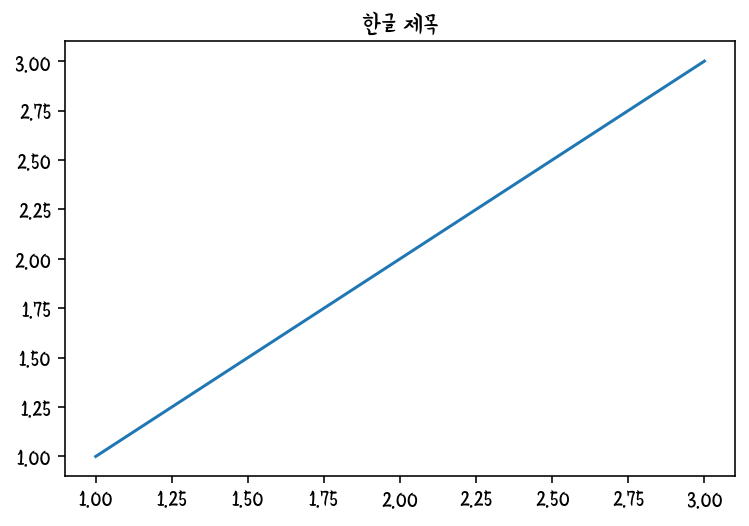
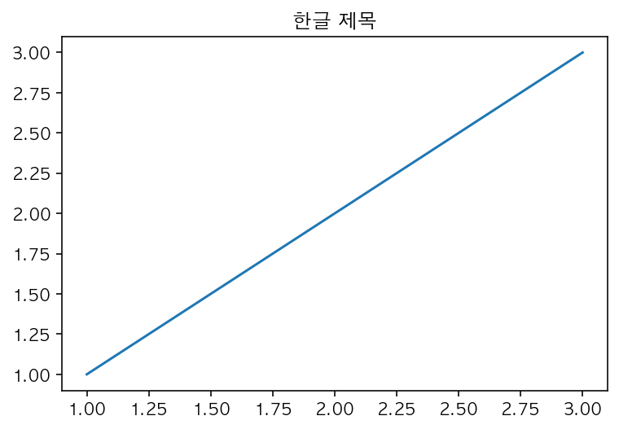
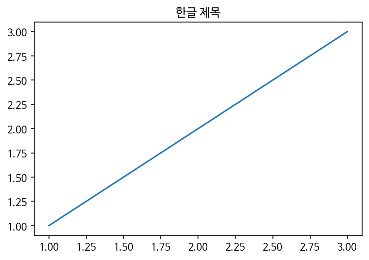

- - -

# 시각화 : 한글 폰트 설치 및 사용

### Visualization : Korean Fonts

* * *

**박 진 수** 교수  
Intelligent Data Semantics Lab  
Seoul National University

- - -

<div align='right'><font size='-1'>[credit: 김도훈(2019학번)]</font></div>

<h3>Table of Contents<span class="tocSkip"></span></h3>
<div class="toc"><ul class="toc-item"><li><span><a href="#윈도우-환경" data-toc-modified-id="윈도우-환경-1">윈도우 환경</a></span><ul class="toc-item"><li><span><a href="#시스템에-설치되어-있는-폰트-확인하기" data-toc-modified-id="시스템에-설치되어-있는-폰트-확인하기-1.1">시스템에 설치되어 있는 폰트 확인하기</a></span></li><li><span><a href="#한글-폰트-설치하기" data-toc-modified-id="한글-폰트-설치하기-1.2">한글 폰트 설치하기</a></span></li></ul></li><li><span><a href="#맥(masOS)-환경" data-toc-modified-id="맥(masOS)-환경-2">맥(masOS) 환경</a></span><ul class="toc-item"><li><span><a href="#시스템에-설치되어-있는-폰트-확인하기" data-toc-modified-id="시스템에-설치되어-있는-폰트-확인하기-2.1">시스템에 설치되어 있는 폰트 확인하기</a></span></li><li><span><a href="#한글-폰트-설치하기" data-toc-modified-id="한글-폰트-설치하기-2.2">한글 폰트 설치하기</a></span></li></ul></li><li><span><a href="#Google-Colaboratory-환경" data-toc-modified-id="Google-Colaboratory-환경-3">Google Colaboratory 환경</a></span><ul class="toc-item"><li><span><a href="#한글-폰트-설치하기" data-toc-modified-id="한글-폰트-설치하기-3.1">한글 폰트 설치하기</a></span></li></ul></li><li><span><a href="#참고" data-toc-modified-id="참고-4">참고</a></span></li></ul></div>


```python
# 버전 확인하기
import matplotlib
print('matplotlib 버전:', matplotlib.__version__)
print('캐시 경로:', matplotlib.get_cachedir())
print('설정 경로:', matplotlib.get_configdir())
```
    matplotlib 버전: 3.1.2
    캐시 경로: /Users/jinsoopark/.matplotlib
    설정 경로: /Users/jinsoopark/.matplotlib

```python
from matplotlib import font_manager, rc
from matplotlib import pyplot 
import platform
```

```python
# matplotlib 도표를 출력 영역에 표시할 것을 지시하는 매직 명령어다.
%matplotlib inline
```

# 윈도우 환경

## 시스템에 설치되어 있는 폰트 확인하기

다음 코드는 내 컴퓨터에 등록된 폰트들을 출력한다. 이 중 한글을 지원하는 폰트를 선택하면 된다.

```python
# 설치된 폰트를 출력한다.
fonts = [font.name for font in font_manager.fontManager.ttflist]
fonts
```

윈도우 환경에서 대표적인 한글 폰트로는 맑은고딕과 나눔고딕이 있다.

```python
# 맑은고딕 폰트가 설치되어 있다면
pyplot.rcParams['font.family'] = 'Malgun Gothic'
```

```python
# 맑은고딕(Malgun Gothic) 폰트로 출력한다.
pyplot.title('한글 제목')

x = 1, 2, 3
pyplot.plot(x, x)
pyplot.show()
```


## 한글 폰트 설치하기

한글 폰트가 설치되어 있지 않으면 아래의 링크에 접속하여 한글 폰트를 내려 받을 수 있다.
- https://brunch.co.kr/@jade/203
- https://hangeul.naver.com/font

링크에 접속한 후 원하는 폰트를 선택하여 설치하면 된다. 이외의 다른 폰트들도 구글링을 통하여 찾을 수 있다.

첫 번째 링크에서 '한나는 11살체'를 다운받고, 두 번째 링크에서 'TTF 나눔고딕 일반용'을 윈도우 용으로 내려받아 저장한다. 

- 첫 번째 링크에서 다운받은 '한나는 11살체' 파일은 확장자가 **.ttf**로 더블클릭 하여 나오는 창에서 설치 버튼을 눌러 설치하거나 윈도우 파일 탐색기에서 **C:\Windows\Fonts**로 이동하여 설치할 수 있다. 

- 두 번째 링크(네이버)에서 다운받은 'TTF 나눔고딕 일반용' 파일은 확장자가 **.exe**로 직접 실행하면 안내에 따라 자동으로 폰트가 설치된다.

폰트 인식을 위해 matplotlib 캐시 파일을 업데이트 해야하므로 앞에서 확인한 캐시 경로로 이동한다. **C:₩Users₩사용자 이름₩.matplotlib** 폴더 안의 **fontlist.json** 파일을 삭제하고 노트북의 커널을 재시작한다. 

**matplotlib.font_manager._rebuild()** 를 실행하여 폰트 캐시를 업데이트 하면 **fontlist.json** 파일이 다시 생성이 되면서 설치한 폰트를 인식하게 된다.


```python
# 폰트를 설치하고 폰트 캐시 업데이트를 위해 실행한다.
font_manager._rebuild()
```

폰트를 설치했으면 폰트 리스트를 출력했을때 설치된 폰트가 나온다. 설치된 폰트명을 입력하여 폰트를 사용한다.

```python
# 폰트를 설치하고 나서 내 컴퓨터에 설치 된 폰트들을 출력한다.
# 한나는 11살체(BM HANNA 11yrs old)와 나눔고딕(NanumGothic)이 설치 된것을 확인할 수 있다.
fonts = [font.name for font in font_manager.fontManager.ttflist]
fonts
```

```python
# 전체 폰트 리스트에서 특정 이름을 가진 폰트를 찾고 싶을 때 아래와 같이 실행할 수 있다. 
# 여기서는 폰트명에 'BM'이 들어간 폰트를 찾는다.
[font.name for font in font_manager.fontManager.ttflist if 'BM' in font.name]
```
    ['BM EULJIRO TTF', 'BM DoHyeon', 'BM JUA_TTF', 'BM HANNA 11yrs old']

```python
# '한나는 11살체' 폰트가 설치되어 있으므로, 폰트명을 입력하여 설정한다.
pyplot.rcParams['font.family'] = 'BM HANNA 11yrs old'

# 설정한 폰트의 이름을 출력하여 확인한다.
print(pyplot.rcParams['font.family']) 
```
    ['BM HANNA 11yrs old']

```python
# 한나는 11살체(BM HANNA 11yrs old) 폰트로 출력한다.
pyplot.title('한글 제목')

x = 1, 2, 3
pyplot.plot(x,x)
pyplot.show()
```





만약 폰트가 정상적으로 설치되었음에도 한글이 출력되지 않고 ㅁㅁ로 나오면 커널을 재시작하고 코드를 실행하면 해결이 된다.

# 맥(masOS) 환경

## 시스템에 설치되어 있는 폰트 확인하기

다음 코드는 내 컴퓨터에 등록된 폰트들을 출력한다. 이 중 한글을 지원하는 폰트를 선택하면 된다.

```python
# 설치된 폰트를 출력한다.
fonts = [font.name for font in font_manager.fontManager.ttflist]
fonts
```

맥에서는 '서체 관리자'를 실행해도 설치된 폰트들을 확인할 수 있다. '서체 관리자'의 좌측 메뉴에서 스마트 모음을 한국어로 설정하면 나오는 폰트들을 확인하고 하나씩 눌러보며 한글이 출력되는 폰트를 선택하면 된다.

**[참고]** '서체 관리자'는 **command + space** 키로 spotlight 검색을 열고 여기서 '서체 관리자'를 입력해서 검색하면 된다.

맥 환경에서 대표적인 한글 폰트로는 AppleGothic이 있다.

```python
# AppleGothic 폰트가 설치되어 있다면,
pyplot.rcParams['font.family'] = 'AppleGothic'
```


```python
# AppleGothic 폰트로 출력한다.
pyplot.title('한글 제목')

x = 1, 2, 3
pyplot.plot(x, x)
pyplot.show()
```





## 한글 폰트 설치하기

한글 폰트가 설치되어 있지 않으면 아래의 링크에 접속하여 한글 폰트를 내려 받을 수 있다.

- https://brunch.co.kr/@jade/203
- https://hangeul.naver.com/font

링크에 접속한 후 원하는 폰트를 선택하여 설치하면 된다. 이외의 다른 폰트들도 구글링을 통하여 찾을 수 있다.

첫번째 링크에서 '연성체'를 다운받고, 두번째 링크에서 'OTF 나눔바른고딕 그래픽용'을 맥용으로 내려받아 저장한다. 

- 첫 번째 링크에서 다운받은 '연성체' 파일은 확장자가 **.otf**로 더블클릭을 하면 나오는 창에서 [Install Font] 버튼을 눌러 설치하거나 [Finder]에서 **/Library/Fonts** 경로로 이동하여 설치할 수 있다. 

- 두 번째 링크(네이버)에서 다운받은 'OTF 나눔바른고딕 그래픽용' 파일은 확장자가 **.dmg**로 직접 실행하면 안내에 따라 폰트가 설치된다.


폰트 인식을 위해 matplotlib 캐시 파일을 업데이트 해야하므로 앞에서 확인한 캐시 경로로 이동한다. **/Users/사용자ID/.matplotlib** 폴더 안의 **fontlist.json**파일을 삭제하고 노트북의 커널을 재시작한다. 

**matplotlib.font_manager._rebuild()**를 실행하여 폰트 캐시를 업데이트 하면 **fontlist.json** 파일이 다시 생성이 되면서 설치한 폰트를 인식하게 된다. 


```python
# 폰트를 설치하고 폰트 캐시 업데이트를 위해 실행한다.
font_manager._rebuild()
```

맥에서는 이 **.matplotlib** 폴더가 안 보일수 있는데 이 경우 [Finder]에서 **shift + command + .** 를 누르면 숨겨진 폴더와 파일들을 볼 수 있다.

폰트를 설치했으면 폰트 리스트를 출력했을때 설치된 폰트가 나온다. 설치된 폰트명을 입력하여 폰트를 사용한다.


```python
# 폰트를 설치하고 나서 내 컴퓨터에 설치된 폰트들을 출력한다.
# 연성체(BM YEONSUNG)와 나눔바른 고딕(NanumBarunGothicOTF)이 설치된 것을 확인할 수 있다.
fonts = [font.name for font in font_manager.fontManager.ttflist]
fonts
```


```python
# 전체 폰트 리스트에서 특정 이름을 가진 폰트를 찾고 싶을 때 아래와 같이 실행할 수 있다. 
# 여기서는 폰트명에 'Barun'이 들어간 폰트를 찾는다.
[font.name for font in font_manager.fontManager.ttflist if 'Barun' in font.name]
```

    ['NanumBarunGothic',
     'NanumBarunGothicOTF',
     'NanumBarunGothicOTF',
     'NanumBarunGothic',
     'NanumBarunGothic',
     'NanumBarunGothic',
     'NanumBarunGothicOTF',
     'NanumBarunGothicOTF']

```python
# 'OTF 나눔바른 고딕' 폰트가 설치되어 있으므로, 폰트명을 입력하여 설정한다.
pyplot.rcParams['font.family'] = 'NanumBarunGothicOTF'

# 설정한 폰트의 이름을 출력하여 확인한다.
print(pyplot.rcParams['font.family']) 
```
    ['NanumBarunGothicOTF']


```python
# OTF 나눔바른고딕(NanumBarunGothicOTF) 폰트로 출력한다.
pyplot.title('한글 제목')

x = 1, 2, 3
pyplot.plot(x, x)
pyplot.show()
```


만약 폰트가 정상적으로 설치되었음에도 한글이 출력되지 않고 ㅁㅁ로 나오면 커널을 재시작하고 코드를 실행하면 해결이 된다.

# Google Colaboratory 환경

## 한글 폰트 설치하기

구글 콜랩에서는 기본적으로 한글 폰트가 설치되어 있지 않기 때문에 사용자가 폰트를 설치해서 사용해아 한다. 

```python
import matplotlib 
from matplotlib import font_manager, pyplot
 
 # 폰트를 설치하기 위해 구글 콜랩에서 설치할 수 있는 폰트의 리스트를 출력한다.
!apt -qq -y install fonts-nanum
 
# 나눔바른고딕(NanumBarunGothic)을 사용하기 위해 경로를 포함시킨다.
fontpath = '/usr/share/fonts/truetype/nanum/NanumBarunGothic.ttf' 

# font_manager.FontProperties를 이용하여 등록한다.
font = font_manager.FontProperties(fname=fontpath, size=9)

# 나눔바른고딕으로 폰트를 설정한다.
pyplot.rc('font', family='NanumBarunGothic') 

# matplotlib의 폰트 캐시 파일을 업데이트 한다.
font_manager._rebuild() 
```

이제 폰트를 변경하기에 앞서 **런타임 다시 시작**을 하고 아래 셀을 실행한다.

- **런타임** -> **런타임 다시 시작**

```python
import matplotlib 
from matplotlib import font_manager, pyplot

# 나눔바른고딕으로 폰트를 설정한다.
pyplot.rc('font', family='NanumBarunGothic') 

# matplotlib의 폰트 캐시 파일을 업데이트 한다.
font_manager._rebuild() 
```

```python
# Retina 스크린을 장착한 컴퓨터인 경우 아래 매직 명령어를 사용해 고화질 도표를 생성할 수 있다.
%config InlineBackend.figure_format = 'retina'
```

```python
# 나눔바른고딕(Nanum Barun Gothic) 폰트로 출력한다.
pyplot.title('한글 제목')

x = 1, 2, 3
pyplot.plot(x, x)
pyplot.show()
```





# 참고

matplotlib/seaborn으로 시각화할 때 한글 폰트 깨짐 현상 해결 방법
- https://teddylee777.github.io/data_science/matplotlib-시각화-한글폰트적용

- - -
# THE END