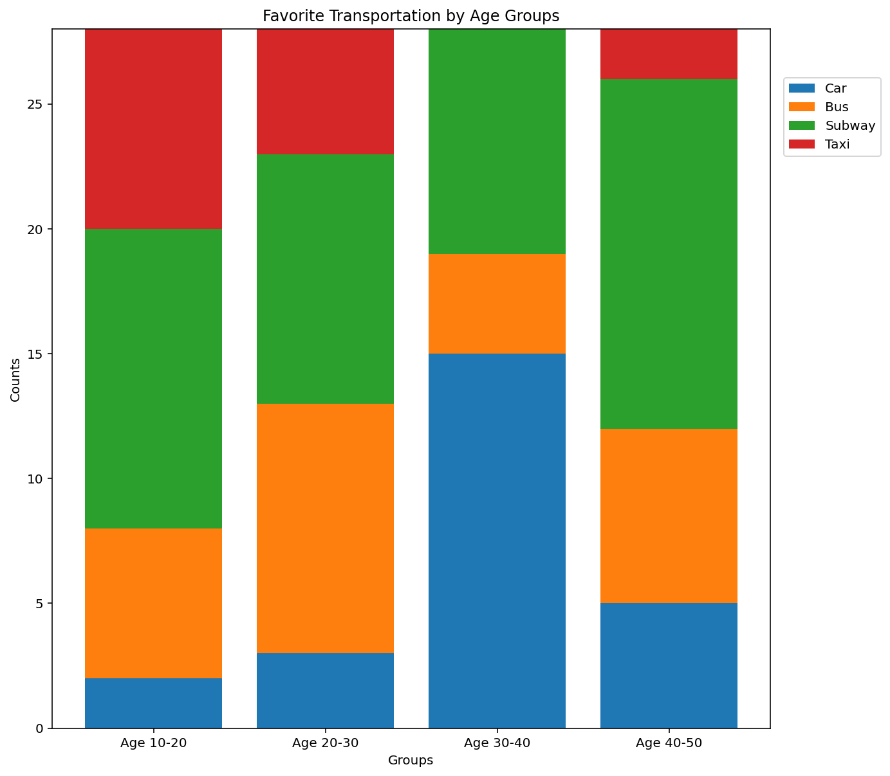
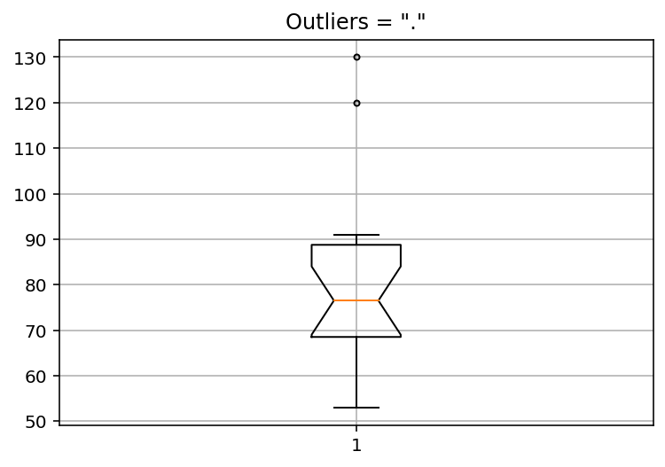

- - -

# 시각화 : matplotlib

### Visualization : matplotlib

* * *

**박 진 수** 교수  
Intelligent Data Semantics Lab  
Seoul National University

- - -

<div align='right'><font size='-1'>[credit: 김도훈(2019학번)]</font></div>

<h3>Table of Contents<span class="tocSkip"></span></h3>
<div class="toc"><ul class="toc-item"><li><span><a href="#matplotlib" data-toc-modified-id="matplotlib-1">matplotlib</a></span></li><li><span><a href="#matplotlib-설치-및-불러오기" data-toc-modified-id="matplotlib-설치-및-불러오기-2">matplotlib 설치 및 불러오기</a></span></li><li><span><a href="#기본-도표-작성하기" data-toc-modified-id="기본-도표-작성하기-3">기본 도표 작성하기</a></span><ul class="toc-item"><li><span><a href="#선-색상-변경" data-toc-modified-id="선-색상-변경-3.1">선 색상 변경</a></span></li><li><span><a href="#선-모양-변경" data-toc-modified-id="선-모양-변경-3.2">선 모양 변경</a></span></li><li><span><a href="#제목과-라벨" data-toc-modified-id="제목과-라벨-3.3">제목과 라벨</a></span></li><li><span><a href="#도표-구간의-확대-및-축소" data-toc-modified-id="도표-구간의-확대-및-축소-3.4">도표 구간의 확대 및 축소</a></span></li><li><span><a href="#범례(legend)" data-toc-modified-id="범례(legend)-3.5">범례(legend)</a></span></li><li><span><a href="#주석(annotation)" data-toc-modified-id="주석(annotation)-3.6">주석(annotation)</a></span></li><li><span><a href="#Lab:-상점-고객수-데이터로-선-그래프-그리기" data-toc-modified-id="Lab:-상점-고객수-데이터로-선-그래프-그리기-3.7">Lab: 상점 고객수 데이터로 선 그래프 그리기</a></span></li></ul></li><li><span><a href="#서브플롯" data-toc-modified-id="서브플롯-4">서브플롯</a></span><ul class="toc-item"><li><span><a href="#도표-크기-조정" data-toc-modified-id="도표-크기-조정-4.1">도표 크기 조정</a></span></li><li><span><a href="#서브플롯과-전체-도표의-제목-설정" data-toc-modified-id="서브플롯과-전체-도표의-제목-설정-4.2">서브플롯과 전체 도표의 제목 설정</a></span></li></ul></li><li><span><a href="#다양한-도표-그리기" data-toc-modified-id="다양한-도표-그리기-5">다양한 도표 그리기</a></span><ul class="toc-item"><li><span><a href="#막대-그래프" data-toc-modified-id="막대-그래프-5.1">막대 그래프</a></span><ul class="toc-item"><li><span><a href="#Lab:-상점-고객수-데이터로-막대-그래프-그리기" data-toc-modified-id="Lab:-상점-고객수-데이터로-막대-그래프-그리기-5.1.1">Lab: 상점 고객수 데이터로 막대 그래프 그리기</a></span></li></ul></li><li><span><a href="#막대-그래프-나란히-그리기" data-toc-modified-id="막대-그래프-나란히-그리기-5.2">막대 그래프 나란히 그리기</a></span></li><li><span><a href="#누적-막대-그래프" data-toc-modified-id="누적-막대-그래프-5.3">누적 막대 그래프</a></span><ul class="toc-item"><li><span><a href="#100%-누적-막대-그래프-그리기" data-toc-modified-id="100%-누적-막대-그래프-그리기-5.3.1">100% 누적 막대 그래프 그리기</a></span></li></ul></li><li><span><a href="#원-그래프" data-toc-modified-id="원-그래프-5.4">원 그래프</a></span></li><li><span><a href="#히스토그램" data-toc-modified-id="히스토그램-5.5">히스토그램</a></span></li><li><span><a href="#박스-그래프" data-toc-modified-id="박스-그래프-5.6">박스 그래프</a></span></li><li><span><a href="#산점도" data-toc-modified-id="산점도-5.7">산점도</a></span></li></ul></li><li><span><a href="#Lab:-아파트-내-외국인-국적-및-연령-데이터-시각화" data-toc-modified-id="Lab:-아파트-내-외국인-국적-및-연령-데이터-시각화-6">Lab: 아파트 내 외국인 국적 및 연령 데이터 시각화</a></span><ul class="toc-item"><li><span><a href="#문제-1-:-막대-그래프를-나란히-그리시오." data-toc-modified-id="문제-1-:-막대-그래프를-나란히-그리시오.-6.1">문제 1 : 막대 그래프를 나란히 그리시오.</a></span></li><li><span><a href="#문제-2-:-누적-막대-그래프를-그리시오" data-toc-modified-id="문제-2-:-누적-막대-그래프를-그리시오-6.2">문제 2 : 누적 막대 그래프를 그리시오</a></span></li><li><span><a href="#문제-3-:-원-그래프를-그리시오." data-toc-modified-id="문제-3-:-원-그래프를-그리시오.-6.3">문제 3 : 원 그래프를 그리시오.</a></span></li></ul></li><li><span><a href="#Lab:-학급의-영어와-수학-점수-데이터-시각화" data-toc-modified-id="Lab:-학급의-영어와-수학-점수-데이터-시각화-7">Lab: 학급의 영어와 수학 점수 데이터 시각화</a></span><ul class="toc-item"><li><span><a href="#문제-1-:-히스토그램을-그리시오." data-toc-modified-id="문제-1-:-히스토그램을-그리시오.-7.1">문제 1 : 히스토그램을 그리시오.</a></span></li><li><span><a href="#문제-2-:-박스-그래프를-그리시오." data-toc-modified-id="문제-2-:-박스-그래프를-그리시오.-7.2">문제 2 : 박스 그래프를 그리시오.</a></span></li><li><span><a href="#문제-3-:-산점도를-그리시오." data-toc-modified-id="문제-3-:-산점도를-그리시오.-7.3">문제 3 : 산점도를 그리시오.</a></span></li></ul></li></ul></div>

# matplotlib

**matplotlib**란?
- 파이썬에서 데이터를 2-D 차트(chart)나 플롯(plot)으로 그려주는 파이썬 라이브러리로 가장 많이 사용하는 데이타 시각화(Data Visualization) 툴이다.
- 선 그래프, 막대 그래프, 원 그래프, 히스토그램, 박스 그래프, 산점도 등을 포함한 다양한 차트와 플롯 스타일을 지원한다. 
- [matplotlib.org](https://matplotlib.org)의 [갤러리 웹페이지](https://matplotlib.org/gallery/index.html)에서 다양한 샘플 도표를 볼 수 있다.

# matplotlib 설치 및 불러오기


```python
!python -m pip install matplotlib
# 또는 
# !pip install matplotlib  
```


```python
# 버전 확인하기
import matplotlib
matplotlib.__version__
```


```python
# 주로 아래 방식으로 matplot.pyplot을 plt이란 별칭으로 불러온다.
# from matplotlib import pyplot as plt 

from matplotlib import pyplot # as plt
import numpy # as np
```


```python
# matplotlib 도표를 출력 영역에 표시할 것을 지시하는 매직 명령어다.
%matplotlib inline
```

# 기본 도표 작성하기

선 그래프는 연속적인 직선이나 곡선으로 데이터 사이의 관계를 나타내는 도표다.

선 그래프를 그리기 위해서는 matplotlib.pyplot의 **plot(*x, y*)**를 사용한다. 
- ***x***, ***y*** 는 각각 **x**축과 **y**축이 된다.

[matplotlib.pyplot.plot](https://matplotlib.org/api/_as_gen/matplotlib.pyplot.plot.html#matplotlib.pyplot.plot)
- Plot ***y*** versus ***x*** as lines and/or markers.
- matplotlib.pyplot.**plot**(\**args, scalex=True, scaley=True, data=None, **kwargs*)
    - By default, each line is assigned a different style specified by a 'style cycle'. The ***fmt*** and line property parameters are only necessary if you want explicit deviations from these defaults. Alternatively, you can also change the style cycle using the 'axes.prop_cycle' rcParam.
    - ***fmt*** = '[marker][line][color]'


```python
# --- x 축은 1, 2, 3 # y 축은 110, 130, 120인 선 그래프를 그린다.
pyplot.plot(__TODO__)
pyplot.show()
```

**실행 결과**  


```python
# --- x 축은 1, 2, ... 9이고 y 축은 x * 3인 선 그래프를 작성한다.
x = __TODO__
y = __TODO__

pyplot.plot(x, y)
pyplot.show()
```

**실행 결과**  


## 선 색상 변경

기본 색상은 파란색이지만 다른 색상으로 변경할 수 있다.
- matplotlib.pyplot의 **plot()**의 세 번째 전달인자로 컬러 색상을 지정할 수 있다.
- 예) plot(x, y, **'r'**)은 색상을 빨강색으로 변경한다. **'b'** 는 blue, **'g'** 는 green, **'c'** 는 cyan이다.
- 이외 다른 색상은 아래 링크에서 확인할 수 있다.
    + https://matplotlib.org/3.1.0/gallery/color/named_colors.html


```python
# --- 선 색깔이 빨간색(red)인 선 그래프를 작성한다.
x = numpy.arange(1, 10)
y = x * 3

pyplot.plot(__TODO__)
pyplot.show()
```

**실행 결과**  


## 선 모양 변경

기본 선은 직선이지만 마커를 변경해서 선 모양을 바꿀 수 있다. 이때 색상도 함께 바꿀 수 있다.
- 앞서 색상을 변경한 것과 같이 **plot()**의 세 번째 전달인자로 선의 종류를 지정해주면 된다.
- 색상과 선의 종류를 같이 지정하기 위해서는 세 번째 전달인자로 선의 종류 다음에 색상을 지정해주면 된다.
- 예) plot(x, y, **'og'**)는 선 모양을 원으로 색깔을 초록색으로 변경한다.
- 이외 다른 선 모양의 마커는 아래 링크에서 확인할 수 있다.
    + https://matplotlib.org/3.1.1/api/markers_api.html


```python
# --- 마커가 원형(circle)이고 색깔이 초록색(red)인 선 그래프를 작성한다.
x = numpy.arange(1, 10)
y = x * 3

# 'o': circle marker, 'g': green color
pyplot.plot(__TODO__)
pyplot.show()
```

**실행 결과**  


```python
# --- 마커가 더하기(plus filled)인 선 그래프를 작성한다.
x = numpy.arange(1, 10)
y = x * 3

# 'P': plus (filled) marker
pyplot.plot(__TODO__)
pyplot.show()
```

**실행 결과**  


```python
# --- 마커는 원형(circle), 선 모양은 점선(dotted line)이고 색깔이 빨간색(red)인 선 그래프를 작성한다.
x = numpy.arange(1, 10)
y = x * 3

# 'o': circle marker, ':': dotted line style, 'r': red color
pyplot.plot(__TODO__)
pyplot.show()
```

**실행 결과**  


## 제목과 라벨

도표의 제목이나 X, Y 축 라벨을 붙이려면 **title**('제목'), **xlabel**('x축이름'), **ylabel**('y축이름')을 사용한다.


```python
# 제목과 x축 y축 라벨을 설정한다. (실행 결과 참조)
x = ['Week 1', 'Week 2', 'Week 3', 'Week 4']  # x축 라벨
y = [70, 77, 83, 81]                          # y축 라벨

__TODO__
__TODO__
__TODO__

pyplot.plot(__TODO__)
pyplot.show()
```

**실행 결과**  


## 도표 구간의 확대 및 축소

도표는 입력한 *x*, *y* 값의 최소부터 최대의 구간으로 지정된다. 이 구간을 키우거나 줄이려면 *x*, *y*의 구간을 따로 지정하면 된다.
- *x* 축은 **xlim**(최소, 최대), *y* 축은 **ylim**(최소, 최대)을 사용한다.


```python
# 기본 구간을 보여준다.
x = numpy.arange(1, 10)
y = x * 3

pyplot.plot(x, y)
pyplot.show();
```

**실행 결과**  


*x* 축을 1\~5, *y* 축을 3\~10으로 확대한 도표를 작성한다.


```python
x = numpy.arange(1, 10)
y = x * 3

pyplot.title('Zoomed In')
pyplot.ylabel('y axis')
pyplot.xlabel('x axis')

# x 축을 1~5, y 축을 3~10으로 확대한 간으로 다시 정의하여 보여준다.
pyplot.xlim(__TODO__)
pyplot.ylim(__TODO__)

pyplot.plot(x, y)
pyplot.show()
```

**실행 결과**  


*x* 축을 1\~20, *y* 축을 3\~50으로 축소한 도표를 작성한다.


```python
x = numpy.arange(1, 10)
y = x * 3

pyplot.title('Zoomed Out')
pyplot.ylabel('y axis')
pyplot.xlabel('x axis')

# x 축을 1~20, y 축을 3~50으로 축소한 구간으로 다시 정의하여 보여준다.
pyplot.xlim(__TODO__)
pyplot.ylim(__TODO__)

pyplot.plot(x, y)
pyplot.show()
```

**실행 결과**  


## 범례(legend)

도표에서 여러 개의 선을 동시에 그릴 때, 각 선을 구분하기 위해 선마다 라벨을 달고 각 라벨의 이름을 보여줄 수 있는데 이를 범례(legend)라고 한다.
- 범례를 사용하려면 **plot**()의 매개변수 ***label*** 에 선 이름을 지정하고 **legend**(*loc*='위치') 메소드를 호출하면 범례를 도표 상에 그려준다.
- 범례의 위치는 아래 링크를 참고하면 된다.
    + https://matplotlib.org/3.1.1/api/_as_gen/matplotlib.pyplot.legend.html

[matplotlib.pyplot.legend](https://matplotlib.org/3.1.1/api/_as_gen/matplotlib.pyplot.legend.html)
- Place a legend on the axes.
- matplotlib.pyplot.**legend**(_\*args, \**kwargs_)

도표에 여러 개의 선을 추가하려면 **plot**() 메소드를 **show()** 메소드 전에 여러 번 호출한다.

다음 예는 두 개의 선을 그린 후, 좌측 상단에 범례를 표현한 것이다.


```python
# 두 개의 선을 그린 후, 좌측 상단에 범례를 표현한다.
x = numpy.arange(1, 10, 0.1)
y1 = x * 0.3
y2 = numpy.sin(x)

pyplot.title('Legend Sample')
pyplot.ylabel('y axis')
pyplot.xlabel('x axis')

# 범례(legend)에 사용할 선 이름을 설정한다.
pyplot.plot(x, y1, 'g', label='linear')
pyplot.plot(x, y2, 'r', label='non-linear')

# 범례(legend)를 설정한다. plot() 다음에 실행해야 한다.
pyplot.legend(__TODO__)
pyplot.show()
```

**실행 결과**  


앞의 예에서는 **plot**() 메소드의 매개변수 ***label*** 에 선의 이름을 지정했는데, **legend**() 메소드에서도 선의 이름을 지정할 수 있다.

각 선에 대한 범례를 추가하려면 각 선에 대한 범례를 순서대로 지정하여 **legend**(*['선1범례', 선2범례', ...], ...*) 메소드를 호출하면 된다.


```python
# 두 개의 선을 그린 후, 좌측 상단에 범례를 표현한다.
x = numpy.arange(1, 10, 0.1)
y1 = x * 0.3
y2 = numpy.sin(x)

pyplot.title('Legend Sample')
pyplot.ylabel('y axis')
pyplot.xlabel('x axis')

pyplot.plot(x, y1, 'g')
pyplot.plot(x, y2, 'r')

# legend() 메소드에서도 범례(legend)에 사용할 선의 이름을 설정할 수 있다.
pyplot.legend(__TODO__)
pyplot.show()
```

**실행 결과**  


## 주석(annotation)

도표의 특정 좌표를 가리키는 화살표를 그린 후, 그 화살표에 문자열을 출력하는 기능이다. 
- **annotate**() 메소드를 **annotate(*'text', xy, xytext, arrowprops*)** 형식으로 사용하면 된다.
    + ***'text'*** 는 주석에 표시하는 문자열이고,   
    + ***xy*** 는 화살표가 가리키는 점의 위치,  
    + ***xytext*** 는 문자열을 출력할 위치,  
    + ***arrowprops*** 는 화살표의 속성으로 스타일, 색상 등을 정의한다.
- 주석과 화살표에 대해 더 자세한 정보는 아래의 링크를 참고하면 된다.
    + https://matplotlib.org/3.1.1/api/_as_gen/matplotlib.pyplot.annotate.html

    
[matplotlib.pyplot.annotate](https://matplotlib.org/3.1.1/api/_as_gen/matplotlib.pyplot.annotate.html)
- Annotate the point xy with text text.
- matplotlib.pyplot.**annotate**(_s, xy, \*args, \**kwargs_)
    - In the simplest form, the text is placed at ***xy***.
    - Optionally, the text can be displayed in another position ***xytext***. 
        - An arrow pointing from the text to the annotated point ***xy*** can then be added by defining ***arrowprops***.

초록색 화살표와 문자열로 주석을 표현한 도표를 작성한다.


```python
# 주석이 있는 도표를 작성한다.
x = numpy.arange(1, 10)
y = x * 3

pyplot.title('Annotation Sample')
pyplot.ylabel('y axis')
pyplot.xlabel('x axis')

# 초록색 화살표와 주석을 설정한다.
pyplot.annotate(__TODO__)

pyplot.plot(x, y, 'r')
pyplot.show()
```

**실행 결과**  


## Lab: 상점 고객수 데이터로 선 그래프 그리기

다음 데이터는 2010년부터 2020년까지의 상점 고객수 데이터다. 이 데이터를 이용하여 선 그래프를 그리시오.


```python
year = 2010, 2011, 2012, 2013, 2014, 2015, 2016, 2017, 2018, 2019, 2020
no_customers = 2031, 2623, 2750, 2908, 3103, 3288, 3453, 3667, 4021, 4300, 4732
```

**문제**

---

- 년도를 x축으로, 고객수를 y축으로 한다. 
- 도표의 제목은 'Store Data'로, x축의 라벨은 'Year', y축의 라벨은 'Number of Customers'로 설정한다. 
- 초록색 선을 가지는 선 그래프를 작성한다.

---

**답**


```python
# Your answer here
```

# 서브플롯

한 번에 여러 개의 도표를 그릴 경우 서브플롯을 사용한다. 
- 서브플롯은 도표가 그려질 위치를 격자형으로 지정하는데, **subplot(*nrow, ncol, pos*)** 형식으로 호출하여 사용한다.
    + ***nrow***, ***ncol*** 은 도표를 그릴 평면의 크기를 지정한다.
        - 예) ***1, 2***는 1줄(세로)과 2칸(가로)으로 이루어진 도표 평면을 설정한다.
    + ***pos*** 는 어느 평면에 도표를 그릴지 지정하는데, 위에서부터 시작해서 좌측에서 우측으로, 그리고 아래 방향으로 1, 2, 3, 4, 5, ... 번호 순으로 그린다.

[matplotlib.pyplot.subplot](https://matplotlib.org/3.1.1/api/_as_gen/matplotlib.pyplot.subplot.html#matplotlib.pyplot.subplot)   
- Add a subplot to the current figure.
- matplotlib.pyplot.**subplot**(_\*args, \**kwargs_)

**1, 2** 즉, 1줄 2칸의 평면에 좌우에 두 개의 서브플롯을 그리는 도표를 작성한다.


```python
# 1줄 2칸의 평면에 좌우에 두 개의 서브플롯을 그리는 도표를 작성한다.
x = numpy.arange(1, 10)   # 두 서브플롯의 x축
y1 = x * 3                # 좌측 서브플롯의 y축
y2 = x * 4                # 우측 서브플롯의 y축

# 1줄 2칸의 서브플롯을 설정한다.
pyplot.subplot(__TODO__)  # 좌측 서브플롯
pyplot.plot(x, y1, 'or')

pyplot.subplot(__TODO__)  # 우측 서브플롯
pyplot.plot(x, y2, 'g')
pyplot.show()
```

**실행 결과**  


**subplot**() 안의 숫자를 변경하여 평면의 줄과 칸을 변경할 수 있다.

**2, 1** 즉, 2줄 1칸의 평면을 만들어 위와 아래에 두 개의 서브플롯을 그리는 도표를 작성한다.


```python
# 2줄 1칸의 평면을 만들어 위와 아래에 두 개의 서브플롯을 그리는 도표를 작성한다.
x = numpy.arange(1, 10)  # 두 서브플롯의 x축
y1 = x * 3               # 좌측 서브플롯의 y축
y2 = x * 4               # 우측 서브플롯의 y축

# 2줄 1칸의 서브플롯을 설정한다.
pyplot.subplot(__TODO__)  # 위쪽 서브플롯
pyplot.plot(x, y1, 'or')

pyplot.subplot(__TODO__)  # 아래쪽 서브플롯
pyplot.plot(x, y2, 'g')
pyplot.show()
```

**실행 결과**  


그런데 2줄 1칸의 평면에서 도표를 그릴 때 첫 번째 도표의 x축과 두 번째 도표의 제목이 앞서 예처럼 겹칠 수가 있다. 

겹치기를 방지하려면 **subplots_adjust**() 메소드로 두 도표 사이의 간격을 설정하면 된다.

[matplotlib.pyplot.subplots_adjust](https://matplotlib.org/3.1.1/api/_as_gen/matplotlib.pyplot.subplots_adjust.html#matplotlib.pyplot.subplots_adjust)
- Tune the subplot layout.
- matplotlib.pyplot.**subplots_adjust**(*left=None, bottom=None, right=None, top=None, wspace=None, hspace=None*)

The parameter meanings (and suggested defaults) are:
<pre>left = 0.125  # the left side of the subplots of the figure
right = 0.9   # the right side of the subplots of the figure
bottom = 0.1  # the bottom of the subplots of the figure
top = 0.9     # the top of the subplots of the figure
wspace = 0.2  # the amount of width reserved for space between subplots,
              # expressed as a fraction of the average axis width
hspace = 0.2  # the amount of height reserved for space between subplots,
              # expressed as a fraction of the average axis height</pre>


```python
# 2줄 1칸의 서브플롯을 설정하면서 겹치기를 방지한다.
x = numpy.arange(1, 10)  # 두 서브플롯의 x축
y1 = x * 3               # 위쪽 서브플롯의 y축
y2 = x * 4               # 아래쪽 서브플롯의 y축

# 2줄 1칸의 서브플롯을 설정한다.
pyplot.subplot(__TODO__)  # 위쪽 서브플롯
pyplot.plot(x, y1, 'or')

pyplot.subplot(__TODO__)  # 아래쪽 서브플롯
pyplot.plot(x, y2, 'g')

# 서브플롯 사이의 높이 간격을 조정한다. 기본값는 0.2다.
pyplot.subplots_adjust(__TODO__)
pyplot.show()
```

**실행 결과**  


3줄 3칸의 평면을 만들어 9개의 서브플롯을 만드는 도표를 작성한다.


```python
# 3줄 3칸의 평면을 만들어 9개의 서브플롯을 만드는 도표를 설정한다.
x = numpy.arange(1, 10)
y1 = x * 3
y2 = x * 4
y3 = x * 5
y4 = x * 6
y5 = x * 7
y6 = x * 8
y7 = x * 9
y8 = x * 10
y9 = x * 11

# 9개의 서브플롯을 그린다.
__TODO__
...
__TODO__

pyplot.subplots_adjust(__TODO__)
pyplot.show()
```

**실행 결과**  


## 도표 크기 조정

도표의 크기를 변경할 수 있다.
- **figure**() 메소드의 매개변수 ***figsize*** 에 전달인자를 ***figsize=(가로, 세로)*** 형식으로 지정하면 도표가 그려질 전체 그림의 크기를 설정할 수 있다.

[matplotlib.pyplot.figure](https://matplotlib.org/3.1.1/api/_as_gen/matplotlib.pyplot.figure.html#matplotlib.pyplot.figure)
- Create a new figure.
- matplotlib.pyplot.**figure**(*num=None, figsize=None, dpi=None, facecolor=None, edgecolor=None, frameon=True, FigureClass=<class 'matplotlib.figure.Figure'>, clear=False, \**kwargs*)

[matplotlib.figure.Figure](https://matplotlib.org/3.1.1/api/_as_gen/matplotlib.figure.Figure.html#matplotlib.figure.Figure)
- The top level container for all the plot elements.
- *class* matplotlib.figure.**Figure**(*figsize=None, dpi=None, facecolor=None, edgecolor=None, linewidth=0.0, frameon=None, subplotpars=None, tight_layout=None, constrained_layout=None*)
    - ***figsize*** : 2-tuple of floats, default: **rcParams["figure.figsize"] = [6.4, 4.8]**
        - Figure dimension (*width, height*) in inches.

앞서 그려본 9개의 도표는 전체 도표의 평면 크기가 작기 때문에 x축의 값들이 모두 보이지 않는 문제가 있었다.이 문제를 해결하기 위해 $ 17 \times 20 $ 크기로 도표를 그리도록 크기를 설정해보자.

이렇게 하기 위해서는 **figure(*figsize=(17, 20)*)** 을 입력하면 된다.

[matplotlib.pyplot.subplots_adjust](https://matplotlib.org/3.1.1/api/_as_gen/matplotlib.pyplot.subplots_adjust.html?highlight=subplots_adjust#matplotlib.pyplot.subplots_adjust)
- Tune the subplot layout.
- matplotlib.pyplot.**subplots_adjust**(*left=None, bottom=None, right=None, top=None, wspace=None, hspace=None*)

The parameter meanings (and suggested defaults) are:
<pre>left = 0.125  # the left side of the subplots of the figure
right = 0.9   # the right side of the subplots of the figure
bottom = 0.1  # the bottom of the subplots of the figure
top = 0.9     # the top of the subplots of the figure
wspace = 0.2  # the amount of width reserved for space between subplots,
              # expressed as a fraction of the average axis width
hspace = 0.2  # the amount of height reserved for space between subplots,
              # expressed as a fraction of the average axis height</pre>


```python
# 3줄 3칸의 평면을 17 by 20 크기로 확대하여 9개의 서브플롯을 만드는 도표를 설정한다.
x = numpy.arange(1, 10)
y1 = x * 3
y2 = x * 4
y3 = x * 5
y4 = x * 6
y5 = x * 7
y6 = x * 8
y7 = x * 9
y8 = x * 10
y9 = x * 11

pyplot.figure(__TODO__)  # 여기에 먼저 크기를 지정해야 한다.

# 9개의 서브플롯을 그린다.
__TODO__
...
__TODO__

pyplot.subplots_adjust(__TODO__)
pyplot.show()
```

**실행 결과**  


## 서브플롯과 전체 도표의 제목 설정

pyplot.**suptitle()** 메소드를 사용하면 된다. 

pyplot.**title()**은 **axes**의 제목을 설정할 때 사용하는 메소드다. 즉, 전체 도표 안에 있는 **각각의 서브플롯에 제목을 설정**한다고 생각하면 된다. 따라서 하나의 도표만 그린다면 pyplot.**title()**을 사용하는게 일반적이다. 

하지만 여러 개의 도표를 그리고 이 전체 도표를 대표하는 제목을 작성할 필요가 있을 때 pyplot.**suptitle()** 메소드를 사용한다. 

**suptitle**을 작성하려면 **suptitle()** 메소드를  **suptitle*(t, **kwargs)*** 형식으로 사용하면 된다.
- ***t*** 는 도표의 제목 텍스트를 입력한다.
- ***x*** 는 제목 텍스트의 x좌표를 입력한다. 기본값은 **0.5**로 제목 텍스트는 도표의 x좌표상에서 중앙에 위치한다. 숫자가 작을수록 제목 텍스트는 왼쪽에 위치한다.
- ***y*** 는 제목 텍스트의 y좌표를 입력한다. 기본값은 **0.98**로 제목 텍스트는 도표의 y좌표상에서 가장 위에 위치한다. 숫자가 작을수록 제목 텍스트는 아래에 위치한다.
- 더 자세한 내용은 아래의 링크에서 확인할 수 있다.
    + https://matplotlib.org/3.1.3/api/_as_gen/matplotlib.pyplot.suptitle.html

[matplotlib.pyplot.suptitle](https://matplotlib.org/3.1.3/api/_as_gen/matplotlib.pyplot.suptitle.html)
- Add a centered title to the figure.
- matplotlib.pyplot.**suptitle**(*t, **kwargs*)


```python
x = numpy.arange(1, 10)  # 두 서브플롯의 x축
y1 = x * 3               # 좌측 서브플롯의 y축
y2 = x * 4               # 우측 서브플롯의 y축

# 1줄 2칸의 서브플롯을 설정한다.
pyplot.subplot(__TODO__)  # 좌측 서브플롯
pyplot.plot(x, y1, 'or')

pyplot.subplot(__TODO__)  # 우측 서브플롯
pyplot.plot(x, y2, 'g')

# 전체 도표에 대한 제목을 설정하고, 
# 각 서브플롯 제목과의 거리를 두기 위해 y=1.01로 설정한다.
pyplot.suptitle(__TODO__)
pyplot.show()
```

**실행 결과**  


# 다양한 도표 그리기

matplotlib는 앞서 그린 선 그래프 이외에 여러 다양한 도표를 그릴 수 있다. 

이를 위해 각 도표마다 다른 메소드를 호출한다. 

예를 들어, 막대 그래프를 그리기 위해서는 **bar()** 메소드를, 원 그래프를 그리기 위해서는 **pie()** 메소드를, 히스토그램을 그리기 위해선 **hist()** 메소드를 호출한다.

## 막대 그래프

막대 그래프 데이터 값에 비례하여 높이와 길이를 지닌 직사각형 막대로 범주형 데이터를 표현하는 도표다.

막대 그래프를 작성하려면 **bar()** 메소드를 주로 **bar(*x, height, width=0.8, bottom=None , align='center'*)** 형식으로 사용하면 된다.
- ***x*** 는 표현하고자 하는 막대들,  
- ***height*** 은 이 막대들의 높이,  
- ***width*** 는 막대의 너비,  
- ***bottom*** 은 막대 시작 점의 *y* 좌표,  
- ***align*** 은 막대가 *x* 축 값의 중앙에 오도록 하거나('center') 모서리로 가도록('edge') 설정한다.
- 이외에도 색상이나 레이블 등을 설정할 수 있는데 아래의 링크에서 더 자세한 명령어 들을 확인할 수 있다.
    + https://matplotlib.org/api/_as_gen/matplotlib.pyplot.bar.html#matplotlib.pyplot.bar

[matplotlib.pyplot.bar](https://matplotlib.org/api/_as_gen/matplotlib.pyplot.bar.html#matplotlib.pyplot.bar)    
- Make a bar plot.
- matplotlib.pyplot.**bar**(_x, height, width=0.8, bottom=None, \*, align='center', data=None, \**kwargs_)
    - The bars are positioned at ***x*** with the given alignment. Their dimensions are given by ***width*** and ***height***. The vertical baseline is ***bottom*** (default 0).
    - Each of ***x***, ***height***, ***width***, and ***bottom*** may either be a scalar applying to all bars, or it may be a sequence of length N providing a separate value for each bar.

너비 **0.5**의 청록색 막대로 이루어진 막대 그래프를 작성한다.


```python
y = [1, 4, 7, 10, 3, 4, 9, 4.5]
x = list('abcdefgh')

# 너비 0.5의 청록색('c') 막대로 이루어진 막대 그래프를 설정한다.
pyplot.bar(__TODO__)
pyplot.show()
```

**실행 결과**  


만약 x축의 눈금 라벨이 너무 긴 경우 **xticks()** 메소드의 매개변수 ***rotation*** 을 사용하여 글자를 회전시킬 수 있다.

[matplotlib.pyplot.xticks](https://matplotlib.org/api/_as_gen/matplotlib.pyplot.xticks.html#matplotlib.pyplot.xticks)
- Get or set the current tick locations and labels of the x-axis.
- matplotlib.pyplot.**xticks**(_ticks=None, labels=None, \**kwargs_)

Call signatures:

<pre>locs, labels = xticks()            # Get locations and labels
xticks(ticks, [labels], **kwargs)  # Set locations and labels</pre>


```python
y = [1, 4, 7, 10, 3, 4, 9, 4.5]
x = range(101, 109)

# 너비 0.5의 청록색('c') 막대로 이루어진 막대 그래프의 
# x축의 라벨을 90도 회전해서 보이도록 설정한다.
pyplot.bar(__TODO__)
pyplot.xticks(__TODO__)
pyplot.show()
```

**실행 결과**  


모든 막대 당 하나의 눈금이 기본으로 붙는 게 아니기 때문에 많은 막대를 그릴 경우에는 자연스럽게 눈금이 생략될 수 있다. 

이런 때는 **xticks()** 메소드를 사용하여 눈금의 위치와 이름을 설정하면 된다. 
- 매개변수인 ***ticks*** 에는 눈금의 위치가, ***labels*** 에는 눈금의 이름이 들어가게 된다. 
- ***ticks*** 와 ***labels*** 는 같이 설정해야 하며 크기가 동일해야 한다. 
- 이 중 하나가 빠지면 오류가 나며 ***ticks*** 의 숫자와 ***labels*** 의 숫자가 일치하지 않으면 잘못된 위치에 눈금이 생길 수도 있으니 주의해야 한다.

[matplotlib.pyplot.xticks](https://matplotlib.org/api/_as_gen/matplotlib.pyplot.xticks.html#matplotlib.pyplot.xticks)
- Get or set the current tick locations and labels of the x-axis.
- matplotlib.pyplot.**xticks**(_ticks=None, labels=None, \**kwargs_)

Call signatures:

<pre>locs, labels = xticks()            # Get locations and labels
xticks(ticks, [labels], **kwargs)  # Set locations and labels</pre>

국적별 전체 외국인 관광객 수를 막대 그래프로 작성한다. 


```python
# y축의 값을 설정한다.
number_of_tourists_total = [
    258522, 102241, 58600, 49998, 
    49282, 43190, 41739, 23760
]

# 0부터 7번까지의 막대 밑에 눈금으로 이름을 설정한다.
# 즉, ticks를 0, 1, 2, 3, 4, 5, 6, 7로
# labels를 x_labels로 설정한다.
x_labels = ('Japan', 'Taiwan', 'Hong Kong', 'Thailand', 
            'Malaysia', 'Vietnam', 'Philippines', 'Indonesia')
pyplot.xticks(__TODO__)

pyplot.bar(__TODO__)
pyplot.show()
```

**실행 결과**  


한 화면에 여러 개의 도표를 그릴 때 사용하는 서브플롯에서는 **set_xticks()**와 **set_xtickslabels()** 메소드를 사용한다.

만들고자 하는 서브플롯에 각각 **set_xticks()** 메소드로 눈금의 위치를 지정하고 **set_xtickslabels()** 메소드로 눈금의 이름을 설정하면 된다.

다음 예는 국적별 남자 외국인 관광객 수와 여자 외국인 관광객 수를 막대 그래프로 작성한 코드다. 두 개의 서브플롯을 만들어 각각 **set_xticks()**와 **set_xtickslabels()**를 이용하여 눈금과 라벨을 설정하고 **tight_layout()** 메소드로 그래프가 겹치지 않도록 설정한다.

[matplotlib.pyplot.tight_layout](https://matplotlib.org/3.1.1/api/_as_gen/matplotlib.pyplot.tight_layout.html#matplotlib.pyplot.tight_layout)
- Automatically adjust subplot parameters to give specified padding.
- matplotlib.pyplot.**tight_layout**(*pad=1.08, h_pad=None, w_pad=None, rect=None*)


```python
# y축의 값을 설정한다.
number_of_tourists_male = 88718, 30560, 17997, 14185, 18196, 16549, 12686, 8548
number_of_tourists_female = 167326, 70670, 39860, 30178, 28885, 21552, 15764, 11035

# x축의 눈금을 설정한다.
x_ticks = tuple(range(8))
# x축의 라벨을 설정한다.
x_labels = ('Japan', 'Taiwan', 'Hong Kong', 'Thailand', 
            'Malaysia', 'Vietnam', 'Philippines', 'Indonesia')

# 도표 크기를 설정한다.
pyplot.figure(figsize=(10, 6))

# --- 1줄 2칸의 서브플롯을 설정한다.
# 좌측 서브플롯을 설정한다.
sub1 = pyplot.subplot(1, 2, 1)
sub1.set_xticks(__TODO__)
sub1.set_xticklabels(__TODO__)
pyplot.bar(__TODO__)

# 우측 서브플롯을 설정한다.
sub2 = pyplot.subplot(1, 2, 2)
sub2.set_xticks(__TODO__)
sub2.set_xticklabels(__TODO__)
pyplot.bar(__TODO__)

pyplot.tight_layout()
pyplot.show()
```

**실행 결과**  


### Lab: 상점 고객수 데이터로 막대 그래프 그리기 

다음 데이터는 2010년부터 2020년까지의 상점 고객수 데이터다. 이 데이터를 이용하여 선 그래프를 그리시오.


```python
year = 2010, 2011, 2012, 2013, 2014, 2015, 2016, 2017, 2018, 2019, 2020
no_customers = 2031, 2623, 2750, 2908, 3103, 3288, 3453, 3667, 4021, 4300, 4732
```

**문제**

---

- 년도 크기만큼의 범위를 x축으로, 고객수를 y축으로 한다. 
- 모든 막대에 하나의 눈금이 기본으로 붙도록 ***xticks***를 설정하고 눈금의 라벨이 겹치지 않도록 45도로 회전한다.
- 도표의 제목은 'Store Data'로, x축의 라벨은 'Year', y축의 라벨은 'Number of Customers'로 설정한다. 
- 파란색 막대를 가지는 막대 그래프를 작성한다.

---

**답**


```python
# Your answer here
```

## 막대 그래프 나란히 그리기

막대 두 개를 나란히 그릴 때는 x축 눈금(xticks) 설정에 유의해야 한다. 

자세한 내용은 아래 링크에서 확인할 수 있다.
- Grouped bar chart with labels
- https://matplotlib.org/3.1.1/gallery/lines_bars_and_markers/barchart.html#sphx-glr-gallery-lines-bars-and-markers-barchart-py

학생들의 퀴즈 점수 평균을 성별과 반으로 나누어 막대 그래프로 작성한다. 여기서는 두 ***x*** 값들의 중간값으로 설정한다.


```python
# 각 막대 위에 y 값을 입력하기 위한 함수
def autolabel(rects):
    for rect in rects:
        height = rect.get_height()
        pyplot.annotate(f'{height}',
                    xy=(rect.get_x() + rect.get_width() / 2, height),
                    xytext=(0, 3),  # 3 points vertical offset
                    textcoords='offset points',
                    ha='center', va='bottom')

men_means = 20, 35, 30, 35, 27      # 남학생 퀴즈 평균 점수
women_means = 28, 32, 34, 20, 25    # 여학생 퀴즈 평균 점수

x_labels = [                        # x축 라벨
    'Classroom 1', 'Classroom 2', 'Classroom 3', 
    'Classroom4', 'Classroom 5'
]
x = numpy.arange(len(x_labels))     # x축 눈금
width = 0.35                        # 막대의 너비

# 도표의 크기를 설정한다.
pyplot.figure(figsize=(8,8))

pyplot.title('Quiz Score by Student Groups and Gender')
pyplot.ylabel('Quiz Score')
pyplot.xticks(x, x_labels)

# 두 개의 막대를 나란히 보여주는 막대 그래프를 설정한다.
bar_men = pyplot.bar(__TODO__, men_means, width, label='Men')
bar_women = pyplot.bar(__TODO__, women_means, width, label='Women')

pyplot.legend()
autolabel(bar_men)                  # 남학생 퀴즈 평균 점수를 막대 위에 표시한다.
autolabel(bar_women)                # 여학생 퀴즈 평균 점수를 막대 위에 표시한다.
pyplot.show()
```

**실행 결과**  


**참고**  

두 개 이상의 데이터를 시각화 할 때 color를 지정하지 않으면 matplotlib에서는 파랑, 주황, 초록, 빨강, 보라 .. 순으로 색이 자동으로 설정된다.
- https://matplotlib.org/gallery/color/color_cycle_default.html

## 누적 막대 그래프

누적(stacked) 막대 그래프는 막대를 사용하여 데이터 범주 간 비교를 표시하지만 전체를 부분으로 나눠 비교할 수 있는 도표다. 도표의 각 막대는 전체를 나타내고 막대의 세그먼트는 전체의 일부분이나 범주를 나타낸다.

누적 막대 그래프는 총계를 표시하고 각 범주 값이 어떻게 총계의 부분으로 나눠지는지 한 눈에 확인할 수 있어 편리하다.

**bar()** 메소드로 여러 개의 바를 생성하여 누적 막대 그래프를 그릴 수 있다. 예를 들어, 두 개의 범주가 있을 때 **bar()** 메소드로 두 개의 막대를 생성하면 되는데 아래에 오는 값으로 먼저 막대를 생성한 후, 그 위에 오는 값으로 막대를 생성할 때 매개변수 ***bottom*** 의 전달인자로 아래에 오는 막대의 값을 지정하면 된다. 

막대 그래프 위에 오차 막대(error bar)를 표시해주고 싶으면 매개변수 ***yerr*** 에 값을 전달인자로 지정하면 된다. 오차 막대의 너비는 매개변수 ***capsize*** 로 설정하면 된다. 마지막으로 **legend()** 메소드를 사용하여 각 값이 의미하는 바를 범례로 표시한다.

학생들의 퀴즈 점수 평균과 표준편차를 성별과 반으로 나누어 누적 막대 그래프로 작성한다. 


```python
# x축의 다섯 개 막대는 학생들이 속한 반을 의미하며 여기서 색상이 다른 누적 막대로 성별을 표현한다. 
# 먼저 먼저 막대 lower_bar을 생성하여 남학생들의 반별 평균 퀴즈 점수를 할당한다. 
# 마찬가지로 upper_bar에는 여학생들의 반별 평균 퀴즈 점수를 할당하되, 
# 매개변수인 bottom에 lower_bar의 y 값인 men_means를 지정하여 
# lower_bar 위에 upper_bar가 그려지는 누적 바 차트를 작성한다.

men_means = 20, 35, 30, 35, 27          # 남학생 퀴즈 평균 점수
men_std = 5, 3, 5, 2, 4                 # 남학생 퀴즈 표준편차
    
women_means = 28, 32, 34, 20, 25        # 여학생 퀴즈 평균 점수
women_std = 3, 2, 6, 3, 4               # 여학생 퀴즈 표준편차

x_labels = [                            # x축 라벨
    'Classroom 1', 'Classroom 2', 'Classroom 3', 
    'Classroom4', 'Classroom 5'
]
x = numpy.arange(len(x_labels))         # x축 눈금
width = 0.35                            # 막대의 너비

# 도표의 크기를 설정한다.
pyplot.figure(figsize=(8,8))

pyplot.title('Quiz Score by Student Groups and Gender')
pyplot.ylabel('Quiz Score')
pyplot.yticks(numpy.arange(0, 71, 5))   # y축에 0부터 70까지 눈금을 5의 단위로 작성한다.
pyplot.xticks(x, x_labels)

# 두 개의 막대를 누적 막대 그래프로 설정한다.
lower_bar = pyplot.bar(__TODO__)
upper_bar = pyplot.bar(__TODO__)

pyplot.legend((lower_bar, upper_bar), ('Men', 'Women'))
pyplot.show()
```

**실행 결과**  


### 100% 누적 막대 그래프 그리기

**100**% 누적 막대 그래프를 그릴 때는 누적해서 작성한 각 바들의 합이 모두 같아야 한다.

여러 개의 막대를 누적하여 그릴 때는 위에 쌓는 막대의 매개변수 ***bottom*** 에 아래에 놓인 모든 막대들의 누적한 값을 전달인자로 지정한다. 예를 들어, 두 번째 막대 B를 첫 번째 막대 A 위에 쌓으려면 B 막대의 ***bottom*** 에 A의 값을, 세 번째 막대 C를 두 번째 막대 B 위에 쌓으려면 C 막대의 ***bottom*** 에 A와 B를 합한 값을 전달인자로 입력한다. 네 번째 막대 D의 경우에는 첫 번째(A), 두 번째(B), 세 번째(C) 막대 값의 합을 D의 ***bottom*** 에 전달하면 된다. 즉, 네 개의 막대를 누적한 누적 막대 그래프를 작성할 때 네 번째 막대의 ***bottom*** 전달인자로 첫 번째, 두 번째, 세 번째 막대 값의 합이 들어간다.

연령대 별 선호하는 교통수단을 **100**% 누적 막대 그래프로 작성한다. 참고로 **100**% 누적 막대 그래프를 그릴 때는 누적해서 작성한 각 막대(여기서는 각 연령대)들의 합이 모두 같아야 한다. 각 막대의 합이 다르면 그래프가 그려는 지지만 막대의 높이가 일정하지 않고 달라진다.


```python
# 연령대 별 선호하는 교통수단을 100% 누적 막대 그래프로 설정한다.

# y축 값으로 각 범주의 합이 28이다.
car    =  2,  3, 15,  5
bus    =  6, 10,  4,  7
subway = 12, 10,  9, 14
taxi   =  8,  5,  0,  2
sum_of_car_bus = __TODO__
sum_of_car_bus_subway = __TODO__

# x축 라벨과 눈금 
x_labels = 'Age 10-20', 'Age 20-30', 'Age 30-40', 'Age 40-50'
x = range(len(x_labels))

# 도표의 크기를 설정한다.
pyplot.figure(figsize=(10, 10))

pyplot.title('Favorite Transportation by Age Groups')
pyplot.ylabel('Counts')
pyplot.xlabel('Groups')
pyplot.xticks(x, x_labels)

bar1 = pyplot.bar(x, car)
bar2 = pyplot.bar(x, bus, bottom=car)
bar3 = pyplot.bar(x, subway, bottom=sum_of_car_bus)
bar4 = pyplot.bar(x, taxi, bottom=sum_of_car_bus_subway)

pyplot.legend((bar1, bar2, bar3, bar4), 
              ('Car', 'Bus', 'Subway', 'Taxi'), 
              bbox_to_anchor=(1.01, 0.94), 
              loc='best')  # loc='center left'
pyplot.show()
```

**실행 결과**  



## 원 그래프

원 그래프는 전체에 대한 각 부분의 비율을 부채꼴 모양으로 나타낸 그래프이며, 각 부분의 비율을 한 눈에 볼 수 있다는 장점이 있다.

원 그래프를 작성하려면 **pie()** 메소드를 주로 **pie(*x, explode, labels=None, autopct=None, shadow=False, startangle=None*)** 형식으로 사용하면 된다.
- ***x*** 는 부채꼴(wedge) 크기,  
- ***explode*** 는 원 그래프에서 특정 부채꼴만 떼어내어 강조할 때,  
- ***labels*** 는 각 부채꼴의 라벨,  
- ***autopct*** 는 해당 항목이 전체의 몇 퍼센트인지 값 표시를 해줘야 할 때,  
- ***shadow*** 는 원 아래에 그림자가 생기도록 설정하고,  
- ***startangle*** 은 원 그래프의 시작을 설정한 각도만큼 x 축에서 시계 반대 방향으로 회전한다.
- 더 자세한 내용은 아래의 링크에서 확인할 수 있다.
    + https://matplotlib.org/3.1.1/api/_as_gen/matplotlib.pyplot.pie.html

참고로 부채꼴이 그려지는 순서는 **시계 역방향**이다. 

그리고 **axis('equal')**로 로 설정하면 Equal aspect ratio를 사용하여 그려지는 도표의 x축과 y축의 길이 비율이 같도록 설정할 수 있다. 

즉, 원 그래프의 데이터나 설정 등에 따라 그려지는 파이가 원이 아닌 타원의 형태로 그려질 수 있는데 x축과 y축의 길이 비율이 같게 하여 원형으로 그려지도록 한다. 

[matplotlib.pyplot.pie](https://matplotlib.org/3.1.1/api/_as_gen/matplotlib.pyplot.pie.html)
- Plot a pie chart.
- matplotlib.pyplot.**pie**(_x, explode=None, labels=None, colors=None, autopct=None, pctdistance=0.6, shadow=False, labeldistance=1.1, startangle=None, radius=None, counterclock=True, wedgeprops=None, textprops=None, center=(0, 0), frame=False, rotatelabels=False, \*, data=None_)
    - Make a pie chart of array ***x***. The fractional area of each wedge is given by **x/sum(x)**. If **sum(x) < 1**, then the values of ***x*** give the fractional area directly and the array will not be normalized. The resulting pie will have an empty wedge of **size 1 - sum(x)**.
    - The wedges are plotted counterclockwise, by default starting from the x-axis.

학생들의 통학 수단을 원 그래프로 작성한다.


```python
# --- 학생들의 통학 수단을 원 그래프로 설정한다.

# 부채꼴의 값과 라벨을 설정한다.
labels = 'Car', 'Taxi', 'Bus', 'Train'
wedges = 20, 28, 45, 7

# 두 번째 부채꼴인 Taxi만 떼어내어 강조한다. explode의 전달인자는 각 부채꼴의 강조 정도를 뜻한다. 
# 0일 경우 원 그래프의 중심점에 붙어 있으며 값이 커질수록 중심에서 떨어져 강조가 된다.
# 여기서는 (0, 0.1, 0, 0)으로 설정했기 때문에 첫 번째, 세 번째, 네 번째 웨지는 0 이므로 중심에 붙어 있고
# 두번째 부채꼴만 0.1 만큼 중심에서 떨어진다.
explode = (0, 0.1, 0, 0)  

# autopct='%0.1f%%'에서 가장 왼쪽의 %는 데이터를 백분율의 형태로 표현하도록 변환해주며 
# 0.1f는 소수점 첫번째 자리까지 표현하도록 설정한다. 오른쪽의 %%는 각 부채꼴에서 표현하는 값 
# 뒤에 %를 붙여준다. '%'를 표현하기 위해서는 %%로 작성해야 한다.
pyplot.pie(__TODO__)   

# 도표의 x축과 y축의 길이 비율이 같도록 설정하여 원 그래프가 원형으로 그려지도록 한다.
pyplot.axis('equal')  
pyplot.show()
```

**실행 결과**  


## 히스토그램

히스토그램은 도수분포표를 시각적으로 표현한 막대 그래프다. 

즉, 특정 구간에 속하는 자료의 개수를 나타내는 빈도표(frequency table)인 도수분포표를 시각화한 도형으로 비교할 양이나 수치에 대한 구간별 빈도수를 막대 모양의 도형으로 나타낸 그래프다.

히스토그램을 작성하려면 **hist()** 메소드를 주로 **hist(*x, bins=None, density=None, weights=None, cumulative=False, histtype='bar', orientation='vertical', rwidth=None, color=None, **kwargs*)** 형식으로 사용하면 된다.
- ***x*** 는 입력되는 데이터 값,  
- ***bins*** 는 구간 수, 즉 도형에 들어갈 막대 개수,  
- ***density*** 는 확률 밀도를 설정하기 위한 가중치 데이터 정규화,  
- ***weights*** 는 각 *x* 값에서의 가중치 데이터로 히스토그램에서 y축이라 볼 수 있다.  
- ***cumulative*** 는 **bool** 자료형을 입력받는데 **True**이면 *x* 방향으로 진행할수록 가중치 데이터가 축적되어 그래프를 그리며 해당 값을 반환한다. 
- ***histtype*** 에는 'bar', 'barstacked', 'step', 'stepfilled' 등이 있는데,
    + 'bar'는 전통적인 형태의 막대 히스토그램(기본값),  
    + 'barstacked'는 누적 막대 히스토그램,  
    + 'step'은 안이 비어 있는 선 히스토그램  
    + 'stepfilled'는 안이 차 있는 선 히스토그램을 그려준다. 
    + 아래 링크에서 더 자세한 내용을 확인할 수 있다.
        - https://matplotlib.org/3.1.1/gallery/statistics/histogram_histtypes.html#sphx-glr-gallery-statistics-histogram-histtypes-py
- ***orientation*** 은 막대가 그려지는 방향을 설정하는데 'horizontal'과 'vertical'이 있다. 
    + 'vertical'은 세로로 그려주며(기본값)
    + 'horizontal'은 가로로 그려준다.
- ***rwidth*** 는 막대의 상대적인 크기다. 단, ***histtype*** 이 'step'이나 'stepfilled'면 ***rwidth*** 값은 무시한다.
- ***color*** 는 막대의 색깔을 지정한다. 지정하지 않으면 기본값이 적용된다.
- ***facecolor*** 는 막대의 색깔을 통일하여 지정한다. ***facecolor*** 를 설정하면, 입력되는 데이터 값 ***x***가 다차원 리스트일 경우 ***color*** 로 일일이 지정하지 않고 전체 막대들의 색상을 한번에 설정할 수 있다.
    + 히스토그램의 데이터가 한 개가 아니고 여러 개면 막대의 color를 선택할 때는 각 데이터마다 하나씩 색상을 설정해야 한다. 예를 들어, 1차원 리스트 3개를 리스트로 담고 있는 2차원 리스트의 데이터가 있다면 색상을 설정할 때 **color=['g', 'g', 'g']**와 같이 작성해야 한다. 만약 여러 개의 데이터를 하나의 색깔로 지정하려면 키워드 매개변수 중 ***facecolor*** 를 사용해서 색깔을 설정하면 여러 데이터로 그려지는 전체 막대들의 색상을 통일할 수 있다. 즉, 색상을 설정할 때 **facecolor='g'**로 하면 모든 막대의 색상을 초록색으로 통일할 수 있다. 이 ***facecolor*** 매개변수는 어떤 메소드의 변수로 사용되냐에 따라 막대, 축, 그래프의 배경 색상 등을 설정할 수 있다. 더 자세한 내용은 아래의 링크에서 확인할 수 있다.
        - https://matplotlib.org/api/_as_gen/matplotlib.patches.Patch.html#matplotlib.patches.Patch.set_facecolor
- ***alpha*** 는 막대의 투명도를 설정한다. **0~1** 사이의 값을 가지며 **0**에 가까울수록 투명, **1**에 가까울수록 불투명한 막대가 생성된다.
- 더 자세한 내용은 아래의 링크에서 확인할 수 있다.
    + https://matplotlib.org/3.1.1/api/_as_gen/matplotlib.pyplot.hist.html 

[matplotlib.pyplot.hist](https://matplotlib.org/3.1.1/api/_as_gen/matplotlib.pyplot.hist.html)    
- Plot a histogram.
- matplotlib.pyplot.**hist**(_x, bins=None, range=None, density=None, weights=None, cumulative=False, bottom=None, histtype='bar', align='mid', orientation='vertical', rwidth=None, log=False, color=None, label=None, stacked=False, normed=None, \*, data=None, \**kwargs_)
    - Compute and draw the histogram of ***x***. The return value is a tuple **(n, bins, patches)** or **([n0, n1, ...], bins, [patches0, patches1,...])** if the input contains multiple data. See the documentation of the ***weights*** parameter to draw a histogram of already-binned data.
    - Multiple data can be provided via ***x*** as a list of datasets of potentially different length **([x0, x1, ...])**, or as a 2-D ndarray in which each column is a dataset. Note that the ndarray form is transposed relative to the list form.

학생들의 키 데이터를 막대 히스토그램으로 작성한다. 


```python
# 학생들의 키 데이터를 막대 히스토그램으로 작성한다.
height = [
    140, 146, 154, 156, 156, 158, 160, 161, 162, 163, 164, 165, 
    170, 171, 172, 172, 173, 174, 177, 179, 180, 181, 185, 188, 190
]

# 구간을 5로 설정하여 위의 데이터들을 5개의 막대로 표현한다. 
# color='r'로 설정하야 막대의 색깔을 red로 표현한다.
pyplot.hist(__TODO__)
pyplot.show()
```

**실행 결과**  


앞과 같은 데이터로 다른 형태의 막대 히스토그램을 작성해보자.


```python
# 학생들의 키 데이터를 다른 형태의 막대 히스토그램을 작성한다.
height = [
    140, 146, 154, 156, 156, 158, 160, 161, 162, 163, 164, 165, 
    170, 171, 172, 172, 173, 174, 177, 179, 180, 181, 185, 188, 190
]

# 앞의 코드는 기본값을 사용했기 때문에 density=True, cumulative=True로 설정하였다. 
# y축이 빈도에서 확률 밀도로 변경하고 그래프 막대가 x축의 방향으로 진행함에 따라 구간 값을 축적해서 그리도록 한다.
# 그리고 생성하는 5개의 막대간 간격이 있도록 rwidth = 0.9로 설정한다.
pyplot.hist(__TODO__)
pyplot.show();
```

**실행 결과**  


중학교 1, 2, 3학년 학생 몸무게 데이터를 히스토그램으로 그리되 ***histtype***, ***orientation***, ***alpha***을 다르게 설정하여 다양한 모양의 히스토그램으로 작성한다.


```python
# 2차원 리스트 내의 값들을 히스토그램으로 그리되 histtype, orientation, alpha를 다르게 설정하여 
# 서로 다른 모양을 가지는 5개의 히스토그램을 작성한다.

weights = [
    [41, 43, 46, 50, 48, 40, 46, 46, 50, 52, 54, 58, 46, 48, 51, 52, 56, 60, 42, 61, 52, 45, 44, 45],
    [46, 47, 49, 50, 53, 55, 59, 60, 62, 60, 58, 57, 59, 70, 68, 72, 73, 70, 66, 63, 61, 62, 53, 74],
    [58, 59, 56, 60, 64, 66, 63, 68, 69, 70, 74, 77, 74, 79, 75, 76, 77, 71, 75, 75, 80, 82, 76, 85],
]
    
# 구간을 10으로 설정하여 주어진 데이터 범위에서 같은 너비의 막대를 10개 그리도록 한다. 
# 예를 들어 학년별 몸무게 데이터에서 2차원 리스트 내에 세 개의 1차원 리스트가 있으므로 
# 각 리스트에 있는 데이터의 범위에서 막대를 10개 그리도록 한다.
# --- [부연 설명]
# bins가 정수 n을 전달받으면 주어진 데이터 범위에서 같은 너비의 막대를 n개 만큼 그린다. 
# 여기서는 x축이 전체 2차원 리스트의 데이터 범위인 41~85가 된다.
# 그리고 bins=10 이므로 41~85 사이에 각 1차원 리스트 별(학년별)로 막대를 10개씩 만들어야 하지만 
# 2차원 리스트의 범위에 비해 1차원 리스트의 데이터 범위가 작기 때문에 막대 10개가 모두 그려지지 않는다.
# 1학년 학생의 데이터는  41~60, 2학년 학생의 데이터는 46~74, 3학년 학생의 데이터는 58~85 구간에 그려진다.
bins = 10  

# 전체 도표의 크기를 figsize=(8, 12)로 5개의 subplot을 생성하여, 5개의 히스토그램을 한번에 출력한다.
fig, (ax1, ax2, ax3, ax4, ax5) = pyplot.subplots(nrows=5, figsize=(8, 15))

# 첫번째 히스토그램은 histtype='bar'로 막대 히스토그램을 작성한다. 
# 전체 데이터가 40~85 사이의 값을 가지므로 set_xlim([40,85])으로 설정하여 x축의 구간을 40~85로 한다.
# 3개의 1차원 데이터로 생성하는 막대 별 색상을 green, red, blue로 설정한다.
# --- [그림에 대한 부연 설명] 
# 막대가 그려지는 눈금의 위치가 조금씩 다른데 이는 전체 2차원 리스트 데이터의 구간이 40~85이고 
# 각 1차원 리스트 데이터의 구간은 상이하기 때문이다. 첫 번째 리스트의 데이터부터 막대가 그려진다.
# 2학년 데이터인 두 번째 리스트에서 45와 50 사이의 숫자는 46, 47, 49다. 하지만 46, 47 두 개만 
# 카운트 되어 빨간색 막대(빨간색 막대 중 첫 번째)가 그려졌다. 실질적으로는 49 또한 같이 카운트 되어 
# 세 개가 카운트 된 막대를 생성해야 한다. 하지만 이미 세 번째 초록색 막대가 50 눈금 앞에 그려졌기 때문에 
# 두 번째 리스트의 49는 x축의 50 눈금 뒤로 카운트 되어 그려진다.
ax1.set_title('bar')
ax1.set_xlim([40, 85])
ax1.hist(__TODO__)


# 두 번째 히스토그램은 첫 번째 히스토그램과 달리 histtype='barstacked'으로 설정하여 
# 누적 막대 히스토그램을 그리도록 하고 누적이 되기에 첫 번째 1차원 리스트로 그려지는 초록색 막대가 가장 아래로 간다.
ax2.set_title('stacked bar')
ax2.set_xlim([40, 85])
ax2.hist(__TODO__)

# 세 번째 히스토그램은 첫 번째 막대 히스토그램과 달리 orientation='horizontal'로 설정하여
# 막대가 가로로 그려지도록 설정한다. 가로로 그려지는 이 히스토그램은 x축의 구간을 따로 설정하지 않았다.
# 물론 전체 데이터가 40~85 사이의 값을 가지므로 set_ylim([40,85])으로 설정하여 y축의 구간을 40~85로
# 할 수 있지만 여기서는 불필요해서 하지 않는다.
ax3.set_title('horizontal bar')
# ax3.set_ylim([40, 85])
ax3.hist(__TODO__)

# 네 번째 히스토그램은 histtype='step'으로 설정하여 안이 비어있는 선 그래프 형태의 히스토그램으로 작성한다.
# 안이 비어있는 선이기 때문에 겹치는 부분이 막대처럼 나란히 그려지지 않는다. 
# 선이 겹치는 부분은 먼저 그려진 선만 보이게 된다. 
ax4.set_title('step')
ax4.set_xlim([40, 85])
ax4.hist(__TODO__)

# 다섯 번째 히스토그램은 histtype='stepfilled'으로 설정하여 안이 차있는 선 그래프 형태의 히스토그램으로 작성한다.
# 전체 선의 색상을 red로 통일하기 위해 facecolor='r'로 설정하였고 투명도는 alpha=0.3으로 설정하였다.
# 투명도가 0.3인 빨강색으로 그리기 때문에 겹치는 부분은 진하게 표현이 되는 것을 확인할 수 있다.
ax5.set_title('stepfilled')
ax5.set_xlim([40, 85])
ax5.hist(__TODO__)

fig.tight_layout()
pyplot.show()
```

**실행 결과**  


## 박스 그래프

박스 그래프는 데이터의 분포를 시각적으로 표현한 박스 모양의 그래프다. 데이터의 범위, 중앙값과 이상치를 빠르게 확인할 수 있는 장점이 있다.

박스 그래프를 작성하려면 **boxplot()** 메소드를 주로 **boxplot(*x, notch=None, sym=None, vert=None, labels=None*)** 형식으로 사용하면 된다.
- ***x*** 는 입력되는 데이터 값이다.  
- ***notch*** 는 ***bool*** 자료형을 입력받으며 **True**면 잘록한 박스 그래프(notched box plot)를 그려 중앙값의 신뢰 구간을 표현한다. 
- ***sym*** 는 문자열을 입력받아 박스 그래프에서 이상치들을 어떤 모양으로 표시할지 설정한다. 
    + 기본값으로 'o' 모양이 설정되어 있으며 이상치를 표시하지 않기 위해서는 **sym=''**로 설정하면 된다.  
- ***vert*** 는 ***bool*** 자료형을 입력받으며 **True**면 박스 그래프를 세로로, **False**이면 가로로 작성한다. 
    + 기본값은 **True**다.  
- ***labels*** 는 박스를 라벨링할 때 사용된다. 
    + ***labels*** 의 길이는 입력되는 데이터 ***x*** 의 차원과 같아야 한다.
- 더 자세한 내용은 아래의 링크에서 확인할 수 있다.
    + https://matplotlib.org/api/_as_gen/matplotlib.pyplot.boxplot.html

[matplotlib.pyplot.boxplot](https://matplotlib.org/api/_as_gen/matplotlib.pyplot.boxplot.html)
- Make a box and whisker plot.
- matplotlib.pyplot.**boxplot**(*x, notch=None, sym=None, vert=None, whis=None, positions=None, widths=None, patch_artist=None, bootstrap=None, usermedians=None, conf_intervals=None, meanline=None, showmeans=None, showcaps=None, showbox=None, showfliers=None, boxprops=None, labels=None, flierprops=None, medianprops=None, meanprops=None, capprops=None, whiskerprops=None, manage_ticks=True, autorange=False, zorder=None, data=None*)
    - Make a box and whisker plot for each column of ***x*** or each vector in sequence ***x***. 
    - The box extends from the lower to upper quartile values of the data, with a line at the median. 
    - The whiskers extend from the box to show the range of the data. Flier points are those past the end of the whiskers.
    
[matplotlib.pyplot.grid](https://matplotlib.org/api/_as_gen/matplotlib.pyplot.grid.html#matplotlib.pyplot.grid)
- Configure the grid lines.

남자들의 몸무게를 박스 그래프로 작성한다.


```python
# 남자들의 몸무게를 박스 그래프로 작성한다.
male_weights = [
    53, 59, 66, 67, 68, 70, 73, 74, 75, 78, 
    81, 82, 85, 90, 90, 91, 120, 130
]

# 격자를 생성한다.
__TODO__

# 위 데이터 값으로 박스 그래프를 작성한다. 
pyplot.boxplot(__TODO__)
pyplot.show()
```

**실행 결과**  


이번에는 이상치의 기본값을 다른 문자로 바꿔 표시하고 잘록한 박스 그래프를 만들어 본다.


```python
# 이상치의 기본값을 .로 표시하는 잘록한 박스 그래프를 설정한다.
male_weights = [
    53, 59, 66, 67, 68, 70, 73, 74, 75, 78, 
    81, 82, 85, 90, 90, 91, 120, 130
]

pyplot.title('Outliers = "."')

# 격자를 생성한다.
__TODO__

# 위의 코드에서 notch=True로 설정하여 잘록한 박스 그래프(notched box plot)를 작성하고
# sym='.'로 설정하여 이상치를 +로 표시한다.
pyplot.boxplot(__TODO__)
pyplot.show()
```

**실행 결과**  



도표에서 이상치를 생략하고 박스 그래프를 그려본다.


```python
# 이상치의 생략한 잘록한 박스 그래프를 설정한다.
male_weights = [
    53, 59, 66, 67, 68, 70, 73, 74, 75, 78, 
    81, 82, 85, 90, 90, 91, 120, 130
]

pyplot.title('Outliers Not Shown')

# 격자를 생성한다.
pyplot.grid()

# 위의 코드에서 sym=''로 설정하여 이상치를 표시하지 않도록 한다. 
# 이상치를 표시하지 않기 때문에 y축이 90까지 표현되도록 자동으로 변경되었다.
pyplot.boxplot(__TODO__)
pyplot.show()
```

**실행 결과**  


두 남자 그룹의 몸무게를 박스 그래프로 작성한다.


```python
# 두 남자 그룹의 몸무게를 박스 그래프로 설정한다.
male1_weights = [
    53, 59, 66, 67, 68, 70, 73, 74, 75, 78, 
    81, 82, 85, 90, 90, 91, 120, 130
]

male2_weights = [
    58, 61, 64, 67, 68, 71, 75, 77, 79,
    83, 84, 85, 89, 91, 93, 94, 121, 127
]

pyplot.title('Weight comparison of Two Groups')

# 격자를 생성한다.
pyplot.grid()

# 두 개의 데이터를 사용하여 박스 그래프를 작성한다.
# sym='o' 설정으로 이상치는 o로 표시하고, 
# labels=...로 각 박스 아래에 라벨을 설정한다.
pyplot.boxplot(__TODO__)
pyplot.show()
```

**실행 결과**  


## 산점도

산점도는 두 변수간의 관계를 좌표평면 상에 점으로 나타내는 그래프이다.

산점도를 작성하려면 **scatter()** 메소드를 주로 **scatter(*x, y, s=None, c=None, marker=None, alpha=None*)** 형식으로 사용하면 된다.
- ***x*** 와 ***y*** 는 입력되는 데이터 값이다.  
- ***s*** 는 마커의 크기를 설정한다.   
- ***c*** 는 마커의 색상을 설정한다.  
- ***marker*** 는 마커의 모양을 설정한다. 
- 마커의 모양에는 'o', 'v', '*' 등이 있다.  
- ***alpha*** 는 마커의 투명도를 설정한다. 
    + **0~1** 사이의 값을 가지며 **0**에 가까울수록 투명, 
    + **1**에 가까울수록 불투명한 마커가 생성된다.
- 더 자세한 내용은 아래의 링크에서 확인할 수 있다.
    + https://matplotlib.org/api/_as_gen/matplotlib.pyplot.scatter.html

[matplotlib.pyplot.scatter](https://matplotlib.org/api/_as_gen/matplotlib.pyplot.scatter.html)
- Make a scatter plot.
- matplotlib.pyplot.**scatter**(_x, y, s=None, c=None, marker=None, cmap=None, norm=None, vmin=None, vmax=None, alpha=None, linewidths=None, verts=None, edgecolors=None, \*, plotnonfinite=False, data=None, \**kwargs_)
    - A scatter plot of ***y*** vs ***x*** with varying marker size and/or color.

성인 남성들의 나이와 몸무게 데이터를 산점도로 작성한다. 입력값인 나이와 몸무게의 데이터 개수는 **25**이며, 마커의 색상은 초록, 투명도는 **0.5**, 모양은 다이아몬드로 설정한다. 


```python
# 성인 남성들의 나이와 몸무게 데이터를 산점도로 설정한다.
age = [
    20, 20, 21, 22, 23, 24, 25, 26, 27, 28, 29,
    30, 33, 37, 38, 39, 40, 40, 40, 40, 40, 40, 41, 41, 41
]
weight = [
    78, 65, 54, 59, 67, 80, 90, 83, 100, 64, 75,
    89, 89, 66, 68, 75, 79, 93, 88, 78, 83, 89, 78, 71, 82
]

pyplot.title('Scatter Plot of Age & Weight')

# age를 x축으로 weight을 y축으로 입력받아 산점도를 작성한다.
# 마커의 크기는 s=40으로, 투명도는 alpha=0.5로 설정한다.
# 마커를 빨간색 다이아몬드로 설정하기 위해 c='red', marker='D'로 설정한다. 
pyplot.scatter(__TODO__)
pyplot.show()
```

**실행 결과**  


# Lab: 아파트 내 외국인 국적 및 연령 데이터 시각화

다음 데이터는 OO 아파트에 살고 있는 외국인들의 연령과 국적을 기록한 데이터다. 

이 데이터를 이용하여 각 문제에서 제시하는 그래프를 그리시오.


```python
age_groups = 'Age 10-20', 'Age 20-30', 'Age 30-40', 'Age 40-50'
chinese = 7, 8, 15, 11
japanese = 6, 7, 14, 10
vietnamese = 3, 5, 10, 9
```

## 문제 1 : 막대 그래프를 나란히 그리시오.

---

- 연령대(age_groups)를 x축으로 하고 y축은 중국(chinese)과 일본(japanese) 데이터를 두 개의 막대로 나란히 그리도록 한다.
- 도표의 제목은 'OO APT Residents'로, x축의 라벨은 'Age Group', y축의 라벨은 'Number of Residents'로 설정한다. 
- Chinese 막대와 Japanese 막대의 범례를 작성하고 각 Age Group 별로 x축에 눈금을 생성하되 이 눈금은 두 막대의 중간에 위치하도록 한다.

---

**답**


```python
# Your answer here
```

## 문제 2 : 누적 막대 그래프를 그리시오

---

- 연령대(age_groups)를 x축으로 하고 y축은 중국(chinese), 일본(japanese), 베트남(vietnamese) 세 개의 데이터를 누적한 누적 막대 그래프를 작성한다.
- 도표의 제목은 'OO APT Residents'로, x축의 라벨은 'Age Group', y축의 라벨은 'Number of Residents'로 설정한다. 
- Chinese, Japanese, Vietnamese 막대의 범례를 그래프 내에 좌측 상단에 작성하고 각 Age Group 별로 x축에 눈금을 생성한다.

---

**답**


```python
# Your answer here
```

## 문제 3 : 원 그래프를 그리시오.

---

- 베트남 데이터(vietnamese)로 원을 그리되 원의 각 부채꼴(wedge) Age Group으로 구분한다. 
- Age 10-20 그룹을 떼어내어  강조하고 각 부채꼴이 전체의 몊 퍼센트인지 값을 표기할 때 소수점 둘째자리 까지로 하고 값 뒤에 % 기호를 붙인다.
- 원 아래 그림자가 생기도록 하고 첫 번째 부채꼴의 시작 각도를 90이 되도록 설정한다.
- 끝으로 그려지는 원 그래프의 x축과 y축의 길이 비율을 같도록 한다.

---

**답**


```python
# Your answer here
```

# Lab: 학급의 영어와 수학 점수 데이터 시각화

다음 데이터는 한 학급의 영어와 수학 시험 점수가 기록된 데이터다. 

이 데이터를 이용하여 각 문제에서 제시하는 그래프를 그리시오.


```python
english_score = [
    7, 17, 20, 28, 40, 59, 60, 62, 63, 64, 
    67, 69, 70, 70, 71, 72, 72, 72, 74, 77,
    78, 80, 97, 97,99
]
math_score = [
    5, 7, 14, 19, 28, 39, 40, 52, 60, 61, 
    63, 64, 65, 66, 66, 68, 69, 70, 71, 73,
    74, 76, 87, 90, 100
]
```

## 문제 1 : 히스토그램을 그리시오.

---

- 수학 점수(*math_score*)로 일반적인 형태의 막대 히스토그램을 작성한다.
- 각 점수대 분포가 잘 보여지도록 막대의 숫자를 설정하고 막대의 색상은 청록색(cyan)으로 한다.

---

**답**


```python
# Your answer here
```

## 문제 2 : 박스 그래프를 그리시오.

---

- 영어 점수(*english_score*)와 수학 점수(*math_score*)를 이용하여 두 개의 박스 그래프를 동시에 작성한다.
- 전체 도표의 제목은 'Final Exam Results'로 설정한다.
- 그려지는 두 개의 박스 그래프를 각각 'English Score'와 'Math Score'로 라벨링한다.
- 이상치는 '.' 로 표기한다.

---

**답**


```python
# Your answer here
```

## 문제 3 : 산점도를 그리시오.

---

- x축을 영어 성적(*english_score*)으로 y축을 수학 성적(*math_score*)으로 하는 산점도를 작성한다.
- 산점도의 제목을 'Final Exam Results'로 라벨링하시오.
- x축을 'English Score', y축을 'Math Score'로 라벨링한다.
- 데이터를 표시하는 각 마커는 0.5의 투명도에 빨간색 'o' 모양이 되도록 한다.

---

**답**


```python
# Your answer here
```

- - -
# THE END
