- - -

# 시각화 : networkx

### Visualization : networkx

* * *

**박 진 수** 교수  
Intelligent Data Semantics Lab  
Seoul National University

- - -

[credit: 김도훈(2019학번)]

<h3>Table of Contents<span class="tocSkip"></span></h3>
<div class="toc"><ul class="toc-item"><li><span><a href="#기초-이론" data-toc-modified-id="기초-이론-1">기초 이론</a></span><ul class="toc-item"><li><span><a href="#그래프" data-toc-modified-id="그래프-1.1">그래프</a></span></li><li><span><a href="#그래프-분류" data-toc-modified-id="그래프-분류-1.2">그래프 분류</a></span></li><li><span><a href="#그래프-관련-용어" data-toc-modified-id="그래프-관련-용어-1.3">그래프 관련 용어</a></span></li><li><span><a href="#그래프의-표현" data-toc-modified-id="그래프의-표현-1.4">그래프의 표현</a></span></li><li><span><a href="#네트워크" data-toc-modified-id="네트워크-1.5">네트워크</a></span></li><li><span><a href="#네트워크-분류" data-toc-modified-id="네트워크-분류-1.6">네트워크 분류</a></span></li><li><span><a href="#네트워크-특성" data-toc-modified-id="네트워크-특성-1.7">네트워크 특성</a></span></li><li><span><a href="#네트워크-분석의-개요" data-toc-modified-id="네트워크-분석의-개요-1.8">네트워크 분석의 개요</a></span></li></ul></li><li><span><a href="#네트워크-구성" data-toc-modified-id="네트워크-구성-2">네트워크 구성</a></span><ul class="toc-item"><li><span><a href="#네트워크의-그래프-구조-생성" data-toc-modified-id="네트워크의-그래프-구조-생성-2.1">네트워크의 그래프 구조 생성</a></span></li><li><span><a href="#노드와-엣지-추가" data-toc-modified-id="노드와-엣지-추가-2.2">노드와 엣지 추가</a></span></li><li><span><a href="#노드와-엣지-열람" data-toc-modified-id="노드와-엣지-열람-2.3">노드와 엣지 열람</a></span></li><li><span><a href="#노드와-엣지-삭제" data-toc-modified-id="노드와-엣지-삭제-2.4">노드와 엣지 삭제</a></span></li><li><span><a href="#노드와-엣지의-정보-열람" data-toc-modified-id="노드와-엣지의-정보-열람-2.5">노드와 엣지의 정보 열람</a></span></li></ul></li><li><span><a href="#시각화" data-toc-modified-id="시각화-3">시각화</a></span><ul class="toc-item"><li><span><a href="#네트워크-그래프-구조의-시각화" data-toc-modified-id="네트워크-그래프-구조의-시각화-3.1">네트워크 그래프 구조의 시각화</a></span></li><li><span><a href="#네트워크-레이아웃" data-toc-modified-id="네트워크-레이아웃-3.2">네트워크 레이아웃</a></span></li></ul></li><li><span><a href="#네트워크-분석-기법" data-toc-modified-id="네트워크-분석-기법-4">네트워크 분석 기법</a></span><ul class="toc-item"><li><span><a href="#네트워크-수준-분석" data-toc-modified-id="네트워크-수준-분석-4.1">네트워크 수준 분석</a></span></li><li><span><a href="#노드-수준-분석" data-toc-modified-id="노드-수준-분석-4.2">노드 수준 분석</a></span><ul class="toc-item"><li><span><a href="#연결-정도" data-toc-modified-id="연결-정도-4.2.1">연결 정도</a></span></li><li><span><a href="#연결-강도" data-toc-modified-id="연결-강도-4.2.2">연결 강도</a></span></li><li><span><a href="#연결-거리" data-toc-modified-id="연결-거리-4.2.3">연결 거리</a></span></li><li><span><a href="#직경" data-toc-modified-id="직경-4.2.4">직경</a></span></li><li><span><a href="#평균-연결-거리" data-toc-modified-id="평균-연결-거리-4.2.5">평균 연결 거리</a></span></li><li><span><a href="#도달-가능성" data-toc-modified-id="도달-가능성-4.2.6">도달 가능성</a></span></li><li><span><a href="#보행" data-toc-modified-id="보행-4.2.7">보행</a></span></li><li><span><a href="#경로" data-toc-modified-id="경로-4.2.8">경로</a></span></li></ul></li><li><span><a href="#네트워크에-내재된-특성-분석" data-toc-modified-id="네트워크에-내재된-특성-분석-4.3">네트워크에 내재된 특성 분석</a></span><ul class="toc-item"><li><span><a href="#호혜성" data-toc-modified-id="호혜성-4.3.1">호혜성</a></span></li><li><span><a href="#전이성" data-toc-modified-id="전이성-4.3.2">전이성</a></span></li><li><span><a href="#군집화-계수" data-toc-modified-id="군집화-계수-4.3.3">군집화 계수</a></span></li></ul></li><li><span><a href="#중심성-분석" data-toc-modified-id="중심성-분석-4.4">중심성 분석</a></span><ul class="toc-item"><li><span><a href="#연결-중심성" data-toc-modified-id="연결-중심성-4.4.1">연결 중심성</a></span></li><li><span><a href="#매개-중심성" data-toc-modified-id="매개-중심성-4.4.2">매개 중심성</a></span></li><li><span><a href="#근접-중심성" data-toc-modified-id="근접-중심성-4.4.3">근접 중심성</a></span></li><li><span><a href="#고유벡터-중심성" data-toc-modified-id="고유벡터-중심성-4.4.4">고유벡터 중심성</a></span></li></ul></li></ul></li><li><span><a href="#Lab:-네트워크-작성" data-toc-modified-id="Lab:-네트워크-작성-5">Lab: 네트워크 작성</a></span></li><li><span><a href="#Lab:-네트워크-수준-분석" data-toc-modified-id="Lab:-네트워크-수준-분석-6">Lab: 네트워크 수준 분석</a></span></li><li><span><a href="#Lab:-노드-수준-분석" data-toc-modified-id="Lab:-노드-수준-분석-7">Lab: 노드 수준 분석</a></span></li><li><span><a href="#Lab:-중심성-분석" data-toc-modified-id="Lab:-중심성-분석-8">Lab: 중심성 분석</a></span></li><li><span><a href="#Lab:-미국-주요-도시-간-거리를-표현하는-그래프-시각화" data-toc-modified-id="Lab:-미국-주요-도시-간-거리를-표현하는-그래프-시각화-9">Lab: 미국 주요 도시 간 거리를 표현하는 그래프 시각화</a></span></li></ul></div>

# 기초 이론

네트워크를 이해하려면 먼저 그래프에 대한 기초 지식이 필요하다. 따라서 네트워크 설명을 하기에 앞서 그래프에 대한 설명을 먼저 다룬다.

## 그래프

**그래프**(graph)란?
- 각각의 모서리(E, edge or link)가 꼭지점(V, vertex or node) 한 쌍을 연결하는 꼭지점 V의 집합과 모서리 E의 집합이다.
- **G = (V, E)**

그래프는 주로 구조 안 일부 객체들 간의 '관계(relationship)'을 설명하기 위한 목적으로 사용한다.

## 그래프 분류

그래프는 모서리의 개수에 따라 다음과 같이 분류한다.
- **성긴 그래프**(sparse graph) : 모서리가 상대적으로 적은 그래프다.
- **빽빽한 그래프**(dense graph) : 모서리가 상대적으로 많은 그래프로 '부분 연결 그래프(partially-connected graph)'라고도 한다.
- **완전한 그래프**(complete graph) : 모서리가 꽉 찬 그래프(모든 꼭지점 쌍에 모서리가 존재하는 그래프)로 '완전 연결 그래프(full-connected graph)'라고도 한다.

그래프는 모서리의 방향 유무에 따라 다음과 같이 분류한다.
- **방향성 그래프**(directed graph) : 한 꼭지점에서 다른 꼭지점으로의 모서리 방향이 있는 그래프로 '방향이 있는 그래프'라고도 한다.
- **무방향 그래프**(undirected graph) : 모든 모서리의 방향이 없는 그래프로 '방향이 없는 그래프'라고도 한다.
    + 무방향 그래프는 꼭지점들 간의 관계가 대칭적(symmetric)인 그래프다.

그래프는 라벨(label)의 유무에 따라 다음과 같이 분류한다.
- **라벨이 있는 그래프**(labeled graph) : 각 꼭지점에 고유한 라벨이 있는, 즉 각 꼭지점을 다른 꼭지점들로부터 구분할 수 있는 그래프다.
- **라벨 없는 그래프**(unlabeled graph) : 각 꼭지점에 라벨이 없는 그래프, 즉 임의의 두 개의 꼭지점을 분간해 낼 수 없는 그래프다.

그래프는 모서리 가중치(weight)의 유무에 따라 다음과 같이 분류한다.
- **가중 그래프**(weighted graph) : 모서리에 가중치가 있는 그래프다.
    + 각 모서리의 속성을 정의할 수 있는 그래프다.
- **무가중 그래프**(unweighted graph) : 모서리에 가중치가 없는 그래프다.
    + 각 모서리의 속성이 모두 동일한 그래프다.

그래프는 모서리의 관계 상태에 따라 다음과 같이 분류한다.
- **균형 그래프**(balanced graph) : 꼭지점들 간의 모든 관계가 동일한 성향을 나타내는 그래프다.
- **비균형 그래프**(unbalanced graph) : 꼭지점들 간의 관계 간 서로 다른 성향을 나타내는 그래프다.

## 그래프 관련 용어

**차수**(degree)는 임의의 꼭지점과 그 이웃하는 꼭지점 사이를 연결하는 모서리의 개수를 의미한다.
+ **내차수**(in-degree) : 임의의 한 꼭지점으로 들어오는 모서리의 개수다.
+ **외차수**(out-degree) : 임의의 한 꼭지점에서 나가는 모서리의 개수다.

**경로**(path)는 그래프 내 임의의 두 꼭지점을 연결했을 때 모서리들의 연결 순서를 의미한다. 이동한 순서대로 꼭지점들을 나열하여 표시한다.
- **경로 길이**(length) : 경로에 있는 전체 모서리의 개수를 의미한다.
- **단순 경로**(simple path) : 같은 꼭지점을 두 번 지나지 않는 경로를 의미한다. 
    + 아래 그래프의 **E**에서 **C**로 가는 경로로는 **EBC**, **EBDC**, **EBAC**, **EBDAC**, **EBADC**, **EBDABC**, **EBADBC**가 있다. 이 중 경로 **EBDABC**와 **EBADBC**는 **B**라는 꼭지점을 두 번 이상 지났으므로 단순 경로에는 해당하지 않는다.
    
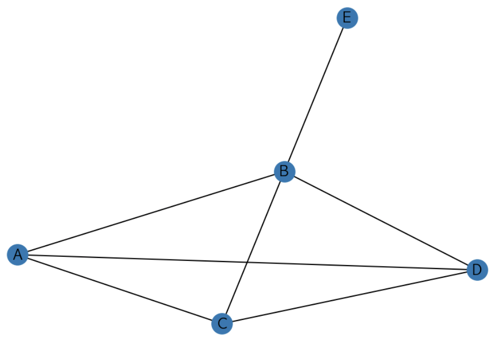

**거리**(distance)는 임의의 두 꼭지점 사이에 존재하는 경로 중 가장 짧은 경로를 의미하며 '최단거리(지오데식 거리, geodesic distance)'라고도 부른다.

**직경**(diamteter)은 한 그래프 내의 거리 중 가장 길이가 긴 거리를 의미한다.

**사이클**(cycle)은 그래프 경로에서 시작 점과 끝 점을 연결하는 경로를 의미한다. 
- 사이클이 존재하려면 최소 **3**개 이상 꼭지점들 사이에 닫힌 형태의 경로가 존재해야 한다. 
- 닫힌 형태의 경로란 시작 점과 끝 점이 같음을 의미한다. 

**인접성**(adjacency)은 임의의 두 꼭지점이 하나의 모서리로 연결되어 있는 경우를 의미한다.

**연결성**(connectivity)은 그래프 내의 모든 꼭지점들 간에 경로가 존재하는 경우를 의미한다. 
- 연결성이 존재하면 '**연결된 그래프**', 
- 연결성이 존재하지 않으면 '**분리된 그래프**'라고 한다.

**부분 그래프**(subgraph)는 한 그래프의 꼭지점과 모서리의 일부로 이루어진 그래프를 의미한다.
- 그래프 **G**가 있을 때 이 그래프의 꼭지점 하나로 그래프를 만들어도 그래프 **G**의 부분 그래프가 된다.
- 또한 그래프 **G**의 꼭지점 **A**와 **B**가 모서리로 연결이 되어 있을때, 모서리로 연결되지 않은 꼭지점 **A**와 **B**도 그래프 **G**의 부분 그래프에 해당한다.
    + 식으로 풀어서 설명을 하자면 꼭지점 **A**와 **B**를 모서리로 연결한 그래프를 **V(G) = {A, B}, E(G) = {(A,B)}** 로 표현하고, 꼭지점 **A**와 **B**를 모서리로 연결하지 않은 그래프를 **V(G) = {A, B}. E(G) = {}** 로 표현한다.

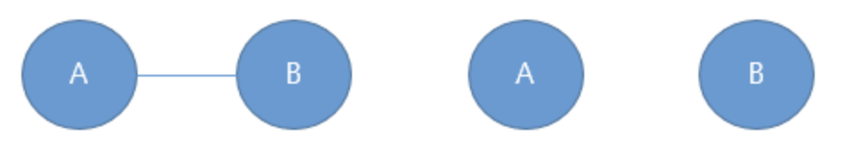

- 아래 그래프의 부분 그래프에는 모서리로 연결하지 않은 각각의 단일 꼭지점 **A**, **B**, **C**, 모서리로 연결하지 않은 두 개의 꼭지점으로 이루어진 그래프 **AB**, **AC**, **BC**, 모서리로 연결하지 않은 세 개의 꼭지점으로 이루어진 그래프 **ABC**, 모서리로 연결한 두 개의 꼭지점으로 이루어진 그래프 **AB**, **AC**, **BC**, 모든 모서리를 서로 연결한 세 개의 꼭지점으로 이루어진 그래프 **ABC**, **ABC**에서 하나의 모서리만 제외한, 즉 **A**와 **B**를 연결하는 모서리만을 제외한 그래프, **A**와 **C**를 연결하는 모서리만을 제외한 그래프, **B**와 **C**를 연결하는 모서리만을 제외한 그래프, 그리고 **ABC**에서 마찬가지로 두 개의 모서리씩을 제외한 세 개의 그래프 모두 포함한다. 즉 부분 그래프는 총 **16**개가 된다.


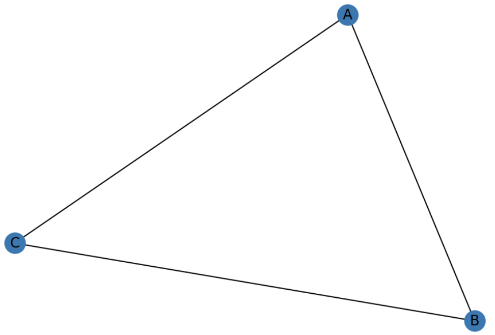

**컴포넌트**(component)는 한 그래프의 부분 그래프(subgraph)들 중 꼭지점들 사이를 연결한 부분 그래프를 의미한다.
- 아래 그래프에서 부분 그래프 **ACD**, **BCC**, **BEF**, **BACD**, **DCABE** 등이 컴포넌트에 해당한다. 
- 여기서 말하는 컴포넌트에 해당하는 부분 그래프들은 꼭지점들 사이가 연결되어 있다.
    + 즉, 부분 그래프 **ACD**라고 했을때, **A**와 **C**만 연결되고 **D**는 연결되지 않은 부분 그래프가 있을 수 있는데 이것은 컴포넌트가 아니다. 반면에  **A**와 **C**, **C**와 **D**를 모두 모서리로 연결한 부분 그래프는 컴포넌트다.

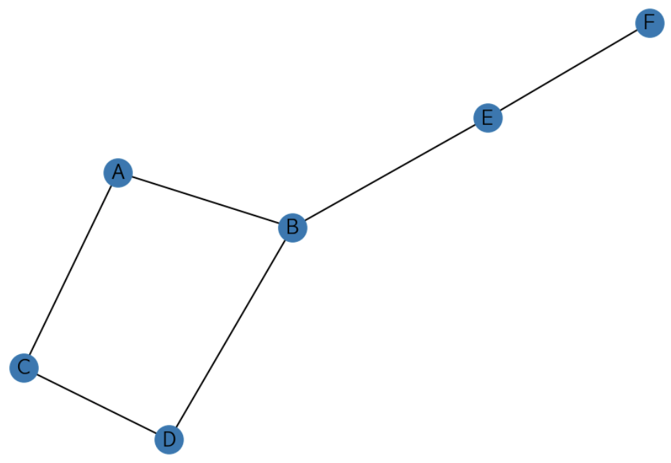

**클릭**(clique)은 **3**개 이상의 꼭지점을 포함한 완전한 그래프 형태의 부분 그래프를 의미한다.
- **3**개 이상의 꼭지점을 가져야하므로 **2**개 이하의 꼭지점을 가지는 완전한 그래프 형태의 부분 그래프는 클릭에 해당하지 않는다. 
- 아래 그래프에서는 부분 그래프 중 **ABC**, **CDEF** 가 클릭에 해당한다.
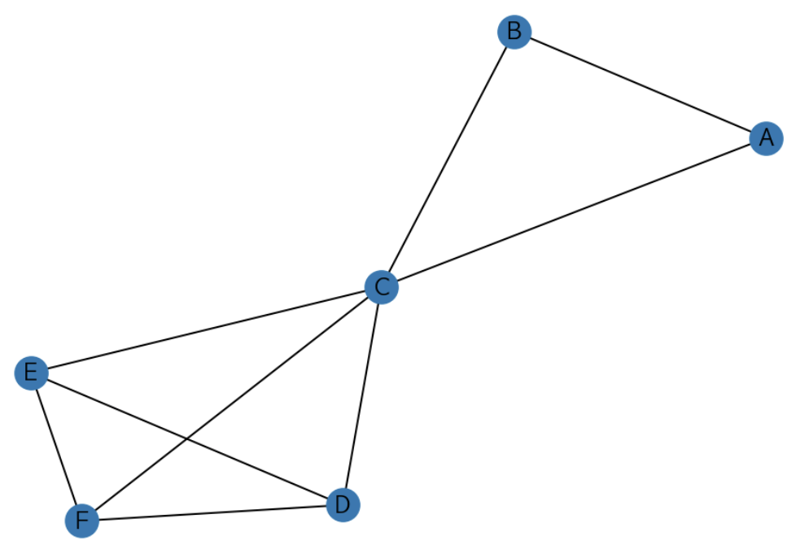

## 그래프의 표현

그래프는 행렬과 시각화를 이용하여 표현할 수 있다.

행렬을 이용한 방식에는 인접행렬, 꼭지점 리스트, 모서리 리스트 등이 있다. 여기서 말하는 꼭지점은 노드(node)를, 모서리는 엣지(edge)를 의미한다.
- **인접행렬**(adjacency matrix) : 인접행렬은 각 점들 간에 존재하는 인접 연결 관계를 표시하는 행렬이다. 
    + 그래프가 ***n*** 개의 꼭지점을 가지고 있을 때, 인접행렬은 ***n*** 차(*n* x *n*) 정방 행렬로 표현된다. 
    + 정방 행렬이란 같은 수의 행과 열을 가지는 행렬을 의미한다. 
    + 임의의 행렬 항 `a(i, j)` 값이 **1**일 때 꼭지점 ***i*** 와 ***j*** 사이에 모서리가 연결되어 있다는 것을 의미하며 **0**일 때 꼭지점 ***i*** 와 ***j*** 사이에 모서리가 연결되어 있지 않다는 것을 의미한다.
- **꼭지점 리스트**(node list) : 인접행렬 내 연결한 모서리가 있는 꼭지점들만 표시하는 방법이다.
    + 그래프에 모서리의 수가 적을 때 쉽게 표현이 가능하다는 장점이 있다.
    + **인접 리스트**(adjacency list)라고도 한다. 
- **모서리 리스트**(edge list) : 인접행렬 내 꼭지점을 연결한 모서리들의 전체 리스트를 표시하는 방법이다.

시각화는 꼭지점과 모서리로 표현한 형태를 가지는 그림을 의미한다.

## 네트워크

**네트워크**(network)란?
- 모든 액터와 액터 간의 모든 타이의 집합(collection)을 의미한다. 

그래프의 설명에서는 꼭지점과 모서리라고 표현을 하였으나, 여기서부터는 엑터와 타이라는 용어를 사용하므로 헷갈리지 않도록 유의한다. 물리학이나 컴퓨터공학 문헌에는 네트워크를 ‘그래프’(graph)라고 부른다.

**액터**(actor)란? 
- '노드'(node)나 '꼭지점'(vertex)이라고도 부른다.
- 액터는 다른 각각의 액터와 관계를 맺을 수 있다.

**타이**(tie)란?
- '관계'(relation)나 '모서리', '엣지'(edge)라고도 부른다.
- 두 액터(actor)간의 관계를 나타낸다.
    + 예) "같은 학교를 나왔다" 또는 "감자칩을 좋아한다"와 같은 관계를 나타낸다.
- 타이는 **무방향**(undirected)과 **방향성**(directed) 두 종류가 존재한다.
    + 액터(actor)에게 관계가 똑같은 것을 의미할 때 '**무방향 타이**'라 하고,
    + **일방향성**(one directional)이나 **쌍방향성**(bidirectional)을 띤 타이는 '**방향성 타이**'라 한다.

네트워크는 앞서 설명한 그래프에서 사용하는 용어들과 유사한 용어들을 사용한다. 아래 테이블은 두 이론에서 비슷한 개념으로 사용되는 용어를 정리한 테이블이다. 

|그래프 이론|네트워크 이론|
|-------:|:---------|
|degree(차수)|degree(연결 정도)|
|in-degree(내차수)|in-degree(내향 연결 정도)|
|out-degree(외차수)|out-degree(외향 연결 정도)|
|directed graph(방향성 그래프)|directed network(방향성 네트워크)|
|undirected graph(무방향 그래프)|undirected network(무방향 네트워크)|

그래프와 마찬가지로 네트워크는 행렬를 이용하거나 시각화로 표현할 수 있다.

## 네트워크 분류

네트워크는 타이의 방향에 따라 다음과 같이 분류한다.
- **방향성 네트워크**(directed network) : 한 엑터에서 다른 엑터로 연결하는 타이에 방향이 있는 네트워크로 '방향성이 있는 네트워크'라고도 부른다.
- **무방향 네트워크**(undirected network) : 모든 타이에 방향성이 없는 네트워크로 '방향성이 없는 네트워크'라고도 부른다.

네트워크는 가중치 여부에 따라 다음과 같이 분류한다.
- **가중 네트워크**(weighted network) : 타이에 가중치를 표시한 네트워크로 '계량(valued) 네트워크'라고도 한다.
- **비가중 네트워크**(unweighed network) : 타이에 가중치가 없는 네트워크로 '이진(binary) 네트워크'라고도 한다.

네트워크는 분석하고자 하는 영역에 따라 다음과 같이 분류한다.
- **전체 네트워크**(complete network) : 단어 그대로 분석하고자 하는 전체 네트워크를 의미한다.
- **부분 네트워크**(sub-network) : 전체 네트워크의 엑터와 타이의 일부로 이루어진 하위 집단 네트워크를 의미한다.
- **에고 네트워크**(ego-network): 한 개의 엑터를 중심으로 그 엑터와 다른 엑터와의 연결을 표현한 네트워크다.
- **양자 네트워크**(dyad network) : **2**개 엑터 간의 관계를 토대로 분석하는 네트워크이다.
- **삼자 네트워크**(triad network) : **3**개 엑터 간의 관계를 토대로 분석하는 네트워크다.

네트워크는 변화 여부에 따라 다음과 같이 분류한다.
- **정적 네트워크**(static network) : 시공간의 변화 여부와 상관없이 네트워크의 엑터와 타이가 고정된 네트워크다.
- **동적 네트워크**(dynamic network) : 시공간의 변화에 따라 네트워크의 엑터와 타이가 변하는 네트워크다.

네트워크는 규모에 따라 다음과 같이 분류한다.
- **소규모 네트워크**(small network) : 엑터의 개수가 **100**개 미만인 네트워크다.
- **중규모 네트워크**(medium network) : 엑터의 개수가 **100**개~**1000**개 사이인 네트워크다.
- **대규모 네트워크**(large network) : 엑터의 개수가 **1000**개 이상인 네트워크다.

네트워크는 엑터의 연결 형태 여부에 따라 다음과 같이 분류한다.

- **정규 네트워크**(regular network) : 모든 엑터의 연결 형태가 동일하다. 즉, 모든 엑터가 같은 차수(degree)를 가지는 것을 의미한다. 
    + 예를 들어, 한 반에 **6**명의 학생이 있고 **3**명씩 **2**개의 조를 이루었다고 가정한다. 조가 다르면 연결하지 않고 같은 조 내에서는 서로 연결이 되어 있다고 한다면, 이는 모든 학생이 조원 **2**명과 연결이 된 정규 네트워크가 된다.
- **무작위 네트워크**(random network) : 엑터의 연결 형태가 임의의 형태를 가진다. 타이의 개수로 분포 곡선을 그리면 무작위 네트워크에서는 적은 수의 엑터만이 매우 적거나 매우 많은 타이를 가지고 대부분의 엑터들이 같은 개수의 타이를 가지므로 엑터의 타이 개수 분포가 종형 곡선(bell curve)를 따르게 된다.  
    + 무작위 네트워크의 예로는 도시들을 연결하는 고속도로가 있다.
- **무척도 네트워크**(scale free network) : 평균 연결 이상으로 많은 타이를 가진 엑터들이 존재한다. 따라서 무척도 네트워크에서는 엑터의 타이 개수 분포가 멱함수 분포(power law distribution)를 따른다. 무척도 네트워크는 선호적 연결(preferential attachment)이라는 특성을 가지는데 이는 새로운 엑터가 추가될 때 보다 많은 타이를 가진 엑터를 선호하여 이 엑터와 연결된다는 것을 의미한다. 
    - 항공 노선, 지하철 노선이 무척도 네트워크에 해당한다.

**멀티플렉스 네트워크**(multiplex networks)란?
- 여러 가지 종류의 타이가 존재하는 네트워크다.
- 예를 들어, 은행 매니저 사이에서 여러 가지 종류의 관계(조언을 구하기, 친구 관계, 고용된 관계 등)에서 정보를 수집한다고 가정했을 때 액터 간의 다중 타이 유형을 포함하는 네트워크를 형성하게 된다.

## 네트워크 특성

- **역동성**(dynamics) : 동적 네트워크의 특성으로 네트워크가 진화하고 구조가 변화하는 것을 의미한다.
- **군집성**(clustering) : 네트워크의 유유상종 현상을 의미한다.
- **중심성**(centrality) : 네트워크 안에서 특정 엑터가 가지는 중심 역할의 영향력을 의미한다.
- **복잡성**(complexity): 역동성, 군집성, 중심성과 같은 구조적 속성만으로는 설명이 불가능한 특성을 의미한다.
- **창발성**(emergence) : 네트워크가 성장함에 따라 생기는 수많은 부분적인 변화로 인해 발생하는 전역적 변화를 의미한다. 

## 네트워크 분석의 개요

**네트워크 분석**이란?
- 연구하고자 하는 대상을 네트워크 형태로 표현하여 분석하는 작업을 의미한다.

네트워크 분석 방법론은 연결 방법론, 위치 방법론, 구조 방법론으로 구분할 수 있다.
- **연결 방법론** : 네트워크 안 엑터들 간의 근접성(closeness)에 기초하여 네트워크 안에 존재하는 군집들을 발견하는 방법론으로, 네트워크 구조 해석에 중점을 둔다.
- **위치 방법론** : 네트워크 안 엑터들 간의 위치 또는 역할의 유사성(similiarity)에 기초하여 네트워크 안에 존재하는 군집들을 발견하는 방법론으로, 마찬가지로 네트워크 구조 해석에 중점을 둔다.
- **구조 방법론** : 네트워크의 구조 자체가 네트워크 안의 엑터들에 미치는 영향을 발견하는 방법론이다.

# 네트워크 구성

**NetworkX**란?
- 복잡한 네트워크의 구조와 기능을 생성과 조작 및 연구를 위한 파이썬 언어 기반의 패키지다.
- https://networkx.github.io

NetworkX의 주요 특징은 다음과 같다.
- 무방향 그래프, 방향성 그래프, 다중 그래프 등의 데이터 구조를 사용할 수 있다.
- 표준 그래프 알고리즘을 보유하고 있다.
- 노드는 텍스트, 이미지, XML 레코드 등 다양한 형태를 가질 수 있다. 
    + **노드**(node)는 그래프의 **꼭지점**을 의미하며 앞서 설명한 엑터를 NetworkX에서는 노드라고 부르기 때문에 앞으로의 설명에서는 **노드**로 통일한다.
- 엣지는 시계열 데이터와 같은 임의(arbitary) 형태의 데이터를 포함할 수 있다. 
    + **엣지**(edge)는 그래프의 **모서리**를 의미하며 앞서 설명한 타이를 NetworkX에서는 엣지라고 부르기 때문에 앞으로의 설명에서는 **엣지**로 통일한다.
- 오픈 소스 패키지다.

**<font size='+1'>관련 모듈 설치 및 사용</font>**


```python
!python -m pip install networkx, matplotlib --upgrade
```


```python
# 버전 확인하기
import networkx
import matplotlib

print('NetworkX version.....:', networkx.__version__)
print('Matplotlib version...:', matplotlib.__version__)
```


```python
# NetworkX로 작성한 네트워크를 시각화하기 위해 matplotlib을 사용한다.
from matplotlib import pyplot
```

NetworkX로 네트워크를 작성할 때는 그래프 구조를 생성하고 노드(node)와 엣지(edge)를 추가한다. 이후 설명에서 **networkx**로 생성한 그래프를 **G**라고 한다.

## 네트워크의 그래프 구조 생성

NetworkX에서 네트워크를 작성하기 위해서는 그래프 구조를 먼저 생성해야한다.
- **Graph**() : 무방향 그래프 구조를 생성한다.
- **DiGraph**() : 방향성 그래프 구조를 생성한다.
- **complete_graph**(*n*) : 모든 노드를 서로 연결한 완전한 그래프를 생성한다. 정수 *n*을 입력받아 *n*개의 노드를 가지는 완전한 그래프를 생성하거나 노드 리스트(꼭지점 리스트)를 입력받아 완전한 그래프를 생성할 수 있다.
- G.**to undirected**(): 현재 그래프 G의 구조를 무방향 그래프 구조로 변환한다.
- G.**to directed**(): 현재 그래프 G의 구조를 방향성 그래프 구조로 변환한다.

다음 예는 무방향 그래프 구조를 생성하여 변수 *g* 에 할당하는 코드다.


```python
g = networkx.Graph()
g
```

다음 예는 방향성 그래프 구조를 생성하여 변수 *dg* 에 할당하는 코드다.


```python
dg = networkx.DiGraph()
dg
```

다음 예는 **4**개의 노드를 가지는 완전한 그래프를 생성하여 변수 *cg* 에 할당하는 코드다.


```python
cg = networkx.complete_graph(4)
cg
```

## 노드와 엣지 추가

빈 그래프 구조를 생성했으면 해당 그래프 구조에 노드와 엣지를 추가할 수 있다.
- **add_node**(_node_) : 노드를 추가한다.
- **add_node**(_node, **kwargs_) : 노드를 추가하고 노드의 속성들을 키워드 전달인자(*kwargs*) 형태로 설정할 수 있다.
- **add_nodes_from**(_node_) : 순회형(리스트, 튜플, 딕셔너리, 세트 등) 형태로 다수의 노드를 추가한다.
- **add_nodes_from**(_nodes, **kwarg_) : 순회형(리스트, 튜플, 딕셔너리, 세트 등) 형태로 다수의 노드를 추가하고 노드의 속성들을 키워드 전달인자(*kwargs*) 형태로 설정할 수 있다.
- **add_edge**(_node1, node2_) : 두 개의 노드를 엣지로 연결한다. 노드를 먼저 추가하지 않고 바로 엣지로 연결해도 엣지가 연결하는 두 개의 노드를 자동으로 추가해준다.
- **add_edge**(_node1, node2, **kwargs_) : 두 개의 노드를 엣지로 연결하고 엣지의 속성들을 키워드 전달인자(*kwargs*) 형태로 설정할 수 있다.
- **add_edges_from**(_edges_) : 튜플 형태의 노드 쌍으로 이루어진 엣지를 담고 있는 리스트 등에서 다수의 엣지들을 추가한다. 노드를 먼저 추가하지 않고 바로 엣지로 연결해도 엣지가 연결하는 노드들을 자동으로 추가해준다.
- **add_edges_from**(_edges, **kwargs_) : 다수의 노드 쌍으로 이루어진 엣지들을 추가하고 엣지의 속성들을 키워드 전달인자(*kwargs*) 형태로 설정할 수 있다. 노드를 먼저 추가하지 않고 바로 엣지로 연결해도 엣지가 연결하는 노드들을 자동으로 추가해준다.

## 노드와 엣지 열람

노드와 엣지를 추가한 후, 그래프 구조 내에서 노드와 엣지를 확인할 수 있다.
- G.**nodes**() : 현재 그래프 G 구조 내 노드를 확인한다.
- G.**edges**() : 현재 그래프 G 구조 내 노드를 연결하는 엣지를 확인한다.

다음 예는 무방향 그래프 구조를 생성하여 변수 *g* 에 할당한 후 노드를 추가하고 그래프 내 노드를 확인하는 코드다.


```python
# 무방향 그래프를 네트워크로 생성한다.
g = __TODO__

# add_node()로 '학교'라는 노드 1개를 추가한다. 
# 이 때 학교 노드의 속성을 지역='서울'로 설정한다.
__TODO__ 

# add_nodes_from()으로 학생, 교직원, 학부모 총 3개의 노드를 추가한다.
# 이 때 여러 개의 노드는 리스트 등 순회형 형태여야 한다.
__TODO__

# 그래프 내 모든 노드를 확인한다. 총 4개의 노드가 출력된다.
print(__TODO__)
```

**실행 결과**  

<pre>
['학교', '학생', '교직원', '학부모']
</pre>

다음 예는 위에서 추가한 노드들을 엣지로 연결하고 그래프 내 엣지를 확인하는 코드다.


```python
# add_edge()로 '학교'와 '학생' 노드을 연결하는 1개의 엣지를 생성한다.
__TODO__

# add_edges_from()으로 '학교'와 '교직원', '학생'과 '학부모'를 연결하는 
# 2개의 엣지를 생성한다. 이 때 튜플 형태의 노드 쌍으로 이루어진 리스트를 사용한다.
__TODO__

# 그래프 내 모든 엣지를 확인한다. 총 3개의 엣지가 출력된다.
print(__TODO__)
```

**실행 결과**  

<pre>
[('학교', '학생'), ('학교', '교직원'), ('학생', '학부모')]
</pre>

## 노드와 엣지 삭제

그래프 구조에서 노드와 엣지를 삭제할 수 있다.
- **remove_node**(*node*) : 노드를 삭제한다. 엣지를 따로 삭제하지 않아도 엣지가 연결하는 노드를 삭제하면 엣지도 함께 삭제된다.
- **remove_nodes_from**(*nodes*) : 순회형(리스트, 튜플, 딕셔너리, 세트 등) 형태로 다수의 노드를 삭제한다. 엣지를 따로 삭제하지 않아도 엣지가 연결하는 노드를 삭제하면 엣지도 함께 삭제된다.
- **remove_edge**(*node1, node2*) : 두 노드를 연결하고 있는 엣지를 삭제한다.
- **remove_edges_from**(*edges*) : 튜플 형태의 노드 쌍로 이루어진 엣지를 담고 있는 리스트 등에서 다수의 엣지를 삭제한다.

다음 예는 무방향 그래프 구조를 생성하여 노드와 엣지를 추가한 후 생성한 노드와 엣지를 확인하고 다시 삭제를 하는 코드다.


```python
# 무방향 그래프를 네트워크로 생성한다.
g = __TODO__

# add_nodes_from()으로 5개의 노드와 3개의 엣지를 추가한다.
__TODO__

# 생성한 노드들을 확인한다.
print('노드 :', __TODO__)  
# 생성한 엣지들을 확인한다.
print('엣지 :', __TODO__)  

# ---  ('사과', '수박') 엣지를 삭제한다.
__TODO__    
print('엣지 삭제 후 노드 :', __TODO__)
print('엣지 삭제 후 엣지 :', __TODO__)

# --- '감'과 '배' 노드를 삭제한다. 
__TODO__
print('노드 삭제 후 노드 :', __TODO__)
print('노드 삭제 후 엣지 :', __TODO__)
```

**실행 결과**  

<pre>
노드 : ['사과', '수박', '감', '배', '포도']
엣지 : [('사과', '수박'), ('수박', '감'), ('감', '배'), ('배', '포도')]
엣지 삭제 후 노드 : ['사과', '수박', '감', '배', '포도']
엣지 삭제 후 엣지 : [('수박', '감'), ('감', '배'), ('배', '포도')]
노드 삭제 후 노드 : ['사과', '수박', '포도']
노드 삭제 후 엣지 : []
</pre>

## 노드와 엣지의 정보 열람

그래프 안의 노드와 엣지 개수를 확인할 수 있다.
- **number_of_nodes**() : 그래프의 노드 개수를 반환한다.
- **number_of_edges**() : 그래프의 엣지 개수를 반환한다.

노드와 엣지를 추가할 때 특정 속성을 입력했다면 속성을 확인할 수 있다.
- **nodes['노드']['속성이름']** : 해당 노드의 속성 값을 반환한다.
- **G['출발노드']['도착노드']['속성이름']** : 현재 그래프 G의 두 노드를 연결하는 특정 엣지의 속성 값을 반환한다.

다음 예는 무방향 그래프 구조를 생성하여 노드를 추가한 후 노드 개수를 확인하는 코드다.


```python
# 무방향 그래프를 네트워크로 생성한다.
g = __TODO__

# 4개의 노드를 추가한다.
__TODO__
print(__TODO__)

# 무방향 그래프 g의 노드 개수를 확인한다.
print(__TODO__)
```

**실행 결과**  

<pre>
['학교', '학생', '교직원', '학부모']
4
</pre>

다음 예는 무방향 그래프 구조를 생성하여 노드와 엣지를 추가한 후 노드와 엣지 개수를 확인하는 코드다.


```python
# 무방향 그래프를 네트워크로 생성한다.
g = __TODO__

# 4개의 노드와 5개의 엣지를 추가한다.
__TODO__

print('노드 :', __TODO__)
print('엣지 :', __TODO__)

# 무방향 그래프 g의 노드 개수와 엣지 개수를 확인한다.
print('노드 개수 :', __TODO__)
print('엣지 개수 :', __TODO__)
```

**실행 결과**  

<pre>
노드 : ['학교', '학생', '교직원', '학부모']
엣지 : [('학교', '학생'), ('학교', '교직원'), ('학교', '학부모'), ('학생', '교직원'), ('학생', '학부모')]
노드 개수 : 4
엣지 개수 : 5
</pre>

다음 예는 무방향 그래프에서 학생의 성적을 속성으로 가지는 노드를 작성하고 속성 값을 확인하는 코드다.


```python
# 무방향 그래프를 네트워크로 생성한다.
g = __TODO__

# '철수'라는 노드 1개를 추가한다. 이 때 철수 노드의 속성을 성적='A'로 설정한다.
__TODO__

# 노드를 출력한다.
print(__TODO__)

# '철수' 노드의 속성의 값을 확인한다.
print(__TODO__)
```

**실행 결과**  

<pre>
['철수']
A
</pre>

다음 예는 무방향 그래프에서 두 학생의 관계를 엣지로 작성하고 엣지의 속성 값을 출력하는 코드다.


```python
# 무방향 그래프를 네트워크로 생성한다.
g = __TODO__

# 2개의 노드와 1개의 엣지를 추가한다. 이 때 엣지의 속성을 관계='친구'로 설정한다.
__TODO__

print('노드 :', __TODO__)
print('엣지 :', __TODO__)

# 철수와 영희 노드를 연결하는 엣지의 속성 값을 출력한다. 
print('엣지 속성 :', __TODO__)
```

**실행 결과**  

<pre>
노드 : ['철수', '영희']
엣지 : [('철수', '영희')]
엣지 속성 : 친구
</pre>

# 시각화

## 네트워크 그래프 구조의 시각화

작성한 네트워크의 그래프를 시각화하여 확인할 수 있다.

NetworkX에서는 그래프 시각화 관련 메소드를 여러 개 가지고 있다. 여기서는 대표적으로 노드에 라벨링 없이 간단하게 그래프를 시각화하는 메소드인 networkx.**draw**()와 기본값으로 노드에 라벨링을 해서 그래프를 시각화 하는 메소드인 networkx.**draw_networkx**()와 시각화한 그래프의 엣지에 라벨링을 하는 메소드인 networkx.**draw_networkx_edge_labels**()를 살펴본다. 이외 다른 메소드들에 대해 자세히 알고 싶으면 아래 랭크에서 확인할 수 있다.
- https://networkx.github.io/documentation/stable/reference/drawing.html

간단한 시각화를 하려면 **draw**() 메소드를 주로 **draw**(_G, pos=None, ax=None, **kws_) 형식으로 사용한다. 이 메소드는 기본적으로 노드와 엣지의 라벨링을 하지 않으며, 간단하게 그래프를 시각화(simple representation) 할 때 사용하는 메소드이다.
- ***G*** 는 시각화하고자 하는 그래프를 의미한다.
- ***pos*** 는 노드의 이름을 키(key)로 가지고 위치(positions), 즉 노드의 x, y 좌표를 매핑값(value)으로 가지는 딕셔너리를 의미한다. 
  + 딕셔너리 외에도 사전에 정의한 노드 위치 지정 레이아웃을 사용할 수 있다. 
  + 기본값이 **None**이므로 입력하지 않으면 자동으로 노드의 위치가 그려진다. 
  + 아래에서 설명할 **draw_network_edge_labels**() 메소드를 같이 사용할 경우 두 메소드 모두 ***pos***를 입력해야 하며 두 메소드 모두 같은 딕셔너리 또는 레이아웃을 사용해야 한다. 
    - 만약 **draw**() 메소드의 ***pos*** 매개변수를 설정하지 않고 **draw_network_edge_labels**() 메소드의 ***pos*** 매개변수만 설정하면 엣지의 라벨이 엣지 중앙에 오지 않고 엣지에서 떨어져서 라벨링 되거나, 전혀 상관없는 위치에 라벨링이 될 수 있다.
  + 노드 위치 지정 레이아웃들에 대해서는 아래 링크에서 확인할 수 있다.
    - https://networkx.github.io/documentation/stable/reference/drawing.html#module-networkx.drawing.layout
- ***ax*** 는 지정한 Matplotlib 축에 그래프를 그릴 때 사용한다.
- ***kws*** 는 기타 optional keywords를 의미한다. 그 중, *with_labels*와 *font_family*를 사용하여 노드의 라벨링 여부와 폰트를 설정할 수 있다. 
  + ***with_labels=True***를 입력하면 시각화 되는 노드의 이름을 표시할 수 있다.
  + ***font_family='설치된 한글 폰트'*** 를 입력하면 한국어를 사용할 수 있다. 맥(macOS)에서는 'AppleGothic'을, 윈도우(Windows)에서는 'NanumGothic'을 사용할 수 있다.

기본값으로 노드에 라벨링을 하는 시각화를 하려면 **draw_networkx()** 메소드를 주로 **draw_networkx**(_G, pos=None, with_labels=True, **kws_) 형식으로 사용한다. **draw()** 메소드와는 달리 기본값으로 노드에 라벨링을 해주며 축선(axis line)이 생겨서 그래프를 사각형 안에 그린다는 차이점이 있다. 또한 그래프를 사각형 안에 그리기 때문에 **draw()** 메소드를 사용했을 때 보다 더 작게 그려진다.
- ***G*** 는 시각화하고자 하는 그래프를 의미한다.
- **pos** 는 노드의 이름을 키(key)로 가지고 위치(positions), 즉 노드의 x,y 좌표를 매핑값(value)으로 가지는 딕셔너리를 의미한다. 딕셔너리 외에도 사전에 정의한 노드 위치 지정 레이아웃을 사용할 수 있다. 
  + 기본값이 **None**이므로 입력하지 않으면 자동으로 노드의 위치가 그려진다. 
  + 아래에서 설명할 엣지에 라벨링을 해주는 **draw_network_edge_labels()** 메소드를 같이 사용할 경우 두 메소드 모두 **pos** 를 입력해야 하며 두 메소드 모두 같은 딕셔너리 또는 레이아웃을 사용해야 한다. 만약 **draw_network_edge_labels()** 메소드에서는 **pos** 매개변수를 설정하고 **draw_networkx()** 메소드에서 **pos** 매개변수를 설정하지 않으면 엣지의 라벨이 엣지 중앙에 오지 않고 엣지에서 떨어져서 라벨링 되거나, 전혀 상관없는 위치에 라벨링이 될 수 있다.
- **with_labels**는 노드의 라벨링 여부를 설정한다. 
  + 기본값은 **True**이므로 자동으로 노드에 라벨링을 하며 이 점이 **draw()** 메소드와 다르다.
- **kws**는 기타 optional keywords를 의미한다. 
  + ***font_family*** 를 사용하여 폰트를 설정할 수 있다. 한국어를 사용하기 위해서는 **font_family='설치된 한글 폰트'** 를 입력해야 한다. 맥에서는 **'AppleGothic'** 을, 윈도우에서는 **'NanumGothic'** 을 사용할 수 있다.  
- 이 메소드는 축선이 생기기 때문에 그래프를 사각형 안에 그리게 된다. 그래프 주변에 생기는 사각형 선을 제거하려면 **pyplot.axis('off')** 를 시각화 출력 전에 사용하면 된다.

시각화한 그래프의 엣지를 라벨링 하려면 **draw_networkx_edge_labels**() 메소드를 주로 **draw_networkx_edge_labels**(_G, pos, edge_labels=None, font_color='k', **kws_) 형식으로 사용한다. 이 메소드는 시각화한 그래프의 엣지에 라벨링을 하는 메소드이므로 반드시 networkx.**draw()** 로 그래프를 먼저 시각화를 한 후 사용해야 한다. 즉, networkx.**draw_networkx_edge_labels**() 메소드는 단독으로 사용하지 않고 networkx.**draw**() 다음에 사용해야 한다. 
- ***G*** 는 엣지의 라벨링을 하려는 그래프를 의미한다.
- ***pos*** 는 노드의 이름을 키(key)로 가지고 위치(positions), 즉 노드의 x, y 좌표를 매핑값(value)으로 가지는 딕셔너리를 의미한다. 
  + **draw**() 메소드와 다르게 필수로 지정해줘야 한다. 
  + 딕셔너리 외에도 사전에 정의된 노드 위치 지정 레이아웃을 입력해서 사용할 수 있다.
- ***edge_labels*** 는 두 개의 노드를 연결하는 하나의 엣지와 이 엣지의 라벨로 이루어진 딕셔너리를 의미한다. 
  + 예) **edge_labels={('Atlanta', 'Boston'): '1095 miles'}**
- ***font_color*** 는 라벨의 폰트 색상을 설정하며 기본값은 'k'로 검정색을 의미한다. 
  + 다양한 색상에 대한 설명은 아래 링크에서 확인할 수 있다.
    - https://matplotlib.org/3.1.1/api/colors_api.html

위 메소드를 통해 시각화를 했으면 matplotlib 패키지를 사용하여 출력한다.

- **matplotlib.pyplot.show**() : **matplotlib** 패키지를 사용하여 시각화 형태로 생성한 그래프를 출력한다. 
  + 주피터 노트북에서는 **draw**()만 사용하여도 그래프를 시각화하여 출력할 수 있다.

다음 예는 무방향 그래프를 작성하고 시각화하는 코드다.


```python
# 무방향 그래프를 네트워크로 생성한다.
g = __TODO__

# 4개의 노드와 5개의 엣지를 추가한다.
__TODO__

print('노드 :', g.nodes)
print('엣지 :', g.edges)

# networkx.draw() 메소드를 이용하여 그래프를 시각화한다.
# 윈도우(Windows)는 폰트를 'NanumGothic'
# 맥(macOS)은 폰트를 'AppleGothic'로 설정한다.
__TODO__

pyplot.show()
```

**실행 결과**  

<pre>
노드 : ['학교', '학생', '교직원', '학부모']
엣지 : [('학교', '학생'), ('학교', '교직원'), ('학교', '학부모'), ('학생', '교직원'), ('학생', '학부모')]
</pre>

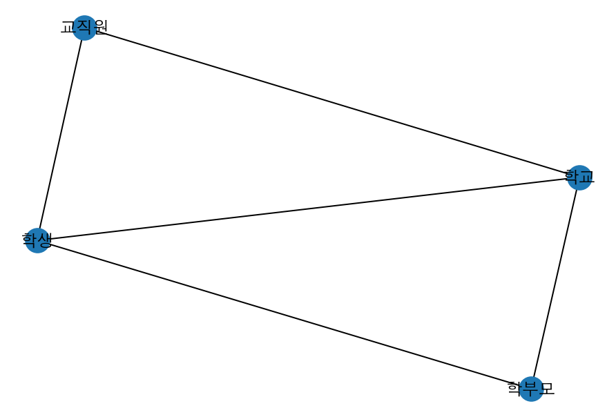

다음 예는 그래프를 작성하고 엣지의 라벨링을 해서 시각화하는 코드다.


```python
# 무방향 그래프를 네트워크로 생성한다.
g = __TODO__

# 3개의 노드와 3개의 엣지를 추가한다.
__TODO__

print('노드 :', g.nodes)
print('엣지 :', g.edges)

# 이 그래프의 레이아웃을 spring 레이아웃으로 설정한다.
layout = __TODO__

# networkx.draw() 메소드를 이용하여 그래프를 시각화한다.
# spring 레이아웃에 맞춰 설정하고, 노드의 이름을 표시한다.
# 맥(macOS)에서는 font_family로 'AppleGothic'을 사용하면 한글이 출력된다.
# 윈도우(Windows)에서는 font_family로 'NanumGothic'을 사용하면 한글이 출력된다.
__TODO__

# networkx.draw_networkx_edge_labels() 메소드를 이용하여 그래프의 엣지에 라벨링을 한다.
# 마찬가지로 노드들의 위치를 spring 레이아웃에 맞춰 설정하고, 
# 두 노드를 연결하는 각 엣지의 라벨링을 한다.
__TODO__

pyplot.show()
```

**실행 결과**  

<pre>
노드 : ['학교', '집', '체육관']
엣지 : [('학교', '집'), ('학교', '체육관'), ('집', '체육관')]
</pre>

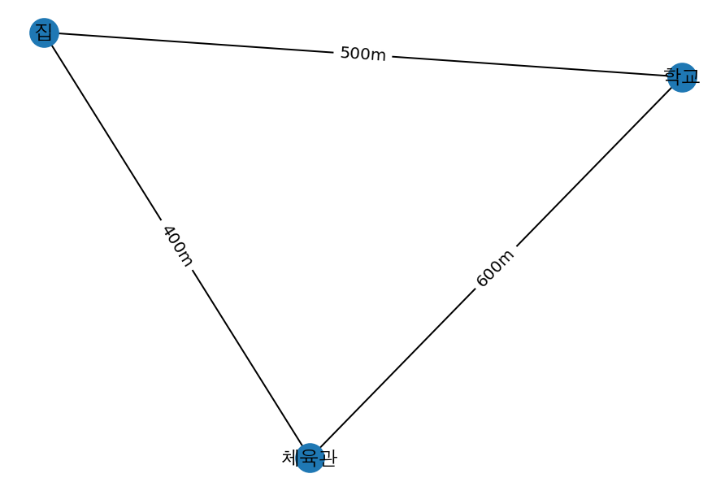

## 네트워크 레이아웃

네트워크의 그래프를 시각화할 때 다양한 노드 위치 지정 레이아웃 메소드를 사용할 수 있다.
- 레이아웃 메소드들은 각 노드의 이름을 키(key)로, 노드의 위치를 매핑값(value)으로 가지는 딕셔너리를 반환하며 시각화 메소드의 ***pos*** 매개변수에 이 딕셔너리를 사용하면 된다.
- 레이아웃의 종류에는 **bipartite_layout, circular_layout, kamada_kawai_layout, planar_layout, random_layout, shell_layout, spring_layout, spectral_layout, spiral_layout**이 있다. 각 레이아웃를 사용하기 위한 메소드의 설명을 아래에 정리한다.

**<font size='+1'>bipartite_layout</font>**
- 이분 그래프(bipartite graph)를 그리는 위한 레이아웃이다.
  + 이 레이아웃은 이분 그래프에만 적용된다.

**이분 그래프**란?
- 인접한 노드끼리 서로 다른 색으로 칠하거나 표시를 통해 구분함으로써 모든 노드를 두 가지 종류로 구분할 수 있는 그래프를 말한다. 


**bipartite_layout**() 메소드를 주로 **bipartite_layout**(*G, nodes,  align='vertical', scale=1*) 형식으로 사용한다. 
- G는 시각화하고자 하는 그래프를 의미한다.
- ***nodes*** 는 이분 그래프의 한 노드 집합에 있는 노드들이며 이 노드들은 왼쪽 또는 상단에 배치된다.
- ***align*** 으로 노드 정렬을 설정할 수 있으며 'vertical' 또는 'horizontal'을 입력한다.
- ***scale***은 노드 배치를 위한 스케일 팩터(scale factor)를 의미한다.

다음은 **Bipartite** 레이아웃을 적용한 그래프를 시각화하는 코드다.


```python
# --- Bipartite 레이아웃

# 무방향 그래프를 네트워크로 생성한다.
g = __TODO__

# 6개의 노드와 9개의 엣지를 생성한다.
__TODO__

print('노드 :', g.nodes)
print('엣지 :', g.edges)

# bipartite_layout()을 적용하여 그래프를 시각화한다
# 이 때 nodes 매개변수를 ['A', 'B', 'C']로 설정하여 이 세 노드들이 왼쪽에 그려지도록 한다.
__TODO__

# 그래프의 제목과 제목 폰트 크기를 설정한다.
pyplot.title('Bipartite Layout', fontsize=20)
pyplot.show()
```

**실행 결과**  

<pre>
노드 : ['A', 'D', 'E', 'F', 'B', 'C']
엣지 : [('A', 'D'), ('A', 'E'), ('A', 'F'), ('D', 'B'), ('D', 'C'), ('E', 'B'), ('E', 'C'), ('F', 'B'), ('F', 'C')]
</pre>

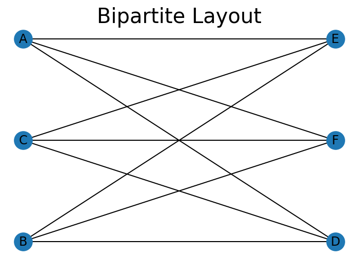

**<font size='+1'>circular_layout</font>**
- 노드들을 원 모양으로 배치하기 위한 레이아웃이다.

**circular_layout**() 메소드를 주로 **circular_layout**(*G, scale=1*) 형식으로 사용한다. 
- G는 시각화하고자 하는 그래프를 의미한다.
- ***scale*** 은 노드 배치를 위한 스케일 팩터(scale factor)를 의미한다.

다음은 **Circular** 레이아웃을 적용한 그래프를 시각화하는 코드다.


```python
# --- Circular 레이아웃

# 무방향 그래프를 네트워크로 생성한다.
g = __TODO__

# 12개의 노드와 12개의 엣지를 생성한다.
__TODO__

print('노드 :', g.nodes)
print('엣지 :', g.edges)

# circular_layout()을 적용하여 그래프 'g'를 시각화한다.
__TODO__

# 그래프의 제목과 제목 폰트 크기를 설정한다.
pyplot.title('Circular Layout', fontsize=20)
pyplot.show()
```

**실행 결과**  

<pre>
노드 : ['A', 'B', 'C', 'D', 'E', 'F', 'G', 'H', 'I', 'J', 'K', 'L']
엣지 : [('A', 'B'), ('A', 'L'), ('B', 'C'), ('C', 'D'), ('D', 'E'), ('E', 'F'), ('F', 'G'), ('G', 'H'), ('H', 'I'), ('I', 'J'), ('J', 'K'), ('K', 'L')]
</pre>

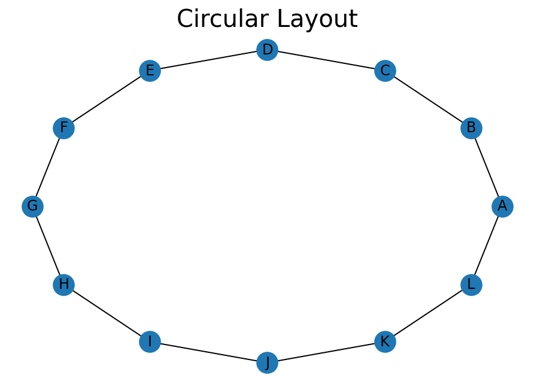

**<font size='+1'>kamada_kawai_layout</font>**
- 노드들을 Kamada-Kawai 알고리즘에 따라서 배치하기 위한 레이아웃이다.

**Kamada-Kawai 알고리즘**이란?
- Kamada와 Kawai가 1989년에 작성한 'An algorithm for drawing general undirected graphs' 논문에서 사용한 알고리즘으로 그래프를 그리는 Force-directed graph drawing 알고리즘의 한 종류이다. 
- **Force-directed graph drawing** 알고리즘은 엣지 길이를 비슷하게 하고 엣지가 최대한 서로 겹치지 않도록 그래프를 생성하는 알고리즘이다.

**kamada_kawai_layout**() 메소드를 주로 **kamada_kawai_layout**(*G, dist=None, pos=None, weight='weight', scale=1, center=None, dim=2*) 형식으로 사용한다. 
- G는 시각화하고자 하는 그래프를 의미한다.
- ***dist*** 는 출발 및 도착 노드별로 인덱싱 된 노드 간 최적 거리(optimal distance)를 기록한 딕셔너리이다. 
  + **None**이면 **shortest_path_length**()를 사용하여 거리를 계산한다.
- ***pos***는 노드를 키(key)로, 좌표 목록(coordinate list)을 매핑값(value)으로 사용하는 딕셔너리로 노드의 초기 위치를 설정한다. 
  + **None**이면 이후에 사용할 ***dim*** 매개변수가 **2**보다 크거나 같을 때 **Circular** 레이아웃을 사용하고 **1**일 때 **Linear** 레이아웃을 사용한다.
    - **선형 레이아웃(linear layout)** : **networkx** 소스코드에는 이 선형 레이아웃을 `{n: pt for n, pt in zip(G, numpy.linspace(0, 1, len(G)))}`가 반환하는 딕셔너리로 설명하고 있다.
      + 마찬가지로 노드의 이름을 키(key)로, 노드의 위치를 매핑값(value)으로 가지는 딕셔너리를 레이아웃으로 사용할 수 있다.
      + **numpy.linspace(start, stop, num=개수)** 는 *start* ~ *stop* 사이의 값을 *n* 개 개수만큼 생성하여 배열(array)로 반환한다.
      + 즉, 선형 레이아웃에서 노드의 위치로 사용할 값을 **0**부터 **1** 사이에서 노드의 개수만큼 생성하여 배열로 반환하고 **zip**() 함수를 이용하여 노드의 이름을 키(key)로, **0**부터 **1** 사이에서 생성된 숫자를 매핑값(value)으로 가지는 딕셔너리를 선형 레이아웃으로 사용한다.
      + 이론이나 알고리즘에 기반하여 만들어진 레이아웃들은 NetworkX 내에서 메소드로 구현이 되어 있으며, NetworkX Documentation에서 각 레이아웃 메소드에 대한 설명이 페이지마다 자세히 정리되어있는 반면, 선형 레이아웃은 메소드로 구현이 되어 있지 않고 따라서 NetworkX Documentation에 설명이 정리되어 있지 않으므로 따로 설명하지 않는다.
- ***weight*** 는 엣지 가중치에 사용되는 숫자 값을 보유하는 엣지의 속성으로 None이면 모든 엣지 가중치는 1이 된다.
- ***scale*** 은 노드 배치를 위한 스케일 팩터(scale factor)를 의미한다.
- ***center*** 는 레이아웃에 중앙에 배치 할 노드의 좌표를 의미한다.
- ***dim*** 은 레이아웃의 차원(dimension)이다.

다음은 **Kamada-Kawai** 레이아웃을 적용한 그래프를 시각화하는 코드다.


```python
# --- Kamada-Kawai 레이아웃

# 무방향 그래프를 네트워크로 생성한다.
g = __TODO__

# 5개의 노드와 8개의 엣지를 생성한다.
__TODO__

print('노드 :', g.nodes)
print('엣지 :', g.edges)

# kamada_kawai_layout()을 적용하여 그래프 'g'를 시각화한다
__TODO__

# 그래프의 제목과 제목 폰트 크기를 설정한다.
pyplot.title('Kamada-Kawai Layout', fontsize=20)
pyplot.show()
```

**실행 결과**  

<pre>
노드 : ['A', 'B', 'D', 'E', 'C']
엣지 : [('A', 'B'), ('A', 'D'), ('A', 'E'), ('B', 'D'), ('B', 'E'), ('D', 'C'), ('D', 'E'), ('E', 'C')]
</pre>

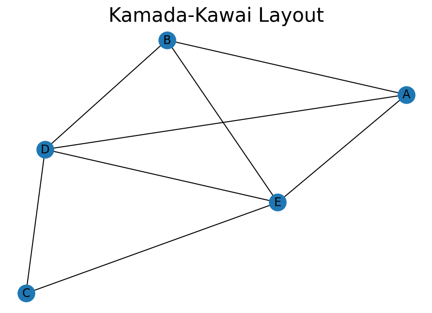

**<font size='+1'>planar_layout</font>**
- 평면 그래프(planar graph)를 그리기 위한 레이아웃이다.
  + 이 레이아웃은 평면 그래프에만 적용된다.

**평면 그래프(planar graph)** 란?
- 엣지가 **서로 교차하지 않도록** 2차원 공간에 그릴 수 있는 그래프를 말한다. 


**planar_layout**() 메소드를 주로 **planar_layout**(*G, scale=1, center=None, dim=2*) 형식으로 사용한다. 
- G는 시각화하고자 하는 그래프를 의미한다.
- ***scale*** 은 노드 배치를 위한 스케일 팩터(scale factor)를 의미한다.
- ***center*** 는 레이아웃에 중앙에 배치 할 노드의 좌표를 의미한다.
- ***dim*** 은 레이아웃의 차원(dimension)이다.

다음은 **Planar** 레이아웃을 적용한 그래프를 시각화하는 코드다.


```python
# --- Planar 레이아웃

# 무방향 그래프를 네트워크로 생성한다.
g = __TODO__

# 4개의 노드와 6개의 엣지를 생성한다.
__TODO__

print('노드 :', g.nodes)
print('엣지 :', g.edges)

# planar_layout()을 적용하여 그래프 'g'를 시각화한다.
__TODO__

# 그래프의 제목과 제목 폰트 크기를 설정한다.
pyplot.title('Planar Layout', fontsize=20)
pyplot.show()
```

**실행 결과**  

<pre>
노드 : ['A', 'B', 'C', 'D']
엣지 : [('A', 'B'), ('A', 'C'), ('A', 'D'), ('B', 'C'), ('B', 'D'), ('C', 'D')]
</pre>

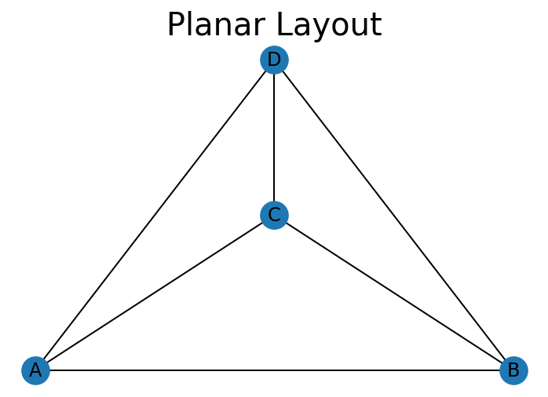

**<font size='+1'>random_layout</font>**
- 노드들을 무작위 위치에 균일하게 배치하기(position nodes uniformly at random) 위한 레이아웃이다.

**random_layout**() 메소드를 주로 **random_layout**(*G, center=None, dim=2, seed=None*) 형식으로 사용한다. 
- G는 시각화하고자 하는 그래프를 의미한다.
- ***center*** 는 레이아웃의 중앙에 배치 할 노드의 좌표를 의미한다.
- ***dim*** 은 레이아웃의 차원(dimension)이다.
- ***seed*** 는 결정적(deterministic) 노드 레이아웃에 대한 임의 상태를 설정한다. 
  + **int** 값을 입력하면 ***seed*** 는 난수 생성기(random number generator)에서 사용하는 ***seed*** 이고, 
  + **None**이면 난수 생성기는 **numpy.random**에서 사용하는 **RandomState** 인스턴스다.

다음은 **Random** 레이아웃을 적용한 그래프를 시각화하는 코드다.


```python
# --- Random 레이아웃

# 무방향 그래프를 네트워크로 생성한다.
g = __TODO__

# 5개의 노드와 8개의 엣지를 생성한다.
__TODO__

print('노드 :', g.nodes)
print('엣지 :', g.edges)

# random_layout()을 적용하여 그래프 'g'를 시각화한다.
__TODO__

# 그래프의 제목과 제목 폰트 크기를 설정한다.
pyplot.title('Random Layout', fontsize=20)
pyplot.show()
```

**실행 결과**  

<pre>
노드 : ['A', 'B', 'D', 'E', 'C']
엣지 : [('A', 'B'), ('A', 'D'), ('A', 'E'), ('B', 'D'), ('B', 'E'), ('D', 'C'), ('D', 'E'), ('E', 'C')]
</pre>

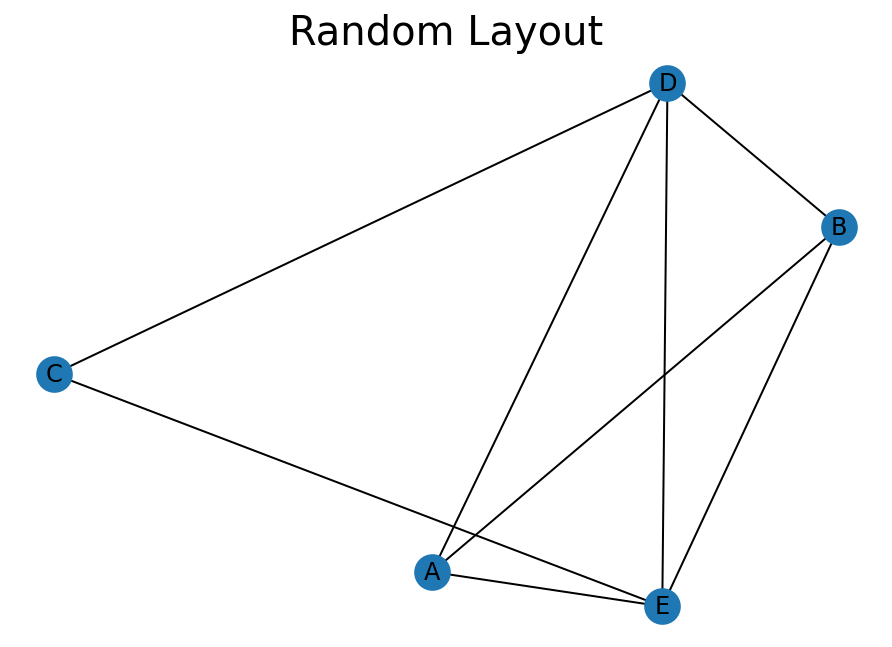

**<font size='+1'>shell_layout</font>**
- 노드들을 **동심원**의 형태로 배치하기 위한 레이아웃이다.

**shell_layout()** 메소드를 주로 **shell_layout**(*G, nlist=None, scale=1, center=None, dim=2*) 형식으로 사용한다.
- G는 시각화하고자 하는 그래프를 의미한다.
- ***nlist*** 는 각 쉘에 들어가는 노드들의 목록이다. 노드들을 2차원 리스트로 입력하고 처음 입력하는 노드 리스트가 가장 안쪽에 위치하는 원을 그린다. 
- ***scale*** 은 노드 배치를 위한 스케일 팩터(scale factor)를 의미한다.
- ***center*** 는 레이아웃에 중앙에 배치 할 노드의 좌표를 의미한다.
- ***dim*** 은 레이아웃의 차원(dimension)이다.

다음은 **Shell** 레이아웃을 적용한 그래프를 시각화하는 코드다.


```python
# --- Shell 레이아웃

# 무방향 그래프를 네트워크로 생성한다.
g = __TODO__

# 18개의 노드와 18개의 엣지를 생성한다.
__TODO__

print('노드 :', g.nodes)
print('엣지 :', g.edges)

# shell_layout()을 적용하여 그래프 'g'를 시각화한다.
# shell_layout 메소드의 nlist 매개변수를 [list(g)[0:9], list(g)[9:18]]로 설정하여,
# 첫번째부터 아홉번째까지의 노드들(A~I)로 안에 원을 그리고,
# 열번째부터 열아홉번째까지의 노드들(A2~I2)로 바깥에 원을 그린다.
__TODO__

# 그래프의 제목과 제목 폰트 크기를 설정한다.
pyplot.title('Shell Layout', fontsize=20)
pyplot.show()
```

**실행 결과**  

<pre>
노드 : ['A', 'B', 'C', 'D', 'E', 'F', 'G', 'H', 'I', 'A2', 'B2', 'C2', 'D2', 'E2', 'F2', 'G2', 'H2', 'I2']
엣지 : [('A', 'B'), ('A', 'I'), ('B', 'C'), ('C', 'D'), ('D', 'E'), ('E', 'F'), ('F', 'G'), ('G', 'H'), ('H', 'I'), ('A2', 'B2'), ('A2', 'I2'), ('B2', 'C2'), ('C2', 'D2'), ('D2', 'E2'), ('E2', 'F2'), ('F2', 'G2'), ('G2', 'H2'), ('H2', 'I2')]
</pre>

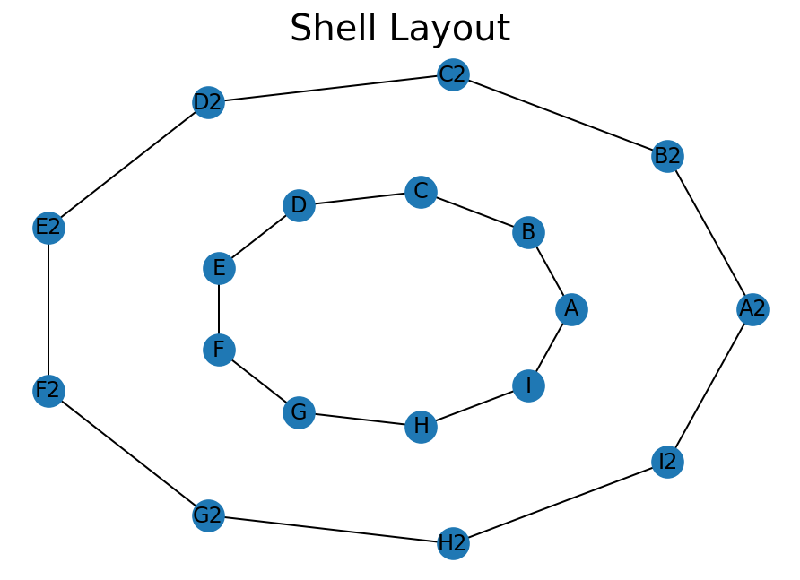

**<font size='+1'>spring_layout</font>**
- 노드들을 Fruchterman-Reingold force-directed 알고리즘에 따라서 배치하기 위한 레이아웃이다.

**Fruchterman-Reingold force-directed 알고리즘**이란?
- Fruchterman과 Reignold가 1991년에 작성한 "Graph Drawing by Force-Directed Placemen" 논문에서 사용된 알고리즘이다.
- 그래프를 그리는 Force-directed graph drawing 알고리즘의 한 종류이다.

**spring_layout()** 메소드를 주로 **spring_layout**(*G, k=None, pos=None, scale=1, center=None, dim=2*) 형식으로 사용한다.
- G는 시각화하고자 하는 그래프를 의미한다.
- ***k*** 는 노드 간의 최적 거리를 설정한다. **None**이면 거리는 **1 / sqrt(n)** 로 설정되며 여기서 **n**은 노드의 수를 의미한다. 노드간 거리를 더 멀리 이동시키려면 이 값을 증가시킨다.
- ***pos*** 는 노드를 키(key)로, 좌표 목록(coordinate list)을 매핑값(value)으로 사용하는 딕셔너리로 노드의 초기 위치를 설정한다. 
  + **None**이면 이후에 사용할 ***dim*** 매개변수가 **2**보다 크거나 같을 때 **Circular** 레이아웃을 사용하고 **1**일 때 **Linear 레이아웃**을 사용한다.
    - **선형 레이아웃(linear layout)** : **networkx** 소스코드에는 이 선형 레이아웃을 `{n: pt for n, pt in zip(G, numpy.linspace(0, 1, len(G)))}`가 반환하는 딕셔너리로 설명하고 있다.
    + 앞서 설명했듯이 노드의 이름을 키(key)로, 노드의 위치를 매핑값(value)으로 가지는 딕셔너리를 레이아웃으로 사용할 수 있다.
    + **numpy.linspace(start, stop, num=개수)** 는 *start* ~ *stop* 사이의 값을 *n* 개 개수만큼 생성하여 배열(array)로 반환한다.
      + 즉, 선형 레이아웃에서 노드의 위치로 사용할 값을 **0**부터 **1** 사이에서 노드의 개수만큼 생성하여 배열로 반환하고 **zip**() 함수를 이용하여 노드의 이름을 키(key)로, **0**부터 **1** 사이에서 생성된 숫자를 매핑값(value)으로 가지는 딕셔너리를 선형 레이아웃으로 사용한다.
- ***scale*** 은 노드 배치를 위한 스케일 팩터(scale factor)를 의미한다.
- ***center*** 는 레이아웃에 중앙에 배치 할 노드의 좌표를 의미한다.
- ***dim*** 은 레이아웃의 차원(dimension)이다.

다음은 **Spring** 레이아웃을 적용한 그래프를 시각화하는 코드다.


```python
# --- Spring 레이아웃

# 무방향 그래프를 네트워크로 생성한다.
g = __TODO__

# 5개의 노드와 8개의 엣지를 생성한다.
__TODO__

print('노드 :', g.nodes)
print('엣지 :', g.edges)

# spring_layout()을 적용하여 그래프 'g'를 시각화한다.
__TODO__

# 그래프의 제목과 제목 폰트 크기를 설정한다.
pyplot.title('Spring Layout', fontsize=20)
pyplot.show()
```

**실행 결과**  

<pre>
노드 : ['A', 'B', 'D', 'E', 'C']
엣지 : [('A', 'B'), ('A', 'D'), ('A', 'E'), ('B', 'D'), ('B', 'E'), ('D', 'C'), ('D', 'E'), ('E', 'C')]
</pre>

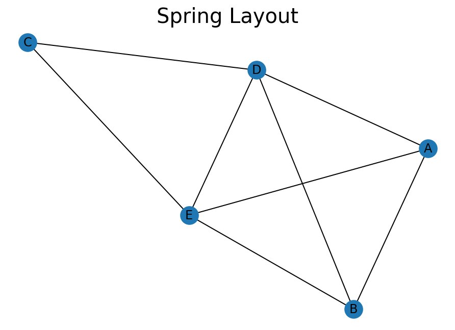

**<font size='+1'>spectral_layout</font>**
- 그래프 라플라시안(Graph Laplacian) 의 고유 벡터(eigenvectors)를 이용하여 노드들을 배치하기 위한 레이아웃이다.
- 이 레이아웃은 그래프 라플라시안의 두 개의 가장 큰 (또는 가장 작은) 고윳값(eigenvalue)과 해당하는 고유 벡터를 계산한 다음 노드를 배치하는 데 사용한다.

**그래프 라플라시안(Graph Laplacian)** 이란?
- 그래프 라플라시안은 **라플라시안 행렬(Laplacian matrix)** 이라고도 부르며 노드의 엣지에 degree를 합한 행렬을 의미한다.
- 신장 트리(spanning tree)를 만들 때 사용한다.

**spectral_layout()** 메소드를 주로 **spectral_layout**(*G, scale=1, center=None, dim=2*) 형식으로 사용한다. 
- G는 시각화하고자 하는 그래프를 의미한다.
- ***scale*** 은 노드 배치를 위한 스케일 팩터(scale factor)를 의미한다.
- ***center*** 는 레이아웃에 중앙에 배치 할 노드의 좌표를 의미한다.
- ***dim*** 은 레이아웃의 차원(dimension)이다.

**[참고]** 이 레이아웃은 시각화할 때 두 노드가 연결되어 있고, 두 노드가 세 개 이상의 다른 노드들과 공통적으로 연결 되어 있다면 두 노드를 겹쳐 그린다. 
- 예를 들어, 노드 **A**와 노드 **B**가 연결되어 있으며 두 노드 모두 노드 각각 노드 **C**, **D**, **F**와 연결이 되어 있다고 가정한다. 또한 노드 **C**와 **D**, **C**와 **E**, **E**와 **F**가 연결되어 있다. 따라서 엣지로 **(A, B)**, **(A, C)**, **(A, D)**, **(A, F)**, **(B, C)**, **(B, D)**, **(B, F)**, **(C, D)**, **(C, E)**, **(E, F)** 가 있다. 이 그래프를 시각화하면 노드 **A**와 **B**가 겹쳐진다. 
- 이 두 노드가 겹쳐지지 않도록 하기 위해서는 두 노드가 서로 연결되지 않도록 엣지 **(A, B)** 를 제거하거나, 세 개 이상의 다른 노드들과 공통적으로 연결이 되지 않도록 노드 **C**, **D**, **F** 와 연결된 엣지 중 한 개의 엣지를 제거하면 된다.

다음은 위 예시대로 **Spectral** 레이아웃을 적용한 그래프에서 두 노드가 겹쳐져 시각화하는 코드다.


```python
# --- Spectral 레이아웃

# 무방향 그래프를 네트워크로 생성한다.
g = __TODO__

# 6개의 노드와 10개의 엣지를 생성한다.
__TODO__

print('노드 :', g.nodes)
print('엣지 :', g.edges)

# spectral_layout()을 적용하여 그래프 'g'를 시각화한다
__TODO__

# 그래프의 제목을 설정한다.
pyplot.title('Spectral Layout', fontsize=20)
pyplot.show()
```

**실행 결과**  

<pre>
노드 : ['A', 'B', 'C', 'D', 'F', 'E']
엣지 : [('A', 'B'), ('A', 'C'), ('A', 'D'), ('A', 'F'), ('B', 'C'), ('B', 'D'), ('B', 'F'), ('C', 'D'), ('C', 'E'), ('F', 'E')]
</pre>

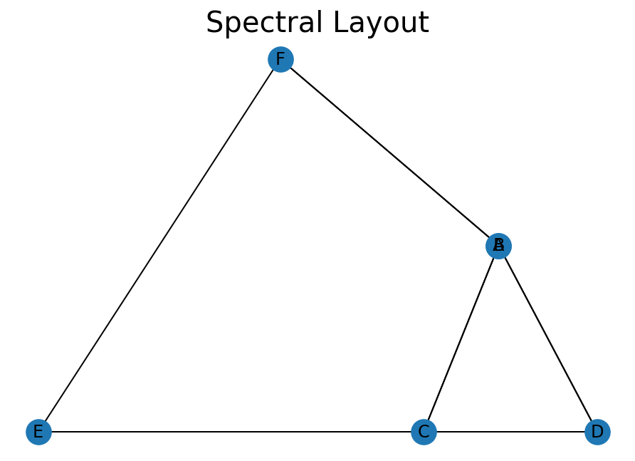

**<font size='+1'>spiral_layout</font>**
- 노드들을 나선(spiral)의 형태로 배치하기 위한 레이아웃이다.

**spiral_layout()** 메소드를 주로 **spiral_layout**(*G, scale=1, center=None, dim=2, resolution=0.35, equidistant=False*) 형식으로 사용한다.
- G는 시각화하고자 하는 그래프를 의미한다.
- ***scale*** 은 노드 배치를 위한 스케일 팩터(scale factor)를 의미한다.
- ***center*** 는 레이아웃에 중앙에 배치할 노드의 좌표를 의미한다.
- ***dim*** 은 레이아웃의 차원(dimension)이다.
- ***resolution*** 은 나선형 레이아웃의 간결함(compactness)를 설정한다. 
  - 기본값은 **0.35**이며 값이 낮을수록 나선형 레이아웃이 더 압축되어 나온다.
- ***equidistant*** 는 **True**이면 노드가 서로 같은 거리(equidistant)에 배치된다.

다음은 **Spiral** 레이아웃을 적용한 그래프를 시각화하는 코드다.


```python
# --- Spiral 레이아웃

# 무방향 그래프를 네트워크로 생성한다.
g = __TODO__

# 19개의 노드와 18개의 엣지를 생성한다.
__TODO__

print('노드 :', g.nodes)
print('엣지 :', g.edges)

# spiral_layout()을 적용하여 그래프 'g'를 시각화한다
__TODOO

# 그래프의 제목을 설정한다.
pyplot.title('Spiral Layout', fontsize=20)
pyplot.show()
```

**실행 결과** 

<pre>
노드 : ['A', 'B', 'C', 'D', 'E', 'F', 'G', 'H', 'I', 'J', 'K', 'L', 'M', 'N', 'O', 'P', 'Q', 'R', 'S']
엣지 : [('A', 'B'), ('B', 'C'), ('C', 'D'), ('D', 'E'), ('E', 'F'), ('F', 'G'), ('G', 'H'), ('H', 'I'), ('I', 'J'), ('J', 'K'), ('K', 'L'), ('L', 'M'), ('M', 'N'), ('N', 'O'), ('O', 'P'), ('P', 'Q'), ('Q', 'R'), ('R', 'S')]
</pre>

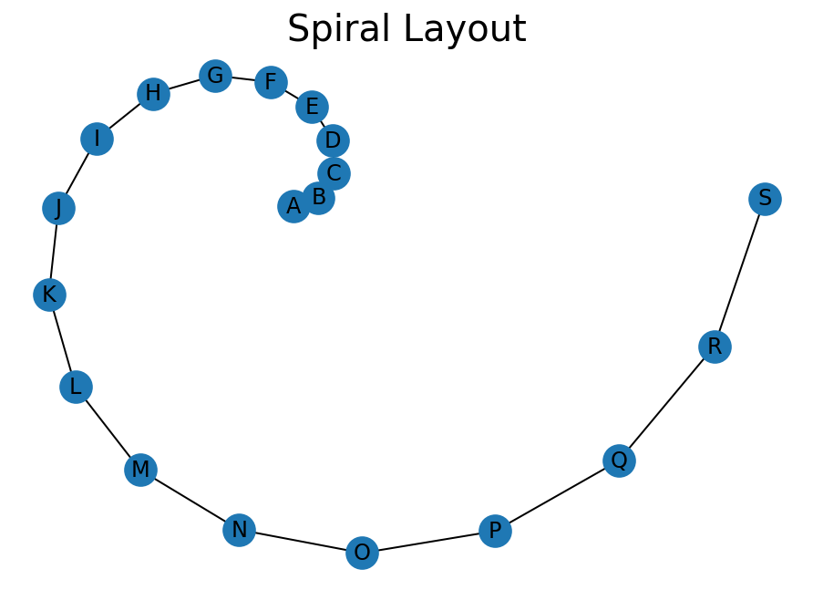

다음은 **Circular**, **Kamada-Kawai**, **Random**, **Shell**, **Spring**, **Spectral**, **Spiral** 레이아웃을 완전한 그래프에 적용하여 시각화하는 코드다. 
- **Bipartite** 레이아웃과 **Planar** 레이아웃은 각각 이분(bipartite) 그래프와 평면(planar) 그래프에서만 사용이 가능하므로 여기서는 적용할 수 없다. 


```python
import numpy

# 20개의 노드를 가진 임의의 완전한 그래프를 생성하고 cg 라는 변수에 저장한다.
cg = __TODO__

print('노드 :', cg.nodes)
print('엣지 :', cg.edges)

# 완전한 그래프로 레이아웃을 확인하면 차이가 잘 보이지 않기 때문에 완전한 그래프의 엣지중 일부를 랜덤하게 삭제한다.
for i in range(0, 200):
    n1 = list(cg.nodes())[numpy.random.randint(0, len(cg.nodes()))]
    n2 = list(cg.nodes())[numpy.random.randint(0, len(cg.nodes()))]
    try:
        cg.remove_edge(n1, n2)
    except:
        continue

# draw() 메소드의 pos 매개변수에 들어갈 레이아웃을 설정한다.
# bipartite 레이아웃은 bipartite 그래프에서만, planar 레이아웃은 planar 그래프에서만 사용이 가능하므로,
# 두 레이아웃을 제외한 레이아웃들을 사용한다.
# 레이아웃의 이름을 키(key)로, 레이아웃 메소드의 반환을 매핑값(value)으로 가지는 딕셔너리를 생성하고 
# layouts 이라는 변수에 저장한다.
layouts = {
    'Default': None,
    'Circular': __TODO__,
    'Kamada-Kawai': __TODO__, 
    'Random': __TODO__,  
    'Shell': __TODO__, # 각 쉘에 들어가는 노드들의 목록을 안쪽 10개([0:10] 바깥쪽 10개[10:20]로 설정한다.
    'Spring': __TODO__, 
    'Spectral': __TODO__, 
    'Spiral': __TODO__
}

# pyplot의 subplots을 이용하여 레이아웃을 적용한 그래프들을 가로 2, 세로 4로 출력하도록 한다.
fig, axes = pyplot.subplots(4, 2)

# 각 그래프의 사이즈를 inch로 설정한다. 이 코드가 없으면 그래프가 작게 압축되어 출력이 된다.
fig.set_size_inches(12, 18)

# 여기서는 draw() 대신 draw_networkx()를 사용한다.
# layouts 딕셔너리에서 각 레이아웃을 가져와서 그래프를 그린다.
# 각 그래프의 제목을 ax.set_title() 로 설정한다.
# ax.axis('off')로 각 그래프 주변에 그려지는 사각형 선을 제거한다.
for i, kv in enumerate(layouts.items()):
    title, pos, ax = kv[0], kv[1], axes[i//2][i%2]
    networkx.draw_networkx(cg, kv[1], ax=ax)
    ax.set_title(f'{title} Layout', fontsize=15)
    ax.axis('off')
    
# 전체 그림과 각 그래프를 그린 서브플롯 사이의 여백을 tight_layout()으로 설정한다.  
pyplot.tight_layout()
pyplot.show()
```

**실행 결과**  

<pre>
노드 : [0, 1, 2, 3, 4, 5, 6, 7, 8, 9, 10, 11, 12, 13, 14, 15, 16, 17, 18, 19]
엣지 : [(0, 1), (0, 2), (0, 3), (0, 4), (0, 5), (0, 6), (0, 7), (0, 8), (0, 9), (0, 10), (0, 11), (0, 12), (0, 13), (0, 14), (0, 15), (0, 16), (0, 17), (0, 18), (0, 19), (1, 2), (1, 3), (1, 4), (1, 5), (1, 6), (1, 7), (1, 8), (1, 9), (1, 10), (1, 11), (1, 12), (1, 13), (1, 14), (1, 15), (1, 16), (1, 17), (1, 18), (1, 19), (2, 3), (2, 4), (2, 5), (2, 6), (2, 7), (2, 8), (2, 9), (2, 10), (2, 11), (2, 12), (2, 13), (2, 14), (2, 15), (2, 16), (2, 17), (2, 18), (2, 19), (3, 4), (3, 5), (3, 6), (3, 7), (3, 8), (3, 9), (3, 10), (3, 11), (3, 12), (3, 13), (3, 14), (3, 15), (3, 16), (3, 17), (3, 18), (3, 19), (4, 5), (4, 6), (4, 7), (4, 8), (4, 9), (4, 10), (4, 11), (4, 12), (4, 13), (4, 14), (4, 15), (4, 16), (4, 17), (4, 18), (4, 19), (5, 6), (5, 7), (5, 8), (5, 9), (5, 10), (5, 11), (5, 12), (5, 13), (5, 14), (5, 15), (5, 16), (5, 17), (5, 18), (5, 19), (6, 7), (6, 8), (6, 9), (6, 10), (6, 11), (6, 12), (6, 13), (6, 14), (6, 15), (6, 16), (6, 17), (6, 18), (6, 19), (7, 8), (7, 9), (7, 10), (7, 11), (7, 12), (7, 13), (7, 14), (7, 15), (7, 16), (7, 17), (7, 18), (7, 19), (8, 9), (8, 10), (8, 11), (8, 12), (8, 13), (8, 14), (8, 15), (8, 16), (8, 17), (8, 18), (8, 19), (9, 10), (9, 11), (9, 12), (9, 13), (9, 14), (9, 15), (9, 16), (9, 17), (9, 18), (9, 19), (10, 11), (10, 12), (10, 13), (10, 14), (10, 15), (10, 16), (10, 17), (10, 18), (10, 19), (11, 12), (11, 13), (11, 14), (11, 15), (11, 16), (11, 17), (11, 18), (11, 19), (12, 13), (12, 14), (12, 15), (12, 16), (12, 17), (12, 18), (12, 19), (13, 14), (13, 15), (13, 16), (13, 17), (13, 18), (13, 19), (14, 15), (14, 16), (14, 17), (14, 18), (14, 19), (15, 16), (15, 17), (15, 18), (15, 19), (16, 17), (16, 18), (16, 19), (17, 18), (17, 19), (18, 19)]
</pre>

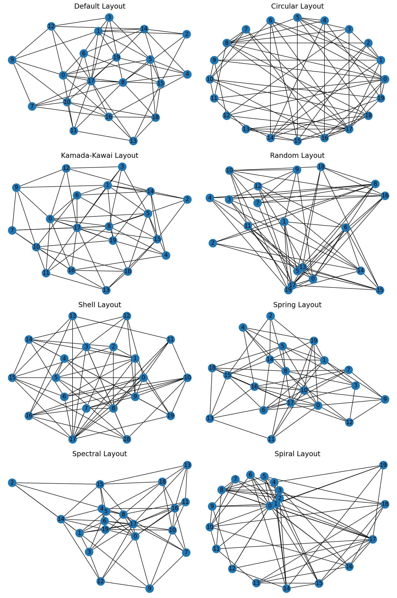

# 네트워크 분석 기법

네트워크 분석 기법은 분석 수준에 따라 아래와 같이 분류한다.

- **네트워크 수준 분석** : 네트워크 전체를 분석하는 기법으로 네트워크의 크기와 밀도 등의 분석 지표를 사용한다.

- **노드 수준 분석** : 네트워크 내의 노드와 노드들을 연결하는 엣지에 대해 분석하는 기법으로 **연결 정도**, **연결 강도**, **연결 거리**, **경로** 등의 분석 지표를 사용한다.

- **네트워크에 내재된 특성 분석** : 특정 노드들이 밀접하게 구성되는 **호혜성**(reciprocity), **전이성**(transitivity), **군집화 계수**(clustering coefficient) 등의 분석 지표를 사용한다.

- **중심성 분석** : 네트워크 내 노드들의 영향력 크기를 분석하는 방법으로 연결정도 **중심성**(degree centrality), **근접 중심성**(closeness centrality) 등의 분석 지표를 사용한다.

- **부분 집단 분석**: 전체 네트워크의 부분 집단을 구분하여 분석하는 방법이다.

- **에고 네트워크 수준 분석** : 특정한 에고를 중심으로 형성되는 네트워크를 분석하는 방법이다. 에고 네트워크는 한 노드를 중심에 두고 에고라 지칭하며 그 노드와 연결된 다른 노드들인 알터와의 관계를 표현한 네트워크이다. 에고 네트워크 분석은 전체 네트워크를 대상으로 분석하지 않고 에고와 알터들 간의 관계에 의한 연결 상황을 분석하는 것을 의미한다.
    + **에고(ego)** 는 초점 노드(focal node)를 의미하며, 에고와 연결된 노드를 **알터(alter)** 라고 부른다. 네트워크는 **1**개 이상의 에고를 가질 수 있다.
    + **알터(alter)** 란 에고(ego)라 불리는 중심 노드와 엣지로 직접 연결된 노드를 의미하며 자기 이외의 다른 사람이나 물체를 뜻하는 타자(他者) 노드라고도 가끔 부른다. 알터(alter)의 사전적인 의미는 (자기와 아주 비슷한) 절친한 친구를 뜻한다.

## 네트워크 수준 분석

**네트워크 크기**(network size)는 네트워크를 구성하는 전체 노드의 개수를 의미한다.
- **len**(G) : G 크기를 반환한다.
- G.**order**() : G 크기를 반환한다.

**밀도**(density)는 네트워크의 노드들 사이에 연결되는 정도를 의미한다.
- 밀도는 연결된 엣지수를 연결 가능한 전체 엣지의 수로 나눈 값이다. 
- 밀도는 **0**에서 **1** 사이의 값을 가지는데 **1**에 가까울수록 모든 노드가 서로 연결된 네트워크를 의미한다.
- networkx.**classes.function.density**(G) : G의 밀도를 반환한다.

**고립된 노드**(isolated node)는 다른 노드들과 연결되지 않은 노드를 의미한다. 
- networkx.**isolate.number_of_isolates**(G) : G의 고립된 노드 수를 반환한다.

**포괄성**(inclusivenss)은 네트워크 내의 전체 노드 수에서 고립된 노드의 수를 제외한 수 또는 비율을 의미한다. 포괄성은 절대적 포괄성과 상대적 포괄성으로 구분한다. 
- **절대적 포괄성** : **(전체 노드 수) - (고립된 노드 수)**
- **상대적 포괄성** : **(엣지로 연결된 노드 수) / (전체 노드 수)**

각각의 포괄성을 계산해주는 함수가 패키지 내에 자체적으로 구현되어있지 않기 때문에 전체 노드 수와 고립된 노드의 수를 패키지 내의 함수로 구한 후 이를 이용하여 계산한다.


다음 예는 네트워크의 크기를 반환하는 코드다.


```python
# 무방향 그래프를 네트워크로 생성한다.
g = __TODO__

# 5개의 엣지와 4개의 노드를 생성한다. 
__TODO__

print('노드 :', g.nodes)
print('엣지 :', g.edges)

# 네트워크의 크기를 반환한다.
print('네트워크 크기 :', __TODO__)
```

**실행 결과**  

<pre>
노드 : ['학교', '학생', '교직원', '학부모']
엣지 : [('학교', '학생'), ('학교', '교직원'), ('학교', '학부모'), ('학생', '교직원'), ('학생', '학부모')]
네트워크 크기 : 4
</pre>

다음 예는 네트워크의 밀도를 반환하는 코드다.


```python
# 무방향 그래프를 네트워크로 생성한다.
g = __TODO__

# 5개의 엣지와 4개의 노드를 생성한다. 
__TODO__

print('노드 :', g.nodes)
print('엣지 :', g.edges)

# 네트워크의 밀도를 반환한다.
print('네트워크 밀도 :', __TODO__)
```

**실행 결과**  

<pre>
노드 : ['학교', '학생', '교직원', '학부모']
엣지 : [('학교', '학생'), ('학교', '교직원'), ('학교', '학부모'), ('학생', '교직원'), ('학생', '학부모')]
네트워크 밀도 : 0.8333333333333334
</pre>

다음 예는 네트워크의 전체 노드 수와 고립된 노드의 수를 이용하여 포괄성 값을 계산하는 코드다.


```python
# 무방향 그래프를 네트워크로 생성한다.
g = __TODO__

# 9개의 노드와 를 추가한다.
__TODO__

# 5개의 엣지를 추가한다.
__TODO__

print('노드 :', g.nodes)
print('엣지 :', g.edges)

# 전체 노드 수를 변수 n에 할당한다.
n = __TODO__

# 고립된 노드 수를 변수 i에 할당한다.
i = __TODO__

# 절대적 포괄성 값을 계산한다. (전체 노드의 수) - (고립된 노드의 수)
print('절대적 포괄성 값 :', __TODO__) 

# 상대적 포괄성 값을 계산한다. (엣지로 연결된 노드의 수) / (전체 노드의 수)
print('상대적 포괄성 값 :', __TODO__) 
```

**실행 결과**  

<pre>
노드 : ['a', 'b', 'c', 'd', 'e', 'f', 'g', 'h', 'i']
엣지 : [('a', 'b'), ('b', 'c'), ('c', 'd'), ('d', 'e'), ('e', 'g')]
절대적 포괄성 값 : 6
상대적 포괄성 값 : 0.6666666666666666
</pre>

## 노드 수준 분석

네트워크 내의 노드와 노드들을 연결하는 엣지에 대한 분석 기법으로 연결 정도, 연결 강도, 연결 거리, 직경, 평균 연결 거리, 도달 가능성, 보행, 경로와 같은 분석 지표를 사용한다.

### 연결 정도

**연결 정도(degree)** 란?
- 네트워크에서 특정 노드에 직접 연결된 노드들의 개수를 의미하며 해당 노드의 영향력을 확인하는 지표가 된다. 
- 연결 정도가 높은 노드는 전체 네트워크에서 높은 영향력을 가지는 것을 의미한다.

연결 정도는 절대적 연결과 상대적 연결로 구분하는데 
- **절대적 연결**은 노드에 연결된 엣지의 수를 의미하며 
- **상대적 연결**은 노드에 연결된 엣지의 수를 정규화하여 계산한 값을 의미한다.

방향성 네트워크에서는 연결 정도를 내향 연결 정도와 외향 연결 정도로 구분한다. 
- **내향 연결 정도(in-degree)** 란 한 개의 특정 노드로 들어오는 엣지의 개수를 의미하며 **입력 차수**라고도 부른다.
- **외향 연결 정도((out-degree)** 란 한 개의 특정 노드에서 나가는 엣지의 개수를 의미하며 **출력 차수**라고도 부른다. 

연결 정도의 값에 따라 방향성 네트워크에서 특정 노드의 특성을 알 수 있다.
- **고립자(isolated node)** : 내향 연결 정도와 외향 연결 정도 모두 **0**이다. 앞에서 설명한 고립된 노드와 같은 용어로 연결된 엣지가 없는 노드를 의미한다.
- **전달자(transmitter)** : 내향 연결 정도는 **0**과 같으며 외향 연결 정도는 **0**보다 크다. 즉, 나가는 엣지만 있고 연결되어 들어오는 엣지는 없는 노드를 의미한다.
- **수신자(receiver)** : 내향 연결 정도는 **0**보다 크며 외향 연결 정도는 **0**과 같다. 즉, 연결되어 들어오는 엣지만 있고 나가는 엣지는 없는 노드를 의미한다.
- **매개자(carrier)** : 내향 연결 정도와 외향 연결 정도 모두 **0**보다 크다. 즉, 다른 노드로 연결되어 나가는 엣지도 있고 다른 노드에서 연결되어 들어오는 엣지도 있는 노드를 의미한다.

NetworkX에서는 방향성 네트워크의 연결 정도를 확인할 수 있다.
- G.**in_degree**() : G 안에 있는 모든 노드의 내향 연결 정도를 반환한다.
- G.**out_degree**(): G 안에 있는 모든 노드의 외향 연결 정도를 반환한다.

다음 예는 방향성 네트워크를 생성하고 각 노드들의 내향 연결 정도와 외향 연결 정도를 확인하는 코드다.


```python
# 방향성 그래프를 네트워크로 생성한다.
dg = __TODO__

# 5개의 노드와 5개의 엣지를 추가한다.
__TODO__

print('노드 :', dg.nodes)
print('엣지 :', dg.edges)

# 방향성 네트워크 dg의 모든 노드들의 내향 연결 정도를 확인한다.
print('각 노드들의 내향 연결정도 :', __TODO__) 
# 방향성 네트워크 dg의 모든 노드들의 외향 연결정도를 확인한다.
print('각 노드들의 외향 연결정도 :', __TODO__) 
```

**실행 결과**  

<pre>
노드 : ['a', 'b', 'c', 'd', 'e']
엣지 : [('a', 'b'), ('a', 'c'), ('a', 'd'), ('b', 'c'), ('d', 'e')]
각 노드들의 내향 연결정도 : [('a', 0), ('b', 1), ('c', 2), ('d', 1), ('e', 1)]
각 노드들의 외향 연결정도 : [('a', 3), ('b', 1), ('c', 0), ('d', 1), ('e', 0)]
</pre>

### 연결 강도

**연결 강도(strength)** 란?
- 가중 네트워크에서 두 노드를 연결하는 엣지의 강도로, 엣지 간 비교가 되는 가중치를 나타낸다.

연결 강도를 이용하여 노드 간 연결의 중요도를 확인할 수 있다. 연결 강도가 크면 **강한 연결(strong ties)**, 작으면 **약한 연결(weak ties)** 로 구분한다. 

비가중 네트워크에서의 엣지는 강도를 표시하지 않고 연결만 하기 때문에 일반적으로 연결 강도는 **1**이 된다.

### 연결 거리

**연결 거리(distance)** 란?
- 특정 노드 간 연결된 거리를 의미한다. 
- 시작 노드에서 도착 노드까지의 단계로 도착 할때까지 거쳐갸아 하는 **엣지의 개수**라고 할 수 있다. 
- 만약 노드 간 다양한 경로가 존재할 경우 연결 거리는 가장 짧은 거리인 최단 연결 거리를 표시한다.

NetworkX에서는 전체 네트워크에 대해 존재하는 모든 노드 간의 연결 거리를 확인할 수 있다.
- networkx.**all_pairs_shortest_path_length**(G) : 모든 노드 간의 연결 거리를 계산한다. 

계산한 연결 거리를 변수에 할당하고 딕셔너리를 이용하여 **dict**(*변수명*)으로 확인할 수 있다. 

다음 예는 무방향 네트워크를 생성하고 전체 노드 간의 연결 거리를 계산하는 코드다.


```python
# 무방향 그래프를 네트워크로 생성한다.
g = __TODO__

# 5개의 노드와 5개의 엣지를 추가한다.
__TODO__

print('노드 :', g.nodes)
print('엣지 :', g.edges)

# 모든 노드 간의 연결 거리를 계산하여 변수 length에 할당한다.
length = __TODO__

# 연결 거리를 확인한다.
print('연결 거리:\n', dict(length))
```

**실행 결과**  

<pre>
노드 : ['a', 'b', 'c', 'd', 'e']
엣지 : [('a', 'b'), ('a', 'c'), ('a', 'd'), ('b', 'c'), ('d', 'e')]
연결 거리 : {'a': {'a': 0, 'b': 1, 'c': 1, 'd': 1, 'e': 2},
           'b': {'b': 0, 'a': 1, 'c': 1, 'd': 2, 'e': 3},
           'c': {'c': 0, 'a': 1, 'b': 1, 'd': 2, 'e': 3},
           'd': {'d': 0, 'a': 1, 'e': 1, 'b': 2, 'c': 2},
           'e': {'e': 0, 'd': 1, 'a': 2, 'b': 3, 'c': 3}}
</pre>

### 직경

**직경(diameter)** 이란?
- 네트워크 내에서 가장 긴 연결 거리를 의미한다. 즉 전체 네트워크에서 가장 멀리 떨어진 두 노드의 거리이며 방향성 네트워크에서는 화살표 방향을 고려하여 계산한다.

NetworkX에서는 직경을 확인할 수 있다.
- networkx.**diameter**(G) : G의 직경을 반환한다.

다음 예는 무방향 네트워크를 생성하고 직경을 반환하는 코드다.


```python
# 무방향 그래프를 네트워크로 생성한다.
g = __TODO__

# 5개의 노드와 5개의 엣지를 추가한다.
__TODO__

print('노드 :', g.nodes)
print('엣지 :', g.edges)

# 네트워크의 직경을 확인한다.
print('직경 :', __TODO__) 
```

**실행 결과**  

<pre>
노드 : ['a', 'b', 'c', 'd', 'e']
엣지 : [('a', 'b'), ('a', 'c'), ('a', 'd'), ('b', 'c'), ('d', 'e')]
직경 : 3
</pre>

### 평균 연결 거리

**평균 연결 거리(average distance)** 란?
- 네트워크 내 모든 노드 간의 연결 거리에 대한 평균을 의미한다.

NetworkX에서는 평균 연결 거리를 계산해서 반환해준다.
- networkx.**average_shortest_path_length**(G) : G의 (가장 짧은) 평균 연결 거리를 반환한다.

다음 예는 무방향 네트워크를 생성하고 평균 연결 거리를 반환하는 코드다.


```python
# 무방향 그래프를 네트워크로 생성한다.
g = __TODO__

# 5개의 노드와 5개의 엣지를 추가한다.
__TODO__

print('노드 :', g.nodes)
print('엣지 :', g.edges)

# 네트워크의 평균 연결 거리를 확인한다.
print('평균 연결 거리 :', __TODO__) 
```

**실행 결과**  

<pre>
노드 : ['a', 'b', 'c', 'd', 'e']
엣지 : [('a', 'b'), ('a', 'c'), ('a', 'd'), ('b', 'c'), ('d', 'e')]
평균 연결 거리 : 1.7
</pre>

### 도달 가능성

**도달가능성(reachability)** 이란?
- 두 노드 간의 도달 가능 여부를 의미하며 주로 **0**과 **1**로 표시한다. 
    + **0**은 도달 불가능, 
    + **1**은 도달 가능을 의미한다. 

무방향 네트워크에서는 각 노드 간의 도달 가능 여부는 가능과 불가능 중 하나만 존재하지만 방향성 네트워크에서는 노드 **A**에서 노드 **B**로는 도달이 가능하지만 노드 **B**에서 노드 **A**로는 도달이 불가능할 수도 있다.

NetworkX에서는 네트워크 내의 특정 노드가 도달 가능한 모든 노드들을 확인할 수 있다.
- networkx.**descendants**(G,'*특정 노드*') : 네트워크 G 내의 '특정 노드'가 도달 가능한 노드들을 반환한다. 

다음 예는 무방향 네트워크를 생성하고 특정 노드가 도달 가능한 모든 노드를 반환하는 코드다.


```python
# 무방향 그래프를 네트워크로 생성한다.
g = __TODO__

# 5개의 노드와 5개의 엣지를 추가한다.
__TODO__

print('노드 :', g.nodes)
print('엣지 :', g.edges)

# 네트워크 g에서 노드 a가 도달 가능한 노드들을 반환한다.
print('네트워크 g에서 노드 a가 도달 가능한 노드들 :', __TODO__) 
```

**실행 결과**  

<pre>
노드 : ['a', 'b', 'c', 'd', 'e']
엣지 : [('a', 'b'), ('a', 'c'), ('a', 'd'), ('b', 'c'), ('d', 'e')]
네트워크 g에서 노드 a가 도달 가능한 노드들 : {'e', 'b', 'd', 'c'}
</pre>

### 보행

**보행(walk)** 이란?
- 두 노드 간에 존재하는 길로, 시작 노드에서 도착 노드로 도달하기 위해 거쳐가는 모든 노드들의 순서열을 의미한다. 
- 뒤에서 설명할 경로(path)와 달리 한번 거쳐간 엣지를 반복해서 거쳐갈 수 있다. 

임의의 두 노드에 대해 도달이 가능하면 보행은 존재하고 도달이 불가능하면 보행은 존재하지 않는다.
- **닫힌 보행(closed walk)** : 시작 노드와 도착 노드가 같은 보행을 의미한다.
- **사이클(cycle)**: **3**개 이상의 노드들 사이에 이루어진 닫힌 보행을 의미한다.
- **보행 길이** : 보행에 포함된 엣지의 개수다.

### 경로

**경로(path)** 란?
- 보행의 한 종류로, 엣지를 반복해서 거치지 않으면서 두 노드를 연결하는 거리를 의미한다.
    + **닫힌 경로(closed path)** : 시작 노드와 도착 노드가 동일한 경로를 의미한다.
    + **최단거리 경로(geodesics)** : 두 노드 간의 경로 중 최단 거리의 경로를 의미한다.

NetworkX에서는 네트워크 내의 특정 두 노드 간의 최단거리 경로를 계산할 수 있다.
- networkx.**all_shortest_paths**(G, '*노드1*', '*노드2*') : ***노드1***과 ***노드2*** 사이의 최단거리 경로를 계산한다.

계산한 결과를 변수에 할당하고 **list**(*변수명*)으로 확인할 수 있다.

다음 예는 무방향 네트워크를 생성하고 특정 두 노드간의 최단거리 경로를 계산하는 코드다.


```python
# 무방향 그래프를 네트워크로 생성한다.
g = __TODO__

# 5개의 노드와 5개의 엣지를 추가한다.
__TODO__

print('노드 :', g.nodes)
print('엣지 :', g.edges)

# 노드 a와 노드 e간의 최단거리 경로를 계산하고 결괏값을 변수 path_a_e에 할당한다.
path_a_e = __TODO__

# list(path_a_e)로 최단거리 경로를 확인한다.
print('노드 a와 노드 e 사이의 최단거리 경로 :', list(path_a_e)) 
```

**실행 결과**  

<pre>
노드 : ['a', 'b', 'c', 'd', 'e']
엣지 : [('a', 'b'), ('a', 'c'), ('a', 'd'), ('b', 'c'), ('d', 'e')]
노드 a와 노드 e 사이의 최단거리 경로 : [['a', 'd', 'e']]
</pre>

## 네트워크에 내재된 특성 분석

네트워크에 내재된 특성으로는 호혜성, 전이성, 군집화 현상 등이 있다.

### 호혜성

**호혜성(reciprocity)** 이란?
- 방향성 네트워크에서 두 노드 간 서로 왕복하는, 즉 양뱡향 연결의 대칭적 관계성을 나타내며 상호성이라고도 한다. 
    + 양방향으로 연결되면 **평형(equilibrium) 상태** 또는 **안정된(stable) 상태**라고 하며 
    + 단방향으로 연결되면 **불안정한(unstable) 상태**라고 한다.

네트워크의 호혜성 계산식은 계산하는 기준이 엣지인지 노드인지 등에 따라 다르다.

호혜성 계산식 **1**
- **(양방향으로 연결한 노드 쌍) / (연결 가능한 전체 노드 쌍)**
    + 이 때 연결 가능한 전체 노드 쌍은 **n(n-1) / 2**로 계산한다.
- 호혜성을 계산하는 기본 공식이다.

호혜성 계산식 **2**
- **(양방향으로 연결한 노드 쌍) / (실제 연결된 노드 쌍)**
- 이 공식은 UCINET 이라는 사회관계망 분석 프로그램에서 사용하는 공식이다.

호혜성 계산식 **3**
- **(양방향으로 연결한 엣지 수) / (연결 가능한 전체 엣지 수)**
- 노드 쌍을 기준으로 계산한 호혜성 계산식 1을 엣지 수 기준으로 적용하여 계산할 때 사용한다.
    + 예를 들어, 노드 **a**와 **b**가 있고 양방향으로(**a**에서 **b**로, **b**에서 **a**로) 연결이 되었다고 가정한다. '호혜성 계산식 **1**'과 '호혜성 계산식 **2**'는 노드를 기준으로 계산을 하므로 양방향으로 연결한 노드 쌍을 나누며 이 경우 한 개의 노드 쌍 **(a, b)** 를 연결 가능한 전체 노드 쌍 혹은 실제로 연결한 노드 쌍으로 나누게 된다. 반대로 호혜성을 엣지를 기준으로 계산할 때는 양방향으로 연결한 엣지 수를 나눈다. 이 때 두 노드는 두 개의 엣지로 양방향 연결이 되므로 양방향으로 연결한 엣지 수는 **2**가 되며 **2**를 연결 가능한 전체 엣지 수로 나누어 호혜성을 계산한다.
- NetworkX에서는 방향성 네트워크를 생성하고 직접 양방향으로 연결한 엣지 수와 연결 가능한 전체 엣지 수를 계산한다. 이 때, 양방향으로 연결한 엣지 수는 생성한 방향성 네트워크의 엣지 수를 무방향 네트워크로 변환했을 때의 엣지 수로 빼면 계산이 된다. 
  + 예를 들어, 방향성 네트워크에서 노드 **a**와 **b**를 양방향으로 연결하는 엣지 **(a, b)** 와 **(b, a)** 가 있을 때, 이 방향성 네트워크를 무방향 네트워크로 변환하면 **(a, b)** 라는 하나의 엣지가 되므로 두 경우에서의 엣지 수를 빼면 양방향으로 연결한 엣지 수를 계산할 수 있다.    
- 호혜성은 방향성 네트워크에서 양방향 연결의 대칭적 관계성을 보는 것이므로 양방향으로 연결한 엣지 수를 계산하기 위해 주어진 방향성 네트워크의 엣지 수와 무방향 네트워크로 변환했을 때의 엣지의 수를 사용하는 것이다. 반대로 무방향 네트워크를 방향성 네트워크로 변환하여 계산하지는 않는다.

호혜성 계산식 **4**
- **(양방향으로 연결한 엣지 수) / (실제 연결한 엣지 수)**
- 노드 쌍을 기준으로 계산한 '호혜성 계산식 **2**'를 엣지 수 기준으로 적용하여 계산할 때 사용한다.
- NetworkX에서는 networkx.**overall_reciprocity**(G) 또는 networkx.**reciprocity**(G)로 호혜성을 계산한다. 여기서 G는 전체 네트워크를 의미한다. 
    + networkx.**overall_reciprocity**(G)는 전체 네트워크(whole network)의 호혜성을 계산하고,
    + networkx.**reciprocity**(G)는 방향성 네트워크의 호혜성을 계산한다.
- 두 메소드 모두 네트워크의 호혜성을 계산하지만 networkx.**reciprocity**()는 특정 노드를 입력하여 노드의 호혜성을 계산할 수도 있다.
    + networkx.**reciprocity**(G, 노드)로 노드의 호혜성을 계산할 수 있다. 노드의 호혜성은 특정 노드를 다른 노드와 양방향으로 연결하는 엣지 수를 해당 노드에 실제로 연결한 엣지 수로 나누어 계산한다. 
    + 일반적으로 호혜성이라 하면 네트워크의 호혜성을 의미하는 것으로 노드의 호혜성은 잘 사용하지 않지만 networkx.**overall_reciprocity**()와 networkx.**reciprocity**()를 차별하는 기능이므로 여기에 소개한다.

다음 예는 방향성 네트워크를 생성하고 '호혜성 계산식 **3**'를 이용해 호혜성을 계산하는 코드다.


```python
# 방향성 그래프를 네트워크로 생성한다.
dg = __TODO__

# 4개의 노드와 9개의 엣지를 추가한다. 
__TODO__

print('노드 :', dg.nodes)
print('엣지 :', dg.edges)

# 전체 노드 수를 변수 n에 할당한다.
n = __TODO__

# 연결 가능한 전체 엣지 수를 계산한다.
e = __TODO__

# 무방향 네트워크일 떄의 엣지 수를 계산하기 위해 
# 방향성 네트워크를 무방향 네트워크로 변환한다.
# 방향성 네트워크를 무방향 네트워크로 변환하면 
# 양방향으로 연결하는 두 개의 엣지가 하나의 엣지로 바뀌게 된다.
g = dg.to_undirected() 

# 방향성 네트워크의 엣지 수를 변환한 무방향 네트워크의 엣지 수로 빼면 
# 양방향으로 연결한 엣지 수를 계산할 수 있다.
e2 = __TODO__ 

# 호혜성을 계산한다.
reciprocity = __TODO__
print('호혜성 :', reciprocity)
```

**실행 결과**  

<pre>
노드 : ['a', 'b', 'c', 'd']
엣지 : [('a', 'b'), ('a', 'c'), ('a', 'd'), ('b', 'a'), ('b', 'c'), ('b', 'd'), ('c', 'd'), ('d', 'a'), ('d', 'c')]
호혜성 : 0.5
</pre>

다음 예는 방향성 네트워크를 생성하고 '호혜성 계산식 **4**'를 이용해 호혜성을 계산하는 코드다.


```python
# 방향성 그래프를 네트워크로 생성한다.
dg = __TODO__

# 4개의 노드와 9개의 엣지를 추가한다. 
__TODO__

print('노드 :', dg.nodes)
print('엣지 :', dg.edges)

# networkx.overall_reciprocity()로 호혜성을 계산한다.
print('전체 네트워크 호혜성 :', __TODO__) 

# networkx.reciprocity()로 호혜성을 계산한다.
print('방향성 네트워크 호혜성 :', __TODO__) 
```

**실행 결과**  

<pre>
노드 : ['a', 'b', 'c', 'd']
엣지 : [('a', 'b'), ('a', 'c'), ('a', 'd'), ('b', 'a'), ('b', 'c'), ('b', 'd'), ('c', 'd'), ('d', 'a'), ('d', 'c')]
전체 네트워크 호혜성 : 0.6666666666666666
방향성 네트워크 호혜성 : 0.6666666666666666
</pre>

다음 예는 방향성 네트워크를 생성하고 노드의 호혜성을 계산하는 코드다.


```python
# 방향성 그래프를 네트워크로 생성한다.
dg = __TODO__

# 4개의 노드와 7개의 엣자를 추가한다.
__TODO__

print('노드 :', dg.nodes)
print('엣지 :', dg.edges)

# 노드의 호혜성을 계산한다.
print('각 노드의 호혜성 :', __TODO__)
```

**실행 결과**  

<pre>
노드 : ['a', 'b', 'c', 'd']
엣지 : [('a', 'b'), ('a', 'c'), ('b', 'a'), ('b', 'c'), ('b', 'd'), ('c', 'd'), ('c', 'a')]
각 노드의 호혜성 : {'a': 1.0, 
                'b': 0.5, 
                'c': 0.5, 
                'd': 0.0}
</pre>

### 전이성

**전이성(transitivity)** 이란?
- 세 노드 간 연결되는 관계를 파악하는 지표로서, 친구의 친구가 친구가 되는 경향이고 적의 적이 적이되는 경향이라고 할 수 있다.
- 예를 들어, **A**가 **C**와 친구이고(연결되고) **C**와 **B**가 친구면, **A**가 **B**를 몰라도(연결되지 않아도) **A**와 **B**가 서로 친구로 연결될 가능성이 높다.
- 전이성은 **이행성(移行性)** 또는 **추이성(推移性)** 이라고도 부른다. 

전체 네트워크에 대한 전이성의 계산식은 다음과 같다.
- **전이성 = (전이성이 있는 삼자관계의 수)/(모든 삼자관계의 수)**
    - 이 계산식은 방향성의 여부와 상관없이 모든 네트워크에 적용 가능하다.
    - NetworkX에서는 networkx.**transitivity**(G)를 사용하여 전이성을 계산할 수 있다. 

다음 예는 방향성 네트워크를 생성하고 전이성을 계산하는 코드다.


```python
# 방향성 그래프를 네트워크로 생성한다.
dg = __TODO__

# 4개의 노드와 10개의 엣지를 추가한다.
__TODO__

print('노드 :', dg.nodes)
print('엣지 :', dg.edges)

# 네트워크의 전이성을 계산한다.
print('전이성 :', __TODO__)
```

**실행 결과**  

<pre>
노드 : ['a', 'b', 'c', 'd']
엣지 : [('a', 'b'), ('a', 'c'), ('a', 'd'), ('b', 'a'), ('b', 'c'), ('b', 'd'), ('c', 'd'), ('d', 'a'), ('d', 'b'), ('d', 'c')]
전이성 : 0.7777777777777778
</pre>

### 군집화 계수

**군집화 계수(clustering coefficient)** 란?
- 네트워크의 특정 지역 내 노드들의 밀도가 다른 지역에 비해 높은 현상을 의미하는 군집화 현상을 측정하기 위해 사용하는 지표다. 
- 이 지표를 이용하여 특정 노드를 연결하는 이웃 노드들이 얼마나 밀도 있게 연결되어 있는지를 알 수 있다.
- 군집화 계수는 **군집 계수** 또는 **결속 계수**라고도 부르며 지역 군집화 계수와 전체 네트워크 군집화 계수로 구분할 수 있다. 
    + **지역 군집화 계수**는 한 노드 주변의 노드들이 얼마나 뭉쳐있는지를 계산하고 
    + **전체 네트워크 군집화 계수**는 전체 네트워크를 대상으로 계산한다. 
    + 일반적으로 **군집화 계수**라고 하면 **지역 군집화 계수**를 의미한다.

**지역 군집화 계수 = (특정 노드의 이웃 노드들 사이에서 실제로 존재하는 엣지 수)/(특정 노드의 이웃 노드들 사이에서 생길 수 있는 가능한 모든 엣지 수)**
- 예를 들어, 노드 **a, b, c, d**가 있고 **a** 와 **b**, **a** 와 **c**, **a** 와 **d**, **b** 와 **c**가 연결되어 있을 때 노드 **a**의 군집화 계수는 **0.333...** 이 된다. 이는 **a**의 이웃 노드들은 **b, c, d** 가 있으며 이웃 노드들 사이에서 생길 수 있는 가능한 모든 엣지의 수는 **(b,c), (b,d), (c,d)** 로 **3**이지만 실제로 존재하는 엣지는 **(b, c)** 뿐이므로 **1/3**이 된다.
- NetworkX에서는 networkx.**clustering**(G,'노드')로 그래프 내 특정 노드의 군집화 계수를 계산할 수 있다.

**전체 네트워크의 군집화 계수**
- 전체 네트워크 내 모든 노드들의 **지역 군집화 계수들의 평균**을 의미한다.
- 전체 네트워크의 군집화 계수를 NetworkX에서는 networkx.**average_clustering**(G)로 계산한다. 

다음 예는 무방향 네트워크를 생성하고 지역 군집화 계수를 계산하는 코드다.


```python
# 무방향 그래프를 네트워크로 생성한다.
g = __TODO__

# 4개의 노드와 4개의 엣지를 추가한다.
__TODO__

print('노드 :', g.nodes)
print('엣지 :', g.edges)

# 각 노드의 지약 군집화 계수를 계산한다.
print('노드 a의 군집화 계수:', __TODO__)
print('노드 b의 군집화 계수:', __TODO__)
print('노드 c의 군집화 계수:', __TODO__)
print('노드 d의 군집화 계수:', __TODO__)
```

**실행 결과**  

<pre>
노드 : ['a', 'b', 'c', 'd']
엣지 : [('a', 'b'), ('a', 'c'), ('a', 'd'), ('b', 'c')]
노드 a의 군집화 계수: 0.3333333333333333
노드 b의 군집화 계수: 1.0
노드 c의 군집화 계수: 1.0
노드 d의 군집화 계수: 0
</pre>

다음 예는 무방향 네트워크를 생성하고 전체 네트워크의 군집화 계수를 계산하는 코드다.


```python
# 무방향 그래프를 네트워크로 생성한다.
g = __TODO__

# 4개의 노드와 4개의 엣지를 추가한다.
__TODO__

print('노드 :', g.nodes)
print('엣지 :', g.edges)

# 전체 네트워크의 군집화 계수를 계산한다.
print('전체 네트워크의 군집화 계수 :', __TODO__)
```

**실행 결과**  

<pre>
노드 : ['a', 'b', 'c', 'd']
엣지 : [('a', 'b'), ('a', 'c'), ('a', 'd'), ('b', 'c')]
전체 네트워크의 군집화 계수 : 0.5833333333333333
</pre>

## 중심성 분석

**중심성(centraility)** 이란?

- 특정 노드가 가지는 영향력 또는 중요도를 보여주는 지표다. 
- 중심성의 유형에는 연결 중심성, 매개 중심성, 근접 중심성, 고유 벡터 중심성이 있으며 중심성 척도로 계산한 값은 절대적인 크기의 값이 아닌 네트워크 내에서 상대적인 순위를 나타내는 값이 된다.

### 연결 중심성

**연결 중심성(degree centrality)** 이란?

- 가장 기초적인 네트워크 측정 방법으로 주어진 노드의 엣지 수를 계산한다.
- 노드가 네트워크 내에서 얼마나 잘 연결되어 있는지 그리고 어느 정도 중심에 있는지를 측정하는 지표이며 높은 점수(즉, high degree centrality)는 노드의 중요한 자산으로 볼 수 있다.

연결 중심성에는 절대적 연결 중심성과 상대적 연결 중심성이 있다.

- **절대적 연결 중심성** : 특정 노드에 연결된 엣지의 개수를 계산한다.
- **상대적 연결 중심성** : 절대적 연결 중심성을 **(네트워크의 전체 노드 수 - 1**)로 나누어 **정규화**를 한다.

연결 중심성은 네트워크의 방향성 유무에 따라 계산하는 방법이 다르다.
- **무방향 네트워크** : 각 노드마다 단순히 엣지의 수를 이용하여 계산한다.
- **방향성 네트워크** : 노드가 엣지의 수 대신 연결 내향 중심 점수와 연결 외향 중심 점수를 이용하여 계산한다.
    + **연결 내향 중심 점수(indegree centrality scores)** : 한 개의 특정 노드로 들어오는 엣지의 개수를 의미한다.
    + **연결 외향 중심 점수(outdegree centrality scores)** : 한 개의 특정 노드에서 나가는 엣지의 개수를 의미한다.

NetworkX에서는 다음의 함수로 상대적 연결 중심성을 계산할 수 있다.

- networkx.centrality.**degree_centrality**(G) : 각 노드의 상대적 연결 중심성을 계산한다. 
- networkx.centrality.**in_degree_centrality**(G) : 각 노드의 상대적 연결 내향 중심성을 계산한다.
- networkx.centrality.**out_degree_centrality**(G) : 각 노드의 상대적 연결 외향 중심성을 계산한다.

다음 예는 무방향 네트워크를 생성하고 각 노드의 상대적 연결 중심성을 계산하는 코드다.


```python
# 무방향 그래프를 네트워크로 생성한다.
g = __TODO__

# 4개의 노드와 4개의 엣지를 추가한다.
__TODO__

print('노드 :', g.nodes)
print('엣지 :', g.edges)

# 각 노드의 상대적 연결 중심성을 계산한다.
print('연결 중심성 :', __TODO__)
```

**실행 결과**  

<pre>
노드 : ['a', 'b', 'c', 'd']
엣지 : [('a', 'b'), ('a', 'c'), ('a', 'd'), ('b', 'c')]
연결 중심성 : {'a': 1.0,
            'b': 0.6666666666666666,
            'c': 0.6666666666666666,
            'd': 0.3333333333333333}
</pre>

다음 예는 방향성 네트워크를 생성하고 각 노드의 상대적 연결 내향 중심성과 연결 외향 중심성을 계산하는 코드다.


```python
# 방향성 그래프를 네트워크로 생성한다.
dg = __TODO__

# 4개의 노드와 9개의 엣지를 추가한다.
__TODO__

print('노드 :', dg.nodes)
print('엣지 :', dg.edges)

# 각 노드의 연결 내향 중심성을 계산한다.
print('연결 내향 중심성 :', __TODO__)

# 각 노드의 연결 외향 중심성을 계산한다.
print('연결 외향 중심성 :', __TODO__)
```

**실행 결과**  

<pre>
노드 : ['a', 'b', 'c', 'd']
엣지 : [('a', 'b'), ('a', 'c'), ('a', 'd'), ('b', 'a'), ('b', 'c'), ('b', 'd'), ('c', 'd'), ('d', 'a'), ('d', 'b')]
연결 내향 중심성 : {'a': 0.6666666666666666, 
                'b': 0.6666666666666666, 
                'c': 0.6666666666666666, 
                'd': 1.0}
연결 외향 중심성 : {'a': 1.0, 
                'b': 1.0, 
                'c': 0.3333333333333333, 
                'd': 0.6666666666666666}
</pre>

### 매개 중심성

**매개 중심성(betweenness centrality)** 이란?
- 직접 연결되어 있지 않은 노드들 간의 관계를 통제 또는 중개하는 정도를 나타내는 지표이다.
- 특정 노드를 거쳐야만 얻을 수 있는 정보나 관계의 정도를 측정하기 때문에, 네트워크 안의 중개자로서 중요한 역할을 하는 노드도 측정할 수 있다.
- 한 노드가 다른 노드 쌍 간의 최단경로 상에 빈번히 등장할수록 높은 매개중심성을 나타낸다. 
  + 예를 들어, 사람들이 다른 사람들과 연결을 위해 나에게 의존할수록 네트워크 내에서 나의 중요성이 높아지는 것과 같다.

인접한 네트워크가 아닌 전체 네트워크를 대상으로 계산되며, 한 노드가 네트워크 내 다른 노드 쌍 간의 최단경로(횟수) 상에 위치할 경우 그 노드는 유리한 위치에 있다고 볼 수 있다.

매개 중심성에는 절대적 매개 중심성과 상대적 매개 중심성이 있다.

**절대적 매개 중심성**

- 노드 **i**의 절대적 매개 중심성은 두 노드 **j**와 **k**간의 최단경로 가운데 노드 **i**를 포함하고 있는 경로의 개수(분자)에서 두 노드 **j**와 **k**간의 최단경로(노드 **i**를 포함 한 것과 안 한 것 모두 포함)의 총 개수(분모)를 나눈 값을 비율로 나타낼 수 있으며, 이 비율을 모두 더한 값이 된다.
- **노드 i의 절대적 매개 중심성**
  + 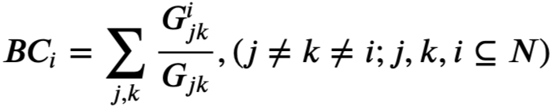
  + 위 수식에서 는 노드 **i**의 절대적 매개 중심성, *N*은 *n*개의 노드 집합, 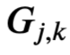는 노드 **j**와 **k** 사이에 존재하는 최단경로의 수, 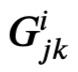는 노드 **j**와 **k** 사이에 존재하는 최단경로 중 노드 **i**를 포함하는 경로의 수를 의미한다.


**상대적 매개 중심성**
- 절대적 매개 중심성 값을 네트워크의 크기를 고려하여 정규화한 값이다.
- **노드 i의 상대적 매개 중심성**
  + 


NetworkX에서는 다음의 함수로 매개 중심성을 계산할 수 있다.
- networkx.**betweenness_centrality**(G): 각 노드의 매개 중심성을 계산한다.

다음 예는 무방향 네트워크를 생성하고 각 노드의 매개 중심성을 계산하는 코드다.


```python
# 무방향 그래프를 네트워크로 생성한다.
g = __TODO__

# 6개의 노드와 8개의 엣지를 추가한다.
__TODO__

print('노드 :', g.nodes)
print('엣지 :', g.edges)

# 네트워크의 매개 중심성을 계산한다.
print('매개 중심성:', networkx.betweenness_centrality(g))
```

**실행 결과**  

<pre>
노드 : ['a', 'b', 'c', 'd', 'e', 'f']
엣지 : [('a', 'b'), ('a', 'c'), ('a', 'd'), ('b', 'c'), ('c', 'd'), ('c', 'e'), ('c', 'f'), ('d', 'f')]
매개 중심성 : {'a': 0.05, 
            'b': 0.0, 
            'c': 0.6000000000000001, 
            'd': 0.05, 
            'e': 0.0, 
            'f': 0.0}
</pre>

### 근접 중심성

**근접 중심성(closeness centrality)** 이란?

- 네트워크 안에 각각의 다른 노드에게 접근하기 위해서 얼마나 많은 단계(노드)를 필요로 하는지를 측정한다.

근접 중심성은 특정 노드가 네트워크 안의 모든 노드와 직접적으로 연결되어 있을 때 주어진 네트워크에서 최대치에 도달하며, 특정 노드가 어느 다른 노드와도 연결되지 않았을 때 최저치에 도달한다.

근접 중심성은 네트워크의 사이즈에 민감하다.
- 네트워크가 점점 자라면서 네트워크 내의 특정 멤버가 네트워크의 모든 멤버들과 친밀한 관계를 유지하기가 점점 어려워지는 경향이 있다.
- 근접 중심성이 네트워크의 크기에 의해 과도하게 영향을 받을 경우, 각각의 노드들의 지표에 네트워크 내의 모든 노드의 수를 곱해줌으로써 그러한 영향을 어느 정도 상쇄할 수 있다.

근접 중심성에는 절대적 근접 중심성과 상대적 근접 중심성이 있다.    

**절대적 근접 중심성**  
- 노드 **i**에서 **i**를 제외한 다른 노드들까지의 최단경로의 길이(단위: 한 노드)를 모두 더한 값을 역수로 취해서 구한다.
- **노드 i의 절대적 근접 중심성**
  + 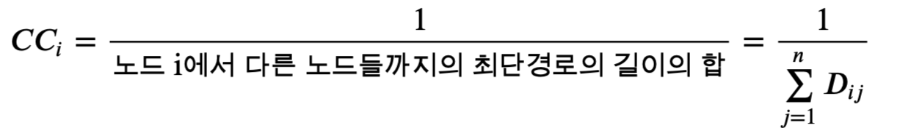
  + 위의 수식에서 는 노드 **i**의 절대적 근접 중심성, *n*은 네트워크 내 총 노드 개수, 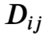는 노드 **i**부터 **i**를 제외한 다른 노드 **j**까지의 최단경로의 길이를 의미한다.

**상대적 근접 중심성**
- 절대적 근접 중심성 값을 정규화한 값이다.
- **노드 i의 상대적 근접 중심성**
  + 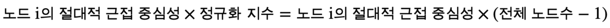

NetworkX에서는 다음의 함수로 상대적 근접 중심성을 계산할 수 있다.
- networkx.**closenss_centrality**(G): 각 노드의 상대적 근접 중심성을 계산한다.

다음 예는 무방향 네트워크를 생성하고 각 노드의 근접 중심성을 계산하는 코드다.


```python
# 무방향 그래프를 네트워크로 생성한다.
g = __TODO__

# 6개의 노드와 8개의 엣지를 추가한다.
__TODO__

print('노드 :', g.nodes)
print('엣지 :', g.edges)

# 네트워크의 근접 중심성을 계산한다.
print('근접 중심성 :', __TODO__)
```

**실행 결과**  

<pre>
노드 : ['a', 'b', 'c', 'd', 'e', 'f']
엣지 : [('a', 'b'), ('a', 'c'), ('a', 'd'), ('b', 'c'), ('c', 'd'), ('c', 'e'), ('c', 'f'), ('d', 'f')]
근접 중심성 : {'a': 0.7142857142857143, 
            'b': 0.625, 
            'c': 1.0, 
            'd': 0.7142857142857143, 
            'e': 0.5555555555555556, 
            'f': 0.625}
</pre>

### 고유벡터 중심성

**고유벡터 중심성(eigenvector centrality)** 이란?
- 한 노드가 네트워크 내에서 중요한 노드들과 얼마나 연결되어 있는지를 나타내며 **아이겐벡터 중심성** 또는 **연쇄 중심성**이라고도 부른다.

노드 ***i*** 의 **고유벡터 중심성** 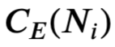는 단위 고유벡터 **e** 의 ***i*** 번째 요소다.
- 행렬 **A** 를 선형 변환(linear transformation)으로 봤을 때, 선형 변환 **A** 에 의한 변환 결과가 자기 자신의 상수배가 되는 **0** 이 아닌 벡터를 **고유벡터(eigenvector)** 라 하고 이 상수배 값을 **고유값(eigenvalue)** 이라 한다.
- **e** 는 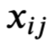를 요소로 갖는 **인접 행렬(adjacency matrix)** 의 가장 큰 고유값에 해당하는 고유벡터를 의미한다. 인접 행렬은 네트워크의 연결 관계를 이차원 배열로 나타내는 방식을 의미한다.
- **e**는 방정식 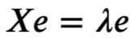를 풀어서 구한다.
  + 여기서 *e* 는 단위 벡터이기 때문에 *e*의 각 요소의 값은 벡터 내 각 요소의 제곱의 합이 **1** 이 되도록 정해진다. *X* 는 를 요소로 갖는 인접 행렬이다. 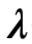는 여러가지 고유값(eigenvalue) 중 가장 큰 값을 선택하며, *e* 는 그 고유값에 해당하는 고유벡터가 된다. (선형대수 이론에 의해 하나의 정방 행렬에 여러 개의 고유값과 고유벡터가 존재할 수 있다.)
  + 예를 들어, *n* 개의 노드가 있는 네트워크 인접 행렬의 가장 큰 고유값에 해당하는 고유벡터를 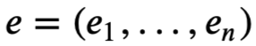이라 하면, ***i*** 번째 노드의 고유값은 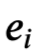가 된다. 

NetworkX에서는 다음의 함수로 고유벡터 중심성을 계산할 수 있다.
- networkx.**eigenvector_centrality**(G): 각 노드의 고유벡터 중심성을 계산한다.

다음 예는 무방향 네트워크를 생성하고 각 노드의 고유벡터 중심성을 계산하는 코드다.


```python
# 무방향 그래프를 네트워크로 생성한다.
g = __TODO__

# 6개의 노드와 8개의 엣지를 추가한다.
__TODO__

print('노드 :', g.nodes)
print('엣지 :', g.edges)

# 고유벡터 중심성을 계산한다.
print('고유벡터 중심성 :', __TODO__)
```

**실행 결과**  

<pre>
노드 : ['a', 'b', 'c', 'd', 'e', 'f']
엣지 : [('a', 'b'), ('a', 'c'), ('a', 'd'), ('b', 'c'), ('c', 'd'), ('c', 'e'), ('c', 'f'), ('d', 'f')]
고유벡터 중심성 : {'a': 0.4481191419315619, 
               'b': 0.337301210560978, 
               'c': 0.5785375120614861, 
               'd': 0.4481191419315618, 
               'e': 0.19007525645108347, 
               'f': 0.33730121056097795}
</pre>

# Lab: 네트워크 작성

- - - 

아래 그림과 같이 시각화한 네트워크를 작성하고 시각화한다.

**참고**: 네트워크를 작성하고 시각화를 할 때 매 출력마다 모양이 달라지므로 아래 그림과 같이 그대로 시각화되지 않을 수 있다.

_ _ _


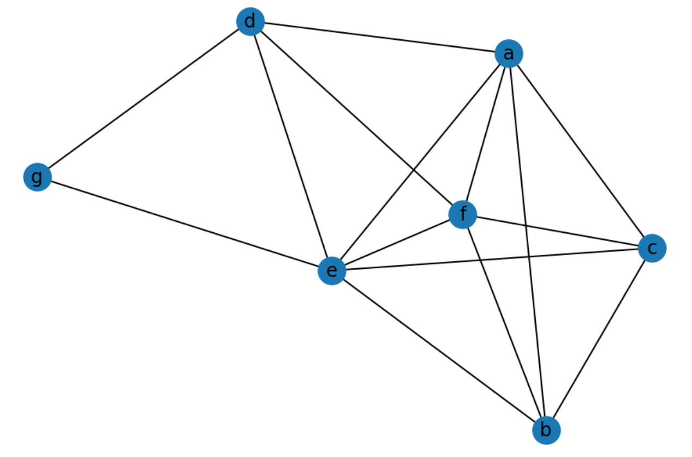

**실행 예**

<pre>>python nx.py
노드 : ['a', 'b', 'c', 'd', 'f', 'e', 'g']
엣지 : [('a', 'b'), ('a', 'c'), ('a', 'd'), ('a', 'f'), ('a', 'e'), ('b', 'c'), ('b', 'e'), ('b', 'f'), ('c', 'e'), ('c', 'f'), ('d', 'e'), ('d', 'f'), ('d', 'g'), ('f', 'e'), ('e', 'g')]
</pre>


```python
# Your answer here
```

# Lab: 네트워크 수준 분석

- - - 
위에서 작성한 네트워크를 이용하여 네트워크 수준 분석을 진행한다.
- 네트워크의 크기를 계산한다.
- 네트워크의 밀도를 계산한다.
- 절대적 포괄성 값과 상대적 포괄성 값을 계산한다.
_ _ _


**실행 예**

<pre>> python nx-network.py
네트워크의 크기 :     7
네트워크의 밀도 :     0.7142857142857143
절대적 포괄성 값 :    7
상대적 포괄성 값 :    1.0
</pre>


```python
# Your answer here
```

# Lab: 노드 수준 분석

- - - 
위에서 작성한 네트워크를 이용하여 노드 수준 분석을 진행한다.
- 전체 노드에 대해 연결 거리, 직경, 평균 연결거리를 계산한다.
- 노드 **a**와 **c**가 도달가능한 모든 노드들을 출력한다.
_ _ _


**실행 예**

참고: 딕셔너리이기 때문에 순서는 다를 수 있다.

<pre>> python nx-nodes.py
전체 노드간의 연결 거리 :
[('a', {'a': 0, 'b': 1, 'c': 1, 'd': 1, 'f': 1, 'e': 1, 'g': 2}), 
 ('b', {'b': 0, 'a': 1, 'c': 1, 'e': 1, 'f': 1, 'd': 2, 'g': 2}), 
 ('c', {'c': 0, 'a': 1, 'b': 1, 'e': 1, 'f': 1, 'd': 2, 'g': 2}), 
 ('d', {'d': 0, 'a': 1, 'e': 1, 'f': 1, 'g': 1, 'b': 2, 'c': 2}), 
 ('f', {'f': 0, 'a': 1, 'b': 1, 'c': 1, 'd': 1, 'e': 1, 'g': 2}), 
 ('e', {'e': 0, 'a': 1, 'b': 1, 'c': 1, 'd': 1, 'g': 1, 'f': 1}), 
 ('g', {'g': 0, 'e': 1, 'd': 1, 'a': 2, 'b': 2, 'c': 2, 'f': 2})]

네트워크의 직경 :                2
평균 연결거리 :                 1.2857142857142858
노드 a가 도달 가능한 모든 노드들 :  {'e', 'c', 'd', 'f', 'g', 'b'}
노드 c가 도달 가능한 모든 노드들 :  {'e', 'd', 'f', 'g', 'a', 'b'}
</pre>


```python
# Your answer here
```

# Lab: 중심성 분석

- - - 
위에서 작성한 네트워크를 이용하여 중심성 분석을 진행한다.
- 전체 노드에 대해 연결 중심성을 계산한다.
- 전체 노드에 대해 매개 중심성을 계산한다.
- 전체 노드에 대해 근접 중심성을 계산한다.
_ _ _


**실행 예**

참고: 딕셔너리이기 때문에 순서는 다를 수 있다.

<pre>> python nx-centrality.py
연결 중심성 : {'a': 0.8333333333333333,
            'b': 0.6666666666666666, 
            'c': 0.6666666666666666, 
            'd': 0.6666666666666666, 
            'f': 0.8333333333333333, 
            'e': 1.0, 
            'g': 0.3333333333333333}

매개 중심성 : {'a': 0.04444444444444444, 
            'b': 0.0, 
            'c': 0.0, 
            'd': 0.06666666666666667, 
            'f': 0.04444444444444444, 
            'e': 0.24444444444444444, 
            'g': 0.0}

근접 중심성 : {'a': 0.8571428571428571, 
            'b': 0.75, 
            'c': 0.75, 
            'd': 0.75, 
            'f': 0.8571428571428571, 
            'e': 1.0, 
            'g': 0.6}
</pre>


```python
# Your answer here
```

# Lab: 미국 주요 도시 간 거리를 표현하는 그래프 시각화

- - - 
다음 표를 참고하여 미국 주요 도시 간 거리를 표현하는 그래프를 작성한다.

|         	    | Atlanta 	| Boston 	| Chicago 	| Dallas 	| Denver 	|
|--------    	|---------:	|--------:	|---------:	|--------:	|--------:	|
| **Atlanta** 	|       	| 1095     	| 715    	| 805   	| 1437      |
| **Boston**  	| 1095    	|        	| 983     	| 1815   	| 1991   	|
| **Chicago** 	| 715     	| 983    	|         	| 931    	| 1050   	|
| **Dallas**  	| 805     	| 1815   	| 931     	|        	| 801    	|
| **Denver**  	| 1437    	| 1991   	| 1050    	| 801    	|        	|

- 도시들을 노드 리스트로 저장하고 완전한 그래프를 이용하여 작성한다.
- 도시간의 거리는 엣지의 가중치로 표시하지 않고 그래프를 시각화하는 과정에서 엣지의 라벨로 표시한다.
_ _ _


**실행 예**

참고: 딕셔너리이기 때문에 순서는 다를 수 있다.

<pre>> python nx-usa-cities.py</pre>

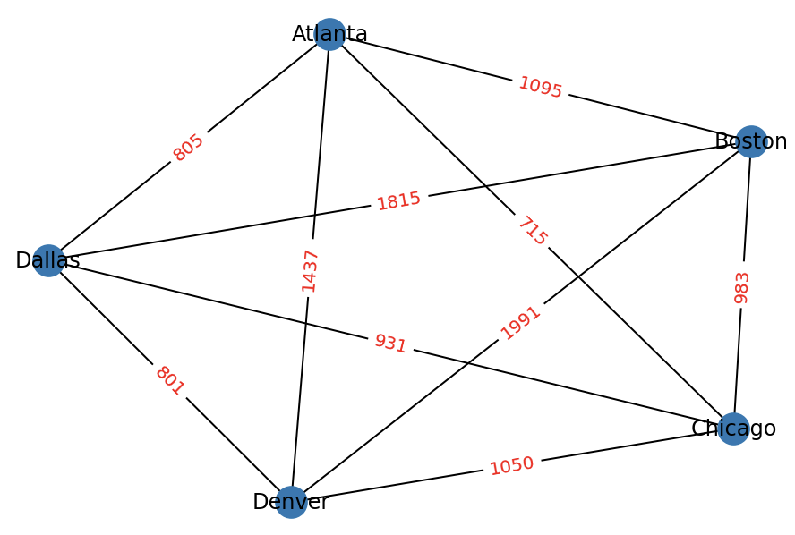


```python
# Your answer here
```

- - -

# THE END
