- - -

# 시각화 : seaborn

### Visualization : seaborn

* * *

**박 진 수** 교수  
Intelligent Data Semantics Lab  
Seoul National University

- - -

[credit: 김도훈(2019학번)]

<h3>Table of Contents<span class="tocSkip"></span></h3>
<div class="toc"><ul class="toc-item"><li><span><a href="#seaborn" data-toc-modified-id="seaborn-1">seaborn</a></span></li><li><span><a href="#seaborn-설치-및-불러오기" data-toc-modified-id="seaborn-설치-및-불러오기-2">seaborn 설치 및 불러오기</a></span></li><li><span><a href="#전처리" data-toc-modified-id="전처리-3">전처리</a></span><ul class="toc-item"><li><span><a href="#샘플-데이터-불러오기" data-toc-modified-id="샘플-데이터-불러오기-3.1">샘플 데이터 불러오기</a></span></li><li><span><a href="#불러온-데이터-열람하기" data-toc-modified-id="불러온-데이터-열람하기-3.2">불러온 데이터 열람하기</a></span></li></ul></li><li><span><a href="#막대-그래프" data-toc-modified-id="막대-그래프-4">막대 그래프</a></span><ul class="toc-item"><li><span><a href="#Lab:-타이타닉-데이터로-막대-그래프-그리기" data-toc-modified-id="Lab:-타이타닉-데이터로-막대-그래프-그리기-4.1">Lab: 타이타닉 데이터로 막대 그래프 그리기</a></span></li></ul></li><li><span><a href="#카운트-플롯" data-toc-modified-id="카운트-플롯-5">카운트 플롯</a></span><ul class="toc-item"><li><span><a href="#Lab:-타이타닉-데이터로-카운트-플롯-그리기(simple-version)" data-toc-modified-id="Lab:-타이타닉-데이터로-카운트-플롯-그리기(simple-version)-5.1">Lab: 타이타닉 데이터로 카운트 플롯 그리기(simple version)</a></span></li><li><span><a href="#Lab:-타이타닉-데이터로-카운트-플롯-그리기" data-toc-modified-id="Lab:-타이타닉-데이터로-카운트-플롯-그리기-5.2">Lab: 타이타닉 데이터로 카운트 플롯 그리기</a></span></li></ul></li><li><span><a href="#러그-플롯" data-toc-modified-id="러그-플롯-6">러그 플롯</a></span></li><li><span><a href="#커널-밀도-플롯" data-toc-modified-id="커널-밀도-플롯-7">커널 밀도 플롯</a></span></li><li><span><a href="#히스토그램" data-toc-modified-id="히스토그램-8">히스토그램</a></span><ul class="toc-item"><li><span><a href="#Lab:-타이타닉-데이터로-러그-플롯,-커널-밀도-플롯,-히스토그램-그리기" data-toc-modified-id="Lab:-타이타닉-데이터로-러그-플롯,-커널-밀도-플롯,-히스토그램-그리기-8.1">Lab: 타이타닉 데이터로 러그 플롯, 커널 밀도 플롯, 히스토그램 그리기</a></span></li></ul></li><li><span><a href="#박스-그래프" data-toc-modified-id="박스-그래프-9">박스 그래프</a></span><ul class="toc-item"><li><span><a href="#Lab:-타이타닉-데이터로-박스-그래프-그리기" data-toc-modified-id="Lab:-타이타닉-데이터로-박스-그래프-그리기-9.1">Lab: 타이타닉 데이터로 박스 그래프 그리기</a></span></li></ul></li><li><span><a href="#바이올린-플롯" data-toc-modified-id="바이올린-플롯-10">바이올린 플롯</a></span></li><li><span><a href="#스트립-플롯" data-toc-modified-id="스트립-플롯-11">스트립 플롯</a></span><ul class="toc-item"><li><span><a href="#Lab:-타이타닉-데이터로-스트립-플롯-그리기" data-toc-modified-id="Lab:-타이타닉-데이터로-스트립-플롯-그리기-11.1">Lab: 타이타닉 데이터로 스트립 플롯 그리기</a></span></li></ul></li><li><span><a href="#스웜-플롯" data-toc-modified-id="스웜-플롯-12">스웜 플롯</a></span><ul class="toc-item"><li><span><a href="#Lab:-타이타닉-데이터로-바이올린-플롯과-스웜-플롯-겹쳐-그리기" data-toc-modified-id="Lab:-타이타닉-데이터로-바이올린-플롯과-스웜-플롯-겹쳐-그리기-12.1">Lab: 타이타닉 데이터로 바이올린 플롯과 스웜 플롯 겹쳐 그리기</a></span></li></ul></li><li><span><a href="#산점도" data-toc-modified-id="산점도-13">산점도</a></span><ul class="toc-item"><li><span><a href="#Lab:-타이타닉-데이터로-산점도-그리기" data-toc-modified-id="Lab:-타이타닉-데이터로-산점도-그리기-13.1">Lab: 타이타닉 데이터로 산점도 그리기</a></span></li></ul></li><li><span><a href="#히트맵" data-toc-modified-id="히트맵-14">히트맵</a></span><ul class="toc-item"><li><span><a href="#피벗-테이블" data-toc-modified-id="피벗-테이블-14.1">피벗 테이블</a></span></li><li><span><a href="#Lab:-타이타닉-데이터로-히트맵-만들기" data-toc-modified-id="Lab:-타이타닉-데이터로-히트맵-만들기-14.2">Lab: 타이타닉 데이터로 히트맵 만들기</a></span></li></ul></li><li><span><a href="#조인트-플롯" data-toc-modified-id="조인트-플롯-15">조인트 플롯</a></span><ul class="toc-item"><li><span><a href="#Lab:-타이타닉-데이터로-조인트-플롯-그리기" data-toc-modified-id="Lab:-타이타닉-데이터로-조인트-플롯-그리기-15.1">Lab: 타이타닉 데이터로 조인트 플롯 그리기</a></span></li></ul></li><li><span><a href="#캣-플롯" data-toc-modified-id="캣-플롯-16">캣 플롯</a></span><ul class="toc-item"><li><span><a href="#Lab:-타이타닉-데이터로-캣-플롯-그리기(가로-모양의-바이올린)" data-toc-modified-id="Lab:-타이타닉-데이터로-캣-플롯-그리기(가로-모양의-바이올린)-16.1">Lab: 타이타닉 데이터로 캣 플롯 그리기(가로 모양의 바이올린)</a></span></li><li><span><a href="#Lab:-타이타닉-데이터로-캣-플롯-그리기-(세로-모양의-바이올린)" data-toc-modified-id="Lab:-타이타닉-데이터로-캣-플롯-그리기-(세로-모양의-바이올린)-16.2">Lab: 타이타닉 데이터로 캣 플롯 그리기 (세로 모양의 바이올린)</a></span></li></ul></li><li><span><a href="#페어-플롯" data-toc-modified-id="페어-플롯-17">페어 플롯</a></span><ul class="toc-item"><li><span><a href="#Lab:-다이아몬드-데이터로-페어-플롯-그리기" data-toc-modified-id="Lab:-다이아몬드-데이터로-페어-플롯-그리기-17.1">Lab: 다이아몬드 데이터로 페어 플롯 그리기</a></span><ul class="toc-item"><li><span><a href="#다이아몬드-데이터-불러오기" data-toc-modified-id="다이아몬드-데이터-불러오기-17.1.1">다이아몬드 데이터 불러오기</a></span></li><li><span><a href="#다이아몬드-데이터에-대한-설명" data-toc-modified-id="다이아몬드-데이터에-대한-설명-17.1.2">다이아몬드 데이터에 대한 설명</a></span></li></ul></li></ul></li><li><span><a href="#조인트-플롯-vs.-캣-플롯-vs.--페어-플롯" data-toc-modified-id="조인트-플롯-vs.-캣-플롯-vs.--페어-플롯-18">조인트 플롯 vs. 캣 플롯 vs.  페어 플롯</a></span></li><li><span><a href="#스타일" data-toc-modified-id="스타일-19">스타일</a></span></li></ul></div>

# seaborn

**seaborn**이란?

- matplotlib을 기반으로 다양한 색상 테마와 통계용 도표 등의 기능을 추가한 시각화 패키지다. 
- 기본적인 시각화 기능은 matplotlib 패키지를, 통계 기능은 statsmodels 패키지를 기반으로 한다.
- 아래의 링크에서 seaborn에 대해 더 자세히 찾아볼 수 있다.
    - https://seaborn.pydata.org/index.html


matplotlib과 비교했을때 여러 장점이 있다.

1. 시각적으로 더 보기 좋다. 
1. 데이터를 다루는 라이브러리인 판다스의 데이터프레임 기능을 제공하기 때문에 CSV 파일 등의 전체 데이터 세트에서 데이터를 불러와서 그릴 수 있다.
1. 보다 많은 차트와 색 테마들을 지원한다.
1. 그래프를 보다 쉽게 그려준다.
1. 데이터의 패턴이나 형상을 그리는데 장점을 보인다.


단점은 다음과 같다.
- matplotlib와의 호환성 문제로 matplotlib에서 작동하는 함수들이 seaborn에서 작동하지 않는 경우가 간혹 있다. 

# seaborn 설치 및 불러오기


```python
# --- seaborn 설치
!python -m pip install seaborn
# 또는 
# !pip install seaborn  
```


```python
# --- bs4 설치
# seaborn이 제공하는 샘플 데이터 세트의 정보를 웹에서 가져올 때 
# BeautifulSoup을 사용하기 때문에 시스템에 설치가 되어 있지 않다면 
# BeautifulSoup 패키지를 설치해야 한다.

# !python -m pip install bs4
```


```python
# --- seaborn과 관련 모듈 불러오기
# 주로 seaborn을 sns란 별칭으로 사용하지만 여기서는 seaborn으로 사용한다.
import seaborn  # as sns

# matplotlib도 함께 불러와야 한다.
from matplotlib import pyplot 

import numpy  # as np
import pandas  # as pd

# 마이너스 기호를 사용할 때 마이너스 기호가 깨지는 것을 방지하기 위해 아래 설정을 한다.
import matplotlib
matplotlib.rcParams['axes.unicode_minus'] = False

# --- searborn 버전 확인하기
seaborn.__version__
```


```python
# 폰트 설정 관련 모듈들을 불러온다.
from matplotlib import font_manager, rc
import platform

# 기본적인 한글 폰트가 설치 되었다고 가정하고 운영 시스템에 따라 기본 한글 폰트를 설정한다.
import platform
if platform.system() == 'Windows':  # 윈도우면
  rc('font', family='Malgun Gothic')
elif platform.system() == 'Darwin':  # macOS면
  rc('font', family='AppleGothic')
else:
  print('ERROR: 시스템 운영체제를 확인할 수 없어 한글 폰트 설정에 실패하였습니다.') 
```

# 전처리

## 샘플 데이터 불러오기

seaborn에서 제공하는 샘플 데이터 세트를 불러올 수 있다. 인터넷에 연결하여 아래 온라인 Repository에서 데이터 세트를 불러온다. 
- https://github.com/mwaskom/seaborn-data

seaborn.**get_dataset_names()** 로 사용할 수 있는 데이터 세트의 이름을 확인할 수 있다.


```python
# seaborn에서 제공하는 데이터 세트의 이름을 확인한다. 
# 총 15개의 데이터 세트를 제공하고 있다.
seaborn.get_dataset_names()
```


    ['anscombe',
     'attention',
     'brain_networks',
     'car_crashes',
     'diamonds',
     'dots',
     'exercise',
     'flights',
     'fmri',
     'gammas',
     'iris',
     'mpg',
     'planets',
     'tips',
     'titanic']


seaborn.get_dataset_names()를 실행할 때 만약 경고 메시지가 나오면 **seaborn**의 **utils.py**파일의 수정하면 이 문제를 해결할 수 있다. 

경고 메시지를 읽어보면 어디서 문제가 발생하는지, 그리고 어떻게 하면 문제를 해결할 수 있는지 그 해결법을 알려준다. 만약 HTML 파서(parser)를 설정해야 한다면 **seaborn**의 **utils.py** 파일을 수정하면 이 문제를 해결할 수 있다. 해당 파일을 열고 경고 메시지를 발생시키는 특정 라인을 수정하면 된다.

예를 들어, 만약 오류 메시지가 다음과 같다면

```
The code that caused this warning is on line 376 of the file /Users/.../python/venv/3.8ds/lib/python3.8/site-packages/seaborn/utils.py. To get rid of this warning, pass the additional argument 'features="lxml"' to the BeautifulSoup constructor.

  gh_list = BeautifulSoup(http)
```

여기서 지시하는대로 **gh_list = BeautifulSoup(http)** 를 **gh_list = BeautifulSoup(http, features='lxml')** 로 수정한 후 이 코드를 실행하면 경고 메시지가 발생하지 않는다.

코드를 수정하지 않고 경고 메시지가 출력되지 않도록 하려면 다음 코드를 실행하면 된다.


```python
# import warnings
# warnings.simplefilter(action='ignore')
```

데이터 세트를 불러오려면 **load_dataset()** 메소드를 __load_dataset(_name, cache=True, data_home=None, **kws_)__ 형식으로 사용한다.
- ***name*** 은 데이터 세트의 이름이다. 
- ***cache*** 는 **bool** 자료형으로 **True**면 데이터 세트를 로컬(local) 드라이브로 저장하여 사용한다.
- ***data_home*** 은 문자열을 입력받는데 데이터 세트를 로컬 드라이브에 저장되는 경로를 뜻한다. 기본값은 **~/seaborn-data/** 다.
- 더 자세한 내용은 아래의 링크에서 확인할 수 있다.
    - https://seaborn.pydata.org/generated/seaborn.load_dataset.html

[seaborn.load_dataset](https://seaborn.pydata.org/generated/seaborn.load_dataset.html)
- Load a dataset from the online repository (requires Internet).
- seaborn.**load_dataset**(_name, cache=True, data_home=None, **kws_)


```python
# 15개의 데이터 세트 중 붓꽃 데이터, 팁 데이터, 항공 데이터, 연비 데이터, 
# 타이타닉 생존 데이터를 불러와 로컬 드라이브 현재 폴더의 하위 폴더인 data에 저장한다.
# 하위 폴더 data가 없으면 자동을 해당 폴더를 만들고 데이터를 저장한다.
# 일단 저장하고 나면 해당 폴더에서 데이터를 불러온다.

iris = seaborn.load_dataset('iris', data_home='data')        # 붓꽃 데이터
tips = seaborn.load_dataset('tips', data_home='data')        # 팁 데이터
flights = seaborn.load_dataset('flights', data_home='data')  # 항공기 데이터
mpg = seaborn.load_dataset('mpg', data_home='data')          # 연비 데이터
titanic = seaborn.load_dataset('titanic', data_home='data')  # 타이타닉 생존 데이터
```

## 불러온 데이터 열람하기

불러온 데이터는 판다스의 데이터프레임(DataFrame) 형식으로 저장되어 있기 때문에 데이터의 이름으로 출력하면 데이터의 속성들 이름과 전체 데이터 중 처음 5줄과 마지막 5줄의 행, 그리고 전체 행과 열의 수를 확인할 수 있다.

뿐만 아니라 데이터를 다루는 라이브러리인 판다스의 데이터프레임 기능을 제공하기 때문에 불러온 데이터의 열람 및 확인이 가능하다.

**데이터를 부분 열람하기**  
데이터의 처음 *n*개의 행을 확인하려면 **head()** 메소드를 **head**(*n*) 형식으로 사용하면 된다.
- ***n*** 은 정수며 처음 *n* 개의 행을 출력해준다. 
- 음의 정수가 입력되면 마지막 *n* 개의 행을 제외한 나머지 행을 출력한다. 
- 기본값은 **5**로 처음 **5**개의 행을 출력한다.   
- 더 자세한 내용은 아래의 링크에서 확인할 수 있다.
    - https://pandas.pydata.org/pandas-docs/stable/reference/api/pandas.DataFrame.head.html#pandas.DataFrame.head

[pandas.DataFrame.head](https://pandas.pydata.org/pandas-docs/stable/reference/api/pandas.DataFrame.head.html#pandas.DataFrame.head)
- This function returns the first *n* rows for the object based on position. 
- pandas.DataFrame.**head**(*n*)
    - It is useful for quickly testing if your object has the right type of data in it.
    - For negative values of *n*, this function returns all rows except the last *n* rows, equivalent to **df[:-n]**


**데이터의 차원 형태를 확인하기**  
데이터의 행과 열의 수를 확인하려면 **shape** 속성을 사용한다.  

[pandas.DataFrame.shape](https://pandas.pydata.org/pandas-docs/stable/reference/api/pandas.DataFrame.shape.html#pandas.DataFrame.shape)
- Return a tuple representing the dimensionality of the DataFrame.
- *property* DataFrame.**shape**

**데이터의 속성값 저장하기**  
불러온 데이터 세트의 특정 열에 속한 모든 값을 변수로 저장할때는 **변수 = 데이터세트.속성이름.to_numpy()** 또는 **변수 = 데이터세트.속성이름.values**로 저장할 수 있다.


```python
# 붓꽃 데이터는 꽃과 관련된 속성들과 어떤 종류의 붓꽃인지를 기록한 데이터 세트다.
# sepal_length(꽃받침의 길이), sepal_width(꽃받침의 너비), 
# petal_length(꽃잎의 길이), petal_width(꽃잎의 너비), 
# species(꽃의 종류)로 총 5개의 속성을 가지고 있다.
print(iris)
```

         sepal_length  sepal_width  petal_length  petal_width    species
    0             5.1          3.5           1.4          0.2     setosa
    1             4.9          3.0           1.4          0.2     setosa
    2             4.7          3.2           1.3          0.2     setosa
    3             4.6          3.1           1.5          0.2     setosa
    4             5.0          3.6           1.4          0.2     setosa
    ..            ...          ...           ...          ...        ...
    145           6.7          3.0           5.2          2.3  virginica
    146           6.3          2.5           5.0          1.9  virginica
    147           6.5          3.0           5.2          2.0  virginica
    148           6.2          3.4           5.4          2.3  virginica
    149           5.9          3.0           5.1          1.8  virginica
    
    [150 rows x 5 columns]


```python
# 팁 데이터는 고객 정보와 고객의 청구서 금액 및 팁을 기록한 데이터 세트다.
# total_bill(전체 금액), tip(팁), sex(성별), smoker(흡연자 여부), 
# day(요일), time(시간), size(인원 수)로 총 7개의 속성을 가지고 있다.
print(tips.head(10))
```

       total_bill   tip     sex smoker  day    time  size
    0       16.99  1.01  Female     No  Sun  Dinner     2
    1       10.34  1.66    Male     No  Sun  Dinner     3
    2       21.01  3.50    Male     No  Sun  Dinner     3
    3       23.68  3.31    Male     No  Sun  Dinner     2
    4       24.59  3.61  Female     No  Sun  Dinner     4
    5       25.29  4.71    Male     No  Sun  Dinner     4
    6        8.77  2.00    Male     No  Sun  Dinner     2
    7       26.88  3.12    Male     No  Sun  Dinner     4
    8       15.04  1.96    Male     No  Sun  Dinner     2
    9       14.78  3.23    Male     No  Sun  Dinner     2


```python
# 항공기 데이터는 연도별 월별 승객 수를 기록한 데이터 세트다.
# year(연도), month(월), passengers(승객 수)로 총 3 개의 속성을 가지고 있다.
print(flights)
```

         year      month  passengers
    0    1949    January         112
    1    1949   February         118
    2    1949      March         132
    3    1949      April         129
    4    1949        May         121
    ..    ...        ...         ...
    139  1960     August         606
    140  1960  September         508
    141  1960    October         461
    142  1960   November         390
    143  1960   December         432
    
    [144 rows x 3 columns]


```python
# 연비 데이터는 자동차와 관련된 정보들을 기록한 데이터 세트다.
# mpg(연비), cylinders(실린더), displacement(배기량), horsepower(마력),
# weight(무게), accleration(가속), model_year(연식), origin(제조국가), 
# name(이름)으로 총 9개의 속성을 가지고 있다. 
mpg.shape
```


    (398, 9)


```python
# 타이타닉 생존 데이터는 탑승했던 사람들의 정보를 바탕으로 생존자를 예측할 때 사용하는 데이터 세트다.
# survived(생존여부), pclass(티켓 클래스), sex(성별), age(나이), sibsp(형제/약혼자의 수), 
# parch(부모/자녀의 수), fare(운임), embarked(정착지), class(클래스 등급) 등 15개의 속성을 가지고 있다.
print(titanic)
```

         survived  pclass     sex   age  sibsp  parch     fare embarked   class  \
    0           0       3    male  22.0      1      0   7.2500        S   Third   
    1           1       1  female  38.0      1      0  71.2833        C   First   
    2           1       3  female  26.0      0      0   7.9250        S   Third   
    3           1       1  female  35.0      1      0  53.1000        S   First   
    4           0       3    male  35.0      0      0   8.0500        S   Third   
    ..        ...     ...     ...   ...    ...    ...      ...      ...     ...   
    886         0       2    male  27.0      0      0  13.0000        S  Second   
    887         1       1  female  19.0      0      0  30.0000        S   First   
    888         0       3  female   NaN      1      2  23.4500        S   Third   
    889         1       1    male  26.0      0      0  30.0000        C   First   
    890         0       3    male  32.0      0      0   7.7500        Q   Third   
    
           who  adult_male deck  embark_town alive  alone  
    0      man        True  NaN  Southampton    no  False  
    1    woman       False    C    Cherbourg   yes  False  
    2    woman       False  NaN  Southampton   yes   True  
    3    woman       False    C  Southampton   yes  False  
    4      man        True  NaN  Southampton    no   True  
    ..     ...         ...  ...          ...   ...    ...  
    886    man        True  NaN  Southampton    no   True  
    887  woman       False    B  Southampton   yes   True  
    888  woman       False  NaN  Southampton    no  False  
    889    man        True    C    Cherbourg   yes   True  
    890    man        True  NaN   Queenstown    no   True  
    
    [891 rows x 15 columns]


# 막대 그래프

**seaborn**에서 막대 그래프는 수치형 값의 특정 집계(평균, 합계 등)를 동일한 너비의 여러 막대로 표시하고 각 막대 위에 오차 막대를 그려주는 그래프다.

막대 그래프를 작성하려면 **barplot()** 메소드를 주로 **barplot(*x=None, y=None, hue=None, data=None, order=None, estimator=<function mean at 0x10a2a03b0>, ci=95*)** 형식으로 사용하면 된다.

- ***x, y*** 에는 데이터의 변수명을 입력한다.
- ***hue*** 에도 데이터의 변수명을 입력하며 생성된 막대들을 입력한 변수의 범주에 따라 색으로 나눠준다.
- ***data***  는 입력하는 전체 데이터의 이름이다.
- ***order***는 입력한 범주형 변수의 범주들을 문자열의 리스트로 입력하여 각 범주가 그래프에 막대로 그려지는 순서를 설정한다.
- ***estimator*** 는 막대 그래프의 큰 막대들이 그려지는 기준을 설정한다. 기본값으로는 **mean**(평균)을 막대로 그리며 이외에 **sum**(합계), **max**(최댓값), **min**(최솟값) 등을 설정할 수 있다.
- ***ci*** 는 추정 값을 중심으로 하는 신뢰구간을 범주 별로 생성되는 큰 막대 위에 작은색 검은 막대로 표시해준다. 실수(**float**)를 입력하면 **실수%** 의 신뢰구간(confidence level)이 범주 별 막대 위에 그려진다. 기본값은 **95**로 추정 값이 **95**%의 확률로 존재할 것으로 기대되는 구간을 의미한다.  **'sd'** 를 입력하면 데이터 값들의 표준 편차(standard deviation)가 그려진다.
    - 표준 오차란 표본 평균들의 표준 편차를 의미한다.
    - 표준 편차란 모집단에 속한 숫자들이 모평균과 차이나는 정도를 의미한다.
    - 신뢰구간이란 이 구간 내에 실제 데이터가 존재할 것으로 예측되는 구간을 의미한다.
- 더 자세한 내용은 아래의 링크에서 확인할 수 있다.
    - https://seaborn.pydata.org/generated/seaborn.barplot.html

**barplot()** 메소드로 출력하는 도표는 하나이므로 x축과 y축을 라벨링할 때 **pyplot.xlabel()** 과 **pyplot.ylabel()** 을 호출하면 된다.

범주별로 생성되는 막대들의 눈금에 라벨을 붙이려면 **barplot()** 메소드가 반환하는 객체인 **AxesSubplot**을 새로운 변수로 할당하고 **set_xticklabels()** 을 사용한다.

[seaborn.barplot](https://seaborn.pydata.org/generated/seaborn.barplot.html)
- Show point estimates and confidence intervals as rectangular bars.
- seaborn.**barplot**(_x=None, y=None, hue=None, data=None, order=None, hue_order=None, estimator=<function mean at 0x10a2a03b0>, ci=95, n_boot=1000, units=None, seed=None, orient=None, color=None, palette=None, saturation=0.75, errcolor='.26', errwidth=None, capsize=None, dodge=True, ax=None, **kwargs_)
    - This is an Axes-level function and will draw the heatmap into the currently-active Axes if none is provided to the ax argument.
    - A bar plot represents an estimate of central tendency for a numeric variable with the height of each rectangle and provides some indication of the uncertainty around that estimate using error bars.
    - Bar plots include 0 in the quantitative axis range, and they are a good choice when 0 is a meaningful value for the quantitative variable, and you want to make comparisons against it.
    - For datasets where 0 is not a meaningful value, a point plot will allow you to focus on differences between levels of one or more categorical variables.
    - It is also important to keep in mind that a bar plot shows only the mean (or other estimator) value, but in many cases it may be more informative to show the distribution of values at each level of the categorical variables.
    - In that case, other approaches such as a box or violin plot may be more appropriate.
    - Input data can be passed in a variety of formats, including:
        - Vectors of data represented as lists, numpy arrays, or pandas Series objects passed directly to the x, y, and/or hue parameters.
        - A “long-form” DataFrame, in which case the x, y, and hue variables will determine how the data are plotted.
        - A “wide-form” DataFrame, such that each numeric column will be plotted.
        - An array or list of vectors.
    - In most cases, it is possible to use numpy or Python objects, but pandas objects are preferable because the associated names will be used to annotate the axes.
    - Additionally, you can use Categorical types for the grouping variables to control the order of plot elements.
    - This function always treats one of the variables as categorical and draws data at ordinal positions (0, 1, … n) on the relevant axis, even when the data has a numeric or date type

다음 예는 연비 데이터에서 생산 국가별 자동차의 평균 마력을 막대 그래프로 작성한 코드다.


```python
# --- 연비 데이터(mpg)에서 생산 국가별 자동차의 평균 마력을 막대 그래프로 작성한다.
# > 연비 데이터는 자동차와 관련된 정보들을 기록한 데이터 세트다.
# > mpg(연비), cylinders(실린더), displacement(배기량), horsepower(마력),
# > weight(무게), accleration(가속), model_year(연식), origin(제조국가), 
# > name(이름)으로 총 9개의 속성을 가지고 있다. 

# x='origin'으로 설정하여 x축을 범주형 변수인 생산 국가로,
# y='horsepower'로 설정하여 y축을 실숫값인 자동차 마력으로 설정한다.
# estimator를 설정하지 않았으므로 막대의 높이는 각 범주에 해당하는 값들의 평균이 된다.
# ci는 따로 설정하지 않아 기본값을 가지므로 95%의 신뢰구간을 오차 막대로 그린다.
# barplot이 반환하는 객체인 AxesSubplot을 'ax'라는 변수로 할당한다.
ax = seaborn.barplot(__TODO__)

# AxesSubplot.set_xticklabels()로 x축에 작성하는 범주들을 각각 미국, 일본, 유럽으로 라벨링한다.
ax.set_xticklabels(__TODO__)

pyplot.title('생산 국가별 자동차 평균 마력\n(막대 그래프 - 연비 데이터)')
pyplot.ylabel('자동차 마력 평균')
pyplot.xlabel('생산 국가')
pyplot.show()
```

**실행 결과**  

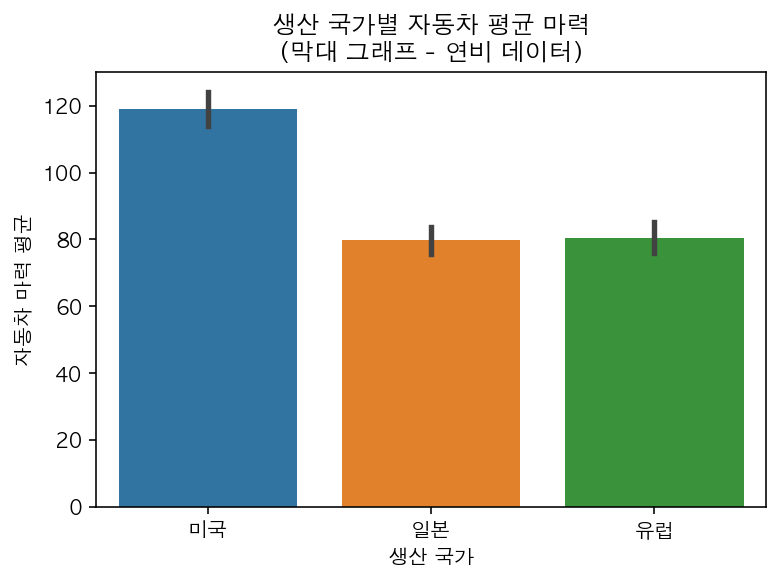

다음 예는 연비 데이터에서 생산 국가별 자동차의 마력 합계를 막대 그래프로 작성한 코드다


```python
# --- 연비 데이터(mpg)에서 생산 국가별 자동차의 마력 합계를 막대 그래프로 작성한다.
# > 연비 데이터는 자동차와 관련된 정보들을 기록한 데이터 세트다.
# > mpg(연비), cylinders(실린더), displacement(배기량), horsepower(마력),
# > weight(무게), accleration(가속), model_year(연식), origin(제조국가), 
# > name(이름)으로 총 9개의 속성을 가지고 있다. 

# x='origin'으로 설정하여 x축을 범주형 변수인 생산 국가로,
# y='horsepower'로 설정하여 y축을 실숫값인 자동차 마력으로 설정한다.
# estimator를 sum으로 설정하여 막대의 높이는 각 범주에 해당하는 값들의 합계가 되도록 한다.
# ci를 None으로 설정하여 오차 막대를 그리지 않는다.
# barplot이 반환하는 객체인 AxesSubplot을 'ax'라는 변수로 할당한다.
ax = seaborn.barplot(__TODO__)

# AxesSubplot.set_xticklabels()로 x축에 작성하는 범주들을 각각 라벨링한다.
ax.set_xticklabels(__TODO__)

pyplot.title('생산 국가별 자동차 마력 총 합계\n(막대 그래프 - 연비 데이터)')
pyplot.ylabel('자동차 마력 합계')
pyplot.xlabel('생산 국가')
pyplot.show()
```

**실행 결과**  

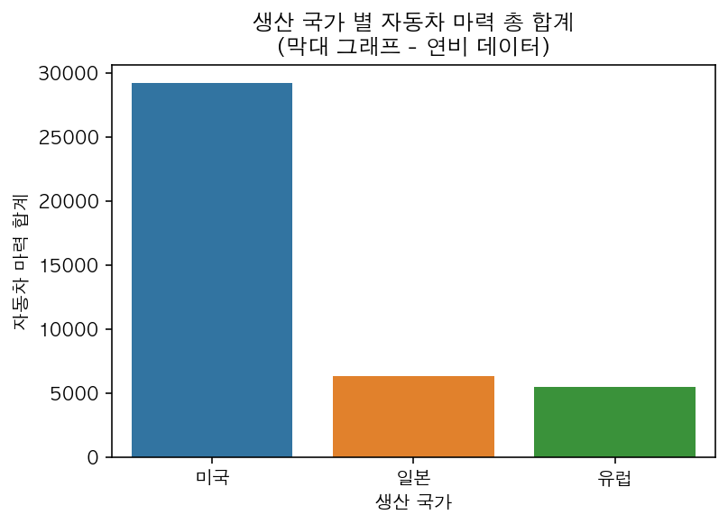

다음 예는 연비 데이터에서 생산 국가별 자동차의 평균 마력을 막대로 작성하되 각 막대를 실린더의 개수로 나누어 그리도록 하는 코드다.


```python
# --- 연비 데이터(mpg)에서 생산 국가별 자동차의 평균 마력을 실린더 개수 별로 나누어 막대 그래프로 작성한다.
# > 연비 데이터는 자동차와 관련된 정보들을 기록한 데이터 세트다.
# > mpg(연비), cylinders(실린더), displacement(배기량), horsepower(마력),
# > weight(무게), accleration(가속), model_year(연식), origin(제조국가), 
# > name(이름)으로 총 9개의 속성을 가지고 있다. 

# x='origin'으로 설정하여 x축을 범주형 변수인 생산 국가로,
# y='horsepower'로 설정하여 y축을 실숫값인 자동차 마력으로 설정한다.
# hue='cylinders'로 설정하여 생산 국가 별 막대가 실린더의 개수에 따라 작은 막대로 나눠지게 하였다.
# order=['europe', 'usa', 'japan']로 설정하여 막대의 순서를 미국, 일본, 유럽 순에서 유럽, 미국, 일본 순으로 변경하였다.
# estimator를 설정하지 않았으므로 막대의 높이는 각 범주에 해당하는 값들의 평균이 된다.
# ci는 90으로 설정하여 90%의 신뢰구간에서 오차 막대를 그린다.
# barplot이 반환하는 객체인 AxesSubplot을 'ax'라는 변수로 할당한다.
ax = seaborn.barplot(__TODO__)

# AxesSubplot.set_xticklabels()로 x축에 작성되는 범주들을 각각 라벨링한다.
ax.set_xticklabels(__TODO__)

# hue를 사용하여 작성하는 범례들을 라벨링하기 위해 AxesSubplot.get_legend_handles_labels()로 
# 범례와 범례 라벨을 반환하여 변수에 할당한다.
legend_colors, _ = ax.get_legend_handles_labels()

# AxesSubplot.legend()에 앞에서 범례를 저장한 변수를 입력하고 원하는 라벨 텍스트를 입력한다. 
# 매개변수 bbox_to_anchor=(1, 1)로 설정하여 범례를 막대 그래프 오른쪽에 위치시킨다.
ax.legend(legend_colors, __TODO__, 
          bbox_to_anchor=(1, 1))

pyplot.title('생산 국가별 실린더 개수 당 자동차 평균 마력\n(막대 그래프 - 연비 데이터)')
pyplot.ylabel('자동차 마력 평균')
pyplot.xlabel('생산 국가')
pyplot.show()
```

**실행 결과**  

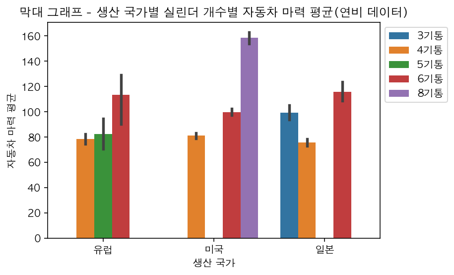

## Lab: 타이타닉 데이터로 막대 그래프 그리기

- - -
- 타이타닉 생존 데이터에서 클래스 등급(class)에 따른 생존자 수의 합계를 막대 그래프로 작성한다.

- 전체 도표의 제목과 x축, y축의 라벨을 적절한 내용으로 설정한다.

- x축 범주 눈금의 라벨도 설정한다.

- - -

**답**


```python
# Your answer here
```

# 카운트 플롯

카운트 플롯은 각 범주별로 데이터가 얼마나 있는지 나타낼 수 있다.

카운트 플롯을 작성하려면 **countplot()** 메소드를 주로 **countplot(*x=None, y=None, hue=None, data=None, color=None, palette=None*)** 형식으로 사용하면 된다.

- ***x***, ***y***, ***hue*** 는 데이터의 열 이름(변수명) 문자열이다. 
    + ***x*** 와 ***y*** 는 동시에 입력할 수 없다. 
    + ***x*** 만 입력하면 세로로 막대가 그려지고 ***y*** 만 입력하면 가로로 막대가 그려진다. 
    + ***hue*** 를 같이 사용하면 범례가 생성되며 다른 범주와 함께 비교할 수 있다.
- ***data*** 는 입력하는 전체 데이터 값이다.
- ***color*** 는 막대의 색상을 설정한다.
- ***palette*** 는 **color**를 지정하지 않았을 때 자동으로 칠하는 색상 순서를 설정한다. 기본값으로는 파랑, 주황, 초록, 빨강 등의 순서로 칠해지는데 *'Set3'* 등으로 설정할 수 있다.
    - https://seaborn.pydata.org/generated/seaborn.color_palette.html#seaborn.color_palette
    - 'Set3'은 **seaborn**이 제공하는 palette 중 하나다. palette는 사용자가 임의로 만들 수도 있지만 기본적으로 제공하는 palette가 몇 개 있는데, 'Set1', 'Set2', 'Set3', 'Blues', 'Paired' 등이 여기에 해당한다.
        - https://seaborn.pydata.org/tutorial/color_palettes.html#palette-tutorial 
        - http://colorbrewer2.org/#type=sequential&scheme=BuGn&n=3
- 더 자세한 내용은 아래의 링크에서 확인할 수 있다.
    - https://seaborn.pydata.org/generated/seaborn.countplot.html

**countplot()** 메소드로 출력하는 도표는 하나이므로 x축과 y축을 라벨링할 때 **pyplot.xlabel()** 과 **pyplot.ylabel()** 을 호출하면 된다.

[seaborn.countplot](https://seaborn.pydata.org/generated/seaborn.countplot.html)
- Show the counts of observations in each categorical bin using bars.
- seaborn.**countplot**(_x=None, y=None, hue=None, data=None, order=None, hue_order=None, orient=None, color=None, palette=None, saturation=0.75, dodge=True, ax=None, **kwargs_)
    - A count plot can be thought of as a histogram across a categorical, instead of quantitative, variable. 
    - The basic API and options are identical to those for barplot(), so you can compare counts across nested variables
    - Input data can be passed in a variety of formats, including:
        - Vectors of data represented as lists, numpy arrays, or pandas Series objects passed directly to the x, y, and/or hue parameters.
        - A “long-form” DataFrame, in which case the x, y, and hue variables will determine how the data are plotted.
        - A “wide-form” DataFrame, such that each numeric column will be plotted.
        - An array or list of vectors.

다음 예는 팁 데이터의 요일 데이터와 성별 데이터로 요일별 방문한 고객 성별 거래 건수를 카운트 플롯을 작성한 코드다.


```python
# --- 팁 데이터(tips)에서 요일별 방문한 고객 성별 거래 건수를 카운트 플롯을 작성한다.
# > 팁 데이터는 고객 정보와 고객의 청구서 금액 및 팁을 기록한 데이터 세트다.
# > total_bill(전체 금액), tip(팁), sex(성별), smoker(흡연자 여부), 
# > day(요일), time(시간), size(인원 수)로 총 7개의 속성을 가지고 있다.

# x='day'로 설정하여 x축을 범주형 변수인 요일로,
# hue='sex'로 설정하여 고객을 성별로 구분한다. 
# 팁 데이터에서 x축을 요일로 설정하고 고객의 성별을 범례로 표시한다.
# y축은 팁을 포함한 전체 식사료, 즉 총 금액을 지불한 행위인 거래 건수를 뜻하며
# 지불 주체가 여성인지 남성인지를 구분하여 보여준다.
# countplot이 반환하는 객체인 AxesSubplot을 'ax' 라는 변수로 할당한다.
ax = seaborn.countplot(__TODO__)

# AxesSubplot.set_xticklabels()로 x축에 작성하는 범주들을 각각 라벨링한다.
ax.set_xticklabels(__TODO__)

pyplot.title('요일별 방문한 고객 성별 거래 건수\n(카운트 플롯 - 팁 데이터)')
pyplot.ylabel('거래 건수')
pyplot.xlabel('요일') 
pyplot.show()
```

**실행 결과**  

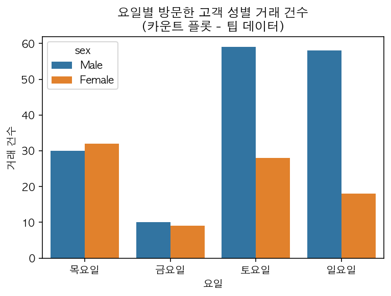

## Lab: 타이타닉 데이터로 카운트 플롯 그리기(simple version)

- - - 

- 타이타닉 생존 데이터에서 좌석의 클래스 등급(class)에 따른 생존 여부(survived)에 따라 색상을 구분하여 사망자와 생존자의 수를 카웃트 플롯으로 작성한 도표를 보여준다.

- 전체 도표의 제목과 x축, y축의 라벨을 적절한 내용으로 설정한다. 

- 코드를 단순하게 하기 위해 ***hue*** 로 생성하는 범례의 범주를 한글로 라벨을 설정하지 않고 자동으로 생성되는 라벨을 그대로 사용한다.


**[참고]**
survived 값 중
- **0**은 사망
- **1**은 생존  
을 의미한다.

- - -

**답**


```python
# Your answer here
```

## Lab: 타이타닉 데이터로 카운트 플롯 그리기

- - - 

- 타이타닉 생존 데이터에서 좌석의 클래스 등급(class)에 따른 생존 여부(survived)에 따라 색상을 구분하여 사망자와 생존자의 수를 카웃트 플롯으로 작성한 도표를 보여준다.

- 전체 도표의 제목과 x축, y축의 라벨을 적절한 내용으로 설정한다. 

- ***hue*** 로 생성하는 범례의 범주로 한글로 라벨을 설정한다.

**[참고]**
survived 값 중
- **0**은 사망
- **1**은 생존을 의미한다.

- - -

**답**


```python
# Your answer here
```

# 러그 플롯

러그 플롯은 데이터 위치를 x축 위에 작은 막대로 나타내어 실제 데이터들의 분포를 시각화한다.

러그 플롯을 작성하려면 **rugplot()** 메소드를 주로 **rugplot(*a, height=0.05, axis='x'*)** 형식으로  사용하면 된다.
- ***a*** 는 입력하는 데이터 값이다. 1차원 배열(1D Arrary) 형태를 가진다.
- ***height*** 는 막대의 길이를, 
- ***axis*** 는 러그 플롯을 그리는 축을 설정한다. **'x'** 와 **'y'** 중 하나를 받으며 기본값은 **'x'** 로 *x*축에 러그 플롯을 그린다.
- 더 자세한 내용은 아래의 링크에서 확인할 수 있다.
    - http://seaborn.pydata.org/generated/seaborn.rugplot.html

**rugplot()** 메소드로 출력하는 도표는 하나이므로 x축과 y축을 라벨링할 때 **pyplot.xlabel()** 과 **pyplot.ylabel()** 을 호출하면 된다.

[seaborn.rugplot](http://seaborn.pydata.org/generated/seaborn.rugplot.html)
- Plot datapoints in an array as sticks on an axis.
- seaborn.**rugplot**(_a, height=0.05, axis='x', ax=None, **kwargs)_

다음 예는 연비 데이터의 배기량 값을 러그 플롯으로 작성한 코드다.


```python
mpg.displacement
```


    0      307.0
    1      350.0
    2      318.0
    3      304.0
    4      302.0
           ...  
    393    140.0
    394     97.0
    395    135.0
    396    120.0
    397    119.0
    Name: displacement, Length: 398, dtype: float64


```python
# --- 연비 데이터(mpg)로 배기량 값을 러그 플롯으로 작성한다.
# > 연비 데이터는 자동차와 관련된 정보들을 기록한 데이터 세트다.
# > mpg(연비), cylinders(실린더), displacement(배기량), horsepower(마력),
# > weight(무게), accleration(가속), model_year(연식), origin(제조국가), 
# > name(이름)으로 총 9개의 속성을 가지고 있다. 

# 배기량(displacement) 분포를 보여준다.
seaborn.rugplot(__TODO__)

pyplot.title('자동차 배기량\n(러그 플롯 - 연비 데이터)')
pyplot.xlabel('자동차 배기량(단위: 세제곱 인치(cubic inch))')
pyplot.show()
```

**실행 결과**  

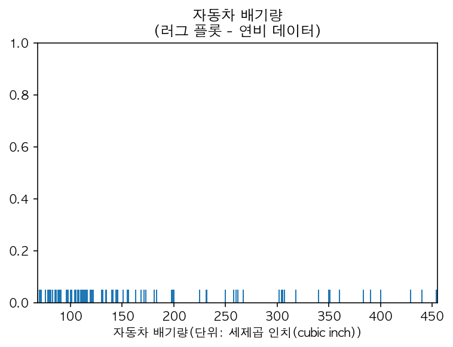

다음 예는 막대의 길이를 **0.5**로 설정한 코드다. 막대의 최댓값은 **1**이다.


```python
# --- 연비 데이터(mpg)로 배기량 값을 러그 플롯으로 작성한다.
# > 연비 데이터는 자동차와 관련된 정보들을 기록한 데이터 세트다.
# > mpg(연비), cylinders(실린더), displacement(배기량), horsepower(마력),
# > weight(무게), accleration(가속), model_year(연식), origin(제조국가), 
# > name(이름)으로 총 9개의 속성을 가지고 있다. 

# 배기량(displacement) 분포를 보여준다.
# y축 막대의 길이를 기본값인 0.05 대신 0.5로 설정한다. 최댓값은 1이다.
seaborn.rugplot(__TODO__)

pyplot.title('자동차 배기량\n(러그 플롯 - 연비 데이터)')
pyplot.xlabel('자동차 배기량(단위: 세제곱 인치(cubic inch))')
pyplot.show()
```

**실행 결과**  

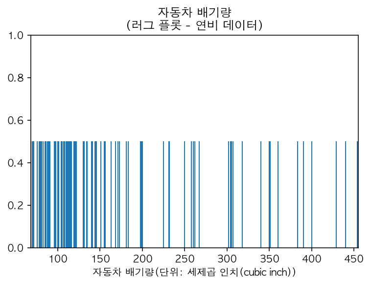

# 커널 밀도 플롯

커널(kernel)이라는 함수를 겹치는 방법으로 히스토그램보다 부드러운 형태의 분포 곡선을 시각화한다. 

히스토그램은 데이터의 밀도를 간단한 형태로 표현해주는 그래프로서 모양이 막대(bin)의 시작점과 폭에 의존하며 추정한 밀도가 불연속적이라 매끄럽지 못한 경우가 있다. 커널 밀도 플롯은 커널 함수를 사용하여 이런 단점들을 완화한다.

**[참고]**  
커널 함수란 확률 분포를 나타내기에 적합한 함수로서 원점을 중심으로 대칭이고, 적분이 **1**인 양의 함수를 뜻한다. 
- 커널 함수에는 가우시안(Gaussian), 코사인(Cosine), Epanechnikov, uniform 등이 있는데, **seaborn**에서는 기본값으로 가우시안 커널 함수를 사용한다.

커널 밀도 플롯을 작성하려면 **kdeplot()** 메소드를 주로 **kdeplot(*data, data2=None, shade=False, vertical=False, kernel='gau'*)** 형식으로 사용하면 된다.
- ***data*** 는 입력하는 데이터 값이다. 1차원 배열(1D Arrary) 형태를 가진다.
- ***data2*** 도 입력하는 데이터 값이다. 1차원 배열(1D Arrary) 형태를 가지는데 두 개 변수를 가지는 커널 밀도 플롯을 그릴 때 설정한다.
- ***shade*** 는 **bool** 자료형을 입력하여 곡선 아래의 공간을 음영 처리할지 설정하며, 기본값은 **False**로 음영 처리를 하지 않는다.
- ***vertical*** 은 **bool** 자료형을 입력하여 커널 밀도를 표현하는 축을 설정한다. 기본값은 **False**로 y축에 커널 밀도를 표현한다.
- ***kernel*** 은 그려지는 커널 밀도의 형태를 설정한다. **{'gau' &#124; 'cos' &#124; 'biw' &#124; 'epa' &#124; 'tri' &#124; 'triw' }** 중 하나를 선택하며 기본값은 **'gau'** 다.
- 더 자세한 내용은 아래의 링크에서 확인할 수 있다.
    - https://seaborn.pydata.org/generated/seaborn.kdeplot.html

**kdeplot()** 메소드로 출력하는 도표는 하나이므로 x축과 y축을 라벨링할 때 **pyplot.xlabel()** 과 **pyplot.ylabel()** 을 호출하면 된다.

[seaborn.kdeplot](https://seaborn.pydata.org/generated/seaborn.kdeplot.html)
- Fit and plot a univariate or bivariate kernel density estimate.
- seaborn.**kdeplot**(_data, data2=None, shade=False, vertical=False, kernel='gau', bw='scott', gridsize=100, cut=3, clip=None, legend=True, cumulative=False, shade_lowest=True, cbar=False, cbar_ax=None, cbar_kws=None, ax=None, **kwargs_)

다음 예는 연비 데이터의 실린더 값을 커널 밀도 플롯으로 작성한 코드다.


```python
mpg.cylinders
```


    0      8
    1      8
    2      8
    3      8
    4      8
          ..
    393    4
    394    4
    395    4
    396    4
    397    4
    Name: cylinders, Length: 398, dtype: int64


```python
# --- 연비 데이터(mpg)로 실린더 값을 커널 밀도 플롯으로 작성한다.
# > 연비 데이터는 자동차와 관련된 정보들을 기록한 데이터 세트다.
# > mpg(연비), cylinders(실린더), displacement(배기량), horsepower(마력),
# > weight(무게), accleration(가속), model_year(연식), origin(제조국가), 
# > name(이름)으로 총 9개의 속성을 가지고 있다. 

# 자동차 실린더 개수('cylinders') 분포를 확률 밀도로 보여준다.
# shade=True로 설정하여 곡선 아래의 공간을 음영 처리한다.
seaborn.kdeplot(__TODO__)

pyplot.title('자동차 실린더 개수\n(커널 밀도 플롯 - 연비 데이터)')
pyplot.ylabel('확률 밀도')
pyplot.xlabel('자동차 실린더 개수') 
pyplot.show()
```

**실행 결과**  

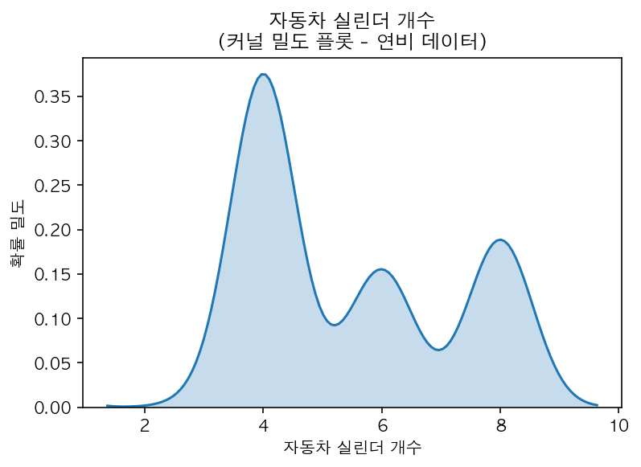

# 히스토그램

히스토그램은 도수분포표를 시각적으로 표현한 막대 그래프다. 즉, 특정 구간에 속하는 자료의 개수를 나타내는 빈도표(frequency table)인 도수분포표를 시각화한 도형으로 비교할 양이나 수치에 대한 구간별 빈도수를 막대 모양의 도형으로 나타낸 그래프다.

히스토그램을 작성하려면 **distplot()** 메소드를 주로 **distplot(*a, bins=None, hist=True, kde=True, rug=False, norm_hist=False*)** 형식으로 사용하면 된다.
- ***a*** 는 입력하는 데이터 값이다. 1차원 배열(1D Array), 리스트(list), 또는 시리즈(series)형태를 가진다.
- ***bins*** 는 구간 수, 즉 도형에 들어갈 막대의 개수다. 설정하지 않으면 유용한 결과를 가지도록 자동으로 설정된다.
- ***hist*** 에는 **bool** 자료형을 입력하여 히스토그램을 그릴지 설정한다. 기본값은 **True**로 히스토그램을 그린다.
- ***kde*** 에는 **bool** 자료형을 입력하여 커널 밀도 플롯을 그릴지 여부를 설정한다. 기본값은 **True**로 커널 밀도 플롯으로 그린다.
- ***rug*** 에는 **bool** 자료형을 입력하여 러그 플롯으로 그릴지 여부를 설정한다. 기본값은 **False**로 러그 플롯으로 그리지 않는다.
- ***norm_hist*** 에는 **bool** 자료형을 입력하여 히스토그램의 막대가 자료의 개수가 아닌 확률 밀도를 의미할지 여부를 설정한다. 기본값은 **False**로 막대는 자료의 개수를 의미한다. 만약 커널 밀도 플롯을 같이 그리는 경우 **True**가 되어 히스토그램의 막대는 확률 밀도가 된다. 여기서 확률 밀도는 상대 도수를 이용하는 확률 밀도 함수로 계산된 확률 밀도다. 확률 밀도 함수란 확률 변수의 분포를 나타내는 함수로 어떤 변수가 가질 수 있는 값 및 그 값을 가질 가능성의 정도를 의미한다.
- 더 자세한 내용은 아래의 링크에서 확인할 수 있다.
    - https://seaborn.pydata.org/generated/seaborn.distplot.html

**distplot()** 메소드는 히스토그램 뿐만 아니라 커널 밀도 플롯과 러그 플롯 등을 같이 그릴 수 있으나 출력하는 그림은 결국 하나이므로 x축과 y축을 라벨링할 때 **pyplot.xlabel()** 과 **pyplot.ylabel()** 을 호출하면 된다.


[seaborn.distplot](https://seaborn.pydata.org/generated/seaborn.distplot.html)
- Flexibly plot a univariate distribution of observations.
- seaborn.**distplot**(*a, bins=None, hist=True, kde=True, rug=False, fit=None, hist_kws=None, kde_kws=None, rug_kws=None, fit_kws=None, color=None, vertical=False, norm_hist=False, axlabel=None, label=None, ax=None*)
    - This function combines the matplotlib **hist** function (with automatic calculation of a good default bin size) with the seaborn **kdeplot()** and **rugplot()** functions. 
    - It can also fit **scipy.stats** distributions and plot the estimated PDF over the data.

다음 예는 연비 데이터의 자동차 배기량 값을 히스토그램으로 작성한 코드다.


```python
# --- 연비 데이터(mpg)로 자동차 배기량 값을 히스토그램으로 작성한다.
# > 연비 데이터는 자동차와 관련된 정보들을 기록한 데이터 세트다.
# > mpg(연비), cylinders(실린더), displacement(배기량), horsepower(마력),
# > weight(무게), accleration(가속), model_year(연식), origin(제조국가), 
# > name(이름)으로 총 9개의 속성을 가지고 있다. 

# 자동차 배기량(displacement)에 따른 자동차 대수를 보여준다.
# kde=False로 설정하여 히스토그램만 그리도록 설정한다.
seaborn.distplot(__TODO__)

pyplot.title('자동차 배기량에 따른 자동차 대수\n(히스토그램 - 연비 데이터)')
pyplot.ylabel('자동차 대수')
pyplot.xlabel('자동차 배기량')
pyplot.show()
```

**실행 결과**  

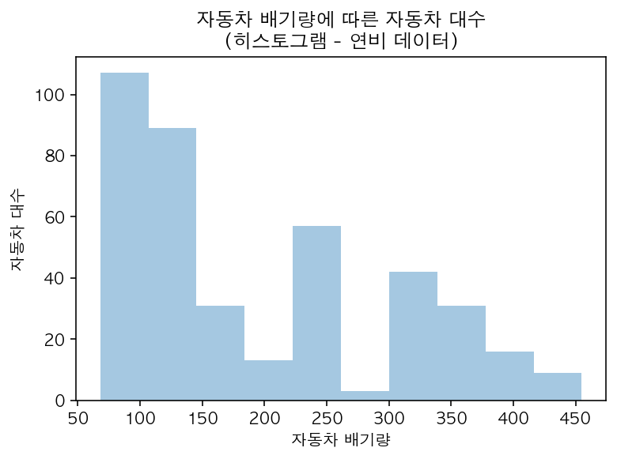

다음 예는 연비 데이터의 자동차 배기량 값을 히스토그램, 커널 밀도 플롯, 러그 플롯으로 동시에 보여주는 코드다.


```python
# --- 연비 데이터(mpg)로 자동차 배기량 값을 히스토그램, 커널 밀도 플롯, 러그 플롯을 동시에 보여준다.
# > 연비 데이터는 자동차와 관련된 정보들을 기록한 데이터 세트다.
# > mpg(연비), cylinders(실린더), displacement(배기량), horsepower(마력),
# > weight(무게), accleration(가속), model_year(연식), origin(제조국가), 
# > name(이름)으로 총 9개의 속성을 가지고 있다. 

# 자동차 배기량에 따른 확률 밀도와 배기량 분포 등을 보여준다.
# hist와 kde는 기본값이 True이기 때문에 rug=True만 설정하면 
# 히스토그램, 커널 밀도 플롯, 러그 플롯을 동시에 그릴 수 있다.
seaborn.distplot(__TODO__)

pyplot.title('자동차 배기량에 대한 히스토그램, 커널 밀도 플롯, 러그 플롯\n(연비 데이터)')
pyplot.ylabel('자동차 배기량의 확률 밀도') 
pyplot.xlabel('자동차 배기량')
pyplot.show()
```

**실행 결과**  

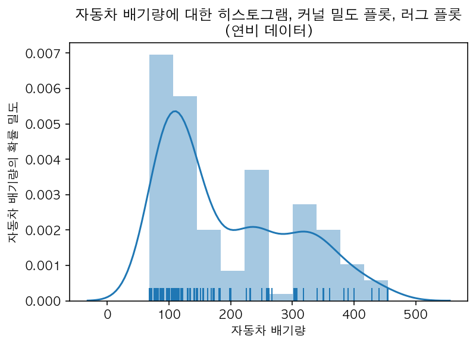

## Lab: 타이타닉 데이터로 러그 플롯, 커널 밀도 플롯, 히스토그램 그리기

- - - 

- 타이타닉 생존 데이터에서 지불한 fare(운임)의 분포를 히스토그램으로 보여준다. 이 때 히스트그램과 함께 커널 밀도 플롯과 러그 플롯도 함께 보여주는 도표를 작성한다.

- 전체 도표의 제목과 x축, y축의 라벨을 적절한 내용으로 설정한다.

- - -

**답**


```python
# Your answer here
```

# 박스 그래프

박스 그래프는 데이터의 분포를 시각적으로 표현한 박스 모양의 그래프다. 데이터의 범위, 중앙값과 이상치를 빠르게 확인할 수 있는 장점이 있다.

- 박스 그래프는 데이터에서 사분위수를 계산하고 제 **1** 사분위(**Q1**)와 제 **3** 사분위(**Q3**)를 밑변으로 하는 박스를 그린다.
- 제 **3** 사분위 수 **Q3**은 전체 자료의 중앙값을 기준으로 봤을때 중앙값보다 큰 값들의 중앙값으로 누적 백분율이 **25%** 에 해당하는 값이다
- 제 **1** 사분위 수 **Q1**은 전체 자료의 중앙값을 기준으로 봤을때 중앙값보다 작은 값들의 중앙값으로 누적 백분율이 **75%** 에 해당하는 값이다.
- 중앙값의 좌우로부터 동일한 백분율을 가진 두 점간의 거리를 계산하기 위해서 제 **3** 사분위수에서 제 **1** 사분위수를 빼서 사분위수 범위 **IQR**(interquartile range)를 계산한다. **Q1 - 1.5 * IQR** 보다 작거나 **Q3 + 1.5 * IQR** 보다 큰 값은 이상치이다.
- 박스 그래프 바깥의 선은 이상치를 제외한 최댓값과 최솟값을 의미한다.

박스 그래프를 작성하려면 **boxplot()** 메소드를 주로 **boxplot(*x=None, y=None, hue=None, data=None, order=None, orient=None, fliersize=5*)** 형식으로 사용하면 된다.

- ***x, y*** 에는 데이터의 변수명을 입력한다. ***x*** 와 ***y*** 중 수치형 데이터 값이 적어도 하나는 들어가야 박스 그래프가 생성된다. 범주형 데이터 값을 가지는 변수명과 수치형 데이터 값을 가지는 변수명을 사용하면 범주별로 박스 그래프가 생성된다.
- ***hue*** 에는 데이터의 변수명이 입력하며 생성한 박스들은 입력한 변수의 범주에 따라 색으로 나눠준다. 
- ***data*** 는 입력하는 전체 데이터의 이름이다. ***x, y*** 를 입력하지 않고 ***data*** 만 입력하면 전체 데이터를 옆으로 긴 데이터프레임(long-form dataframe)으로 인식하여 수치형 변수들에 대해서만 박스 그래프를 작성한다.
- ***order*** 에는 문자열의 리스트를 입력하여 각 범주값이 그래프에 박스로 그려지는 순서를 설정한다.
- ***orient*** 는 **'v'** 또는 **'h'** 를 입력해 박스가 그려지는 방향을 vertical(세로) 또는 horizontal(가로)로 설정한다. 기본값은 **None**으로 x와 y 중 수치형 데이터를 입력한 축의 방향으로 그려진다. 즉 y축에 수치형 데이터 값을 가지는 변수명을 입력하면 박스 그래프는 세로로 그린다. 수치형 변수들에 대해서만 박스 그래프를 작성할 때 사용한다.
- ***fliersize*** 는 데이터의 이상치를 표시하는 마커의 사이즈를 설정한다.
- 더 자세한 내용은 아래의 링크에서 확인할 수 있다.
    - https://seaborn.pydata.org/generated/seaborn.boxplot.html

**boxplot()** 메소드로 출력하는 그림은 하나이므로 x축과 y축을 라벨링할 때 **pyplot.xlabel()** 과 **pyplot.ylabel()** 을 호출하면 된다.

범주별로 생성하는 박스들의 눈금에 라벨을 붙이려면 **boxplot()** 메소드가 반환하는 객체인 **AxesSubplot**을 새로운 변수에 할당하고 **set_xticklabels()** 을 사용한다.

[seaborn.boxplot](https://seaborn.pydata.org/generated/seaborn.boxplot.html)
- Draw a box plot to show distributions with respect to categories.
- seaborn.**boxplot**(_x=None, y=None, hue=None, data=None, order=None, hue_order=None, orient=None, color=None, palette=None, saturation=0.75, width=0.8, dodge=True, fliersize=5, linewidth=None, whis=1.5, ax=None, **kwargs)_
    - A box plot (or box-and-whisker plot) shows the distribution of quantitative data in a way that facilitates comparisons between variables or across levels of a categorical variable. 
    - The box shows the quartiles of the dataset while the whiskers extend to show the rest of the distribution, except for points that are determined to be “outliers” using a method that is a function of the inter-quartile range.
    - Input data can be passed in a variety of formats, including:
        - Vectors of data represented as lists, numpy arrays, or pandas Series objects passed directly to the x, y, and/or hue parameters.
        - A “long-form” DataFrame, in which case the x, y, and hue variables will determine how the data are plotted.
        - A “wide-form” DataFrame, such that each numeric column will be plotted.
        - An array or list of vectors.
    - In most cases, it is possible to use numpy or Python objects, but pandas objects are preferable because the associated names will be used to annotate the axes. Additionally, you can use Categorical types for the grouping variables to control the order of plot elements.
    - This function always treats one of the variables as categorical and draws data at ordinal positions (0, 1, … n) on the relevant axis, even when the data has a numeric or date type.

다음 예는 팁 데이터에서 요일별 청구서 금액을 박스 그래프로 작성한 코드다.


```python
# --- 팁 데이터(tips)에서 요일별 청구서 금액을 박스 그래프로 작성한다.
# > 팁 데이터는 고객 정보와 고객의 청구서 금액 및 팁을 기록한 데이터 세트다.
# > total_bill(전체 금액), tip(팁), sex(성별), smoker(흡연자 여부), 
# > day(요일), time(시간), size(인원 수)로 총 7개의 속성을 가지고 있다.

# x='day'로 설정하여 x축을 범주형 변수인 요일로, 
# y='total_bill'로 설정하여 y축을 실숫값인 청구서 금액으로 설정한다.
# y축에 수치형 데이터 값을 가지는 변수 'total_bill'가 오기 때문에 박스 그래프는 세로로 그려진다.
# boxplot이 반환하는 객체인 AxesSubplot을 'ax'라는 변수로 할당한다.
ax = seaborn.boxplot(__TODO__)

# AxesSubplot.set_xticklabels()로 x축에 작성하는 범주들을 각각 라벨링한다.
ax.set_xticklabels(__TODO__)

pyplot.title('요일별 청구서 금액\n(박스 그래프 - 팁 데이터)')
pyplot.ylabel('청구서 금액')
pyplot.xlabel('요일')
pyplot.show()
```

**실행 결과**  

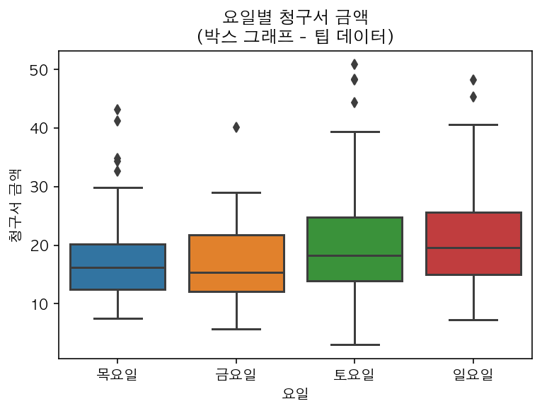

다음 예는 팁 데이터에서 고객의 흡연 여부에 따라 구분한 요일별 청구서 금액을 박스 그래프로 작성한 코드다.


```python
# --- 팁 데이터(tips)에서 고객의 흡연 여부에 따라 구분한 요일별 청구서 금액을 박스 그래프로 작성한다.
# > 팁 데이터는 고객 정보와 고객의 청구서 금액 및 팁을 기록한 데이터 세트다.
# > total_bill(전체 금액), tip(팁), sex(성별), smoker(흡연자 여부), 
# > day(요일), time(시간), size(인원 수)로 총 7개의 속성을 가지고 있다.

# x='day'로 설정하여 x축을 범주형 변수인 요일로, 
# y='total_bill'로 설정하여 y축을 실숫값인 청구서 금액으로 설정한다.
# hue='smoker'로 설정하여 요일 별 박스가 흡연 여부에 따라 작은 박스들로 나눠지게 한다.
# fliersize=8로 설정하여 이상치 마커의 크기를 조금 키운다.
# boxplot이 반환하는 객체인 AxesSubplot을 'ax'라는 변수로 할당한다.
ax = seaborn.boxplot(__TODO__)

# AxesSubplot.set_xticklabels()로 x축에 작성하는 범주들을 각각 라벨링한다.
ax.set_xticklabels(__TODO__)

# hue를 사용하여 작성하는 범례들을 라벨링하기 위해 AxesSubplot.get_legend_handles_labels()로 
# 범례와 범례 라벨을 반환하고 변수에 할당한다.
legend_colors, _ = ax.get_legend_handles_labels()

# AxesSubplot.legend()에 앞에서 범례를 저장한 변수를 입력하고 원하는 라벨 텍스트를 입력한다. 
# 매개변수 bbox_to_anchor=(1, 1)로 범례를 박스 그래프 오른쪽에 위치시킨다.
ax.legend(legend_colors, __TODO__, __TODO__)

pyplot.title('요일별 청구서 금액\n(박스 그래프 - 팁 데이터)')
pyplot.ylabel('청구서 금액')
pyplot.xlabel('요일')
pyplot.show()
```

**실행 결과**  

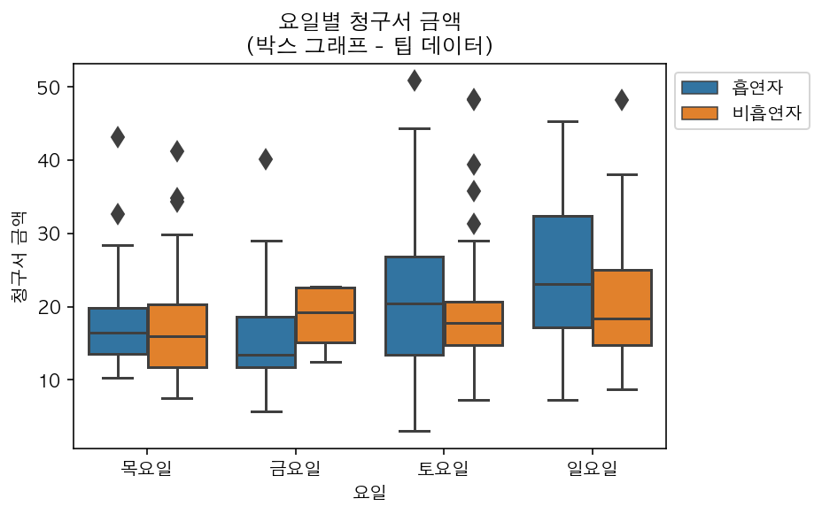

## Lab: 타이타닉 데이터로 박스 그래프 그리기

- - -

- 타이타닉 생존 데이터에서 성별(sex)에 따른 나이(age)의 분포와 통계량을 보여주는 박스 그래프를 작성한다. 이 때 성별 박스를 생존 여부에 따라 다른 색깔을 가지는 박스로 나누어 그린다.

- 전체 도표의 제목과 x축, y축의 라벨을 적절한 내용으로 설정한다. 이 때 각 박스의 색깔에 대한 범례에 라벨을 설정한다.

- x축의 범주 눈금의 라벨도 설정한다.

- - -

**답**


```python
# Your answer here
```

# 바이올린 플롯

바이올린 플롯은 **박스 그래프**를 그리고 그 위에 **커널 밀도 플롯**을 좌우 대칭으로 그려 데이터의 분포를 표현하는 그래프이다.

바이올린 플롯을 작성하려면 **violinplot()** 메소드를 주로 **violinplot(*x=None, y=None, hue=None, data=None, order=None, scale='area', inner='box', split=False, orient=None*)** 형식으로 사용하면 된다.

- ***x, y*** 에는 데이터의 변수명을 입력한다. ***x*** 와 ***y*** 중 수치형 데이터 값이 적어도 하나는 들어가야 바이올린 플롯이 생성된다. 범주형 데이터 값을 가지는 변수명과 수치형 데이터 값을 가지는 변수명을 사용하면 범주별로 바이올린 플롯이 생성된다.
- ***hue*** 에는 데이터의 변수명을 입력하며 생성한 바이올린 도형들을 입력한 변수의 범주에 따라 색으로 나눠준다.
- ***data*** 는 입력하는 전체 데이터의 이름이다. ***x, y*** 를 입력하지 않고 **data**만 입력하면 전체 데이터를 옆으로 긴 데이터프레임(long-form dataframe)으로 인식하여 수치형 변수들에 대해서만 바이올린 플롯을 작성한다.
- ***order*** 에는 문자열의 리스트를 입력하여 각 범주값이 그래프에 바이올린 도형으로 그려지는 순서를 설정한다.
- ***scale***은 각 바이올린 도형의 너비를 조정하는 방법이다. *{'area' &#124; 'count' &#124; 'width'}* 중 하나를 선택하여 기본값은 **'area'** 로 바이올린 도형의 면적(area)이 같도록 한다. **'count'** 를 입력하면 바이올린 도형의 너비는 데이터 개수에 따라 조정된다. **'width'** 를 입력하면 모든 바이올린 도형은 같은 너비를 가지게 된다.
- ***inner*** 는 각 바이올린 도형 내부에 그릴 그래프나 도형을 선택한다. *{'box' &#124; 'quartile' &#124; 'point' &#124; 'stick' &#124; None}'* 중 하나를 선택하며 기본값은 **'box'** 로 작은 박스 그래프를 그린다. **'quartile'** 은 사분위 값을 바이올린 도형안에 점선으로 표시한다. **'point'** 와 **'stick'** 는 데이터 포인트를 각각 점과 선으로 표시한다.
- ***split*** 에는 **bool** 자료형을 입력하며 그려지는 바이올린 도형이 하나의 범주에 대한 좌우 대칭 커널 밀도 플롯이 아니라, ***hue*** 로 입력 받는 범주형 변수의 두 가지 범주로 바이올린 도형의 양 날개를 나누어 그린다. 기본값은 **False**이며 **True**로 설정하여 사용하기 위해서는 반드시 ***hue*** 로 입력 받는 변수가 **2개의 범주**를 가지는 범주형 변수여야만 한다.
    + 두 개의 범주를 가지는 변수를 ***hue*** 에 사용할 때 ***split*** 을 **True**로 설정하면 각 범주에 대해 바이올린을 절반으로 양쪽 날개에 그리게 된다. 이를 통해 커널 밀도 분포를 직접 비교하기가 훨씬 수월해진다.
    + 매개변수 **split** 는 매개변수 ***hue*** 의 값이 반드시 설정되어 있어야 적용가능하다. 즉, ***hue*** 가 없다면 **split=True** 로 설정한 것과 **split=False** 로 설정한 것은 아무런 차이가 없다.
        - ***hue*** 를 설정하고 매개변수 ***split*** 를 **False**로 설정하면 x축에 그려지는 각 바이올린 플롯이 ***hue*** 의 범주에 따라 두 개가 각각 그려진다. 
        - ***hue*** 를 설정하고 매개변수 ***split*** 를 **True**로 설정하면 x축에 그려지는 각 바이올린 플롯이 ***hue*** 의 두 개 범주를 바이올린 플롯의 각 날개로 그리게 된다. 
- ***orient***는 **'v'** 또는 **'h'** 를 입력 받아 바이올린 플롯이 그려지는 방향을 vertical(세로) 또는 horizontal(가로)로 설정한다. 기본값은 **None**으로 x와 y 중 수치형 데이터를 입력한 축의 방향으로 그린다. 즉 y축에 수치형 데이터 값을 가지는 변수명이 입력되면 바이올린 플롯은 세로로 그려진다. 수치형 변수들에 대해서만 바이올린 플롯을 작성할 경우 사용한다.
- 더 자세한 내용은 아래의 링크에서 확인할 수 있다.
    - https://seaborn.pydata.org/generated/seaborn.violinplot.html

**violin()** 메소드는 박스 그래프와 커널 밀도 플롯을 같이 그릴 수 있으나 출력하는 그림은 결국 하나이므로 x축과 y축을 라벨링할 때 **pyplot.xlabel()** 과 **pyplot.ylabel()** 을 호출하면 된다.

범주별로 생성되는 바이올린 도형들의 눈금에 라벨을 붙이려면 **violinplot()** 메소드가 반환하는 객체인 **AxesSubplot**을 새로운 변수에 할당하고 **set_xticklabels()** 을 사용한다.

**[참고]** 커널 밀도로 도표를 그릴 경우 데이터가 음수가 아니더라도 **0**에 가까운 데이터가 많다면 커널 밀도는 음수에 그려질 수 있다. 만약 커널 밀도 함수 값에서 음수를 보고 싶지 않으면 매개변수 중 ***cut*** 을 **0**으로 설정(**cut=0**)하면 **0** 이상의 값들만 확인할 수 있다.

[seaborn.violinplot](https://seaborn.pydata.org/generated/seaborn.violinplot.html)
- Draw a combination of boxplot and kernel density estimate.
- seaborn.**violinplot**(_x=None, y=None, hue=None, data=None, order=None, hue_order=None, bw='scott', cut=2, scale='area', scale_hue=True, gridsize=100, width=0.8, inner='box', split=False, dodge=True, orient=None, linewidth=None, color=None, palette=None, saturation=0.75, ax=None, **kwargs)_
    - A violin plot plays a similar role as a box and whisker plot. It shows the distribution of quantitative data across several levels of one (or more) categorical variables such that those distributions can be compared. 
    - Unlike a box plot, in which all of the plot components correspond to actual datapoints, the violin plot features a kernel density estimation of the underlying distribution.
    - This can be an effective and attractive way to show multiple distributions of data at once, but keep in mind that the estimation procedure is influenced by the sample size, and violins for relatively small samples might look misleadingly smooth.
    - Input data can be passed in a variety of formats, including:
        - Vectors of data represented as lists, numpy arrays, or pandas Series objects passed directly to the x, y, and/or hue parameters.
        - A “long-form” DataFrame, in which case the x, y, and hue variables will determine how the data are plotted.
        - A “wide-form” DataFrame, such that each numeric column will be plotted.
        - An array or list of vectors.
    - In most cases, it is possible to use numpy or Python objects, but pandas objects are preferable because the associated names will be used to annotate the axes. Additionally, you can use Categorical types for the grouping variables to control the order of plot elements.
    - This function always treats one of the variables as categorical and draws data at ordinal positions (0, 1, … n) on the relevant axis, even when the data has a numeric or date type.

다음 예는 연비 데이터에서 생산 국가별 자동차 마력을 바이올린 플롯으로 작성한 코드다.


```python
# --- 연비 데이터(mpg)에서 생산 국가별 자동차 마력을 바이올린 플롯으로 작성한다.
# > 연비 데이터는 자동차와 관련된 정보들을 기록한 데이터 세트다.
# > mpg(연비), cylinders(실린더), displacement(배기량), horsepower(마력),
# > weight(무게), accleration(가속), model_year(연식), origin(제조국가), 
# > name(이름)으로 총 9개의 속성을 가지고 있다. 

# x='origin'으로 설정하여 x축을 범주형 변수인 생산 국가로,
# y='horsepower'로 설정하여 y축을 실숫값인 자동차 마력으로 설정한다.
# y축에 수치형 데이터 값을 가지는 변수 'horsepower'가 오기 때문에 바이올린 플롯은 세로로 그려진다.
# violinplot이 반환하는 객체인 AxesSubplot을 'ax'라는 변수로 할당한다.
ax = seaborn.violinplot(__TODO__)

# AxesSubplot.set_xticklabels()로 x축에 작성하는 범주들을 각각 라벨링한다.
ax.set_xticklabels(__TODO__)

pyplot.title('생산 국가별 자동차 마력 분포\n(바이올린 플롯 - 연비 데이터)')
pyplot.xlabel('생산 국가')
pyplot.ylabel('자동차 마력')
pyplot.show()
```

**실행 결과**  

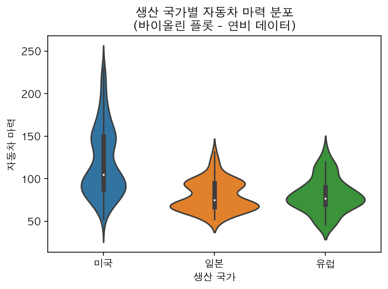

다음 예는 연비 데이터에서 생산 국가별 자동차 마력을 실린더의 개수에 따라 나누어 바이올린 플롯으로 작성한 코드다.


```python
# --- 연비 데이터(mpg)에서 생산 국가별 자동차 마력을 실린더의 개수에 따라 나누어 바이올린 플롯으로 작성한다.
# > 연비 데이터는 자동차와 관련된 정보들을 기록한 데이터 세트다.
# > mpg(연비), cylinders(실린더), displacement(배기량), horsepower(마력),
# > weight(무게), accleration(가속), model_year(연식), origin(제조국가), 
# > name(이름)으로 총 9개의 속성을 가지고 있다. 

# pyplot.figure(figsize=(14, 10))로 설정하여 전체 그림의 크기를 크게 설정한다. 
pyplot.figure(figsize=(14, 10))

# x='origin'으로 설정하여 x축을 범주형 변수인 생산 국가로,
# y='horsepower'로 설정하여 y축을 실숫값인 자동차 마력으로 설정한다.
# y축에 수치형 데이터 값을 가지는 변수 'horsepower'가 오기 때문에 바이올린 플롯은 세로로 그려진다.
# hue='cylinders'로 설정하여 생산 국가 별 바이올린 도형들이 실린더의 개수에 따라 작은 바이올린 도형들로 나눠지게 한다.
# order=['europe', 'usa', 'japan']으로 설정하여 바이올린 도형의 순서를 미국, 일본, 유럽 순에서 유럽, 미국, 일본 순으로 변경한다.
# orderscale='count'로 설정하여 각 바이올린 도형의 너비가 해당 도형 안의 데이터 수에 따라 조정되도록 한다.
# inner='stick'으로 설정하여 각각 데이터들을 바이올린 도형 안에 선으로 표시하였다.
# violinplot이 반환하는 객체인 AxesSubplot을 'ax'라는 변수로 할당한다.
ax = seaborn.violinplot(__TODO__)

# AxesSubplot.set_xticklabels()로 x축에 작성하는 범주들을 각각 라벨링한다.
ax.set_xticklabels(__TODO__)

# hue를 사용하여 작성하는 범례들을 라벨링하기 위해 AxesSubplot.get_legend_handles_labels()로 
# 범례와 범례 라벨을 반환하고 변수에 할당한다.
legend_colors, _ = ax.get_legend_handles_labels()

# AxesSubplot.legend()에 앞에서 범례를 저장한 변수를 입력하고 원하는 라벨 텍스트를 입력한다. 
# 매개변수 bbox_to_anchor=(1.14, 1)로 설정하여 범례를 박스 그래프 오른쪽에 위치시킨다.
ax.legend(legend_colors, __TODO__, __TODO__)

pyplot.title('생산 국가별 실린더 개수에 따른 자동차 마력 분포\n(바이올린 플롯 - 연비 데이터)')
pyplot.xlabel('생산 국가')
pyplot.ylabel('자동차 마력')
pyplot.show()
```

**실행 결과**  

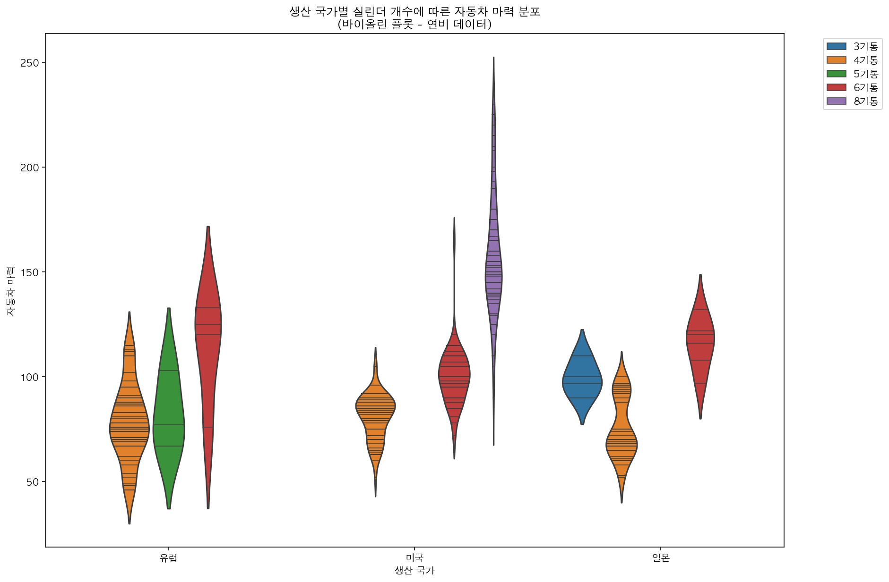

다음 예는 팁 데이터에서 성별에 따른 청구서 금액을 점심과 저녁으로 구분하여 바이올린 플롯으로 작성한 코드다. 이렇게 하려면 매개변수 ***split*** 를 **True**로 설정하고 작성하면 되는데 이 때 ***hue*** 에 설정한 열의 값이 두 개의 범주를 가지는 범주형이어야 한다.


```python
# --- 팁 데이터(tips)에서 성별에 따른 청구서 금액을 점심과 저녁으로 구분하여 바이올린 플롯으로 작성한다.
# > 팁 데이터는 고객 정보와 고객의 청구서 금액 및 팁을 기록한 데이터 세트다.
# > total_bill(전체 금액), tip(팁), sex(성별), smoker(흡연자 여부), 
# > day(요일), time(시간), size(인원 수)로 총 7개의 속성을 가지고 있다.

# x='day'로 설정하여 x축을 범주형 변수인 요일로,
# y='total_bill'로 설정하여 y축을 실숫값인 청구서 금액으로 설정한다.
# y축에 수치형 데이터 값을 가지는 변수 'total_bill'이 오기 때문에 바이올린 플롯은 세로로 그려진다.
# hue='time', split=True로 설정하여 바이올린 도형의 양 날개를 시간 범주에 따라 나누어 그린다. 
# split=True로 하기 위해서는 hue의 값이 2개의 범주를 가져야만 한다. 
# 여기서 사용하는 'time' 열은 '점심'과 '저녁' 두 범주를 가진다.
# violinplot으로 반환하는 객체인 AxesSubplot을 'ax'라는 변수로 할당한다.
ax = seaborn.violinplot(__TODO__)

# AxesSubplot.set_xticklabels()로 x축에 작성되는 범주들을 각각 라벨링한다.
ax.set_xticklabels(__TODO__)

# hue를 사용하여 작성되는 범례들을 라벨링하기 위해 AxesSubplot.get_legend_handles_labels()로 
# 범례와 범례 라벨을 반환하고 변수로 저장한다.
legend_colors, _ = ax.get_legend_handles_labels()

# AxesSubplot.legend()에 앞에서 범례를 저장한 변수를 입력하고 원하는 라벨 텍스트를 입력한다. 
# bbox_to_anchor=(1.2, 1)로 범례를 바이올린 플롯 오른쪽에 위치시킨다.
ax.legend(legend_colors, __TODO__, __TODO__)

pyplot.title('시간과 성별에 따른 청구서 금액\n(바이올린 플롯 - 팁 데이터)')
pyplot.xlabel('성별')
pyplot.ylabel('청구서 금액')
pyplot.show()
```

**실행 결과**  

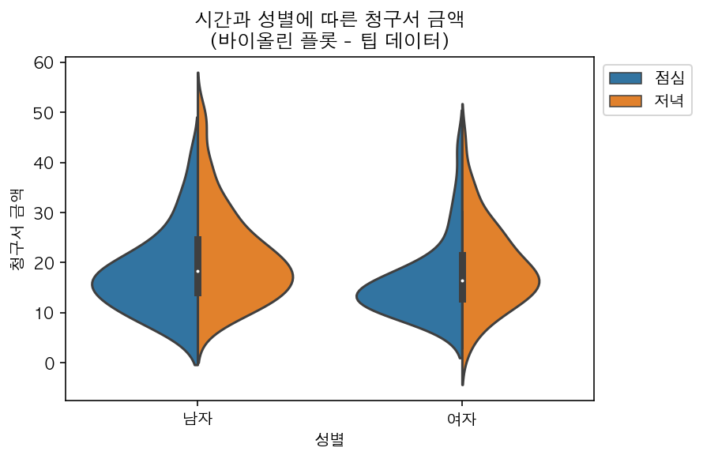

# 스트립 플롯

스트립 플롯은 입력되는 변수 하나가 범주형인 **산점도**를 그린다. 따라서 각 점은 데이터 한 개를 뜻한다.

스트립 플롯을 작성하려면 **stripplot()** 메소드를 주로 **stripplot(*x=None, y=None, hue=None, data=None, order=None, jitter=True, color=None, size=5*)** 형식으로 사용하면 된다.

- ***x, y*** 에는 데이터의 변수명을 입력한다. ***x*** 와 ***y*** 에는 범주형 변수와 수치형 변수를 각각 하나씩 입력해야 한다. 두 개의 수치형 변수를 입력할 수는 있지만 그럴 경우 ***x*** 에 입력하는 수치형 데이터 값을 각각 하나의 범주로 간주하여 그린다. 즉, 이 경우 스트립 플롯보다는 산점도를 사용하는게 적합하다.
- ***hue*** 에는 데이터의 변수명을 입력하며 생성한 범주별 산점도를 입력한 변수의 범주에 따라 다른 색으로 표현한다.
- ***data*** 는 입력하는 전체 데이터의 이름이다. ***x, y*** 를 입력하지 않고 ***data***만 입력하면 전체 데이터를 옆으로 긴 데이터프레임(long-form dataframe)으로 인식하여 수치형 변수들에 대해서만 스트립 플롯을 작성한다.
- ***order*** 는 문자열의 리스트를 입력하여 각 범주값이 그래프에 스트립 플롯으로 그려지는 순서를 설정한다.
- ***jitter*** 는 **bool** 자료형 또는 **float** 자료형을 입력하며 데이터를 표현한 점들이 겹칠 때 이 점들을 범주형 데이터가 입력된 축의 방향으로 무작위로 늘어뜨려 겹치지 않도록 한다. 기본값은 **True**로 실수 1이 들어간 결과와 같으며 seaborn 패키지 내에서 자동으로 데이터를 적당히 늘어뜨려준다. 실수는 0부터 1미만의 값이 들어가며 0에 가까울수록 점들이 겹쳐진다.
- ***color*** 에는 컬러 문자열을 입력하여 점의 색상을 설정한다. 컬러 문자열에는 파랑색 **'b'**, 초록색 **'g'**, 빨강색 **'r'**, 노랑색 **'y'**, 하양색 **'w'** 등이 있다. 더 많은 컬러 문자열은 아래 링크에서 확인할 수 있다.
    - https://matplotlib.org/3.1.0/gallery/color/named_colors.html
- ***size*** 는 점의 크기를 설정한다. 기본값은 **5**이며 값이 커질수록 점의 크기가 커진다.
- 더 자세한 내용은 아래의 링크에서 확인할 수 있다.
    - https://seaborn.pydata.org/generated/seaborn.stripplot.html

**stripplot()** 메소드로 출력하는 그림은 하나이므로 x축과 y축을 라벨링할 때 **pyplot.xlabel()** 과 **pyplot.ylabel()** 을 호출하면 된다.

범주별로 생성되는 산점도들의 눈금에 라벨을 붙이려면 **stripplot()** 메소드가 반환하는 객체인 **AxesSubplot**을 새로운 변수로 할당하고 **set_xticklabels()** 을 사용한다.

[seaborn.stripplot](https://seaborn.pydata.org/generated/seaborn.stripplot.html)
- Draw a scatterplot where one variable is categorical.
- seaborn.**stripplot**(_x=None, y=None, hue=None, data=None, order=None, hue_order=None, jitter=True, dodge=False, orient=None, color=None, palette=None, size=5, edgecolor='gray', linewidth=0, ax=None, **kwargs_)
    - A strip plot can be drawn on its own, but it is also a good complement to a box or violin plot in cases where you want to show all observations along with some representation of the underlying distribution.
    - Input data can be passed in a variety of formats, including:
        - Vectors of data represented as lists, numpy arrays, or pandas Series objects passed directly to the x, y, and/or hue parameters.
        - A “long-form” DataFrame, in which case the x, y, and hue variables will determine how the data are plotted.
        - A “wide-form” DataFrame, such that each numeric column will be plotted.
        - An array or list of vectors.
    - In most cases, it is possible to use numpy or Python objects, but pandas objects are preferable because the associated names will be used to annotate the axes. Additionally, you can use Categorical types for the grouping variables to control the order of plot elements.
    - This function always treats one of the variables as categorical and draws data at ordinal positions (0, 1, … n) on the relevant axis, even when the data has a numeric or date type.

다음 예는 연비 데이터에서 생산 국가별 자동차 마력을 스트립 플롯으로 작성한 코드다.


```python
# --- 연비 데이터(mpg)에서 생산 국가별 자동차 마력을 스트립 플롯으로 작성한다.
# > 연비 데이터는 자동차와 관련된 정보들을 기록한 데이터 세트다.
# > mpg(연비), cylinders(실린더), displacement(배기량), horsepower(마력),
# > weight(무게), accleration(가속), model_year(연식), origin(제조국가), 
# > name(이름)으로 총 9개의 속성을 가지고 있다. 

# x='origin'으로 설정하여 x축을 범주형 변수인 생산 국가로,
# y='horsepower'로 설정하여 y축을 실숫값인 자동차 마력으로 설정한다.
# y축에 수치형 데이터 값을 가지는 변수 'horsepower'가 오기 때문에 스트립 플롯은 세로로 그려진다.
# stripplot이 반환하는 객체인 AxesSubplot을 'ax'라는 변수로 할당한다.
ax = seaborn.stripplot(__TODO__)

# AxesSubplot.set_xticklabels()를 이용하여 x축에 작성하는 범주들을 각각 라벨링한다.
ax.set_xticklabels(__TODO__)

pyplot.title('생산 국가별 자동차 마력 분포\n(스트립 플롯 - 연비 데이터)')
pyplot.xlabel('생산국가')
pyplot.ylabel('자동차 마력')
pyplot.show()
```

**실행 결과**  

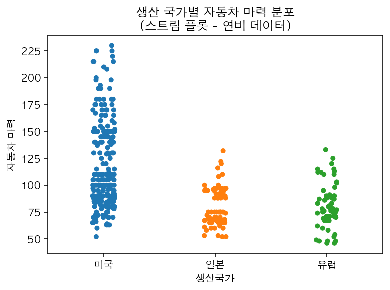

다음 예는 연비 데이터에서 생산 국가별 자동차 마력을 실린더의 개수에 따라 나누어 스트립 플롯으로 작성한 코드다.


```python
# --- 연비 데이터(mpg)에서 생산 국가별 자동차 마력을 실린더의 개수에 따라 나누어 스트립 플롯으로 작성한다.
# > 연비 데이터는 자동차와 관련된 정보들을 기록한 데이터 세트다.
# > mpg(연비), cylinders(실린더), displacement(배기량), horsepower(마력),
# > weight(무게), accleration(가속), model_year(연식), origin(제조국가), 
# > name(이름)으로 총 9개의 속성을 가지고 있다. 

# pyplot.figure(figsize=(9, 8))로 설정하여 전체 그림의 크기를 크게 설정한다. 
pyplot.figure(figsize=(9, 8))

# x='origin'으로 설정하여 x축을 범주형 변수인 생산 국가로,
# y='horsepower'로 설정하여 y축을 실숫값인 자동차 마력으로 설정한다.
# y축에 수치형 데이터 값을 가지는 변수 'horsepower'가 오기 때문에 스트립 플롯은 세로로 그려진다.
# hue='cylinders'로 설정하여 생산 국가별 산점도의 점들이 실린더의 개수에 따라 다른 색상을 가지도록 한다.
# jitter=0.4로 설정하여 산점도의 점들이 겹쳐지지 않도록 가로로 늘어뜨린다.
# size=6.5로 설정하여 점들의 크기를 조금 키운다.
# stripplot이 반환하는 객체인 AxesSubplot을 'ax'라는 변수로 할당한다.
ax = seaborn.stripplot(__TODO__)

# AxesSubplot.set_xticklabels()로 x축에 작성하는 범주들을 각각 라벨링한다.
ax.set_xticklabels(__TODO__)

# hue를 사용하여 작성하는 범례들을 라벨링하기 위해 AxesSubplot.get_legend_handles_labels()로 
# 범례와 범례 라벨을 반환하고 변수에 할당한다.
legend_colors, _ = ax.get_legend_handles_labels()

# AxesSubplot.legend()에 앞에서 범례를 저장한 변수를 입력하고 원하는 라벨 텍스트를 입력한다. 
# 매개변수 bbox_to_anchor=(1.22, 1)로 범례를 박스 그래프 오른쪽에 위치시킨다.
ax.legend(legend_colors, __TODO__, __TODO__)

pyplot.title('생산 국가별 실린더 개수에 따른 자동차 마력 분포\n(스트립 플롯 - 연비 데이터)')
pyplot.xlabel('생산 국가')
pyplot.ylabel('자동차 마력')
pyplot.show()
```

**실행 결과**  

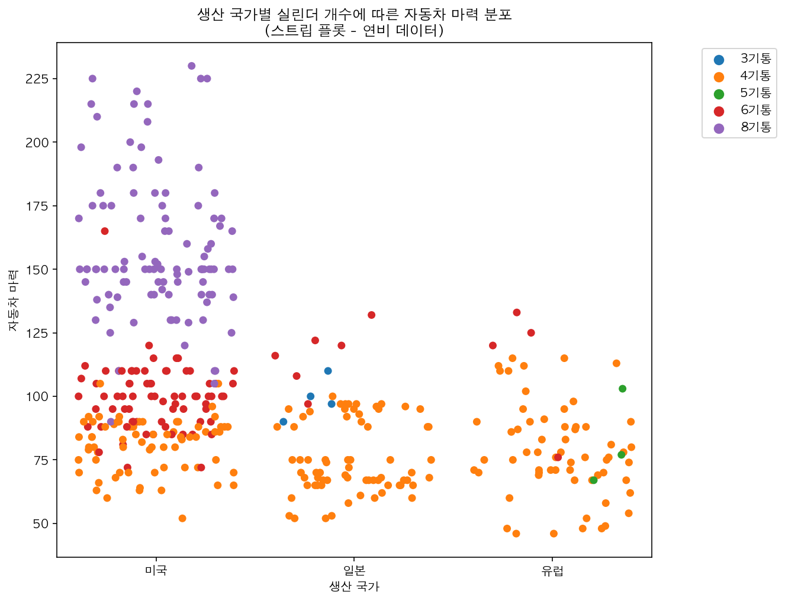

다음 예는 연비 데이터에서 생산 국가별 자동차 마력을 박스 그래프와 스트립 플롯으로 겹쳐 작성한 코드다.


```python
# --- 연비 데이터(mpg)에서 생산 국가별 자동차 마력을 박스 그래프와 스트립 플롯으로 겹쳐 작성한다.
# > 연비 데이터는 자동차와 관련된 정보들을 기록한 데이터 세트다.
# > mpg(연비), cylinders(실린더), displacement(배기량), horsepower(마력),
# > weight(무게), accleration(가속), model_year(연식), origin(제조국가), 
# > name(이름)으로 총 9개의 속성을 가지고 있다. 

# x='origin'으로 설정하여 x축을 범주형 변수인 생산 국가로,
# y='horsepower'로 설정하여 y축을 실숫값인 자동차 마력으로 설정한다.
# 겹쳐 그리기 위해 그래프 또는 플롯을 작성하는 두 개의 메소드에 들어가는 x와 y 변수는 동일해야 한다.
# 여기서는 두 메소드 모두 data=mpg, x='origin', y='horsepower'로 설정한다.

# stripplot의 점 색상을 'silver'로 설정하여 박스 그래프의 색상과 구분한다.
seaborn.stripplot(__TODO__)

# boxplot이 반환하는 객체인 AxesSubplot을 'ax'라는 변수로 할당한다.
ax = seaborn.boxplot(__TODO__)

# AxesSubplot.set_xticklabels()로 x축에 작성하는 범주들을 각각 라벨링한다.
ax.set_xticklabels(__TODO__)

pyplot.title('생산 국가별 자동차 마력 분포\n(박스 그래프와 스트립 플롯 - 연비 데이터)')
pyplot.xlabel('생산국가')
pyplot.ylabel('자동차 마력')
pyplot.show()
```

**실행 결과**  

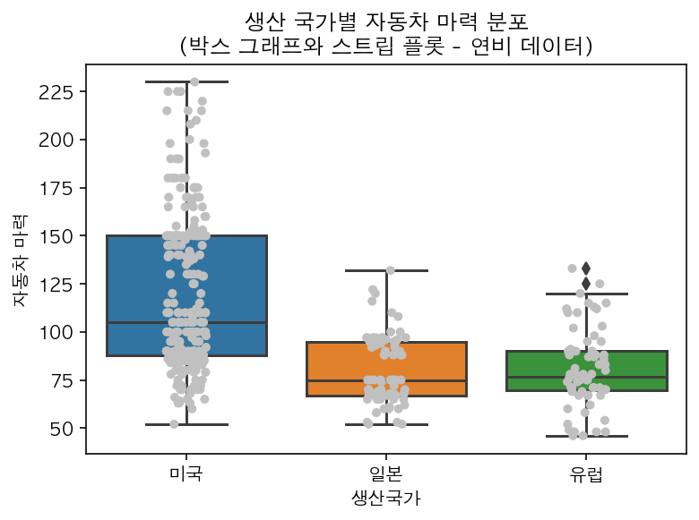

## Lab: 타이타닉 데이터로 스트립 플롯 그리기

- - -

- 타이타닉 생존 데이터에서 동반한 형제 자매 및 배우자 수(sibsp)와 나이(age)의 상관 관계를 보여주는 스트립 플롯을 작성한다. 이 때 겹친 점들을 흩뜨리도록 설정한다.

- 전체 도표의 제목과 x축, y축의 라벨을 적절한 내용으로 설정한다.

- - -

**답**


```python
# Your answer here
```

# 스웜 플롯

스웜 플롯은 각 범주에 속하는 수치형 데이터를 최대한 겹치지 않도록 퍼뜨려 점 형태로 나타낸다. **점을 겹치지 않게 그린 스트립 플롯**이라고 할 수 있으며 데이터의 분포 정도를 잘 보여준다.

스웜 플롯을 작성하려면 **swarmplot()** 메소드를 주로 **swarmplot(*x=None, y=None, hue=None, data=None, order=None, color=None, size=5*)** 형식으로 사용하면 된다.

- ***x, y*** 에는 데이터의 변수명을 입력한다. ***x*** 와 ***y*** 에는 범주형 변수와 수치형 변수를 각각 하나씩 입력해야 한다. 두 개의 수치형 변수를 입력할 수는 있지만 그럴 경우 ***x*** 에 입력하는 수치형 데이터 값을 각각 하나의 범주로 간주하여 그린다. 즉, 이 경우 스웜 플롯보다는 산점도를 사용하는게 적합하다.
- ***hue*** 에는 데이터의 변수명을 입력하며 생성한 범주별 산점도를 입력한 변수의 범주에 따라 색으로 나눠준다.
- ***data*** 는 입력하는 전체 데이터의 이름이다. ***x, y*** 를 입력하지 않고 **data**만 입력하면 전체 데이터를 옆으로 긴 데이터프레임(long-form dataframe)으로 인식하여 수치형 변수들에 대해서만 스웜 플롯을 작성한다.
- ***order*** 은 문자열의 리스트를 입력하여 각 범주값이 그래프에 스웜 플롯으로 그려지는 순서를 설정한다.
- ***color*** 에는 컬러 문자열을 입력하여 점의 색상을 설정한다. 대표적인 컬러 문자열로 파랑색은 **'b'**, 초록색은 **'g'**, 빨강색은 **'r'**, 노랑색은 **'y'**, 하양색은 **'w'**, 검정색은 **'k'** 등이 있다. 더 많은 컬러 문자열은 아래 링크에서 확인할 수 있다.
    - https://matplotlib.org/3.1.0/gallery/color/named_colors.html
- ***size*** 는 점의 크기를 설정한다. 기본값은 **5**이며 값이 커질수록 점의 크기가 커진다.
- 더 자세한 내용은 아래의 링크에서 확인할 수 있다.
    - https://seaborn.pydata.org/generated/seaborn.swarmplot.html

**swarmplot()** 메소드로 출력하는 그림은 하나이므로 x축과 y축을 라벨링할 때 **pyplot.xlabel()** 과 **pyplot.ylabel()** 을 호출하면 된다.

범주별로 생성되는 산점도들의 눈금에 라벨을 붙이려면 **swarmplot()** 메소드가 반환하는 객체인 **AxesSubplot** 을 새로운 변수에 할당하고 **set_xticklabels()** 을 사용한다.


[seaborn.swarmplot](https://seaborn.pydata.org/generated/seaborn.swarmplot.html)
- Draw a categorical scatterplot with non-overlapping points.
- seaborn.**swarmplot**(_x=None, y=None, hue=None, data=None, order=None, hue_order=None, dodge=False, orient=None, color=None, palette=None, size=5, edgecolor='gray', linewidth=0, ax=None, **kwargs_)
    - This function is similar to stripplot(), but the points are adjusted (only along the categorical axis) so that they don’t overlap. This gives a better representation of the distribution of values, but it does not scale well to large numbers of observations. This style of plot is sometimes called a “beeswarm”.
    - A swarm plot can be drawn on its own, but it is also a good complement to a box or violin plot in cases where you want to show all observations along with some representation of the underlying distribution.
    - Arranging the points properly requires an accurate transformation between data and point coordinates. This means that non-default axis limits must be set before drawing the plot.
    - Input data can be passed in a variety of formats, including:
        - Vectors of data represented as lists, numpy arrays, or pandas Series objects passed directly to the x, y, and/or hue parameters.
        - A “long-form” DataFrame, in which case the x, y, and hue variables will determine how the data are plotted.
        - A “wide-form” DataFrame, such that each numeric column will be plotted.
        - An array or list of vectors.
    - In most cases, it is possible to use numpy or Python objects, but pandas objects are preferable because the associated names will be used to annotate the axes. Additionally, you can use Categorical types for the grouping variables to control the order of plot elements.
    - This function always treats one of the variables as categorical and draws data at ordinal positions (0, 1, … n) on the relevant axis, even when the data has a numeric or date type.

다음 예는 연비 데이터에서 생산 국가별 자동차 마력을 스웜 플롯으로 작성한 코드다.


```python
# --- 연비 데이터(mpg)에서 생산 국가별 자동차 마력을 스웜 플롯으로 작성한다.
# > 연비 데이터는 자동차와 관련된 정보들을 기록한 데이터 세트다.
# > mpg(연비), cylinders(실린더), displacement(배기량), horsepower(마력),
# > weight(무게), accleration(가속), model_year(연식), origin(제조국가), 
# > name(이름)으로 총 9개의 속성을 가지고 있다. 

# x='origin'으로 설정하여 x축을 범주형 변수인 생산 국가로,
# y='horsepower'로 설정하여 y축을 실숫값인 자동차 마력으로 설정한다.
# y축에 수치형 데이터 값을 가지는 변수 'horsepower'가 오기 때문에 스웜 플롯은 세로로 그려진다.
# swarmplot이 반환하는 객체인 AxesSubplot을 'ax'라는 변수로 할당한다.
ax = seaborn.swarmplot(__TODO__)

# AxesSubplot.set_xticklabels()로 x축에 작성하는 범주들을 각각 라벨링한다.
ax.set_xticklabels(__TODO__)

pyplot.title('생산 국가별 자동차 마력 분포\n(스웜 플롯 - 연비 데이터)')
pyplot.xlabel('생산국가')
pyplot.ylabel('자동차 마력')
pyplot.show()
```

**실행 결과**  

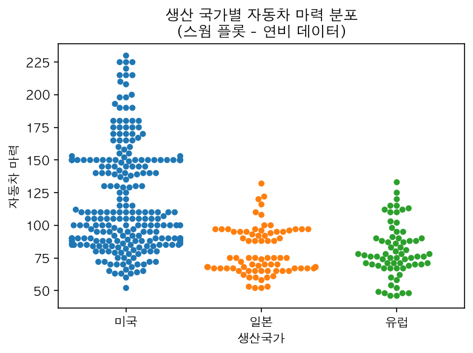

다음 예는 팁 데이터에서 요일 별 청구서 금액을 스웜 플롯으로 작성한 코드다.


```python
# --- 팁 데이터(tips)에서 요일 별 청구서 금액을 스웜 플롯으로 작성한다.
# > 팁 데이터는 고객 정보와 고객의 청구서 금액 및 팁을 기록한 데이터 세트다.
# > total_bill(전체 금액), tip(팁), sex(성별), smoker(흡연자 여부), 
# > day(요일), time(시간), size(인원 수)로 총 7개의 속성을 가지고 있다.

# x='day'로 설정하여 x축을 범주형 변수인 요일로,
# y='total_bill'로 설정하여 y축을 실숫값인 청구서 금액으로 설정한다.
# y축에 수치형 데이터 값을 가지는 변수 'total_bill'이 오기 때문에 스웜 플롯은 세로로 그려진다.
# swarmplot이 반환하는 객체인 AxesSubplot을 'ax'라는 변수로 할당한다.
ax = seaborn.swarmplot(__TODO__)

# AxesSubplot.set_xticklabels()로 x축에 작성되는 범주들을 각각 라벨링한다.
ax.set_xticklabels(__TODO__)

pyplot.title('요일별 청구서 금액\n(스웜 플롯 - 팁 데이터)')
pyplot.xlabel('요일')
pyplot.ylabel('청구서 금액')
pyplot.show()
```

**실행 결과**  

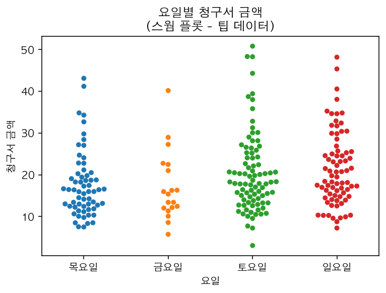

다음 예는 팁 데이터에서 요일 별 산점도를 흡연 여부에 따라 나눈 청구서 금액을 스웜 플롯으로 작성한 코드다.


```python
# --- 팁 데이터(tips)에서 요일 별 산점도를 흡연 여부에 따라 나눈 청구서 금액을 스웜 플롯으로 작성한다.
# > 팁 데이터는 고객 정보와 고객의 청구서 금액 및 팁을 기록한 데이터 세트다.
# > total_bill(전체 금액), tip(팁), sex(성별), smoker(흡연자 여부), 
# > day(요일), time(시간), size(인원 수)로 총 7개의 속성을 가지고 있다.

# x='day'로 설정하여 x축을 범주형 변수인 요일로,
# y='total_bill'로 설정하여 y축을 실숫값인 청구서 금액으로 설정한다.
# y축에 수치형 데이터 값을 가지는 변수 'total_bill'이 오기 때문에 스웜 플롯은 세로로 그려진다.
# hue='smoker'로 설정하여 요일 별 산점도의 점 형태가 흡연 여부에 따라 다른 색상을 가지도록 한다.
# size=6으로 설정하여 점들의 크기를 조금 키운다.
# swarmplot이 반환하는 객체인 AxesSubplot을 'ax'라는 변수로 할당한다.
ax = seaborn.swarmplot(__TODO__)

# AxesSubplot.set_xticklabels()로 x축에 작성되는 범주들을 각각 라벨링한다.
ax.set_xticklabels(__TODO__)

# hue를 사용하여 작성하는 범례들을 라벨링하기 위해 AxesSubplot.get_legend_handles_labels()로 
# 범례와 범례 라벨을 반환하고 변수에 할당한다.
legend_colors, _ = ax.get_legend_handles_labels()

# AxesSubplot.legend()에 앞에서 범례를 저장한 변수를 입력하고 원하는 라벨 텍스트를 입력한다. 
# bbox_to_anchor=(1, 1)로 범례를 박스 그래프 오른쪽에 위치시킨다.
ax.legend(legend_colors, __TODO__, __TODO__)

pyplot.title('요일별 흡연 여부에 따른 청구서 금액\n(스트립 플롯 - 팁 데이터)')
pyplot.xlabel('요일')
pyplot.ylabel('청구서 금액')
pyplot.show()
```

**실행 결과**  

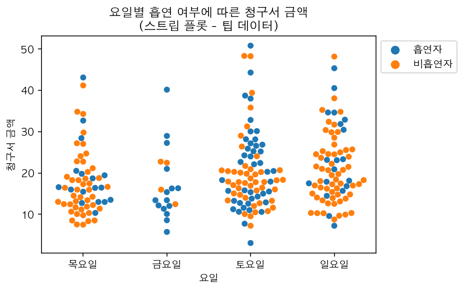

다음 예는 팁 데이터에서 요일별 청구서 금액을 바이올린 플롯과 스웜 플롯으로 겹쳐 작성한 코드다.


```python
# --- 팁 데이터(tips)에서 요일별 청구서 금액을 바이올린 플롯과 스웜 플롯으로 겹쳐 작성한다.
# > 팁 데이터는 고객 정보와 고객의 청구서 금액 및 팁을 기록한 데이터 세트다.
# > total_bill(전체 금액), tip(팁), sex(성별), smoker(흡연자 여부), 
# > day(요일), time(시간), size(인원 수)로 총 7개의 속성을 가지고 있다.

# x='day'로 설정하여 x축을 범주형 변수인 요일로,
# y='total_bill'로 설정하여 y축을 실숫값인 청구서 금액으로 설정한다.
# 겹쳐 그리기 위해서는 그래프 또는 플롯을 작성하는 두 개의 메소드에 들어가는 x 와 y 변수는 동일해야 한다.
# 여기서는 두 메소드 모두 data=tips, x='day', y='total_bill'로 설정한다.

# swarmplot의 점 색상을 'silver'로 설정하여 박스 그래프의 색상과 구분한다.
seaborn.swarmplot(__TODO__)

# violinplot이 반환하는 객체인 AxesSubplot을 'ax'라는 변수로 할당한다.
ax = seaborn.violinplot(__TODO__)

# AxesSubplot.set_xticklabels()로 x축에 작성되는 범주들을 각각 라벨링한다.
ax.set_xticklabels(__TODO__)

pyplot.title('요일별 청구서 금액\n(바이올린 플롯과 스트립 플롯 - 팁 데이터)')
pyplot.xlabel('요일')
pyplot.ylabel('청구서 금액')
pyplot.show()
```

**실행 결과**  

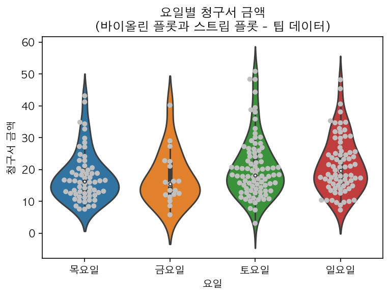

## Lab: 타이타닉 데이터로 바이올린 플롯과 스웜 플롯 겹쳐 그리기

- - -

- 타이타닉 생존 데이터에서 클래스 등급(class)과 운임(fare)의 분포와 통계량을 보여주는 바이올린 플롯과 스웜 플롯을 겹쳐 그린다. 이 때 스웜 플롯이 그리는 점들의 원하는 색상으로 설정하여 두 도표가 서로 가려 보이지 않도록 한다.

- 전체 도표의 제목과 x축, y축의 라벨을 적절한 내용으로 설정한다.

- - -

**답**


```python
# Your answer here
```

# 산점도

산점도는 두 변수 간의 관계를 좌표평면 상에 점으로 나타내는 도표다.

산점도를 작성하려면 **scatterplot()** 메소드를 주로 **scatterplot(*x=None, y=None, hue=None, style=None, size=None, data=None, palette=None*)** 형식으로 사용하면 된다.

- ***x*** 는 x축에 그려지는 데이터 또는 데이터의 열 이름(변수명)으로 문자열이다.
- ***y*** 는 y축에 그려지는 데이터 또는 데이터의 열 이름(변수명)으로 문자열이다.
- ***hue*** 에는 데이터의 열 이름을 입력하여 색상이 다른 점들을 생성한다. 만약 범주형을 입력하면 범주에 따라 다른 색상을 나타내고, 수치형을 입력하면 자동으로 일정한 수치에 따라 색을 다르게 표현한다.
- ***style*** 에는 데이터의 열 이름을 입력하여 다른 형태의 마커를 가지는 점들을 생성한다. 수치형과 범주형 모두 입력할 수 있지만 수치형도 범주형으로 간주하여 마커를 표현한다. 
- ***size*** 는 데이터의 열 이름을 입력받아 크기가 다른 점들을 생성한다. 만약 범주형을 입력하면 범주에 따라 크기를 다르게 하고, 수치형을 입력하면 자동으로 일정한 수치에 따라 점의 크기를 다르게 표현한다.
- ***data*** 는 입력되는 전체 데이터의 이름이다.
- ***palette*** 는 **hue**로 칠해지는 색상들의 순서를 설정한다.
- 양 축에 라벨링을 하려면 **pyplot.xlabel()** 과 **pyplot.ylabel()** 을 호출하면 된다.
- 더 자세한 내용은 아래의 링크에서 확인할 수 있다.
    - https://seaborn.pydata.org/generated/seaborn.scatterplot.html

[seaborn.scatterplot](https://seaborn.pydata.org/generated/seaborn.scatterplot.html)
- Draw a scatter plot with possibility of several semantic groupings.
- seaborn.**scatterplot**(_x=None, y=None, hue=None, style=None, size=None, data=None, palette=None, hue_order=None, hue_norm=None, sizes=None, size_order=None, size_norm=None, markers=True, style_order=None, x_bins=None, y_bins=None, units=None, estimator=None, ci=95, n_boot=1000, alpha='auto', x_jitter=None, y_jitter=None, legend='brief', ax=None, **kwargs_)
    - The relationship between x and y can be shown for different subsets of the data using the hue, size, and style parameters. 
    - These parameters control what visual semantics are used to identify the different subsets. It is possible to show up to three dimensions independently by using all three semantic types, but this style of plot can be hard to interpret and is often ineffective. 
    - Using redundant semantics (i.e. both hue and style for the same variable) can be helpful for making graphics more accessible.
    

다음 예는 팁 데이터에서 청구서 금액과 팁의 관계를 산점도로 작성한 코드다.


```python
# --- 팁 데이터(tips)에서 구서 금액과 팁의 관계를 산점도로 작성한다.
# > 팁 데이터는 고객 정보와 고객의 청구서 금액 및 팁을 기록한 데이터 세트다.
# > total_bill(전체 금액), tip(팁), sex(성별), smoker(흡연자 여부), 
# > day(요일), time(시간), size(인원 수)로 총 7개의 속성을 가지고 있다.

# data=tip, x='total_bill', y='tip'을 설정하여 팁 데이터에서 
# x축을 청구서 금액, y축을 팁으로 산점도를 그린다.
# hue='smoker'로 점들의 색상이 흡연 여부에 따라 다르게 표현하도록 한다.
seaborn.scatterplot(__TODO__)

pyplot.title('흡연 여부에 따른 청구서 금액과 팁 간의 상관 관계\n(산점도 - 팁 데이터)')
pyplot.xlabel('청구서 금액')
pyplot.ylabel('팁')
pyplot.show()
```

**실행 결과**  

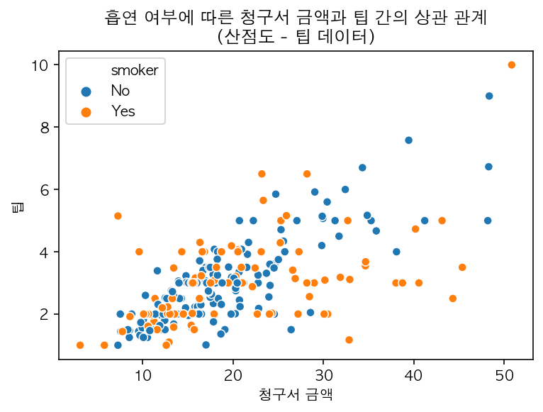

## Lab: 타이타닉 데이터로 산점도 그리기

- - - 

- 타이타닉 생존 데이터에서 나이(age)와 운임(fare)의 상관 관계를 보여주는 산점도를 그린다. 이 때 산점도에 표시되는 각 점을 '남자(man)', '여자(woman)', 어린이(child)'에 따라 다른 색깔로 표시한다. 

- 전체 도표의 제목과 x축, y축의 라벨을 적절한 내용으로 설정한다. 이 때 각 점의 색깔에 대한 범례에 라벨을 설정한다. 

- - -

**답**


```python
# Your answer here
```

# 히트맵

히트맵은 2차원 데이터를 색으로 표시한다.

히트맵을 작성하려면 **heatmap()** 메소드를 주로 **heatmap(*data, cmap=None, annot=None, fmt='.2g', annot_kws=None, linewidths=0*)** 형식으로 사용하면 된다.
- ***data*** 는 다차원 배열(ndarray)으로 변환할 수 있는 2차원 데이터 세트나 데이터프레임이다.
- ***cmap*** 으로 히트맵의 색상을 설정한다.
- ***annot*** 은 **bool** 자료형을 입력하여 히트맵의 각 셀 안에 데이터 값을 표시할지 여부를 정한다.
- ***fmt*** 는 각 셀 안에 표시하는 값의 포맷을 설정한다. 문자열로 입력하고 예를 들어 '.2f'를 입력하면 소수점 두 번째 자리까지 표시한다.
- ***annot_kws*** 는 ***annot***이 **True**일 때 각 셀 안에 표기하는 값의 글자의 크기와 위치 등을 설정할 수 있다.
- ***linewidths*** 는 각 셀을 나누는 선의 너비를 설정한다.
- 양 축에 라벨링을 하려면 **pyplot.xlabel()** 과 **pyplot.ylabel()** 을 호출하면 된다.
- 더 자세한 내용은 아래의 링크에서 확인할 수 있다.
    - https://seaborn.pydata.org/generated/seaborn.heatmap.html


**[참고 1]**  
매개변수 ***cmap*** 은 컬러맵을 뜻하는데 이 컬러맵은 네 가지 종류가 있다.
1. **sequential colormap**은 색의 밝기와 채도를 점차적으로 증가시키는 컬러맵이다. 순차가 있는 값을 나타낼 때 사용한다. 
1. **diverging colormap**은 색의 밝기와 채도가 변하는 두 가지 색상이 중앙에서 만나게 된다. 양 또는 음의 편차를 강조하는 양극성 데이터에 주로 사용한다. 
1. **cyclic colormap**은 색의 사이클을 이용하는 컬러맵이다. 시간과 같이 시작과 끝이 같은 값에 주로 사용한다.
1. **qualitative colormap**은 순차가 없는 범주형 데이터에 주로 사용한다. 즉, 범주를 구분하기 위해 색이 사용한다.


**[참고 2]**  
히트맵은 값에 따라 색의 진한 정도가 달라지기 때문에 sequential colormap에 해당하는 색 전달인자를 사용한다. 대표적으로 Greys, Purples, Blues, YlGnBu, BuPu 등이 있다. Greys는 회색, Purples는 보라색, Blues는 파란색으로 값에 따라 진하기를 다르게 표현한다. YlGnBu는 노랑색, 초록색, 파란색을 같이 사용하여 값에 따라 노랑색에서 파랑색으로 진하기를 다르게 표현한다. BuPu는 파란색, 보라색을 같이 사용하여 값에 따라 색이 파란색에서 보라색으로 표현한다. 더 자세한 내용은 아래의 링크에서 확인할 수 있다.
- https://matplotlib.org/3.1.1/gallery/color/colormap_reference.html

[seaborn.heatmap](https://seaborn.pydata.org/generated/seaborn.heatmap.html)
- Plot rectangular data as a color-encoded matrix.
- seaborn.**heatmap**(_data, vmin=None, vmax=None, cmap=None, center=None, robust=False, annot=None, fmt='.2g', annot_kws=None, linewidths=0, linecolor='white', cbar=True, cbar_kws=None, cbar_ax=None, square=False, xticklabels='auto', yticklabels='auto', mask=None, ax=None, **kwargs_)
    - This is an Axes-level function and will draw the heatmap into the currently-active Axes if none is provided to the ax argument. 
    - Part of this Axes space will be taken and used to plot a colormap, unless ***cbar*** is **False** or a separate Axes is provided to ***cbar_ax***.    

히트맵을 생성하려면 피벗 테이블을 사용해야 한다. 따라서 히트맵 작성에 앞서 피벗 테이블을 작성한다. 피벗 테이블에 대한 간단한 설명은 바로 다음의 내용을 참고하면 된다.

다음 예는 항공기 데이터를 이용하여 연도와 월을 각각 행과 열로 설정하고 연도별 매월 탑승객 수를 피벗 테이블로 작성한 코드다.


```python
# --- 항공기 데이터(flights)에서 연도별 매월 탐승객 수를 피벗 테이블로 작성한다.
# > 항공기 데이터는 연도별 월별 승객 수를 기록한 데이터 세트다.
# > year(연도), month(월), passengers(승객 수)로 총 3 개의 속성을 가지고 있다.

# 항공기 데이터에서 values='passengers'로 탑승객 수를 집계한다.
# index='year'로 설정하여 행을 연도로 columns='month'로 설정하여 
# 열을 월별로 해서 피벗 테이블을 작성한다.
flights_pivot = pandas.pivot_table(flights, values='passengers', 
                                  index='year', columns='month')
print(flights_pivot)
```

    month  January  February  March  April  May  June  July  August  September  \
    year                                                                         
    1949       112       118    132    129  121   135   148     148        136   
    1950       115       126    141    135  125   149   170     170        158   
    1951       145       150    178    163  172   178   199     199        184   
    1952       171       180    193    181  183   218   230     242        209   
    1953       196       196    236    235  229   243   264     272        237   
    1954       204       188    235    227  234   264   302     293        259   
    1955       242       233    267    269  270   315   364     347        312   
    1956       284       277    317    313  318   374   413     405        355   
    1957       315       301    356    348  355   422   465     467        404   
    1958       340       318    362    348  363   435   491     505        404   
    1959       360       342    406    396  420   472   548     559        463   
    1960       417       391    419    461  472   535   622     606        508   
    
    month  October  November  December  
    year                                
    1949       119       104       118  
    1950       133       114       140  
    1951       162       146       166  
    1952       191       172       194  
    1953       211       180       201  
    1954       229       203       229  
    1955       274       237       278  
    1956       306       271       306  
    1957       347       305       336  
    1958       359       310       337  
    1959       407       362       405  
    1960       461       390       432  


다음 예는 앞서 작성한 피벗 테이블로 히트맵을 그리는 코드다.


```python
# pyplot.figure(figsize=(10, 8))로 히트맵의 크기를 설정한다.
pyplot.figure(figsize=(10, 8))

# annot=True, fmt='d'로 셀 안의 데이터 값을 정수 형태로 표시한다.
seaborn.heatmap(__TODO__)

# pyplot.ylim(0, 12)으로 설정하여 히트맵의 y축의 범위가 1949부터 1960이 되도록 한다.
# ylim()을 설정하지 않으면 위에서 작성된 피벗 테이블의 형태 그대로 히트맵을 생성하게 되어
# y축의 시작(즉, 좌측 하단)이 1960이 된다.
pyplot.__TODO__

pyplot.title('연도별 월별 승객 수\n(히트맵 - 항공기 데이터)')
pyplot.xlabel('월')
pyplot.ylabel('년')
pyplot.show()
```

**실행 결과**  

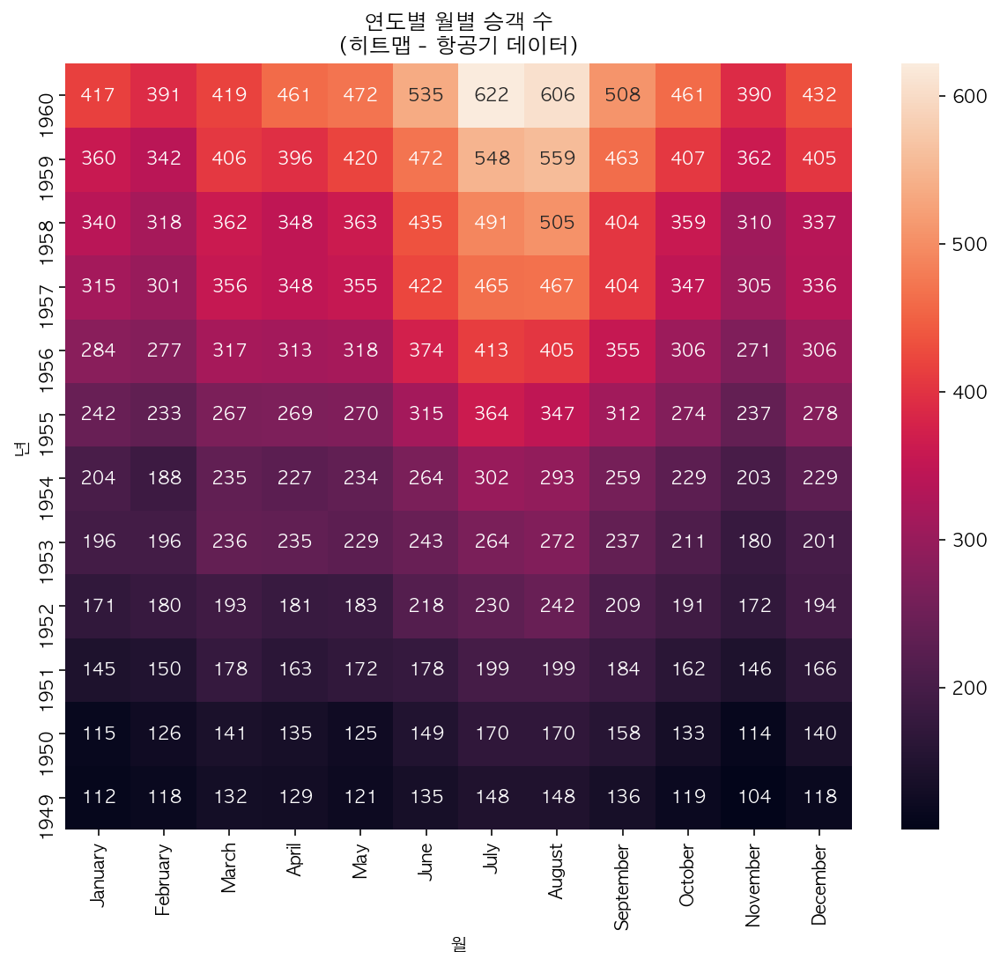

다음 예는 앞서 작성한 히트맵의 ***cmap*** 설정을 통해 색상을 다르게 표현한 코드다.


```python
# cmap='Greens'로 설정하여 값이 클수록 진한 초록색으로 표현되게 하였다.
pyplot.figure(figsize=(10, 8))
seaborn.heatmap(__TODO__)

pyplot.__TODO__
pyplot.title('연도별 월별 승객 수\n(히트맵 - 항공기 데이터)')
pyplot.xlabel('월')
pyplot.ylabel('년')
pyplot.show()
```

**실행 결과**  

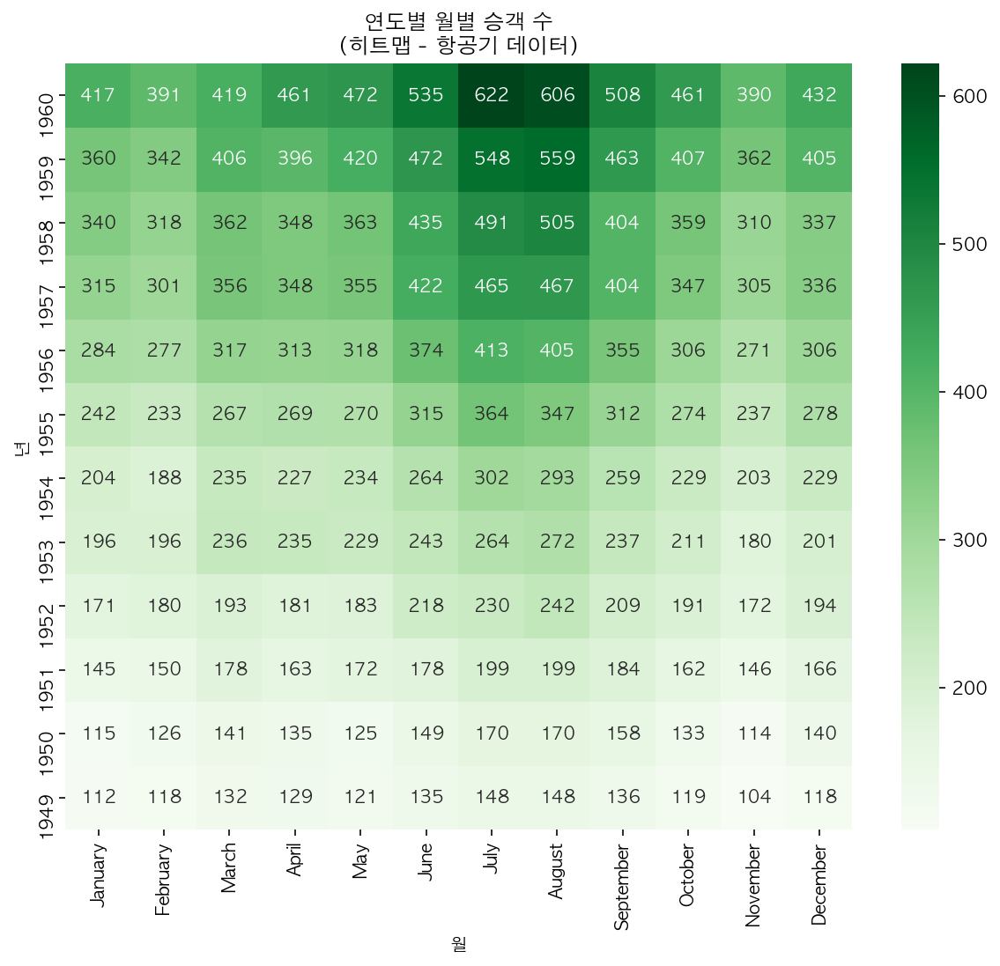

다음 예는 앞서 작성한 피벗 테이블로 히트맵을 그리되 다양한 전달인자로 도표의 모양을 조금 다르게 표현한 코드다.


```python
# pyplot.figure(figsize=(10, 8))로 히트맵의 크기를 설정한다.
pyplot.figure(figsize=(10, 8))

# annot=True, fmt='d'로 셀 안의 데이터 값을 정수 형태로 표시한다.
# cmap='BuPu'로 설정하여 값이 작으면 연한 파랑이며 값이 커질수록 진한 보라색으로 표현한다.
# annot_kws={'size': 14}로 셀 안의 글자 폰트를 설정한다. 
# linewidths=4로 설정하여 셀 사이의 공간을 설정한다.
seaborn.heatmap(__TODO__)

# 히트맵 출력 전에 pyplot.ylim(0, 12)을 설정하여 히트맵의 y축의 범위가 1949부터 1960이 되도록 한다.
# pyplot.ylim(0, 12)이 없으면 위에서 작성된 피벗 테이블의 형태 그대로 히트맵이 작성되어 y축의 시작(즉, 좌측 하단)이 1960이 된다.
# pyplot.title()을 이용하여 제목을 지었고, pyplot.xlabel()과 pyplot.ylabel()을 이용하여 x축과 y축에 라벨링을 하였다.
pyplot.__TODO__

pyplot.title('연도별 월별 승객 수\n(히트맵 - 항공기 데이터)')
pyplot.xlabel('월')
pyplot.ylabel('년')
pyplot.show()
```

**실행 결과**  

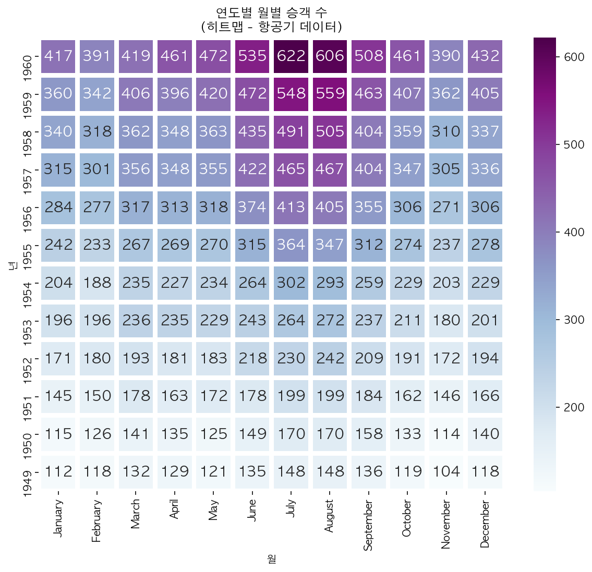

## 피벗 테이블

피벗 테이블은 피벗 테이블의 행(index)과 열(columns)로 사용할 두 개의 열을 데이터프레임에서 가져와서 테이블로 작성한다. 

피벗 테이블을 생성하기 위해서는 **pandas** 패키지를 사용한다. 판다스는 피벗 테이블을 만드는 **pivot_table()** 메소드를 제공하며, 매개변수 **index**와 **columns**를 사용하여 피벗 테이블의 행과 열을 설정한다. 

피벗 테이블을 작성하려면 **pandas.pivot_table()** 메소드를 주로 **pivot_table(*data, values=None, index=None, columns=None, aggfunc='mean', margins=False, margins_name='All'*)** 형식으로 사용하면 된다.

- ***data*** 는 피벗 테이블로 작성할 데이터프레임이다.
- ***values*** 는 데이터프레임에서 ***aggfunc***을 사용하여 집계할(분석할) 열이다.
- ***index*** 는 피벗 테이블에서 행을 의미한다. 데이터프레임의 열 이름(변수명)을 ***index***의 전달인자로 설정한다.
- ***columns*** 는 피벗 테이블에서 열을 의미한다. 데이터프레임의 열 이름(변수명)이 ***columns***의 전달인자로 설정한다.
- ***aggfunc*** 는 분석 메소드이다. 기본값은 **mean**으로 평균을 계산한다. 
- ***margins*** 는 **bool** 자료형을 입력받아 모든 데이터를 분석한 결과를 오른쪽과 아래에 붙일지 여부를 설정한다. 기본값은 **False**다.
- ***margins_name*** 는 분석한 결과로 만들어지는 행과 열의 이름을 설정한다.
- 더 자세한 내용은 아래의 링크에서 확인할 수 있다.
    - https://pandas.pydata.org/pandas-docs/stable/reference/api/pandas.pivot_table.html

피벗 테이블은 제목을 설정할 수 없고 데이터프레임에서 행과 열을 그대로 가져오므로 라벨링도 임의로 할 수 없다. 단지 분석 메소드를 통해 만들어지는 새로운 행과 열의 이름만 설정이 가능하다.

[pandas.pivot_table](https://pandas.pydata.org/pandas-docs/stable/reference/api/pandas.pivot_table.html)
- Create a spreadsheet-style pivot table as a DataFrame.
- pandas.**pivot_table**(_data, values=None, index=None, columns=None, aggfunc='mean', fill_value=None, margins=False, dropna=True, margins_name='All', observed=False)_
    - The levels in the pivot table will be stored in MultiIndex objects (hierarchical indexes) on the index and columns of the result DataFrame.

다음 예는 팁 데이터를 이용하여 성별로 흡연 여부를 각각 행과 열로 이루어진 피벗 테이블로 작성한 코드다.


```python
# --- 팁 데이터(tips)에서 성별로 흡연 여부를 각각 행과 열로 하여 피벗 테이블로 작성한다.
# > 팁 데이터는 고객 정보와 고객의 청구서 금액 및 팁을 기록한 데이터 세트다.
# > total_bill(전체 금액), tip(팁), sex(성별), smoker(흡연자 여부), 
# > day(요일), time(시간), size(인원 수)로 총 7개의 속성을 가지고 있다.

# 성별, 흡연자 여부에 따른 고객 데이터를 피벗 테이블로 작성한다.
# index='sex'로 피벗 테이블의 행을 성별로, columns='smoker'로 하여 열을 흡연 여부로 설정한다.
# aggfunc='size'로 단순히 빈도를 계산하여 테이블로 작성한다.
tips_pivot = pandas.pivot_table(tips, index='sex', columns='smoker', aggfunc='size')
print(tips_pivot)
```

    smoker  Yes  No
    sex            
    Male     60  97
    Female   33  54


다음 예는 팁 데이터를 이용하여 성별로 흡연 여부를 각각 행과 열로 이루어진 피벗 테이블로 작성하고 고객들이 지불한 청구서 금액의 평균을 계산하는 코드다.


```python
# --- 팁 데이터(tips)에서 성별로 흡연 여부를 각각 행과 열로 이루어진 피벗 테이블로 작성하고 고객들이 지불한 청구서 금액의 평균을 계산한다.
# > 팁 데이터는 고객 정보와 고객의 청구서 금액 및 팁을 기록한 데이터 세트다.
# > total_bill(전체 금액), tip(팁), sex(성별), smoker(흡연자 여부), 
# > day(요일), time(시간), size(인원 수)로 총 7개의 속성을 가지고 있다.

# index='sex'로 피벗 테이블의 행을 성별로, columns='smoker'로 하여 열을 흡연 여부로 설정한다.
# values='total_bill', aggfunc='mean', margins=True로 설정하여 
# 청구서 금액의 평균을 계산하고 피벗 테이블에 새로운 행과 열로 추가한다.
# margins_name='Average Total Bill'로 설정하여 계산 결과로 만들어지는 행과 열 이름을 Average Total Bill로 한다.
bill_pivot = pandas.pivot_table(tips, values='total_bill', 
                                index='sex', columns='smoker',
                                aggfunc='mean', margins=True, 
                                margins_name='Average Total Bill')
print(bill_pivot)
```

    smoker                    Yes         No  Average Total Bill
    sex                                                         
    Male                22.284500  19.791237           20.744076
    Female              17.977879  18.105185           18.056897
    Average Total Bill  20.756344  19.188278           19.785943


## Lab: 타이타닉 데이터로 히트맵 만들기

- - -

- 타이타닉 생존 데이터에서 클래스 등급(class)과 성별(sex)에 대한 승객 수를 히트맵으로 작성한다.

- 히트맵이 피벗 테이블을 데이터로 사용하기 때문에 먼저 타이타닉 생존 데이터로 피벗 테이플 생성한다.

- 히트맵의 각 셀 안에 승객 수를 정수로 기록하도록 설정한다.

- y축 구간을 설정하여 클래스 등급의 범주가 좌측 하단부터 그려되도록 설정한다.

- 전체 도표의 제목과 x축, y축의 라벨을 적절한 내용으로 설정한다.


- - -

**답**


```python
# Your answer here
```

# 조인트 플롯

조인트 플롯(joint plot)은 특정 그래프를 도표의 안쪽에 그리고 그래프의 가장자리에는 안에 그려진 그래프에 따라 히스토그램 또는 커널 밀도 플롯을 그려주는 도표다.

조인트 플롯을 작성하려면 **jointplot()** 메소드를 주로 **jointplot(*x, y, data=None, kind='scatter', color=None, height=6, space=0.2*)** 형식으로 사용하면 된다.

- ***x*** 는 x축에 그려지는 데이터 또는 데이터의 열 이름(변수명) 문자열이다.
- ***y*** 는 y축에 그려지는 데이터 또는 데이터의 열 이름(변수명) 문자열이다.
- ***data*** 는 입력되는 전체 데이터의 이름이다.
- ***kind*** 는 안에 그려지는 그래프의 종류를 설정한다. *{ 'scatter' &#124; 'reg' &#124; 'resid' &#124; 'kde' &#124; 'hex' }* 중 하나를 선택하며 기본값은 **'scatter'** 로 산점도를 그린다. 가장자리에는 자동으로 히스토그램을 그린다. **'reg'** 는 데이터와 선형회귀의 직선을 그려주는 **regplot**을, **'resid'** 는 데이터와 잔차(residual)를 그려주는 **residplot**을, **'hex'** 는 데이터의 수를 육각형의 형태로 보여주는 **hexbin** 플롯을 뜻한다. 여기서 선형회귀의 직선은 데이터로부터 *x*와 *y*의 관계를 가장 잘 나타내는 직선을 뜻하고 잔차(redidual)는 데이터의 관측값과 예측값의 차이를 뜻한다. 이 때 **'scatter'** 나 **'hex'** 를 선택하면 가장자리 도형으로는 히스토그램을 그려주며, **'kde'** 를 선택하면 가장자리 도형으로는 **1**차원 커널 밀도를 그린다. **'reg'** 이나 **'reside'** 를 선택하면 가장자리 도형으로 히스토그램과 **1**차원 커널밀도 둘 다 함께 그린다.
    - 잔차(residual)는 표본 집단(sample)에서 도출한 회귀식으로 얻은 예측값과 실제 데이터 값과의 차이를 뜻한다. 
    - 표본 집단은 전체 대상인 모집단으로부터 추출된 모집단의 부분 집합이다.
    - 모집단에서 도출한 회귀식으로 얻은 예측값과 실제 데이터값의 차이는 오차(error)라고 한다.
- ***color*** 는 안과 가장자리에 그려지는 그래프의 점, 선의 색상을 설정한다. 대표적인 컬러로 파랑색은 **'b'**, 초록색은 **'g'**, 빨강색은 **'r'**, 노랑색은 **'y'**, 하양색은 **'w'**, 검정색은 **'k'** 등이 있다. 더 많은 컬러 문자열은 아래의 링크에서 확인할 수 있다.
    - https://matplotlib.org/3.1.0/gallery/color/named_colors.html
- ***height*** 는 작성하는 전체 그래프의 사이즈를 설정한다. 숫자를 입력하며 전체 그래프는 입력한 숫자의 크기를 변의 길이로 가지는 정사각형 형태로 그려진다.
- ***space*** 는 안에 그려지는 그래프와 가장자리에 그려지는 그래프 사이의 공간을 설정한다. 숫자를 입력하며 **0**에 가까울 수록 두 그래프는 가까워진다.
- 더 자세한 내용은 아래의 링크에서 확인할 수 있다.
    - https://seaborn.pydata.org/generated/seaborn.jointplot.html

하나의 그래프에 제목을 설정할 때는 **pyplot.title()** 을 이용한다. 하지만 조인트 플롯에 **pyplot.title()** 을 사용하면 제목의 위치가 내부 도표와 외부 도표 사이에 위치하게 된다. 조인트 플롯 전체에 대한 제목을 설정하려면 **pyplot.suptitle()** 을 호출해야 한다. 조인트 플롯에서 내부 도표와 외부 도표에 각각 제목을 짓는 것은 가능하지 않다. 비록 조인트 폴롯으로 두 개의 그래프를 그리지만 서브플롯(subplot)의 개념이 아니라 조인트 플롯 자체가 하나의 도표이기 때문이다.

조인트 플롯에서 각 축을 라벨링 하려면 **jointplot**이 반환하는 객체를 변수에 할당하고 해당 변수에 **set_axis_labels**(*xlabel='', ylabel=''*)로 값을 설정하여 각 축을 라벨링한다. 
- **jointplot**이 반환하는 객체는 **JointGrid**다.
- **JointGrid**는 이변량 플롯(bivariate plot)을 그리기 위한 그리드이다.

[seaborn.jointplot](https://seaborn.pydata.org/generated/seaborn.jointplot.html)
- Draw a plot of two variables with bivariate and univariate graphs.
- seaborn.**jointplot**(*x, y, data=None, kind='scatter', stat_func=None, color=None, height=6, ratio=5, space=0.2, dropna=True, xlim=None, ylim=None, joint_kws=None, marginal_kws=None, annot_kws=None, **kwargs*)
    - This function provides a convenient interface to the JointGrid class, with several canned plot kinds. 
    - This is intended to be a fairly lightweight wrapper; if you need more flexibility, you should use JointGrid directly.

다음 예 붓꽃 데이터의 꽃받침의 길이와 꽃잎 길이로 도표를 작성하되 도표 안에는 산점도를 바깥에는 히스토그램을 보여주는 조인트 플롯을 작성한 코드다.


```python
# --- 붓꽃 데이터(iris)에서 꽃받침의 길이와 꽃잎 길이의 상관 관계를 조인트 플롯(산점도 + 히스토그램)으로 작성한다.
# > 붓꽃 데이터는 꽃과 관련된 속성들과 어떤 종류의 붓꽃인지를 기록한 데이터 세트다.
# > sepal_length(꽃받침의 길이), sepal_width(꽃받침의 너비), 
# > petal_length(꽃잎의 길이), petal_width(꽃잎의 너비), 
# > species(꽃의 종류)로 총 5개의 속성을 가지고 있다.

# x='sepal_length', y='petal_length', data=iris로 설정하여 
# 붓꽃 데이터에서 x축을 꽃받침의 길이, y축을 꽃잎의 길이로 산점도를 그린다.
# 조인트 플롯이 반환하는 객체를 변수로 할당해서 양 축을 라벨링할 때 사용한다.
g = seaborn.jointplot(__TODO__)

# 조인트 플롯의 반환한 JointGrid의 set_axis_labels()를 사용하여 x축과 y축을 라벨링한다.
g.set_axis_labels(__TODO__)

# 하나의 전체 결과 그림에 제목을 지어주기 위해 pyplot.suptitle()을 사용한다.
# pyplot.suptitle(y=1.05)로 제목의 y좌표를 설정하여 가장자리의 히스토그램과 겹치지 않도록 한다.
pyplot.suptitle('꽃받침 길이와 꽃잎 길이의 상관 관계\n(조인트 플롯(산점도 + 히스토그램) - 붓꽃 데이터)', 
                __TODO__)
pyplot.show()
```

**실행 결과**  

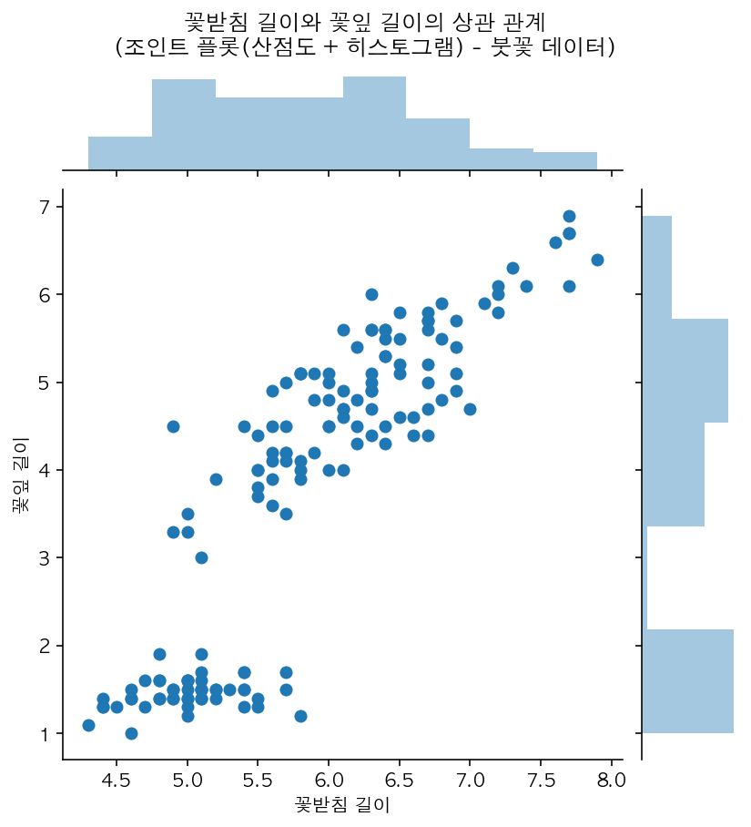

다음 예는 붓꽃 데이터의 꽃받침 길이와 꽃잎 길이로 도표를 작성하되 내부 도표로 산점도 대신 커널 밀도 플롯을 보여주는 조인트 플롯을 작성한 코드다.


```python
# --- 붓꽃 데이터(iris)에서 꽃받침의 길이와 꽃잎 길이의 상관 관계를 커널 밀도 플롯을 보여주는 조인트 플롯으로 작성한다.
# > 붓꽃 데이터는 꽃과 관련된 속성들과 어떤 종류의 붓꽃인지를 기록한 데이터 세트다.
# > sepal_length(꽃받침의 길이), sepal_width(꽃받침의 너비), 
# > petal_length(꽃잎의 길이), petal_width(꽃잎의 너비), 
# > species(꽃의 종류)로 총 5개의 속성을 가지고 있다.

# 바로 이전에 작성한 코드에서 kind='kde'로 설정하여 내부 도표를 산점도가 아닌 커널 밀도 플롯으로 그린다.
# 따라서 도표 안쪽에는 2차원 커널 밀도 플롯을, 바깥쪽에는 1차원 커널 밀도 플롯을 그리는 조인트 플롯이다.
# 조인트 플롯은 안에 그리는 그래프의 종류를 { 'scatter' | 'reg' | 'resid' | 'kde' | 'hex' } 중 
# 하나를 선택할 수 있는데, 'scatter'나 'hex'를 선택하면 가장자리에 히스토그램을 그려주며, 
# 'kde'를 선택하면 가장자리에는 1차원 커널 밀도를 그린다.
# 'reg'이나 'reside'를 선택하면 가장자리에 히스토그램과 1차원 커널밀도 둘 다 함께 그린다.
# x='sepal_length', y='petal_length', data=iris로 설정하여 
# 붓꽃 데이터에서 x축을 꽃받침의 길이, y축을 꽃잎의 길이로 커널 밀로 플롯을 그린다.
# 조인트 플롯이 반환하는 객체를 변수로 할당해서 양 축을 라벨링 할 때 사용한다.
g = seaborn.jointplot(__TODO__)

# 조인트 플롯의 반환한 JointGrid의 set_axis_labels()를 사용하여 x축과 y축을 라벨링한다.
g.set_axis_labels(__TODO__)

# 하나의 전체 결과 그림에 제목을 지어주기 위해 pyplot.suptitle을 사용한다.
# pyplot.suptitle(y=1.05)로 제목의 y좌표를 설정하여 가장자리의 히스토그램과 겹치지 않도록 한다.
pyplot.suptitle('꽃받침 길이와 꽃잎 길이의 상관 관계\n(조인트 플롯(커널 밀도, kde) - 붓꽃 데이터)', 
                __TODO__)
pyplot.show()
```

**실행 결과**  

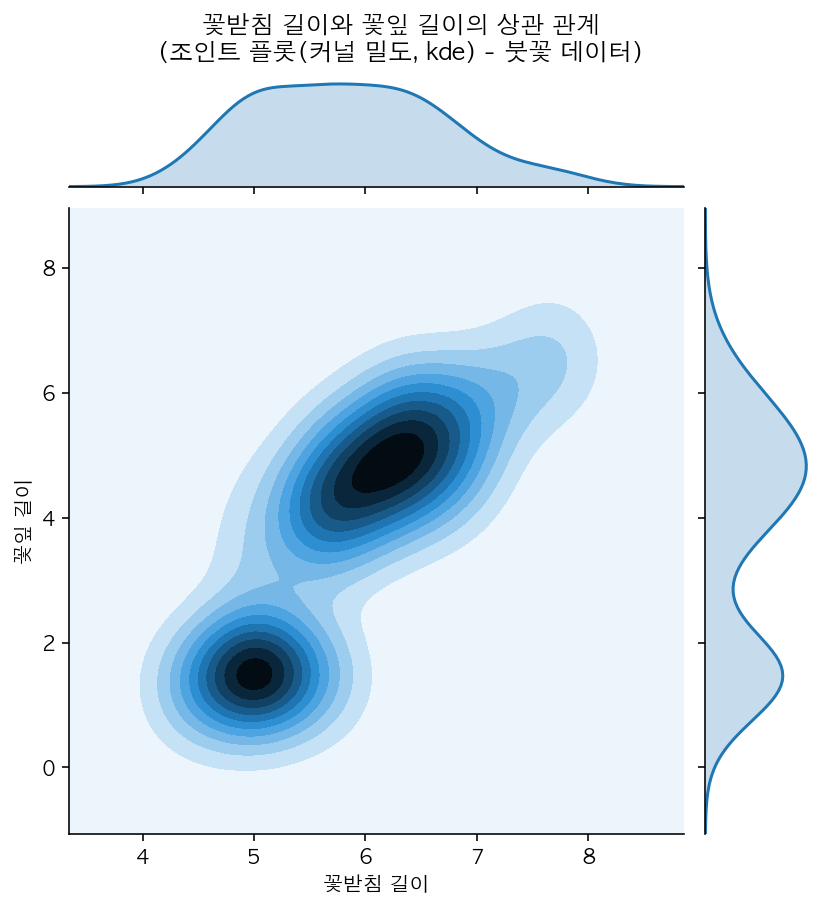

**jointplot**이 반환하는 객체인 **Jointrid**의 **plot_joint()**로 세 개의 그래프도 그릴 수 있다. 아래 코드는 안에 산점도와 가장자리에 히스토그램을 그린 후 안에 커널 밀도 플롯을 추가한 코드다.


```python
# --- 붓꽃 데이터(iris)에서 꽃받침의 길이와 꽃잎 길이의 상관 관계를 조인트 플롯(산점도 + 히스토그램 + 커널 밀도)으로 작성한다.
# > 붓꽃 데이터는 꽃과 관련된 속성들과 어떤 종류의 붓꽃인지를 기록한 데이터 세트다.
# > sepal_length(꽃받침의 길이), sepal_width(꽃받침의 너비), 
# > petal_length(꽃잎의 길이), petal_width(꽃잎의 너비), 
# > species(꽃의 종류)로 총 5개의 속성을 가지고 있다.

# jointplot의 메소드가 반환하는 JointGrid 객체의 plot_joint() 메소드로 seaborn.kdeplot을 전달하여 
# 조인트 플롯 안에 2차원 커널 밀도 플롯을 추가한다. 따라서 도표의 안쪽에는 산점도와 2차원 커널 밀도 플롯을, 
# 바깥쪽에는 히스토그램을 그린 이 조인트 플롯을 grid라는 변수에 할당한다.
# color='k'로 설정하여 산점도의 점과 히스토그램의 막대를 검정색으로 설정한다. 
g = seaborn.jointplot(__TODO__)

# 조인트 플롯의 반환한 JointGrid의 set_axis_labels()를 사용하여 x축과 y축을 라벨링한다.
g.set_axis_labels(__TODO__)

# 하나의 전체 결과 그림에 제목을 지어주기 위해 pyplot.suptitle을 사용한다.
# pyplot.suptitle(y=1.05)로 제목의 y좌표를 설정하여 가장자리의 히스토그램과 겹치지 않도록 한다.
pyplot.suptitle('꽃받침 길이와 꽃잎 길이의 상관 관계\n(조인트 플롯(산점도 + 히스토그램 + 커널 밀도) - 붓꽃 데이터)', 
                __TODO__)
pyplot.show()
```

**실행 결과**  

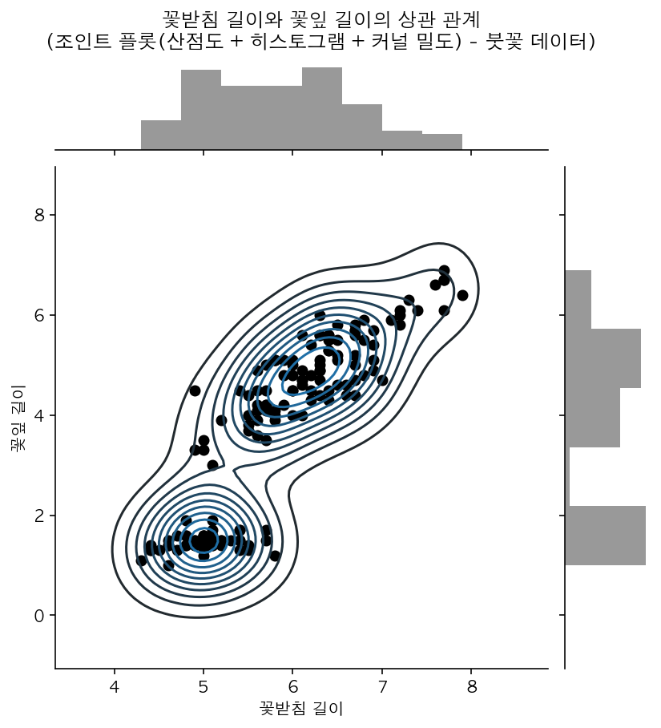

## Lab: 타이타닉 데이터로 조인트 플롯 그리기

- - - 

- 타이타닉 생존 데이터에서 승객의 나이(age)와 운임(fare)의 상관 관계를 조인트 플롯(산점도 + 히스토그램)으로 작성한다. 이 때 조인트 플롯의 내부 도표는 산점도로 하고 가장자리는 히스토그램으로 한다.

- 도표의 제목은 가장자리의 히스토그램 위에 오도록 설정한다.

- x축과 y축의 라벨도 설정한다.

- - -

**답**


```python
# Your answer here
```

# 캣 플롯

캣 플롯은 앞에서 설명한 여러 그래프와 플롯 중 하나를 사용하여 범주형 변수와 수치형 변수 간의 관계를 시각화한다.

캣 플롯은 범주형 변수와 수치형 변수간의 관계를 사용자가 원하는 그래프 중 하나를 선택하여 시각화한다. 이 때 매개 변수 ***row*** 와 ***col*** 에 범주형 변수를 입력하면 선택한 그래프를 범주에 따라 여러 개의 행이나 열로 그려준다. 즉, 캣 플롯은 범주형 변수와 수치형 변수간의 관계를 각 범주에 따라 한 가지 종류의 그래프로 여러 개를 그린다.

캣 플롯을 작성하려면 **catplot()** 메소드를 주로 **catplot(*x=None, y=None, hue=None, data=None, row=None, col=None, kind='strip'*)** 형식으로 사용하면 된다.

- ***x, y*** 에는 데이터의 변수명을 입력한다. ***x*** 와 ***y*** 에는 범주형 변수와 수치형 변수를 각각 하나씩 입력해야 한다. 두 개의 수치형 변수를 입력할 수는 있지만 그럴 경우 ***x***에 입력하는 수치형 데이터 값을 각각 하나의 범주로 간주하여 그린다.
- ***hue*** 에는 데이터의 변수명을 입력하며 생성한 범주별 도표를 입력한 변수의 범주에 따라 다른 색으로 표현한다.
- ***data*** 는 입력한는 전체 데이터의 이름이다.
- ***row, col*** 은 범주형 변수명을 입력하여 범주 별로 그래프를 행과 열로 작성한다.
- ***kind*** 는 그릴 플롯의 종류를 설정한다. *{'point' &#124; 'bar' &#124; 'strip' &#124; 'swarm' &#124; 'box' &#124; 'violin' &#124; 'boxen'}* 중 하나를 선택한다. 기본값은 **'strip'** 으로 스트립 플롯을 그린다. **'point'** 는 꺾은선 그래프를 그려주는 **pointplot**을, **'boxen'** 은 큰 데이터 세트에 사용되는 박스 그래프인 **boxenplot**을 그린다.  
- 더 자세한 내용은 아래의 링크에서 확인할 수 있다.
    - https://seaborn.pydata.org/generated/seaborn.catplot.html

캣 플롯에서는 행으로 표현하기 원하는 범주형 변수는 매개변수 ***row*** 에 설정하고, 열로 표현하기 원하는 범주형 변수는 매개변수 ***col*** 에 설정하면 된다.

**catplot()** 메소드에서 **x**와 **y** 변수만 입력하여 하나의 그래프를 그리면 **pyplot.title**로 제목을 짓고 x축과 y축을 라벨링 할 때 **pyplot.xlabel()** 과 **pyplot.ylabel()** 을 호출하면 된다. 

캣 플롯에서 각 축을 라벨링 하려면 **catplot**이 반환하는 객체를 변수에 할당하고 해당 변수에 **set_axis_labels**(*xlabel='', ylabel=''*)로 값을 설정하여 각 축을 라벨링한다. 
- **catplot**이 반환하는 객체는 **FacetGrid**다.
- **FacetGrid**는 변수 간의 관계를 범주에 따라 행과 열로 표현하는 그리드다.
    - **seaborn** 패키지에서는 FacetGrid를 '조건부 관계(conditional relationships)를 그리기 위한 다중 플롯 그리드'로 정의하고 있다.
  
**catplot()** 메소드에서 매개변수 ***row*** 를 사용하여 캣 플롯이 ***row*** 의 범주에 따라 여러 개의 서브 플롯들로 그릴 수 있다. 그러므로 전체 도표에 대해 제목을 짓기 위해서는 **pyplot.suptitle()** 을 사용해야 한다. 여러 개의 서브 플롯이 그려지면 캣 플롯이 반환하는 객체를 변수에 할당하고 **axes** 속성을 이용하여 라벨링을 할 수 있다. 그려지는 서브 플롯의 순서에 따라 **axes[x, y].set_xlabel()**, **axes[x, y].set_ylabel()** 로 라벨링을 한다. 여기서 **[x, y]** 은 몇 번째 서브 플롯인지를 설정한다. ***x*** 가 행이 되고 ***y*** 가 열이 되는데 예를 들어 **[0, 3]** 이라면 첫 번째 행의 네번째 열을 의미한다.

[seaborn.catplot](https://seaborn.pydata.org/generated/seaborn.catplot.html)
- Figure-level interface for drawing categorical plots onto a FacetGrid.
- seaborn.**catplot**(_x=None, y=None, hue=None, data=None, row=None, col=None, col_wrap=None, estimator=<function mean at 0x10a2a03b0>, ci=95, n_boot=1000, units=None, seed=None, order=None, hue_order=None, row_order=None, col_order=None, kind='strip', height=5, aspect=1, orient=None, color=None, palette=None, legend=True, legend_out=True, sharex=True, sharey=True, margin_titles=False, facet_kws=None, **kwargs_)
    - This function provides access to several axes-level functions that show the relationship between a numerical and one or more categorical variables using one of several visual representations. The kind parameter selects the underlying axes-level function to use:
        - Categorical scatterplots:
            - stripplot() (with kind="strip"; the default)
            - swarmplot() (with kind="swarm")
        - Categorical distribution plots:
            - boxplot() (with kind="box")
            - violinplot() (with kind="violin")
            - boxenplot() (with kind="boxen")
        - Categorical estimate plots:
            - pointplot() (with kind="point") 
            - barplot() (with kind="bar")
            - countplot() (with kind="count")
    - Extra keyword arguments are passed to the underlying function, so you should refer to the documentation for each to see kind-specific options.
    - Note that unlike when using the axes-level functions directly, data must be passed in a long-form DataFrame with variables specified by passing strings to x, y, hue, etc.
    - As in the case with the underlying plot functions, if variables have a categorical data type, the the levels of the categorical variables, and their order will be inferred from the objects. Otherwise you may have to use alter the dataframe sorting or use the function parameters (orient, order, hue_order, etc.) to set up the plot correctly.
    - This function always treats one of the variables as categorical and draws data at ordinal positions (0, 1, … n) on the relevant axis, even when the data has a numeric or date type.
    - After plotting, the FacetGrid with the plot is returned and can be used directly to tweak supporting plot details or add other layers.

다음 예는 팁 데이터에서 성별 청구액 금액을 캣 플롯을 사용하여 바이올린 플롯으로 작성한 코드다.


```python
# --- 팁 데이터(tips)에서 성별 청구액 금액을 캣 플롯을 사용하여 바이올린 플롯으로 작성한다.
# > 팁 데이터는 고객 정보와 고객의 청구서 금액 및 팁을 기록한 데이터 세트다.
# > total_bill(전체 금액), tip(팁), sex(성별), smoker(흡연자 여부), 
# > day(요일), time(시간), size(인원 수)로 총 7개의 속성을 가지고 있다.

# x='day'로 설정하여 x축을 범주형 변수인 요일로, 
# y='total_bill'로 설정하여 y축을 실숫값인 청구서 금액으로 설정한다.
# kind='violin'으로 설정하여 바이올린 플롯으로 그린다.
# y축에 수치형 데이터 값을 가지는 변수 'total_bill'이 오기 때문에 바이올린 플롯은 세로로 그려진다.
# catplot이 반환하는 객체인 FacetGrid를 'g'라는 변수로 할당한다.
g = seaborn.catplot(__TODO__)

# g.set_xticklabels()로 x축에 작성하는 범주들을 각각 라벨링한다.
g.set_xticklabels(__TODO__)

# pyplot.title()에 pad=20으로 하여 제목을 도표 그림으로부터의 거리를 설정한다.
# 이 거리의 단위는 포인트(point)다. matplotlib에서 포인트의 표준 크기는 1 포인트가 1/72인치다.
pyplot.title('성별 청구 금액\n캣 플롯(바이올린 플롯) - 팁 데이터', __TODO__)
pyplot.xlabel('성별')
pyplot.ylabel('청구 금액')
pyplot.show()
```

**실행 결과**  

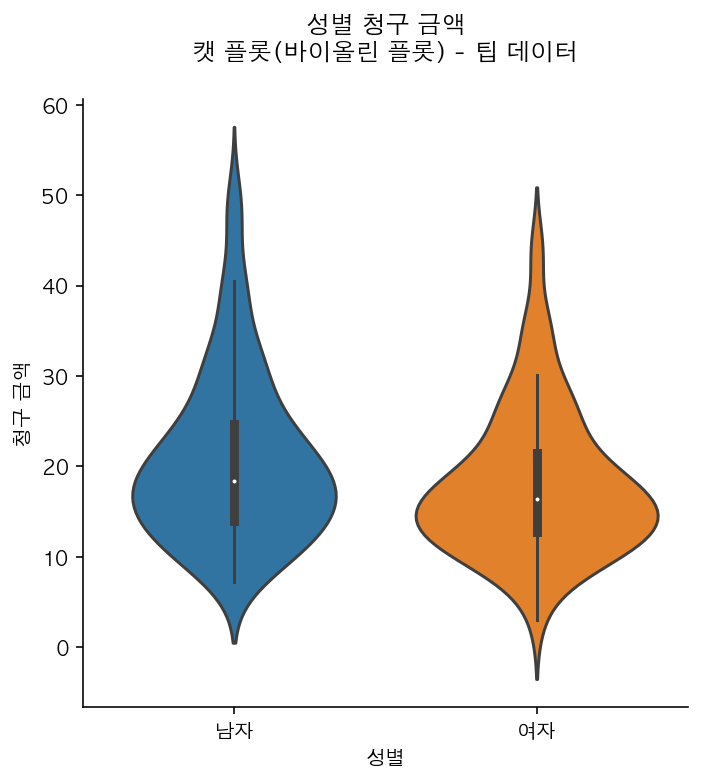

다음 예는 팁 데이터에서 요일 별로 흡연 여부에 따라 성별로 구분하여 청구서 금액과의 관계를 캣 플롯을 사용하여 바이올린 플롯으로 작성한 코드다.


```python
# --- 팁 데이터(tips)에서 요일 별로 흡연 여부에 따라 성별로 구분하여 청구서 금액과의 관계를 
# 캣 플롯을 사용하여 바이올린 플롯으로 작성한 코드다.
# > 팁 데이터는 고객 정보와 고객의 청구서 금액 및 팁을 기록한 데이터 세트다.
# > total_bill(전체 금액), tip(팁), sex(성별), smoker(흡연자 여부), 
# > day(요일), time(시간), size(인원 수)로 총 7개의 속성을 가지고 있다.

# x='sex'로 설정하여 x축을 범주형 변수인 성별로, 
# y='total_bill'로 설정하여 y축을 실숫값인 청구서 금액으로 설정한다.
# kind='violin'으로 설정하여 바이올린 플롯으로 그린다.
# hue='smoker'로 설정하여 성별 바이올린 도형들이 흡연 여부에 따라 작은 바이올린 도형으로 나눠지게 한다.
# 이 때 매개변수 split를 기본값인 False로 해서 흡연 여부에 따라 바이올린 플롯을 나눠서 그리도록 한다.
# 즉 흡연하는 남성, 흡연 하지 않는 남성, 흡연 하는 여성, 흡연 하지 않는 여성으로 총 4개의 바이올린 플롯을 그린다.
# 참고로 매개변수 split를 True로 설정하면 x축에 그려지는 각 바이올린 플롯이 hue의 두 개 범주를 바이올린 플롯의 좌우 날개로 그리게 된다. 
# 즉 x축에 성별에 따라 바이올린 플롯을 두 개 그리는데 hue='smoker'로 설정하였으므로 
# 각 성별 축(남성 또는 여성)에 그려지는 하나의 바이올린 플롯은 흡연 여부로 좌우 날개를 그리게 된다.
# row='day'로 설정하여 요일 범주를 행으로 작성한다.
# y축에 수치형 데이터 값을 가지는 변수 'total_bill'이 오기 때문에 바이올린 플롯은 세로로 그려진다.
# catplot이 반환하는 객체인 FacetGrid를 'g'라는 변수로 할당한다.
g = seaborn.catplot(__TODO__)

# FacetGrid.set_xticklabels()로 x축에 작성하는 범주들을 각각 라벨링한다.
g.set_xticklabels(__TODO__)

# FacetGrid 객체 'g'의 axes속성을 사용하여 라벨링을 한다.
# 그려지는 서브 플롯의 순서에 따라 axes[x, y].set_xlabel(), axes[x, y].set_ylabel()로 라벨링하면 된다.
g.axes[__TODO__].set_xlabel('요일')
g.axes[__TODO__].set_ylabel('목요일 청구서 금액')
g.axes[__TODO__].set_ylabel('금요일 청구서 금액')
g.axes[__TODO__].set_ylabel('토요일 청구서 금액')
g.axes[__TODO__].set_ylabel('일요일 청구서 금액')

# FacetGrid 객체 'g'의 axes로 각 서브플롯을 호출하고 
# 여기에 set_title()을 사용하여 서브플롯의 제목을 짓는다.
g.axes[__TODO__].set_title('목요일')
g.axes[__TODO__].set_title('금요일')
g.axes[__TODO__].set_title('토요일')
g.axes[__TODO__].set_title('일요일')

# 여러 개의 서브 플롯을 그리기 때문에 전체 도표에 대한 제목은 pyplot.suptitle()를 호출하는데 
# y=1.05로 제목을 y축 방향으로 이동한다. 그리고 fontsize를 15로 설정하여 제목의 크기를 크게 한다. 
# 폰트의 기본 크기는 fontsize=12다.
pyplot.suptitle('성별 흡연 여부에 따른 요일별 청구서 금액\n캣 플롯(바이올린 플롯) - 팁 데이터',
                __TODO__, __TODO__)
pyplot.show();
```

**실행 결과**  

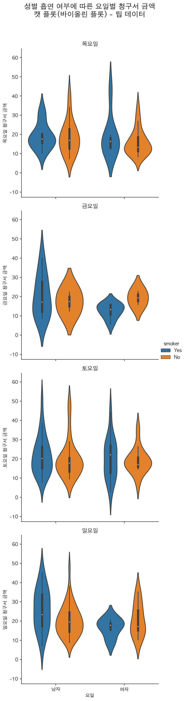

다음 예는 팁 데이터에서 요일 별로 흡연 여부에 따라 성별로 구분하여 청구서 금액과의 관계를 캣 플롯을 사용하여 바이올린 플롯으로 작성한 코드다. 앞의 예와 다르게 이번에는 매개변수 ***split*** 를 **True**로 설정한다.


```python
# --- 팁 데이터(tips)에서 요일 별로 흡연 여부에 따라 성별로 구분하여 청구서 금액과의 관계를 
# 캣 플롯을 사용하여 바이올린 플롯으로 작성한 코드다.
# > 팁 데이터는 고객 정보와 고객의 청구서 금액 및 팁을 기록한 데이터 세트다.
# > total_bill(전체 금액), tip(팁), sex(성별), smoker(흡연자 여부), 
# > day(요일), time(시간), size(인원 수)로 총 7개의 속성을 가지고 있다.

# x='sex'로 설정하여 x축을 범주형 변수인 성별로, 
# y='total_bill'로 설정하여 y축을 실숫값인 청구서 금액으로 설정한다.
# kind='violin'으로 설정하여 바이올린 플롯으로 그린다.
# hue='smoker'로 설정하여 성별 바이올린 도형들이 흡연 여부에 따라 작은 바이올린 도형으로 나눠지게 한다.
# 이 때 매개변수 split를 True로 설정하면 x축에 그려지는 각 바이올린 플롯이 hue의 두 개 범주를 바이올린 플롯의 좌우 날개로 그리게 된다. 
# 즉 x축에 성별에 따라 바이올린 플롯을 두 개 그리는데 hue='smoker'로 설정하였으므로 
# 각 성별 축(남성 또는 여성)에 그려지는 하나의 바이올린 플롯은 흡연 여부로 좌우 날개를 그리게 된다.
# row='day'로 설정하여 요일 범주를 행으로 작성한다.
# y축에 수치형 데이터 값을 가지는 변수 'total_bill'이 오기 때문에 바이올린 플롯은 세로로 그려진다.
# catplot이 반환하는 객체인 FacetGrid를 'g'라는 변수로 할당한다.
g = seaborn.catplot(__TODO__)

# FacetGrid.set_xticklabels()로 x축에 작성하는 범주들을 각각 라벨링한다.
g.set_xticklabels(__TODO__)

# FacetGrid 객체 'g'의 axes 속성을 사용하여 라벨링을 한다.
# 그려지는 서브 플롯의 순서에 따라 axes[x, y].set_xlabel(), axes[x, y].set_ylabel()로 라벨링하면 된다.
# for문으로 y축을 라벨링한다.
dates = '목요일', '금요일', '토요일', '일요일'
for ax, lbl in zip(g.axes.flatten(), dates):
    ax.set_ylabel(__TODO__)

# FacetGrid 객체 'g'의 axes로 각 서브플롯을 호출하고 
# 여기에 set_title()을 사용하여 서브플롯의 제목을 짓는다.
for ax, lbl in zip(g.axes.flatten(), dates):
    ax.set_title(__TODO__)

# 여러 개의 서브 플롯을 그리기 때문에 전체 도표에 대한 제목은 pyplot.suptitle()를 호출하는데 
# y=1.05로 제목을 y축 방향으로 이동한다. 그리고 fontsize를 15로 설정하여 제목의 크기를 크게 한다. 
# 폰트의 기본 크기는 fontsize=12다.
pyplot.suptitle('성별 흡연 여부에 따른 요일별 청구서 금액\n캣 플롯(바이올린 플롯) - 팁 데이터', 
                __TODO__)
pyplot.show()
```

**실행 결과**  

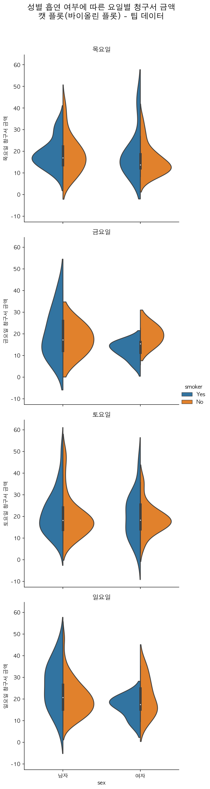

## Lab: 타이타닉 데이터로 캣 플롯 그리기(가로 모양의 바이올린)

- - -

- 타이타닉 생존 데이터에서 클래스 등급(class)별로 성별(sex)에 따른 나이(age)의 분포를 캣 플롯으로 작성한다. 이 때 그리는 도표의 종류는 바이올린 플롯으로 설정하고 바이올린이 가로 모양으로 그려지도록 설정한다.

- 클래스 등급(class)별로 행을 나누어 그리도록 설정한다.

- 전체 도표의 제목과 x축, y축의 라벨을 적절한 내용으로 설정한다.

- 범주에 대한 눈금의 라벨도 설정한다.

- - -

**답**


```python
# Your answer here
```

## Lab: 타이타닉 데이터로 캣 플롯 그리기(세로 모양의 바이올린)


- - -

- 타이타닉 생존 데이터에서 클래스 등급(class)별로 suvived(생존 여부)에 따른 성별(sex) 나이(age) 분포를 캣 플롯으로 작성한다. 이 때 그리는 도표의 종류는 바이올린 플롯으로 설정하고 바이올린이 세로 모양으로 그려지도록 설정한다.

- 클래스 등급(class)별로 행을 나누어 그리고, 바이올린 도형의 양쪽 날개를 성별(sex)로 나누어 그리도록 설정한다.

- 전체 도표의 제목과 x축, y축의 라벨을 적절한 내용으로 설정한다.

- 범주에 대한 눈금의 라벨도 설정한다.

- - -

**답**


```python
# Your answer here
```

# 페어 플롯

페어 플롯은 데이터 세트 내의 모든 변수간의 관계를 좌표평면 상에 점으로 나타내는 그래프이다. 모든 변수에 대해 산점도를 그린다고 보면 된다. 따라서 데이터 세트에 있는 변수 개수의 제곱만큼 서브 플롯을 생성한다. 

페어 플롯을 작성하려면 **pairplot()** 메소드를 주로 **pairplot(*data, hue=None, palette=None, kind='scatter', markers=None*)** 형식으로 사용하면 된다.

- ***data*** 는 행이 데이터의 관측값, 열이 변수인 전체 데이터 세트이다.
- ***hue*** 는 전체 데이터 세트 중 하나의 변수명이며 **pairplot**의 막대나 마커를 범주별로 색상을 다르게 표현할 수 있다.
- ***palette*** 는 자동으로 칠하는 색상의 순서와 종류를 설정한다.
- ***kind*** 는 서로 다른 변수에 대한 그래프를 그릴 때 그래프의 종류를 설정한다. *{‘scatter’ &#124; ‘reg’}* 중 하나를 선택하며 기본값은 **'scatter'** 로 산점도를 그린다. **'reg'** 는 선형 회귀 적합선이 포함된 산점도를 그린다.
- ***diag_kind*** 는 같은 변수 간 그래프를 그릴때 그래프의 종류를 설정한다. **{‘auto’, ‘hist’, ‘kde’, None}** 중 하나를 선택하며 기본값은 **'auto'** 다.
- ***markers*** 는 산점도의 마커 모양을 설정한다.
- 더 자세한 내용은 아래의 링크에서 확인할 수 있다.
    - https://seaborn.pydata.org/generated/seaborn.pairplot.html

전체 페어 플롯에 대해 제목을 설정하려면 **pyplot.suptitle()** 을 사용해야한다. 그리고 페어 플롯은 여러 개의 서브 플롯을 그리기 때문에 페어 플롯이 반환하는 객체를 변수에 할당하고 **axes** 속성을 사용하여 각 축을 라벨링 할 수 있다. 그려지는 서브 플롯의 순서에 따라 **axes[*x, y*].set_xlabel()**, **axes[*x, y*].set_ylabel()** 메소드로 라벨링을 하면된다. 여기서 **[*x, y*]** 은 몇 번째 서브 플롯인지를 설정할 때 사용한다. ***x***가 행이고 ***y***가 열인데, 예를 들어 **[0, 3]** 이라면 첫 번째 행의 네번째 열을 의미한다.

[seaborn.pairplot](https://seaborn.pydata.org/generated/seaborn.pairplot.html)
- Plot pairwise relationships in a dataset.
- seaborn.**pairplot**(*data, hue=None, hue_order=None, palette=None, vars=None, x_vars=None, y_vars=None, kind='scatter', diag_kind='auto', markers=None, height=2.5, aspect=1, corner=False, dropna=True, plot_kws=None, diag_kws=None, grid_kws=None, size=None*)
    - By default, this function will create a grid of Axes such that each numeric variable in data will by shared in the y-axis across a single row and in the x-axis across a single column. 
    - The diagonal Axes are treated differently, drawing a plot to show the univariate distribution of the data for the variable in that column.
    - It is also possible to show a subset of variables or plot different variables on the rows and columns.    

다음 예는 붓꽃 데이터에서 꽃받침 길이, 꽃받침 너비, 꽃잎 길이, 꽃잎 너비의 상관 관계를 페어 플롯을 작성한 코드다.


```python
# --- 붓꽃 데이터(iris)에서 꽃받침 길이, 꽃받침 너비, 꽃잎 길이, 꽃잎 너비의 상관 관계를 페어 플롯을 작성한다.
# > 붓꽃 데이터는 꽃과 관련된 속성들과 어떤 종류의 붓꽃인지를 기록한 데이터 세트다.
# > sepal_length(꽃받침의 길이), sepal_width(꽃받침의 너비), 
# > petal_length(꽃잎의 길이), petal_width(꽃잎의 너비), 
# > species(꽃의 종류)로 총 5개의 속성을 가지고 있다.

# 페어 플롯이 반환하는 객체를 'g'라는 변수에 할당한다. 
g = seaborn.pairplot(__TODO__)

# g의 axes[x, y].set_xlabel()과 axex[x, y].set_ylabel()로 각 축을 라벨링한다.
g.axes[__TODO__].set_ylabel('꽃받침 길이')   # 가장 위의 가장 왼쪽에 있는 subplot의 y축을 라벨링한다.
g.axes[__TODO__].set_ylabel('꽃받침 너비')   # 위에서 두 번째, 가장 왼쪽에 있는 subplot의 y축을 라벨링한다.
g.axes[__TODO__].set_ylabel('꽃잎 길이')    # 위에서 세 번째, 가장 왼쪽에 있는 subplot의 y축을 라벨링한다.
g.axes[__TODO__].set_ylabel('꽃잎 너비')    # 위에서 네 번째, 가장 왼쪽에 있는 subplot의 y축을 라벨링을 한다.

g.axes[__TODO__].set_xlabel('꽃받침 길이')  # 가장 아래의 가장 왼쪽에 있는 subplot의 x축을 라벨링한다.
g.axes[__TODO__].set_xlabel('꽃받침 너비')  # 가장 아래의, 왼쪽에서 두 번째에 있는 subplot의 x축을 라벨링한다.
g.axes[__TODO__].set_xlabel('꽃잎 길이')   # 가장 아래의, 왼쪽에서 세 번째에 있는 subplot의 x축을 라벨링한다.
g.axes[__TODO__].set_xlabel('꽃잎 너비')   # 가장 아래의, 왼쪽에서 네 번째에 있는 subplot의 x축을 라벨링한다.

# 전체 페어 플롯에 제목을 설정하기 위해 pyplot.suptitle()을 사용한다.
# y=1.09로 설정하여 제목이 페어 플롯과 겹치지 않도록 제목을 위로 이동한다.
# fontsize를 20으로 설정하여 제목의 크기를 크게 한다.
pyplot.suptitle('꽃받침 길이, 꽃받침 너비, 꽃잎 길이, 꽃잎 너비의 상관 관계\n(페어 플롯 - 붓꽃 데이터)', 
                __TODO__, __TODO__)
pyplot.show()
```

**실행 결과**  

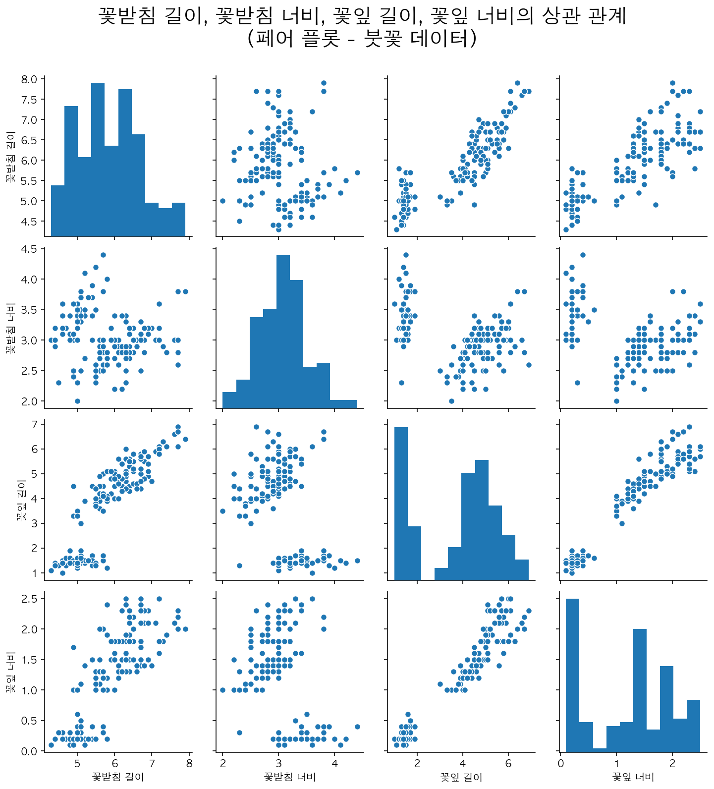

다음 예는 **pairplot**의 매개변수 ***hue*** 를 사용하여 붓꽃 데이터에서 붓꽃의 종류별로 색을 다르게 표현하는 페어 플롯을 작성한 코드다.


```python
# --- 붓꽃 데이터(iris)에서 꽃받침 길이, 꽃받침 너비, 꽃잎 길이, 꽃잎 너비의 상관 관계를 
# 붓꽃의 종류별로 색을 다르게 표현하는 페어 플롯을 작성한다.
# > 붓꽃 데이터는 꽃과 관련된 속성들과 어떤 종류의 붓꽃인지를 기록한 데이터 세트다.
# > sepal_length(꽃받침의 길이), sepal_width(꽃받침의 너비), 
# > petal_length(꽃잎의 길이), petal_width(꽃잎의 너비), 
# > species(꽃의 종류)로 총 5개의 속성을 가지고 있다.

# hue='species'를 설정하여 붓꽃의 종류별로 색을 다르게 표현한다. 
# markers=['o', 'D', 'x']로 설정하여 마커는 붓꽃의 종류에 따라 원(o), 다이아몬드(D), 크로스(x)로 표시한다.
# 페어 플롯이 반환하는 객체를 'g'라는 변수에 할당한다. 
g = seaborn.pairplot(__TODO__)

# g의 axes[x, y].set_xlabel()과 axex[x, y].set_ylabel()로 각 축을 라벨링한다.
g.axes[__TODO__].set_ylabel('꽃받침 길이')   # 가장 위의 가장 왼쪽에 있는 subplot의 y축을 라벨링한다.
g.axes[__TODO__].set_ylabel('꽃받침 너비')   # 위에서 두 번째, 가장 왼쪽에 있는 subplot의 y축을 라벨링한다.
g.axes[__TODO__].set_ylabel('꽃잎 길이')    # 위에서 세 번째, 가장 왼쪽에 있는 subplot의 y축을 라벨링한다.
g.axes[__TODO__].set_ylabel('꽃잎 너비')    # 위에서 네 번째, 가장 왼쪽에 있는 subplot의 y축을 라벨링을 한다.

g.axes[__TODO__].set_xlabel('꽃받침 길이')   # 가장 아래의 가장 왼쪽에 있는 subplot의 x축을 라벨링한다.
g.axes[__TODO__].set_xlabel('꽃받침 너비')   # 가장 아래의, 왼쪽에서 두 번째에 있는 subplot의 x축을 라벨링한다.
g.axes[__TODO__].set_xlabel('꽃잎 길이')    # 가장 아래의, 왼쪽에서 세 번째에 있는 subplot의 x축을 라벨링한다.
g.axes[__TODO__].set_xlabel('꽃잎 너비')    # 가장 아래의, 왼쪽에서 네 번째에 있는 subplot의 x축을 라벨링한다.

# 전체 페어 플롯에 제목을 설정하기 위해 pyplot.suptitle()을 사용한다.
# y=1.09로 설정하여 제목이 페어 플롯과 겹치지 않도록 제목을 위로 이동한다.
# fontsize를 20으로 설정하여 제목의 크기를 크게 한다.
pyplot.suptitle('꽃받침 길이, 꽃받침 너비, 꽃잎 길이, 꽃잎 너비의 상관 관계\n(페어 플롯 - 붓꽃 데이터)', 
                __TODO__, __TODO__)
pyplot.show()
```

**실행 결과**  

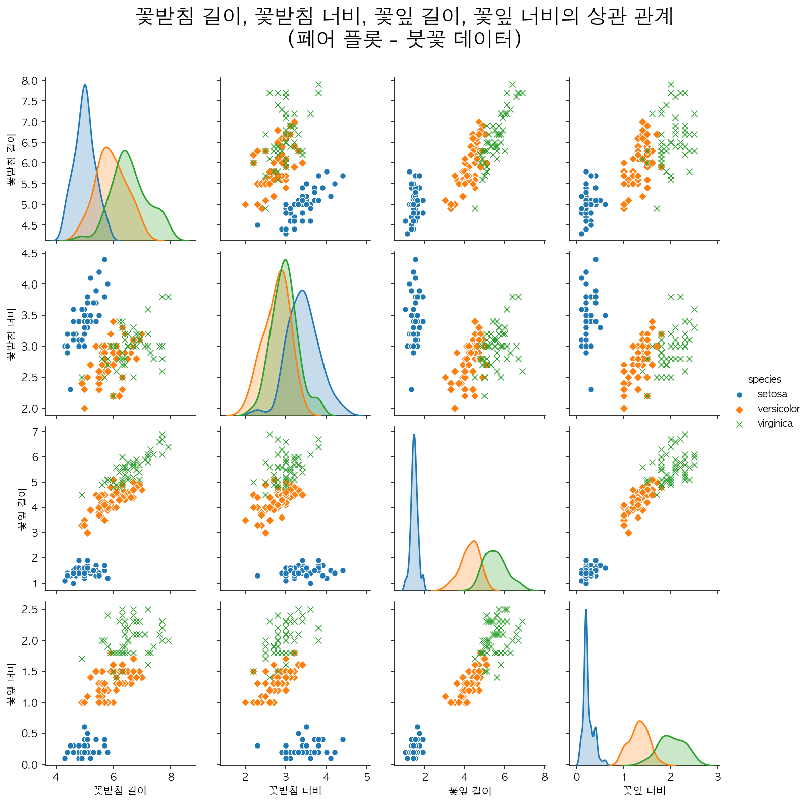

## Lab: 다이아몬드 데이터로 페어 플롯 그리기

- - - 

- 다이아몬드 데이터에서 전체 수치형 변수들에 대한 분포를 페어 플롯으로 작성한다. 이 때 산점도에 표시하는 각 점과 커널 밀도 플롯이 그리는 곡선을 투명도(clarity)에 따라 다른 색상으로 표시한다.

- 전체 도표의 제목과 x축, y축의 라벨을 적절한 내용으로 설정한다.

_ _ _


### 다이아몬드 데이터 불러오기


```python
# 다이아몬드 데이터
diamonds = seaborn.load_dataset('diamonds', data_home='./data')
```


```python
# 다이아몬드 데이터는 다이아몬드와 관련된 정보들이 기록한 데이터 세트다.
# carat(캐럿), cut(절단면 품질), color(색상), clarity(투명도), 
# depth(깊이 백분율), table(테이블 면의 너비 백분율), price(가격), 
# x(길이), y(너비), z(깊이)로 총 10개의 속성을 가지고 있다.
print(diamonds)
```

           carat        cut color clarity  depth  table  price     x     y     z
    0       0.23      Ideal     E     SI2   61.5   55.0    326  3.95  3.98  2.43
    1       0.21    Premium     E     SI1   59.8   61.0    326  3.89  3.84  2.31
    2       0.23       Good     E     VS1   56.9   65.0    327  4.05  4.07  2.31
    3       0.29    Premium     I     VS2   62.4   58.0    334  4.20  4.23  2.63
    4       0.31       Good     J     SI2   63.3   58.0    335  4.34  4.35  2.75
    ...      ...        ...   ...     ...    ...    ...    ...   ...   ...   ...
    53935   0.72      Ideal     D     SI1   60.8   57.0   2757  5.75  5.76  3.50
    53936   0.72       Good     D     SI1   63.1   55.0   2757  5.69  5.75  3.61
    53937   0.70  Very Good     D     SI1   62.8   60.0   2757  5.66  5.68  3.56
    53938   0.86    Premium     H     SI2   61.0   58.0   2757  6.15  6.12  3.74
    53939   0.75      Ideal     D     SI2   62.2   55.0   2757  5.83  5.87  3.64
    
    [53940 rows x 10 columns]


### 다이아몬드 데이터에 대한 설명

다이아몬드 데이터는 다이아몬드와 관련된 정보들이 기록한 데이터 세트다.
- carat(캐럿), cut(절단면 품질), color(색상), clarity(투명도), depth(깊이 백분율), table(테이블 면의 너비 백분율), price(가격), x(길이), y(너비), z(깊이)로 총 10 개의 속성을 가지고 있다.

각 범주에 대한 간단한 설명은 다음과 같다.
- carat(캐럿)은 다이아몬드 등의 보석의 질량을 재는 단위이며 1 캐럿은 200mg에 해당한다.
- cut(절단면 품질)의 범주는 'Fair', 'Good', Very Good, Premium, Ideal을 가지며 뒤로 갈수록 좋은 품질을 의미한다.
- color(색상)의 범주는 알파벳 'D' 부터 'J' 까지의 범주를 가지는데 'D' 는 무색 다이아몬드를 의미하며 뒤로 갈수록 옅은 색을 가진다.
- clarity(투명도)는 다이아몬드의 투명도로 매긴 등급으로 'IF', 'Vvs1', 'vvs2', 'vs1', 'vs2', 'sl1', 'sl2', 'I1' 범주를 가지며 뒤로 갈수록 낮은 투명도를 의미한다.
- depth(깊이 백분율)는 다이아몬드의 높이를 거들 지름 평균으로 나눈 값을 %로 표시한다.
- table(테이블 면의 너비 백분율)은 평균 지름의 백분율로 표시한 다이아몬드 테이블의 너비를 의미한다.
- price(가격)는 다이아몬드의 가격이며 단위는 USD이다.
- x, y, z는 각각 다이아몬드의 길이, 너비, 깊이를 mm로 기록한 값이다.

**답**


```python
# Your answer here
```

# 조인트 플롯 vs. 캣 플롯 vs.  페어 플롯

**조인트 플롯** 
- 두 가지 종류의 그래프를 그림 하나의 내부와 외부에 각각 작성한다.

**캣 플롯** 
- 한 가지 종류의 그래프를 여러 개의 서브 플롯으로 작성한다.
- 매개변수 ***hue***, ***row***, ***col*** 에 범주형 변수명을 전달하여 범주 값에 의한 차이를 여러 개의 그래프로 그려준다. 

**페어 플롯**
- 다차원 수치형 데이터에 사용한다.
- 수치형 변수간의 관계를 여러 개의 산점도 서브플롯으로 그리며, 같은 변수가 만나는 영역은 히스토그램을 그린다. 그려지는 서브 플롯의 개수는 수치형 변수의 제곱만큼이다.
    - 예) 'tips' 데이터로 페어 플롯을 그리면 수치형 변수들인 'total_bill', 'tip', 'size' 간의 관계를 6개의 산점도와 3개의 히스토그램으로 그려 총 9개의 서브 플롯이 작성하게 된다.
- 페어 플롯이 수치형 데이터를 자동으로 산점도와 히스토그램으로 그려준다면 캣 플롯은 하나의 그래프를 ***hue***, ***row***, ***col*** 세 개의 범주형 변수의 범주 별로 그려준다.

# 스타일

라벨, 선의 크기, 배경 등 전반적인 플롯 스타일을 한번에 변경하는 것이 가능하다.

플롯 스타일을 변경하려면 **set()** 메소드를 주로 **set(*context='notebook', style='darkgrid'*)** 형식으로 사용하면 된다.
- ***context*** 에는 문자열 또는 딕셔너리 자료형을 입력하며 라벨이나 선의 크기에 변화를 준다. *{'paper' &#124; 'notebook' &#124; 'talk' &#124; 'poster'}* 중 하나를 선택하여 입력할 수 있다.
- ***style*** 에는 문자열 또는 딕셔너리 자료형을 입력하며 배경을 설정할 수 있다. *{'darkgrid' &#124; 'whitegrid' &#124; 'dark' &#124; 'white' &#124; 'ticks'}* 중 하나를 선택하여 입력할 수 있다.
- 더 자세한 내용은 아래의 링크에서 확인할 수 있다.
    - https://seaborn.pydata.org/generated/seaborn.set.html
    
**[주의]**  
**set()** 메소드로 플롯 스타일을 변경하면 폰트 설정 또한 초기화 되기 때문에 한글 폰트를 사용하려면 다시 설정해줘야한다.

[seaborn.set](https://seaborn.pydata.org/generated/seaborn.set.html)
- Set aesthetic parameters in one step.
- seaborn.**set**(_context='notebook', style='darkgrid', palette='deep', font='sans-serif', font_scale=1, color_codes=True, rc=None)_

다음은 사인 함수를 그려주는 **sinplot**을 작성한 코드다. 스타일 설정을 다르게 하면서 이 사인 함수의 형태가 어떻게 변화하는지 알아본다.


```python
# 스타일의 변화를 비교해보기 위해 sinplot 함수를 작성한다. 
def sinplot(flip=1):
    x = numpy.linspace(0, 14, 100)
    for i in range(1, 7):
        pyplot.plot(x, numpy.sin(x + i * .5) * (7 - i) * flip)
```


```python
sinplot()
```

**실행 결과**  

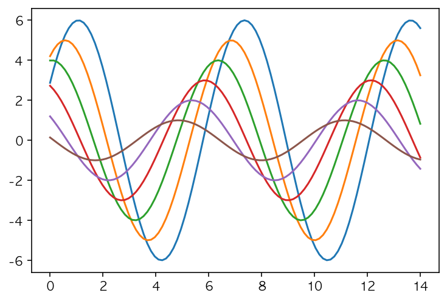

다음 예는 'paper'라는 context로 사인 함수를 그리는 코드다.


```python
# paper context에 sinplot을 그린다.
seaborn.set(__TODO__)
sinplot()
```

**실행 결과**  

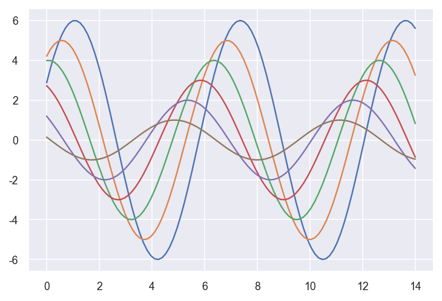

다음 예는 'talk'라는 context로 사인 함수를 그리는 코드다.


```python
# talk context에 sinplot을 그린다.
seaborn.set(__TODO__)
sinplot()
```

**실행 결과**  

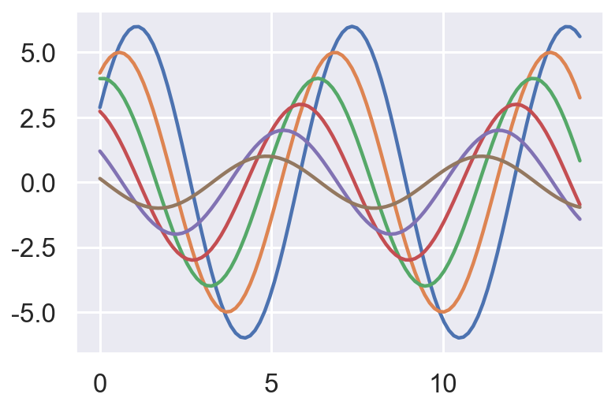

이번에는 'poster'라는 context로 사인 함수를 그리는 코드다.


```python
# poster context에 sinplot을 그린다.
seaborn.set(__TODO__)
sinplot()
```

**실행 결과**  

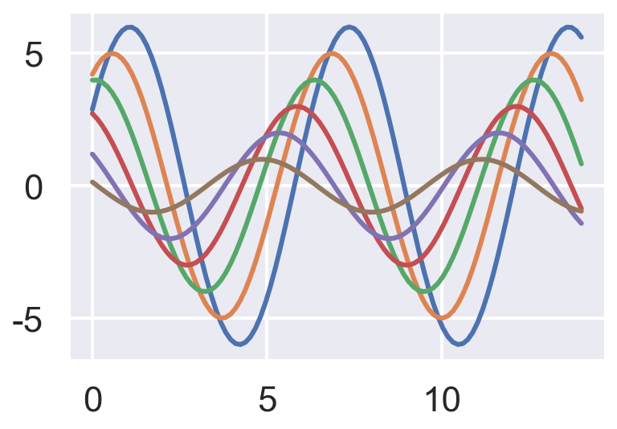

다음 예는 어두운 그리드 배경에 사인 함수를 그리는 코드다.


```python
# 어두운 그리드 배경에 sinplot을 그린다.
seaborn.set(__TODO__)
sinplot()
```

**실행 결과**  

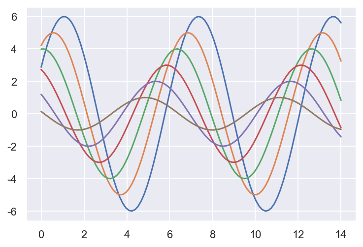

이번에는 어두운 배경에 사인 함수를 그리는 코드다.


```python
# 어두운 배경에 sinplot을 그린다.
seaborn.set(__TODO__)
sinplot()
```

**실행 결과**  

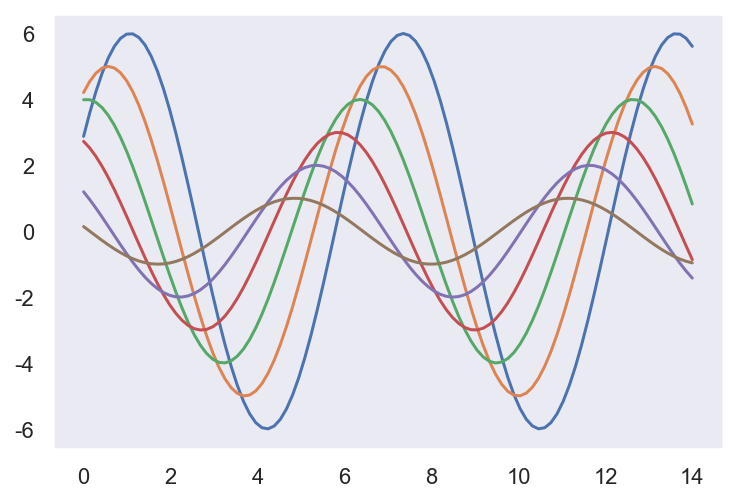

다음은 하얀 그리드 배경에 사인 함수를 그리는 코드다.


```python
# 하얀 그리드 배경에 sinplot을 그린다.
seaborn.set(__TODO__)
sinplot()
```

**실행 결과**  

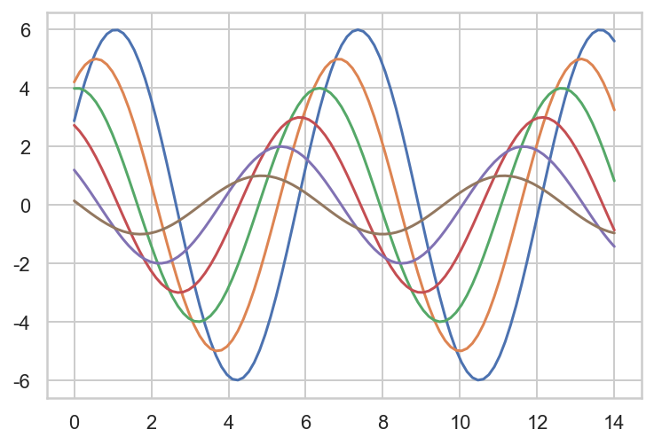

이번에는 하얀 배경에 사인 함수를 그리는 코드다.


```python
# 하얀 배경에 sinplot을 그린다.
seaborn.set(__TODO__)
sinplot()
```

**실행 결과**  

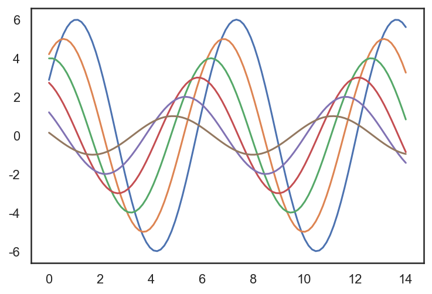


```python
# 스타일을 설정한 후 리셋 하고 싶으면 아래의 코드를 실행한다. 한글 폰트 설정 또한 리셋이 된다.
seaborn.reset_orig()
sinplot()
```

**실행 결과**  

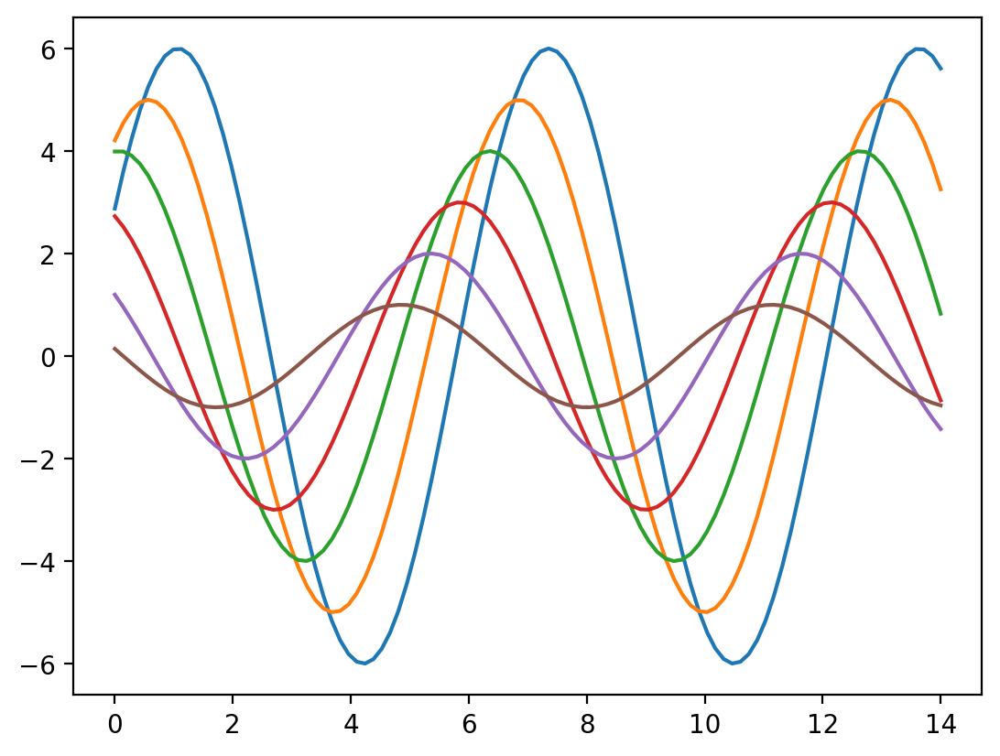

- - -

# THE END
